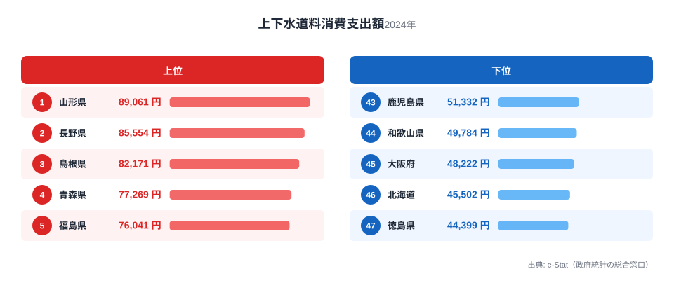
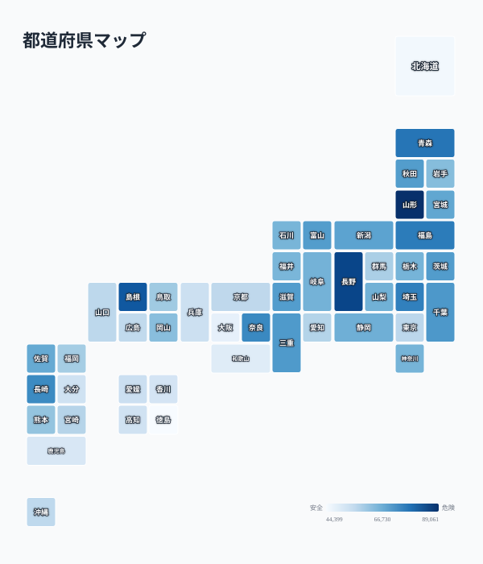

同じ日本に住んでいても、上下水道にかかる家計支出は都道府県で最大2倍近く違います。総務省「家計調査」による1世帯あたりの上下水道料消費支出額（2024年）を見ると、最も高い山形県は89,061円、最も低い徳島県は44,399円で、その差は2.01倍です。

水道料金は自治体ごとに水道事業者が個別に設定しており、全国一律ではありません。水源の確保にかかるコスト、人口密度、老朽化した施設の更新費用などが料金に直接反映されるため、同じ「上下水道」という生活インフラでも住む場所によって家計への負担がまったく違います。この記事では、支出額が高い県・低い県の顔ぶれと、その背景にある構造を都道府県別データから読み解きます。[家計の消費支出全般](/category/economy)や[各県のプロフィール](/areas/06000)と合わせて見ると、地域の生活コスト構造がより立体的に見えてきます。

> [!NOTE]
> このデータは総務省「家計調査」の1世帯あたり上下水道料消費支出額（年換算）です。実際に支払う「水道料金の単価（円/m³）」そのものではなく、各世帯が実際に支出した金額の平均であるため、世帯人数や水使用量の地域差も反映されている点に注意してください。

## 上位と下位

<source-link href="/ranking/water-sewer-consumption-expenditure">上下水道料ランキングをもっと見る</source-link>

上位を見ると、山形県89,061円、長野県85,554円、島根県82,171円、青森県77,269円、福島県76,041円と、東北・北陸・山陰の内陸・地方県が並びます。これらの県に共通するのは、人口密度が低く、家屋が広い戸建て中心の居住形態であることです。水道管を引く距離が長くなるほど1世帯あたりの整備・維持コストは高くなり、それが料金に転嫁されます。

さらに雪国では、水道管の凍結防止工事や、積雪地帯特有の配管の深埋設が必要になるため、初期整備費・維持費がかさみやすい事情もあります。山形・長野・青森・福島はいずれも豪雪地帯を抱える県で、この地理条件が上下水道料の高さと重なっている点は見逃せません。

一方で、埼玉県（6位、75,315円）や千葉県（9位、70,958円）のように首都圏近郊の県も上位に食い込んでいます。これは人口密度が高い都市部というより、県内に人口が薄い郊外・農村部を広く抱えていることや、世帯人数がやや多めであることが影響していると考えられます。上下水道料消費支出は「都市か地方か」の単純な二分では説明しきれない構造を持っています。

> [!WARNING]
> このランキングは「水道料金の単価」ではなく「世帯の支出額」です。同じ料金体系でも世帯人数が多い、または水使用量が多い家庭ほど支出額は増えます。したがって上位県が必ずしも「水道料金が高い」とは限らず、下位県が必ずしも「水道料金が安い」とも限りません。単価差と使用量差の両方が数値に含まれていることを念頭に読んでください。

## 発見：大都市圏はなぜ安いのか

下位を見ると、鹿児島県51,332円、和歌山県49,784円、大阪府48,222円、北海道45,502円、そして最下位の徳島県44,399円が並びます。特に目を引くのが大阪府の45位で、大都市圏を抱える府県ほど支出額が低い傾向がはっきり出ています。

<source-link href="/ranking/water-sewer-consumption-expenditure">上下水道料の全47都道府県を見る</source-link>

地図を見ると、東北・北陸・山陰の内陸県が濃い色（支出額が高い）で連なる一方、近畿・四国・北海道の一部が薄い色（支出額が低い）で分布しています。大阪府のように人口密度が極めて高い地域では、限られた面積に多くの世帯が集中するため、水道管1本あたりでカバーできる利用者数が多く、1世帯あたりの整備・維持コストが低く抑えられます。いわゆる「規模の経済」が働きやすい地理条件です。この人口密度の効果は[人口密度ランキング](/ranking/population-density-per-km2-total-area)と重ね合わせるとさらに分かりやすくなります。

徳島県が最下位という結果は一見意外に映るかもしれません。徳島は人口密度が特別高い県ではないためです。ただし徳島県は上水道の給水人口カバー率や既存インフラの整備状況、世帯当たりの水使用量が比較的少ないことなどが影響している可能性があります。〔仮説〕世帯人数の少なさ（単身・高齢世帯の割合）が使用量ベースの支出を押し下げている可能性もありますが、これは家計調査の世帯属性データと突き合わせないと検証できません。

> [!TIP]
> 上下水道料の地域差を深く知りたい場合は、人口密度が近い県同士で比較すると「施設更新費」の影響が見えやすくなります。老朽化した水道管が多い自治体では、更新投資が料金に反映され始めているため、今後この格差はさらに拡大する可能性があります。

## まとめ

- 1位は山形県で89,061円、最下位は徳島県で44,399円、その差は2.01倍
- 上位は山形・長野・島根・青森・福島など、人口密度が低く豪雪地帯を抱える内陸県が多い
- 下位は大阪・北海道・徳島など、大都市圏または人口分布が異なる県が並ぶ
- 人口密度が高いほど水道管1本あたりの利用者数が多く、1世帯あたりのコストが低くなりやすい
- このランキングは「料金単価」ではなく「世帯の支出額」であり、世帯人数や使用量の差も含まれる点に注意

## データ出典

総務省「家計調査」（総世帯・二人以上の世帯、上下水道料）2024年分を用いています。e-Stat（政府統計の総合窓口）経由で整備されたデータです。
