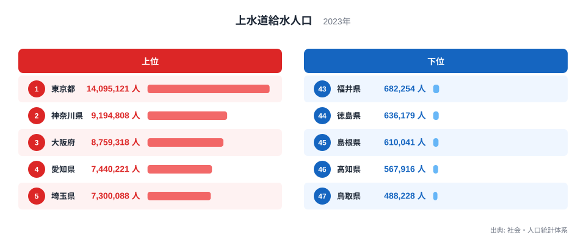
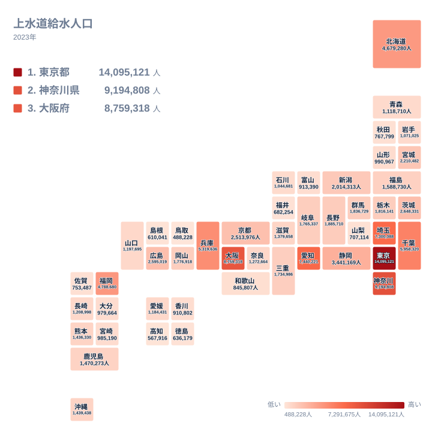

蛇口をひねれば水が出る、という当たり前の暮らしを支えているのが上水道です。上水道給水人口とは、上水道によって水の供給を受けている人の数を指す統計で、2023年の全国データを都道府県別に見ると、その数には大きな地域差があります。

もっとも多い東京都は14,095,121人が上水道の給水を受けているのに対し、もっとも少ない鳥取県は488,228人にとどまります。両者の差は約28.9倍にのぼり、同じ日本国内でも水道インフラを利用する人の規模はまったく異なる姿を見せています。この記事では、上位県と下位県の顔ぶれ、そして地理的な分布から、この差がどのような構造から生まれているのかを見ていきます。

## 上水道給水人口の全体像

2023年の上水道給水人口は、全国47都道府県で488,228人から14,095,121人まで幅広く分布しています。単位は人で、値そのものが多いか少ないかは、その県に住み上水道を利用している人の絶対数を表しています。

> [!NOTE]
> 上水道給水人口は、上水道の普及率（％）とは異なる指標です。普及率がすでに高い水準で頭打ちになっている県が多い一方、給水人口は住民の絶対数に直接連動するため、人口規模の大きい都道府県ほど値が大きくなりやすい性質を持っています。この記事の順位は、水道インフラの整備度合いというより、上水道を利用している人の数そのものの比較として読んでください。

## 上位5県と下位5県の顔ぶれ

<source-link href="/ranking/water-supply-population">上水道給水人口ランキングをもっと見る</source-link>

上位5県を見ると、東京都が14,095,121人で1位、神奈川県が9,194,808人で2位、大阪府が8,759,318人で3位、愛知県が7,440,221人で4位、埼玉県が7,300,088人で5位となっています。いずれも大都市を抱える都府県で、東京都と神奈川県だけで2,000万人を超える人が上水道を利用していることになります。

一方で下位5県は、福井県が682,254人で43位、徳島県が636,179人で44位、島根県が610,041人で45位、高知県が567,916人で46位、鳥取県が488,228人で47位と続いています。上位県との差は数百万人から一千万人以上にのぼり、同じランキングの中でも規模の違いがはっきり表れています。東京都の給水人口は、47位の鳥取県のおよそ28.9倍に達しており、これは上水道の整備水準の差というより、そもそもその地域に住む人の数の差を色濃く反映した結果だと考えられます。

## 地理から見た分布のかたち

このタイルマップからは、給水人口の多い県が太平洋側の大都市圏に連なっている様子が読み取れます。関東地方では、東京都が1位、神奈川県が2位、埼玉県が5位、千葉県が6位、茨城県が11位で、いずれも上位から中位の順位に入っています。近畿地方でも、大阪府が3位、兵庫県が7位、京都府が13位と、上位に集まっています。中京圏の愛知県も4位と高い値を示しており、これらの地域がひとつながりの太平洋ベルトを形づくっていることが、給水人口の分布にもそのまま表れています。

反対に、四国地方を見ると、愛媛県が30位、香川県が38位、徳島県が44位、高知県が46位で、いずれも全国の後半に位置しています。山陰地方の鳥取県と島根県も、それぞれ47位と45位で、全国で最も給水人口の少ない2県となっています。これらの地域は、平野部が限られていたり、人口が集中する大都市を持たなかったりする条件が重なっており、上水道を利用する住民の絶対数が少なくなりやすいと考えられます。ただし、これは地形や都市の有無から推測できる関係であり、[仮説]として受け止めてください。

> [!WARNING]
> このデータは上水道による給水人口であり、山間部などで用いられる簡易水道の利用者は別に集計されている可能性があります。人口の少ない県ほど簡易水道への依存度が高い場合、上水道給水人口だけを比べると、その県の水道インフラ全体の利用者数を過小に見積もってしまうおそれがあります。地域の水道事情を厳密に比較する際は、この点に注意してください。

## 北海道と福岡県に見る例外的な位置

北海道は4,679,280人で9位、福岡県は4,788,680人で8位と、いずれも上位10県に入っています。[仮説] 北海道は面積が広く人口密度の低い地域を多く抱える一方、道内最大の都市に人口が集中しているため、給水人口としては大都市圏の県に匹敵する規模になっていると考えられます。福岡県も同様に、県内有数の大都市を抱えていることが、九州の中で突出した順位につながっている可能性があります。

沖縄県は1,439,438人で24位となっており、全国のちょうど中間あたりに位置しています。[仮説] 離島を多く抱える地域でありながら中位にとどまっているのは、県内に人口が集中する都市があることが背景にあると考えられます。北海道、福岡県、沖縄県のいずれについても、はっきりとした要因はこのデータだけからは確定できず、他の指標と合わせた検証が必要です。

> [!TIP]
> 上水道給水人口は総人口とほぼ連動する指標なので、この順位だけを見て水道インフラの充実度を判断しないようにしましょう。県ごとの生活実感に近づけて読みたい場合は、[同じカテゴリの統計一覧](/category/infrastructure)から他の指標と見比べることをおすすめします。

## まとめ

- もっとも給水人口が多いのは東京都で14,095,121人、もっとも少ないのは鳥取県で488,228人でした
- 上位と下位の差はおよそ28.9倍にのぼり、同じ国内でも規模の違いが際立ちます
- 上位5県は東京都、神奈川県、大阪府、愛知県、埼玉県と、いずれも大都市圏の都府県が占めています
- 下位5県は福井県、徳島県、島根県、高知県、鳥取県で、四国や山陰の県が目立ちます
- 給水人口は総人口の規模を色濃く反映する指標であり、水道インフラの充実度そのものを示すものではない点に注意が必要です

たとえば[東京都のデータ](/areas/13000)や[神奈川県のデータ](/areas/14000)を見比べると、同じ上位県同士でも人口規模の違いがそのまま給水人口の差になって表れていることが確認できます。

## データ出典

社会・人口統計体系、2023年の上水道給水人口データをもとに作成しました。
