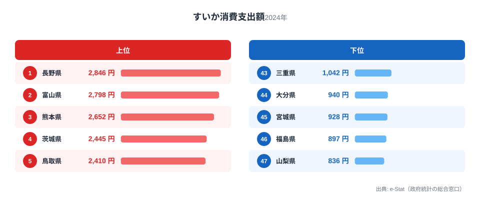
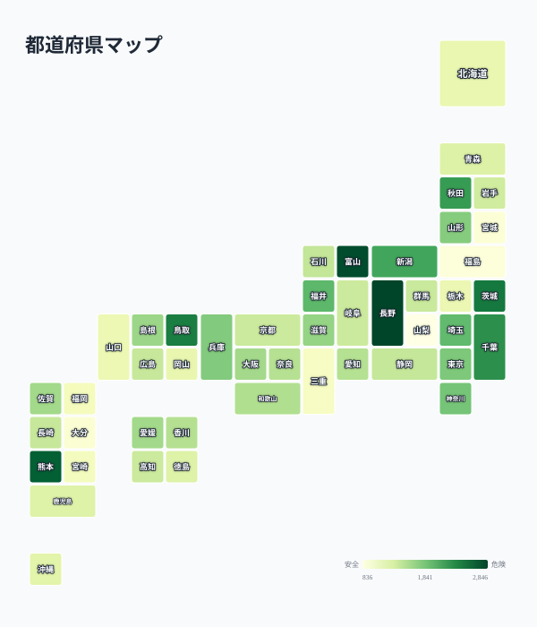

夏の風物詩「すいか」。丸ごと1玉を買って冷やし、家族で切り分けて食べる光景は、今も多くの家庭の夏の記憶に残っています。総務省の家計調査によると、都道府県庁所在市の二人以上世帯が1年間にすいかへ使う金額は、全国平均で1,500円台。ですが、都道府県ごとの差を見ると、最も多い長野県と最も少ない山梨県の間には3.4倍もの開きがあります。

さらに意外なのは、上位に並ぶ顔ぶれです。すいかの二大産地として知られる熊本県や鳥取県は確かに上位に入っていますが、1位は「すいかの名産地」というイメージがあまりない長野県でした。この記事では、すいか消費支出額の都道府県ランキングを詳しく見ながら、なぜ産地ではない県が支出額でトップに立つのかを探ります。

> [!NOTE]
> 本データは総務省「家計調査」による、都道府県庁所在市（東京都のみ都区部）の二人以上世帯を対象にした年間の品目別支出額です。世帯が実際に「買った金額」であり、贈答用のすいかや自家消費用（家庭菜園など）は含まれません。したがって「消費量が多い県」ではなく「店頭ですいかを購入する金額が大きい県」を示す指標である点に注意してください。

## すいか消費支出額 上位5県・下位5県

2024年の都道府県庁所在市別すいか消費支出額を見ると、上位は次の通りです。

1位は長野県で2,846円。2位は富山県で2,798円、3位は熊本県で2,652円、4位は茨城県で2,445円、5位は鳥取県で2,410円と続きます。

熊本県と鳥取県は、それぞれ「植木すいか」（熊本市植木町）、「大栄すいか」（鳥取県北栄町）というブランドすいかで知られる全国有数の産地です。地元でとれた新鮮なすいかが手頃な価格で店頭に並ぶため、消費支出額の上位に入るのは自然な結果といえます。[熊本県](/areas/43000)や[鳥取県](/areas/31000)の地域データを見ると、農業産出額に占める果物・野菜の比重の高さがうかがえます。

一方で1位の[長野県](/areas/20000)と2位の[富山県](/areas/16000)は、すいかの大産地として全国的に知られているわけではありません。両県とも冷涼な気候を活かした果物・野菜の生産が盛んな土地で、地元の直売所や道の駅で夏場にすいかが積極的に売られる文化があると考えられます。また、長野県は東京都に次ぐ全国有数の「野菜・果物への支出額が高い県」としてもたびたび話題になる県で、すいかに限らず生鮮食品全般への支出が大きい傾向がうかがえます。

<source-link href="/ranking/watermelon-consumption-expenditure">すいか消費支出額ランキングをもっと見る</source-link>

## 支出額が少ない下位5県

上位とは対照的に、支出額が少ない県にも明確な傾向が見えます。

最も支出額が少なかったのは山梨県で836円。次いで福島県897円、宮城県928円、大分県940円、三重県1,042円と続きます。

> [!WARNING]
> 山梨県はぶどう・桃など他の果物の生産が非常に盛んな県です。すいかへの支出が少ないのは「果物を買わない」のではなく、地元産の他の果物（特に桃・ぶどう）への支出配分が大きく、すいかに回る予算が相対的に少なくなっている可能性があります。本データだけでは果物全体の消費傾向までは分かりません。

下位県には東北・東海・九州の各地域から1県ずつ入っており、地理的なまとまりは見られません。むしろ「地元で強い果物ブランドが別にある県」「都市部で世帯人数が少なく1玉単位のすいかを買いにくい県」といった、個別の事情が支出額を押し下げていると考えられます。

## なぜ産地ではない長野・富山が上位に来るのか

<source-link href="/ranking/watermelon-consumption-expenditure">すいか消費支出額の全47都道府県を見る</source-link>

地図にすると、すいか消費支出額には魚介類のような明確な東西の帯がないことが分かります。色の濃い（支出額が高い）県が中部（長野・富山）、九州（熊本）、北関東（茨城）、山陰（鳥取）とばらばらに散らばり、地理的なまとまりが見えません。これは、すいか消費が「産地の近さ」という一つの軸ではなく、産地要因と果物全般への支出習慣という複数の要因が県ごとに違う比率で効いていることを物語っています。

すいかの生産量ランキングでは熊本県・千葉県・山形県・新潟県・鳥取県が例年上位を占めますが、支出額ランキングの1位・2位は長野県・富山県でした。この「生産量」と「消費支出額」のずれは、すいかという商品の特性を考えるうえで重要な手がかりになります。

すいかは重量があり単価も比較的高い果物です。1玉2,000円前後することも珍しくなく、「買うかどうか」を左右するのは産地からの近さだけでなく、世帯の果物・生鮮食品全般への支出習慣です。長野県・富山県はともに、全国の家計調査で野菜・果物支出額が上位に来やすい県として知られており、すいかもその一部として積極的に購入されていると見られます。

これに対し、産地として名高い熊本県・鳥取県が3位・5位につけているのは、産地ならではの入手のしやすさと価格の手頃さが支出を押し上げているためと考えられます。「産地だから安く買えて、結果的に支出額も伸びる」パターンと、「果物全般への支出意欲が高く、すいかにも予算が回る」パターンの両方が上位に混在しているのが、このランキングの実像といえるでしょう。

> [!TIP]
> すいかの「消費量」（購入した個数・重量）と「消費支出額」（支払った金額）は必ずしも一致しません。産地に近い県は同じ金額でより多くの量を買えている可能性があり、量の視点で見ると顔ぶれが変わることも考えられます。

金額ではなく購入量そのものの地域差が気になる方は、<source-link href="/ranking/watermelon-consumption-quantity">すいか消費量ランキング</source-link>もあわせてご覧ください。産地の強さがより直接的に表れているはずです。

## 世帯単位で消費される果物という背景

すいかは1玉が大きく、丸ごと買うと二人世帯や単身世帯では食べきれないことが多い果物です。近年は核家族化や単身世帯の増加を背景に、全国的にすいか全体の消費量は緩やかな減少傾向にあるとされています。スーパーでは半玉やカットすいかでの販売が主流になりつつあり、「丸ごと1玉」を買う機会自体が減っていることも、地域差を生む一因かもしれません。

世帯人数が多く、庭先や直売所でまとめ買いしやすい地方部と、単身・少人数世帯が多くカット売りが中心になりがちな都市部とでは、同じ「すいか好き」でも支出の出方が変わってきます。今回のランキングで大都市を抱える都府県が軒並み中位にとどまっているのも、こうした世帯構成の違いが影響している可能性があります。

## まとめ

- 1位は長野県2,846円、2位は富山県2,798円、3位は熊本県2,652円
- 最下位は山梨県836円で、1位との差は3.4倍
- 熊本県・鳥取県は産地としての強みが支出額にも反映されている
- 長野県・富山県は産地ではないが、果物・生鮮食品全般への支出習慣の高さが上位入りの背景にあると考えられる
- 山梨県・福島県・宮城県など下位県は、他の果物ブランドの存在や世帯構成が影響している可能性がある

すいか以外の食品・家計支出の地域差については、<source-link href="/category/economy">家計・経済カテゴリ</source-link>で他の品目のランキングも確認できます。

## データ出典

総務省統計局「家計調査」（都道府県庁所在市及び政令指定都市の二人以上世帯、品目別支出額）を基に、e-Stat（政府統計の総合窓口）経由で集計しています。集計年は2024年です。
