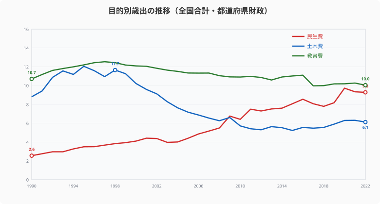
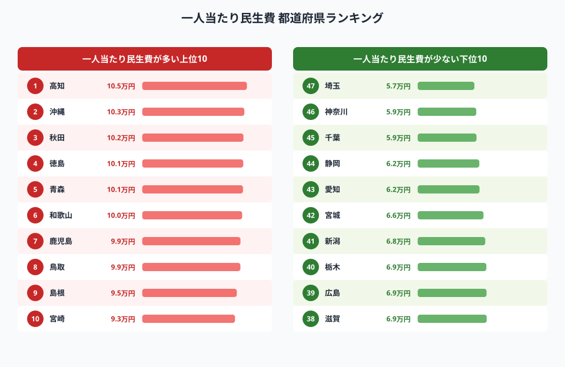
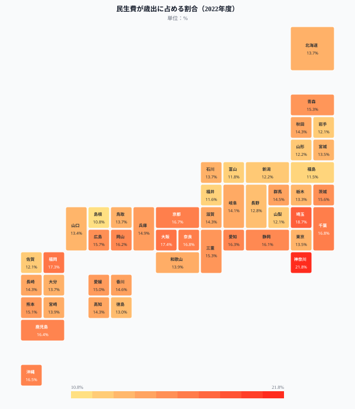
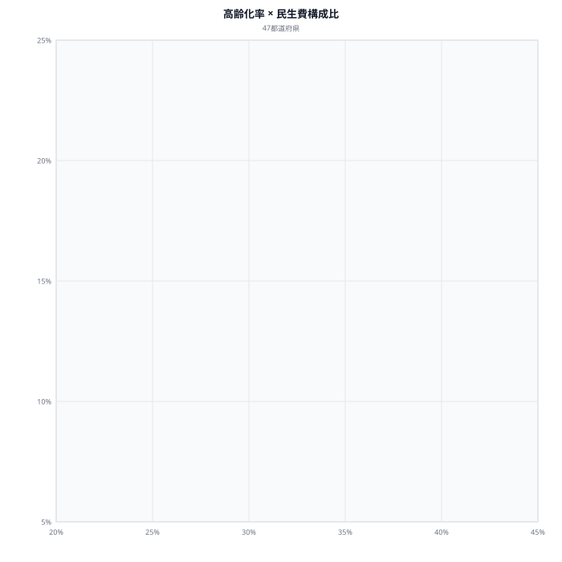
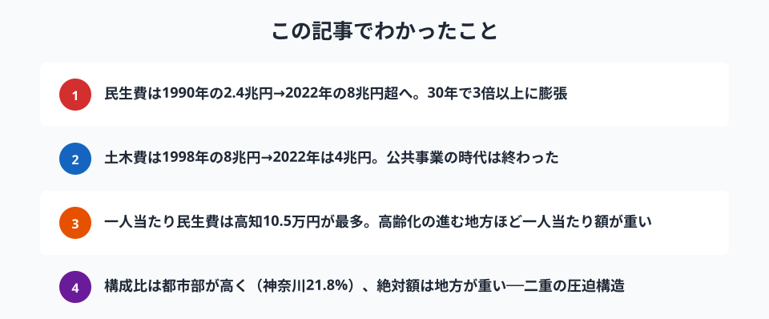

都道府県の歳出で最も急速に膨張しているのが**民生費**です。老人福祉費・児童福祉費・生活保護費などを含む民生費は、高齢化と社会保障制度の拡充に伴い、30年間で**3倍以上**に増加しました。

かつて地方財政の主役だった**土木費**はピーク時の半分以下に縮小し、2000年代前半に民生費と逆転。地方財政の構造は「公共事業の時代」から「福祉の時代」へと大きく転換しています。

> [!NOTE]
> **民生費**は地方自治体の歳出のうち、社会福祉・老人福祉・児童福祉・生活保護などに充てる経費の総称です。本記事では都道府県財政（市町村分を除く）の決算額を使用しています。

## 目的別歳出の推移──民生費が土木費を逆転

<data-source url="https://www.e-stat.go.jp/dbview?sid=0000010104" label="e-Stat 社会・人口統計体系（都道府県財政）"></data-source>

1990年に約2.4兆円だった民生費は、2022年には約8兆円へ膨張しました。一方、土木費は1998年の約8兆円をピークに2022年は約4兆円と半減。教育費は約6兆円前後で横ばいです。

**2000年代前半に民生費と土木費が逆転**し、以降その差は拡大し続けています。介護保険制度（2000年）、子ども・子育て支援の拡充、コロナ禍の給付金事業などが民生費を押し上げた主因です。

## 一人当たり民生費ランキング──高知10.5万円、埼玉5.7万円

<data-source url="https://www.e-stat.go.jp/dbview?sid=0000010104" label="e-Stat 社会・人口統計体系（都道府県財政）"></data-source>

**一人当たり民生費が最も多いのは[高知県](/areas/39000)の約10.5万円**。約10.3万円の沖縄県、約10.2万円の[秋田県](/areas/05000)と続き、**高齢化率が高い県や離島を抱える県が上位を占めます**。

一方、最も少ないのは約5.7万円の埼玉県。約5.9万円の神奈川県・千葉県と首都圏3県が下位に集中しています。人口が多い都市部では、民生費の絶対額は大きくても一人当たりでは薄まる構造です。

注目は**[東京都](/areas/13000)が約8.8万円で11位**という点。絶対額は全国最大（約1.24兆円）ですが、1,400万人の人口で割ると中位に収まります。

### 全国マップ

<data-source url="https://www.e-stat.go.jp/dbview?sid=0000010104" label="e-Stat 社会・人口統計体系（都道府県財政）"></data-source>

マップは**民生費の対歳出構成比**を示しています。一人当たりのランキングとは異なり、21.8%の神奈川県、18.7%の埼玉県、17.4%の大阪府など**都市部の構成比が高い**のが特徴です。

都市部は土木費や農林水産費の比率が低い分、民生費の比率が相対的に高くなります。逆に10.8%の島根県、11.5%の福島県など農村部では公共事業や災害復旧の比重が大きく、民生費の構成比は低めです。

<source-link href="/ranking/welfare-expenses-prefecture">47都道府県の民生費ランキングをもっと見る</source-link>

<ad-slot></ad-slot>

## 高齢化率 × 民生費構成比──高齢化が財政を直撃する

<data-source url="https://www.e-stat.go.jp/dbview?sid=0000010104" label="e-Stat 社会・人口統計体系"></data-source>

散布図で高齢化率と民生費構成比の関係を見ると、**明確な正の相関は見られず、むしろ分散が大きい**ことがわかります。

- **右上（**高齢化高・構成比高）: 実は該当する県は少ない。高齢化が進む県は土木費など他の経費も大きく、民生費の比率は必ずしも高くない
- **左上（**高齢化低・構成比高）: 神奈川・埼玉・千葉。若い人口構成ながら、児童福祉や生活保護の需要が大きい都市型パターン
- **右下（**高齢化高・構成比低）: 秋田・島根・山口。高齢化が進んでいても、公共事業費の比重が大きく民生費比率は低い

つまり**民生費の構成比は高齢化率だけでは説明できず、産業構造や社会資本整備の進捗度など複合的な要因**で決まります。ただし、一人当たりの絶対額で見れば高齢化が進む県ほど民生費が重い傾向は明確です。

> [!NOTE]
> 高齢化率は2024年、民生費は2022年度のデータです。時点が異なるため、厳密な比較には注意が必要です。

## まとめ

民生費の膨張と地方財政への影響を整理します。

民生費の膨張は高齢化の進行とともに今後も続くことが確実です。土木費の削減余地はすでに限られており、教育費も削りにくい。**歳出全体のパイが変わらない中で民生費だけが増え続ける構造**は、地方財政にとって最大の課題です。

地方自治体の財政運営は、かつての「公共事業をどこに配分するか」から「増え続ける福祉需要にどう対応するか」へと、根本的な転換を迫られています。

## データ出典

本記事のデータはe-Stat（政府統計の総合窓口）を基に作成しています。

本記事の対象データ: [関連カテゴリ](/category/economy)・[高知県](/areas/39000)・[秋田県](/areas/05000)・[埼玉県](/areas/11000)
