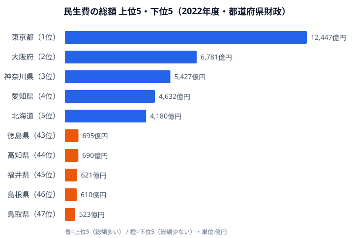

都道府県の歳出で最も急速に膨らんでいるのが**民生費**です。老人福祉費・児童福祉費・生活保護費などをまとめた民生費は、高齢化と社会保障制度の拡充に押されて、30年で**3倍以上**に増えました。

かつて地方財政の主役だった**土木費**はピーク時の半分以下に縮み、2000年代前半に民生費と逆転します。地方財政の重心は「公共事業の時代」から「福祉の時代」へと移りました。本記事では、民生費の総額が大きいのはどこか、一人当たりではなぜ順位が入れ替わるのか、そして高齢化率だけでは構成比を説明できない理由を、2022年度のデータで読み解いていきます。

> [!NOTE]
> **民生費**とは、地方自治体の歳出のうち社会福祉・老人福祉・児童福祉・生活保護などに充てる経費の総称。本記事は都道府県財政（市町村分を除く）の決算額を使っています。市町村が担う部分は含まないため、住民が受け取る福祉サービスの総量とは一致しない点に注意してください。

## 民生費が土木費を逆転──30年で3倍に膨張

1990年に約2.4兆円だった民生費は、2022年には約8兆円へ膨らみました。一方で土木費は1998年の約8兆円をピークに、2022年は約4兆円と半減しています。教育費は約6兆円前後でほぼ横ばいです。

注目すべきは、**2000年代前半に民生費が土木費を追い抜いた**点です。以降その差は開き続けています。背景には介護保険制度の創設（2000年）、子ども・子育て支援の拡充、コロナ禍の各種給付金事業があり、いずれも民生費を押し上げる方向に働きました。歳出全体のパイがほとんど変わらないなかで民生費だけが伸び続けるため、土木費や農林水産費が相対的に縮小する「玉突き」が起きています。

公共事業は景気対策や政策判断で増減を調整できますが、福祉は制度に基づく義務的な支出が多く、自治体の裁量で削りにくいのが特徴です。だからこそ「増え続ける福祉需要にどう財源を回すか」が、地方財政の最大の論点になっています。

## 民生費の総額が大きいのは都市部──東京 vs 鳥取

<data-source url="https://www.e-stat.go.jp/dbview?sid=0000010104" label="e-Stat 社会・人口統計体系（都道府県財政）"></data-source>

**民生費の総額が最も大きいのは[東京都](/areas/13000)の約1.24兆円（12,447億円）**で、2位の大阪府（約6,781億円）の1.8倍にあたります。3位は[神奈川県](/areas/14000)（約5,427億円）、4位の愛知県（約4,632億円）、5位の北海道（約4,180億円）と続き、上位は人口の多い大都市圏が占めています。これは当然で、福祉サービスを受ける人数そのものが多いため、絶対額が大きくなるからです。

対照的に、総額が最も小さいのは[鳥取県](/areas/31000)の約523億円です。45位の福井県（約621億円）、46位の[島根県](/areas/32000)、44位の[高知県](/areas/39000)、43位の徳島県と、人口の少ない県が下位に並びます。東京都と鳥取県の総額の開きは約24倍にのぼりますが、これは福祉の手厚さの差ではなく、人口規模の差をほぼそのまま映したものです。総額ランキングは「どこに人が多いか」を示すだけで、住民一人あたりがどれだけ手厚い福祉を受けているかは、この図からは読み取れません。

<source-link href="/ranking/welfare-expenses-prefecture">47都道府県の民生費ランキングをもっと見る</source-link>

> [!TIP]
> 総額ランキングは人口規模に強く引きずられます。県ごとの福祉の「厚み」を比べたいときは、総額ではなく一人当たり額や歳出に占める構成比で見るのが鉄則です。次の章ではその一人当たり額で順位がどう入れ替わるかを見ていきます。

<ad-slot></ad-slot>

## 一人当たりで見ると逆転する──高知が最多、首都圏が最少

総額では下位だった県が、一人当たりに直すと顔ぶれが大きく変わります。**一人当たり民生費が最も多いのは高知県の約10.5万円です**。約10.3万円の沖縄県、約10.2万円の秋田県が続き、高齢化率が高い県や離島・中山間地域を抱える県が上位に並びます。高齢者一人ひとりに必要な介護・福祉サービスの単価が高く、それを少ない人口で負担するため、頭割りすると重くなるのです。

逆に一人当たりで最も少ないのは約5.7万円の[埼玉県](/areas/11000)。約5.9万円の神奈川県・千葉県と、首都圏3県が下位に集まります。人口が多い都市部では、民生費の絶対額は大きくても、それを大人数で割るため一人当たりでは薄まります。総額1位の[東京都](/areas/13000)も、一人当たりでは約8.8万円と中位の11番目まで下がります。1,400万人という分母の大きさが、絶対額の大きさを相殺するからです。

つまり**総額ランキングと一人当たりランキングは、ほぼ逆の地図を描きます**。総額は人口の集まる都市部が上位、一人当たりは人口が少なく高齢化の進む地方が上位、という構造です。同じ「民生費」でも、どの物差しで測るかによって「福祉が重い県」の答えが正反対になる点が、この指標を読む際の最大の落とし穴です。

> [!WARNING]
> 一人当たり額や構成比は、総額（このページの主データ）を人口や歳出総額で割って算出した派生指標です。総額ランキングの順位とは一致しません。本文で「11番目」などと触れている一人当たり順位は、図に示した総額順位（東京都1位など）とは別の物差しである点にご注意ください。

## 高齢化率だけでは説明できない構成比の地域差

歳出全体に占める民生費の割合（構成比）で見ると、また別の地図が現れます。構成比が高いのは約21.8%の神奈川県、約18.7%の埼玉県、約17.4%の大阪府など、むしろ**都市部**です。都市部は土木費や農林水産費の比率が低い分、相対的に民生費の比率が押し上げられます。一方で約10.8%の島根県、約11.5%の福島県など農村部は、公共事業や災害復旧に回す比重が大きく、民生費の構成比は低めにとどまります。

ここで「高齢化が進むほど民生費の構成比も高いはずだ」と考えたくなりますが、データはそう単純ではありません。高齢化率と構成比のあいだに、きれいな正の相関は見られないのです。高齢化が低くても児童福祉や生活保護の需要が大きい神奈川・埼玉・千葉のような都市型のパターンもあれば、高齢化が進んでいても公共事業の比重が大きく構成比は低い秋田・島根・山口のようなパターンもあります。構成比は高齢化率という一つの要因ではなく、産業構造や社会資本整備の進み具合といった複合的な事情で決まります。

ただし、一人当たりの絶対額で見れば、高齢化が進む県ほど民生費が重くなる傾向ははっきりしています。**「構成比」は財政の使い道の配分を、「一人当たり額」は住民が背負う福祉負担の重さを表す**——同じ民生費でも切り口によって語る内容が違うことを押さえておくと、地方財政のニュースが立体的に読めるようになります。

## まとめ

民生費が地方財政に与える影響を、3つの物差しで整理します。

- **総額**: 東京都が約1.24兆円で最大、鳥取県が約523億円で最小です。約24倍の開きは、福祉の手厚さではなく人口規模の差をほぼそのまま映したものです。
- **一人当たり**: 高知県が約10.5万円で最多、埼玉県が約5.7万円で最少です。高齢化が進む地方ほど重く、総額順位とは逆の地図を描きます。
- **構成比**: 神奈川県の約21.8%が最高で、都市部ほど高くなります。高齢化率だけでは説明できず、産業構造や公共事業の比重も効いています。

民生費の膨張は高齢化の進行とともにこれからも続く見込みです。土木費の削減余地はすでに限られ、教育費も削りにくいのが実情です。**歳出のパイが変わらないなかで民生費だけが増え続ける構造**は、地方財政にとって最大の課題です。地方自治体の財政運営は、かつての「公共事業をどこに配分するか」から「増え続ける福祉需要にどう応えるか」へと、根本的な転換を迫られています。

## データ出典

- e-Stat（政府統計の総合窓口）社会・人口統計体系（都道府県財政）
- 関連カテゴリ: [経済・財政のランキング一覧](/category/economy)
