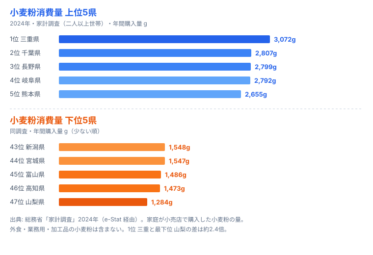

「うどん県」を名乗る香川県は、小麦粉消費量ランキングで何位だと思いますか。お好み焼きの大阪、ラーメンの福岡、すいとんの北関東――小麦粉の食文化が濃い土地を思い浮かべると、つい上位を想像してしまいます。ところが2024年の総務省「家計調査」で都道府県を並べると、トップは意外な顔ぶれで、香川は真ん中あたりに沈みます。

この記事が扱うのは「家庭が一年でどれだけ小麦粉そのものを買ったか」という一点です。パンやうどんの完成品ではなく、袋入りの粉を台所で買う量です。1位の三重県は年間**3,072g**、最下位の山梨県は**1,284g**で、その開きはおよそ2.4倍。なぜ三重・千葉・長野が上位を占め、うどんの本場・香川や大都市の東京が上位に来ないのでしょうか。順位の裏側には「家庭調理の文化」と「統計が拾えない外食消費」という二つの構造が隠れています。

## 小麦粉消費量ランキングの全体像

まず全体の地図を確認しましょう。下のランキングは2024年の家計調査(二人以上世帯)で、家庭が一年間に購入した小麦粉の量(g)を都道府県別に並べたものです。上位は東海・南関東・九州・甲信越に散らばり、特定の一地域に偏っていない点が目を引きます。

チャート上位5は三重(1位)・千葉(2位)・長野(3位)・岐阜(4位)・熊本(5位)で、東海・南関東・甲信越・九州に散らばります。中位の香川は13位(2,135g)、東京は42位(1,568g)で、いずれも上位に届きません。

<source-link href="/ranking/wheat-flour-consumption-quantity">小麦粉消費量ランキング(全47都道府県)をもっと見る</source-link>

トップの三重県は3,072g。最下位の山梨県(1,284g)と比べると、同じ日本の家庭でも一年に買う粉の量がおよそ2.4倍ちがいます。地域別に見ると、上位10県は東海2・南関東2・九州2に甲信越・山陽・山陰・東北が各1という散らばり方で、「西日本=粉もん文化」という単純な図式では説明しきれません。順位を作っているのは「外で食べるか、家で作るか」という生活様式の差です。詳しい指標の背景は[小麦粉消費量ランキング](/ranking/wheat-flour-consumption-quantity)のページでも確認できます。

> [!NOTE]
> 本データは総務省「家計調査」(二人以上世帯・都道府県庁所在市)の年間購入量(g)。家庭が小売店で買った「小麦粉そのもの」の量であり、パン・うどん・お好み焼きなどの加工品や、飲食店で出される料理に使われた小麦粉は一切含まれない。つまり「家でどれだけ粉から調理するか」を映す指標であって、「その土地で小麦粉料理がどれだけ食べられているか」とは別物だ。

## 上位を占めるのは「家庭で粉から作る」県

上位陣を眺めると、共通するのは「家庭での粉ものづくりが日常に根づいている」点です。

1位の三重県(3,072g)と4位の岐阜県(2,792g)は東海勢です。三重の伊勢うどんや志摩の手延べ、岐阜の郷土食には家庭で生地をこねる文化が色濃く残り、家庭用の小麦粉が継続的に消費されています。2位の千葉県(2,807g)、7位の神奈川県(2,550g)という南関東勢は、都市近郊で家庭調理の機会が比較的保たれていることに加え、製粉産業や輸入小麦の集積地という流通面の近さも背景にあります。

3位の長野県(2,799g)は、すいとん・おやき・手打ちうどんといった「粉を練る」郷土食の宝庫です。寒冷で米作に不利だった歴史が、家庭で小麦粉を扱う習慣を残してきました。九州勢では5位の熊本県(2,655g)、6位の福岡県(2,601g)が並びます。だご汁(団子汁)に代表される家庭の粉もの料理が、買い物カゴの小麦粉を押し上げます。9位の鳥取県(2,314g)、10位の秋田県(2,280g)のように、雪国・山陰の家庭調理文化も上位に食い込みます。

> [!TIP]
> 上位県に共通するキーワードは「家でこねる」だ。だご汁・すいとん・おやき・手打ちうどんなど、完成品を買うのではなく粉から作る郷土食が残る地域ほど、家計調査の小麦粉購入量は伸びる。逆に外食やパン・冷凍麺で済ませる生活が広がると、同じ小麦粉好きでも家庭の購入量は下がる。

## 「うどん県」香川が13位にとどまる逆説

ここで本題です。讃岐うどんで全国に知られる香川県は、2,135gで**13位**。上位を独占していてもおかしくないのに、真ん中あたりに位置しています。これは統計の「拾い方」を理解すると腑に落ちます。

香川のうどん文化は、家庭で粉から打つ文化というより、安くて旨い「うどん店」を日常的に利用する**外食型**です。県内には数百軒のうどん店がひしめき、住民は朝食や昼食を店で済ませます。ところが店が使う業務用の小麦粉は、各家庭の買い物ではなく事業者の仕入れであり、家計調査の「家庭購入量」には1グラムも計上されません。つまり香川では「小麦粉を大量に食べているのに、家庭の財布からは買っていない」という構図が起きています。

> [!WARNING]
> 香川が13位という数字を「香川は実はうどんをあまり食べない」と読むのは誤りだ。家計調査が捉えるのは家庭で小麦粉を「買う」量だけで、うどん店という外食消費はまったく見えない。同じ理由で、お好み焼き店やラーメン店、製パン業が盛んな土地でも、家庭購入量だけを見ると消費の実態を取りこぼす。指標の定義を外して順位を語ると、食文化を見誤る。

同じことは大都市圏でいっそう極端に表れます。家庭で粉を扱う「うどん県」香川が13位で踏みとどまっているのは、それでも家庭調理の余地があるからだ、とも読めます。香川の食文化全体を知りたい方は、完成品ベースで比較した[生うどん・そば消費量の食文化地図](/blog/udon-soba-food-culture-prefecture-map)も合わせて見ると、家庭購入量との差がよく分かります。

## 大都市と「外食・中食」が下位を作る構造

下位グループには、外食・中食(惣菜やパン)に頼る生活様式が透けて見えます。

下位5県は、最下位の山梨県(1,284g)を筆頭に、高知県(1,473g)・富山県(1,486g)・宮城県(1,547g)・新潟県(1,548g)で、東北・甲信越・北陸・四国に散らばっています(上のチャート右側が下位)。

<source-link href="/ranking/wheat-flour-consumption-quantity">小麦粉消費量ランキングの下位県を一覧で見る</source-link>

そして注目すべきは、家計調査で東京都が42位(1,568g)と下位グループにいることです。日本最大の人口と外食産業を抱える東京では、家庭で粉から調理する機会が構造的に少なくなっています。パン・冷凍麺・惣菜・外食でまかなう生活が広がるほど、家庭の小麦粉購入量は減ります。これは「東京の人が小麦粉料理を食べない」のではなく、「家庭で粉を買って作る工程を外部化している」結果です。

最下位の山梨県は米やほうとう(完成品・乾麺の流通も多い)、果樹を中心とした食生活で、家庭で小麦粉から調理する場面が相対的に少なくなっています。下位10県を地域別に見ると東北3・甲信越2・近畿1・九州1・南関東1・北陸1・四国1と散らばり、「寒冷地だから少ない」「都市だから少ない」のどちらか一方では説明できません。共通項はやはり「家庭調理 vs 外食・中食」という生活様式の比重です。

このギャップは「家庭が小麦粉に支出した金額」と並べると、より立体的に見えてきます。購入量と支出額のズレ(高い粉を少なく買う県、安い粉を多く買う県)を扱った[小麦粉の支出額と消費量のズレ](/blog/wheat-flour-expenditure-vs-quantity)も参考になります。家計や食品消費の他指標は[暮らし・経済カテゴリ](/category/economy)から横断的にたどれます。

> [!NOTE]
> 家計調査は都道府県庁所在市の二人以上世帯を対象とするサンプル調査で、単身世帯や全市町村を網羅していない。年により対象世帯が入れ替わるため、単年の順位差を過大に解釈しないことが大切だ。傾向は複数年で見るのが安全で、本指標は2007〜2024年の18年分が蓄積されている。

## データ出典

- 総務省「家計調査」(都道府県庁所在市・二人以上世帯)2024年(e-Stat 経由)
- 集計対象は家庭が小売店で購入した小麦粉(g)。外食・業務用・加工品の小麦粉は含まない。
- トップは三重県の3,072g、最も少ない山梨県は1,284g(本文・図中の数値はすべて2024年の同調査による)。

## まとめ

- 2024年の家庭購入量で見ると小麦粉消費量1位は三重県(3,072g)、最下位は山梨県(1,284g)で、開きは約2.4倍です。
- 上位は三重・千葉・長野・岐阜・熊本など「家庭で粉から作る」郷土食の残る県が占め、特定の一地域には偏りません。
- 「うどん県」香川は13位(2,135g)。うどん消費の主体が外食=業務用仕入れのため、家計調査の家庭購入量には現れません。
- 東京都は42位(1,568g)で下位グループ。外食・中食・パン中心の生活が家庭の小麦粉購入を構造的に減らします。
- ランキングは「小麦粉料理をどれだけ食べるか」ではなく「家庭で粉からどれだけ作るか」を映します。指標の定義を外して順位を語ると食文化を見誤ります。
