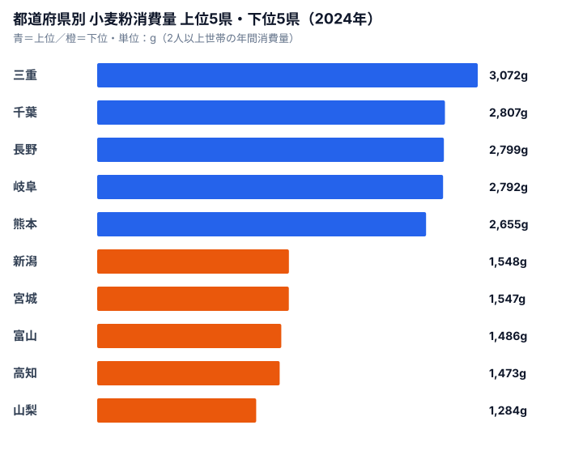

小麦粉と聞いて思い浮かべるのは、うどん・お好み焼き・天ぷら・たこ焼きといった粉物文化でしょう。粉食の根づいた地域では、家庭の戸棚に1kg袋が常備されています。ところが2024年の家計調査（総務省）で47都道府県別の年間小麦粉消費量を見ると、郷土麺の知名度と順位は必ずしも一致しません。**1位は三重県（3,072g）、最下位は山梨県（1,284g）で約2.4倍の開き**があります。全国平均は1,989gです。なぜ「ほうとうの本場」山梨が最下位で、「うどんの本場」香川が上位に入っていないのか――この記事では、家計調査が映す「家庭での粉物調理」という切り口から順位の正体を読み解いていきます。

## 上位5県と下位5県──三重が突出し、山梨が沈む

家計調査の「1世帯当たり年間消費量（2人以上世帯）」を上位5県・下位5県で並べると、開きの大きさがひと目で分かります。

1位の三重県は3,072gで、全国平均の約1.5倍に達します。三重には伊勢うどんという独自の粉食文化があり、太くやわらかい麺を家庭でも日常的に食べる習慣が根づいています。2位の千葉県（2,807g）、3位の長野県（2,799g）、4位の岐阜県（2,792g）、5位の熊本県（2,655g）と続き、上位には関東・信州・中部・九州が入り混じります。つまり「西日本だから上位」という単純な構図ではなく、それぞれの地域に固有の粉物の郷土食が背景にあるのです。長野はすいとんやおやき、岐阜はしらたまや水まんじゅう、熊本はだご汁といった具合に、家庭で粉から作る料理の層の厚さが消費量を押し上げています。

一方の下位5県は、山梨県（1,284g）を底に、高知県（1,473g）、富山県（1,486g）、宮城県（1,547g）、新潟県（1,548g）が並びます。山梨は全国平均の約65%にとどまり、上位の三重とは2.4倍の差がつきました。下位に米どころが集中している点は、後ほど詳しく見ていきます。

> [!NOTE]
> ここでの消費量は、家庭で購入した小麦粉そのものの量です。うどん・パン・乾麺といった「小麦粉を原料とする加工品」の購入や、外食で食べた粉物は含まれません。「うどん消費量No.1は香川」のような外食込みの指標とは性格が異なります。

<source-link href="/ranking/wheat-flour-consumption-quantity">小麦粉消費量ランキングをもっと見る</source-link>

## なぜ三重や九州が高く、都市部が低いのか

上位の顔ぶれを見ると、地域ブロックでまとまっているわけではありません。中部・近畿では三重（1位）・岐阜（4位）が突出する一方、同じ近畿でも京都は40位（1,584g）、奈良は29位（1,827g）と低めです。三重・岐阜の高さは、家庭で粉から麺や郷土菓子を作る習慣がいまも残っていることの表れと言えます。

九州に目を移すと、熊本（5位）・福岡（6位）・長崎（12位・2,141g）・鹿児島（15位・2,091g）と、主要県が軒並み全国平均を超えています。ちゃんぽん・皿うどん・五島うどん・だご汁といった郷土麺に加え、博多の鉄なべ餃子文化など、粉を使う食習慣が多層的に重なっているためでしょう。九州は外食の粉物が有名な一方で、家庭でも粉をよく使う地域だと分かります。家庭がいくら粉物にお金をかけているかは、[小麦粉消費支出額ランキング](/ranking/wheat-flour-consumption-expenditure)と合わせて見ると、量と金額の両面から地域差を捉えられます。

対照的に低いのが都市部です。東京は42位（1,568g）、大阪は34位（1,743g）と、人口の多い大都市ほど消費量が低い傾向が見えます。共働き世帯比率が高く、外食・中食への依存が強い都市部では、家庭で粉物を一から調理する機会そのものが減ります。粉を買う代わりに、出来合いの麺やパン、惣菜で済ませているのです。実際、粉そのものではなく加工品で粉食をまかなう傾向は、[食パン消費量ランキング](/ranking/white-bread-consumption-quantity)や[生うどん・そば消費量ランキング](/ranking/fresh-udon-soba-consumption-quantity)と読み比べると見えてきます。つまり小麦粉消費量は、その土地の「粉食文化の有無」だけでなく、「家庭で調理するかどうか」という生活様式を強く反映しています。

> [!TIP]
> 「消費量」と「支出額」は順位が入れ替わります。家庭での小麦粉支出額の上位は、岐阜県（1,042円）、三重県（912円）、福岡県（900円）、長野県（857円）、千葉県（802円）の順です。消費量で頂点に立つ三重が支出額では岐阜に首位を譲る点に注目してください。量を多く買いつつ単価の安い大袋を選んでいるか、調理頻度が高いかで、量と金額のバランスは変わってきます。

<source-link href="/ranking/wheat-flour-consumption-expenditure">小麦粉消費支出額ランキングをもっと見る</source-link>

## 山梨が最下位の意外性──ほうとう県なのに

最下位の山梨県（1,284g）は、全国平均の約65%です。「ほうとう」の本場として全国に知られる県が、なぜ小麦粉消費量で最下位なのか――この意外性こそ、家計調査データを読む面白さでしょう。

考えられる要因は3つあります。第一に、ほうとうの麺は基本的に「購入麺」だという点です。家庭で粉から打つよりも、スーパーや直売所で乾麺・生麺を買うケースが多く、小麦粉そのものの購入量には反映されにくくなります。第二に、米食文化との併存です。甲府盆地は古くからの米作地帯でもあり、主食としての米への依存度が高い土地柄です。第三に、観光地・外食での提供が中心という事情があります。ほうとうは観光客向けの郷土料理として外食で消費される比率が高く、家庭調理の機会が相対的に少ないのです。

下位の顔ぶれを広げると、この見立てを裏づける並びになります。新潟（43位）・宮城（44位）・富山（45位）・高知（46位）・山梨（47位）と、米どころ・日本海側・東北の一部に下位が集中しているのです。米を主食とし、粉物を副菜的に位置づける食文化が、そのままデータに表れていると言えます。

加えて、東京（42位・1,568g）・京都（40位・1,584g）・佐賀（41位・1,578g）といった都市部や西日本の県も下位に並びます。これらを合わせて見ると、小麦粉消費量を強く規定しているのは「西高東低」という地理よりも、むしろ「家庭調理の頻度」と「外食・中食への依存度」だと考えるのが妥当でしょう。

> [!WARNING]
> 郷土麺の有名さと小麦粉消費量の順位は一致しません。うどんの本場である香川は13位（2,135g）にとどまります。これは家庭で食べるうどんが、粉からではなく外食や乾麺・生麺の購入でまかなわれているためと考えられます。「○○うどんが名物だから小麦粉消費も多いはず」と直感で結びつけると読み違えます。家計調査は加工品ではなく粉そのものの購入量を測っている点に注意してください。

## データの出典と読み方

本記事のデータは、総務省統計局「家計調査（品目別都道府県庁所在市及び政令指定都市ランキング）」の2024年値です。集計対象は2人以上世帯で、対象は基本的に都道府県庁所在市（東京は都区部）になります。

読むうえでの注意点は次の3つです。

- **県庁所在市のデータ**であって、県全体の平均ではありません（例として、神奈川県の数値は横浜市の値です）
- **家庭での購入量**であり、外食・中食での消費は含まれません
- 単身世帯は対象外のため、若年層比率が高い都市部は実需より低めに出る傾向があります

「うどん消費量No.1は香川」のような外食込みの指標とは性格が異なるため、両者を区別して読む必要があります。

<source-link href="/ranking/wheat-flour-consumption-quantity">小麦粉消費量ランキングの全47都道府県を見る</source-link>

## まとめ──粉物文化は「家庭調理」と「郷土食」の交点

2024年データから見えた小麦粉消費の構造をまとめます。

- 1位三重（3,072g）と最下位山梨（1,284g）で**約2.4倍の開き**があります
- 都市部（東京42位・大阪34位）は外食依存で家庭消費が低めです
- 米食地帯（新潟・宮城・富山）も下位に集中しています
- 九州勢（熊本・福岡・長崎・鹿児島）は主要県が平均を超えています
- うどんの本場である香川は13位で、家庭での粉購入は意外と少なめです

家計調査は「家庭でどれだけ買って調理しているか」を映す鏡です。粉物文化の濃淡は、観光や外食ではなく、家庭の食卓を見て初めて正確に掴めます。郷土麺の知名度で順位を予想すると外れるのは、そのギャップがあるからなのです。

## データ出典

- 総務省統計局「家計調査（品目別都道府県庁所在市及び政令指定都市ランキング）」2024年
- e-Stat 経由で整備（[家計調査データベース](https://www.e-stat.go.jp/dbview?sid=0002070001)）
