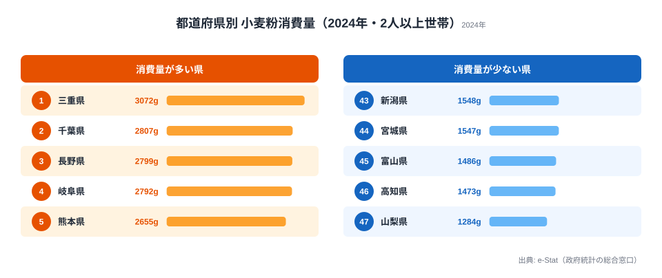
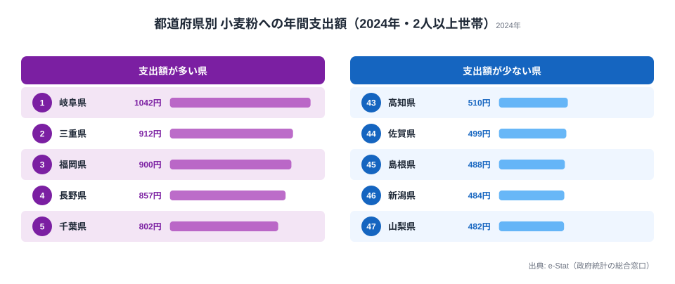

小麦粉と聞いて思い浮かべるのは、うどん・お好み焼き・天ぷら・たこ焼きといった粉物料理でしょう。粉食文化の根づいた地域では、家庭の戸棚に1kg袋が常備されています。2024年の家計調査（総務省）で47都道府県別の年間小麦粉消費量を見ると、**1位は三重県の3,072g、最下位は山梨県の1,284gで、その差は約2.4倍**でした。全国平均は1,989gです。

ここで一つ、意外な事実があります。「ほうとう」で全国に知られる山梨県が、小麦粉消費量では最下位なのです。粉物の本場が最下位という逆説は、家計調査というデータの性格そのものを映しています。この記事では、なぜ三重がこれほど突出するのか、そしてなぜ山梨が最下位になるのかを、消費量と支出額の両面から読み解いていきます。

## 小麦粉を最も買う県・最も買わない県

家計調査の「1世帯当たり年間消費量（2人以上世帯）」を見ると、上位には東日本と西日本が入り混じる興味深い構図が現れます。

1位の三重県は3,072gで、全国平均（1,989g）の約1.5倍にあたります。上位には、伊勢うどん文化の三重、関東の千葉・神奈川、信州の長野、郷土麺の多い岐阜、九州の熊本・福岡といった「粉物の郷土食が根づく地域」が並びます。一方、最下位の山梨（1,284g）をはじめ、高知・富山・宮城・新潟といった米どころが下位を占めています。

上位と下位を分けているのは、単純な「西日本か東日本か」ではありません。三重・岐阜・長野のように中部の県が上位に食い込む一方、近畿の大阪は34位（1,743g）と振るわず、地理的な東西軸だけでは説明がつかないのです。むしろ「その土地に家庭で粉を使う郷土食が根づいているか」と「日常的に米を主食とするか」という食習慣の違いが、上位と下位の境界をつくっています。

> [!NOTE]
> 家計調査の数値は各県の**県庁所在市（東京は都区部）における2人以上世帯**の値です。たとえば神奈川県の数字は横浜市の購入実績であり、県全体の平均ではありません。県を代表する1都市のデータとして読む必要があります。

<source-link href="/ranking/wheat-flour-consumption-quantity">小麦粉消費量ランキングをもっと見る</source-link>

## なぜ西日本〜中部で多いのか──郷土麺と粉物食習慣

上位県の顔ぶれを見ると、いずれも「家庭で粉から作る料理」が日常に組み込まれている地域だと分かります。三重には伊勢うどんがあり、岐阜には水まんじゅうやけいちゃんなどの粉物料理、長野にはおやき文化があります。これらは外食で食べるよりも、家庭の台所で粉をこねて作られてきた料理です。

九州勢の強さも目を引きます。熊本（5位）・福岡（6位）が平均を大きく上回り、その背景にはちゃんぽん・皿うどん・だご汁といった郷土麺料理に加え、博多の鉄なべ餃子のように家庭でも皮から作る食文化があります。粉を「買って料理する」習慣が世帯単位で残っていることが、消費量に直接表れていると考えられます。

一方で都市部は総じて低めです。東京は42位（1,568g）、大阪は34位（1,743g）にとどまります。共働き世帯比率が高く外食・中食への依存が強い都市部では、家庭で粉物を一から作る機会そのものが減っているとみられます。

> [!TIP]
> 「消費量が多い県＝粉物をよく食べる県」とは限りません。家計調査が捉えるのは**家庭で購入した小麦粉**であって、外食や乾麺・冷凍麺での消費は含まれません。うどんの本場として有名な香川は13位（2,135g）にとどまっており、これは外食や讃岐うどんの製麺所利用が家庭での小麦粉購入を代替しているためと考えられます。麺類全体の消費傾向は[麺類消費量から見る都道府県の個性](/blog/noodle-consumption-prefecture-character)でも詳しく扱っています。

## 支出額で見ると順位が入れ替わる──岐阜の「こだわり買い」

同じ小麦粉でも、「どれだけの量を買ったか（消費量）」と「いくら使ったか（支出額）」では順位が変わります。家庭での小麦粉への年間支出額ランキングを見てみましょう。

支出額の1位は岐阜県（1,042円）で、消費量4位だった岐阜が支出ではトップに立ちます。消費量1位の三重は支出額では2位（912円）です。この逆転は、岐阜の家庭が「量こそ三重に次ぐが、より単価の高い小麦粉を選んでいる」か、あるいは「こまめに買い足す調理頻度の高さ」を映していると読めます。福岡（3位・900円）・長野（4位・857円）・千葉（5位・802円）と続き、消費量上位の顔ぶれと大きくは変わりません。

消費量と支出額の両方で上位に入る三重・岐阜・長野・千葉・福岡は、「家庭でよく粉を使い、それなりにお金もかける」地域だと言えます。一方、山梨は支出額でも最下位グループ（482円）にとどまり、消費量・支出額の両面で粉物の家庭調理が少ないことが裏づけられます。三重県の食や暮らしの全体像は[三重県のプロフィール](/areas/24000)からも確認できます。

<source-link href="/ranking/wheat-flour-consumption-expenditure">小麦粉支出額ランキングをもっと見る</source-link>

## 山梨が最下位の謎──「ほうとう県」なのに?

最下位の山梨県（1,284g）は全国平均の約65%です。ほうとうの本場として知られる県が、なぜ小麦粉消費量で最下位なのでしょうか。この逆説を解く鍵は、家計調査が「家庭で買った小麦粉」しか捉えない点にあります。

考えられる要因は3つあります。

1. **ほうとうの麺は「購入麺」が中心**：家庭で粉から打つよりも、スーパーや直売所で生麺・乾麺を買って調理するケースが多く、小麦粉そのものの購入量には反映されにくいと考えられます
2. **米食文化との併存**：甲府盆地は古くからの米作地帯でもあり、主食としての米への依存度が高い土地柄です
3. **観光地・外食での提供が中心**：ほうとうは観光客向けの郷土料理として飲食店で食べられる比率が高く、家庭で一から作る機会が相対的に少ないとみられます

実際、下位を見ると新潟（43位）・宮城（44位）・富山（45位）・高知（46位）・山梨（47位）と、米どころや日本海側、東北の一部に集中しています。米を主食とし、粉物を副菜的に位置づける食文化が、データにそのまま表れていると言えます。

東京（42位・1,568g）や京都（40位・1,584g）、佐賀（41位・1,578g）といった都市部や西日本の県も下位に並びます。このことから、小麦粉消費量を強く規定しているのは「西高東低」という地理ではなく、**「家庭調理の頻度」と「外食・中食への依存度」**のほうだと考えるべきでしょう。

> [!WARNING]
> 山梨の最下位は「山梨県民が粉物を食べない」という意味ではありません。家計調査は単身世帯を対象外とし、外食・中食を含まないため、観光地の郷土食や外食で消費される粉物は数字に乗りません。郷土料理の知名度と家庭での小麦粉購入量は、必ずしも一致しないのです。

## まとめ──粉物文化は「家庭調理」と「郷土食」の交点

2024年の家計調査から見えた小麦粉消費の構造を整理します。

- 消費量1位は三重（3,072g）、最下位は山梨（1,284g）で、その差は約2.4倍
- 上位は三重・岐阜・長野・熊本・福岡など、家庭で粉から作る郷土食が根づく地域
- 都市部（東京42位・大阪34位）は外食・中食への依存で家庭消費が低い
- 米どころ（新潟・宮城・富山）も下位に集中
- 支出額では岐阜が1位に逆転し、三重は2位──「量」と「お金のかけ方」は別の物語

家計調査は「家庭でどれだけ買って調理しているか」を映す鏡です。粉物文化の濃淡は、観光や外食のイメージではなく、家庭の食卓を見て初めて正確に掴めます。山梨が最下位という逆説は、その何よりの証拠だと言えるでしょう。食品や家計に関する他の指標は[経済カテゴリのランキング一覧](/category/economy)からも探せます。

## データ出典

本記事のデータは、総務省統計局「家計調査（品目別都道府県庁所在市及び政令指定都市ランキング）」の2024年値です。e-Stat（政府統計の総合窓口）を経由して整備しています。集計対象は2人以上世帯で、対象は基本的に都道府県庁所在市（東京は都区部）の家庭での購入量・支出額であり、外食・中食での消費は含まれません。
