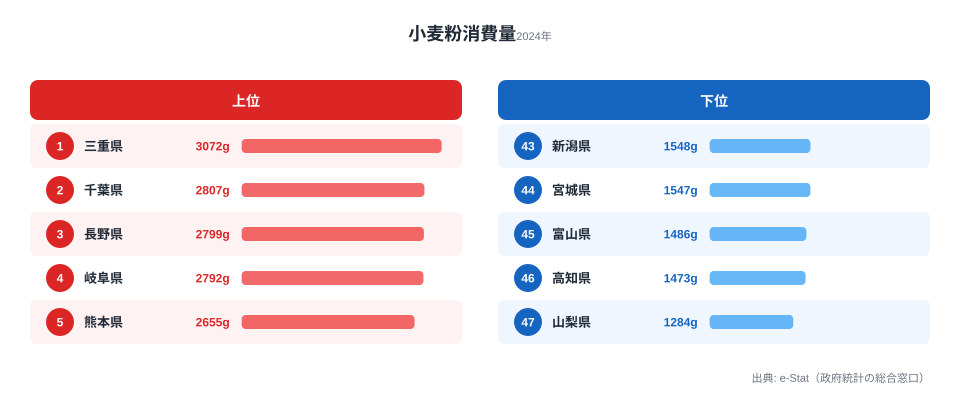
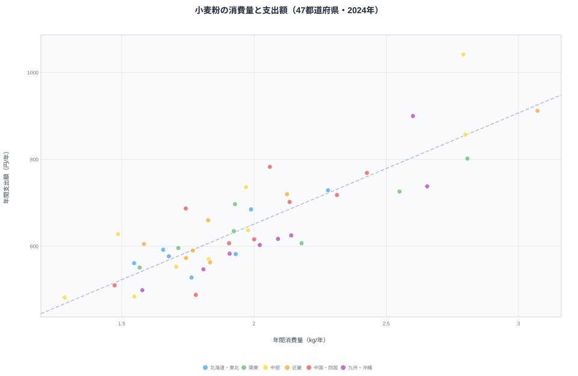

「小麦粉をいちばん多く買う県」と「小麦粉にいちばんお金を使う県」は、同じ県だと思いますか。直感的には「たくさん買えば、たくさん払う」はずです。ところが2024年の家計調査を開くと、その直感は静かに裏切られます。

小麦粉の年間支出額が最も多いのは岐阜県の1,042円です。一方、年間消費量が最も多いのは別の県、三重県の3,072gでした。三重の支出額は912円で、岐阜には届きません。「最も多く買う県」と「最も多く払う県」が、きれいにズレています。

このズレは集計の誤差ではありません。同じ「小麦粉」でも、県によって選ぶ商品の価格帯が違う――つまり「量」ではなく「単価」の差が効いているのです。本記事では支出額ランキングの全体像を押さえたうえで、量と金額のズレを単価まで分解し、地域ごとの品質選好を読み解いていきます。

## 小麦粉消費支出額ランキングの全体像（2024年）

まずは支出額のランキングを見ます。最も多いのは岐阜県の1,042円、最も少ないのは山梨県の482円で、その差は約2.2倍です。東海・九州・甲信越の県が上位に並びます。

上位5は岐阜(1位・1,042円)・三重(2位・912円)・福岡(3位・900円)・長野(4位・857円)・千葉(5位・802円)です。下位は最下位の山梨(482円)に新潟(484円)・島根(488円)が続きます。

上位には岐阜・三重・愛知を抱える東海、福岡・熊本の九州、長野などの内陸県が目立ちます。粉ものの食文化（味噌煮込みうどん、五平餅、団子・すいとんなど）が根づいた地域と重なります。順位の細かな動きや過去年の推移は下記のランキング詳細で確認できます。

<source-link href="/ranking/wheat-flour-consumption-expenditure">小麦粉消費支出額ランキングをもっと見る</source-link>

> [!NOTE]
> 本データは総務省「家計調査」（都道府県庁所在市・二人以上世帯）の2024年値（e-Stat経由）。スーパーなどで購入した「小麦粉そのもの」の金額・数量であり、パン・麺・菓子といった加工品や、外食・中食での粉消費は含まれない。家庭で粉から調理する文化の濃淡を映す指標と捉えるとよい。

## 消費量で最多の三重が、支出では首位に立たない理由

ここで「量」のランキングと突き合わせます。消費量で見ると首位は三重で3,072g、続いて千葉が2,807g、長野が2,799gです。岐阜は2,792gと、量では4番手にとどまります。

上位5は三重(1位・3,072g)・千葉(2位・2,807g)・長野(3位・2,799g)・岐阜(4位・2,792g)・熊本(5位・2,655g)です。最下位は山梨(1,284g)で、高知(1,473g)・富山(1,486g)が続きます。

<source-link href="/ranking/wheat-flour-consumption-quantity">小麦粉消費量ランキングをもっと見る</source-link>

つまり岐阜は、量では三重に280gも及ばないのに、支出額では130円多くなっています。量と金額の並び順が、きれいに入れ替わっているのです。

なぜでしょうか。鍵は「1kgあたりいくら払っているか」という単価にあります。支出額（円/年）を消費量（kg/年）で割って概算すると――

- 岐阜：1,042円 ÷ 2.792kg ≒ **約373円/kg相当**
- 三重：912円 ÷ 3.072kg ≒ **約297円/kg相当**

岐阜のほうが約26%高い単価の小麦粉を買っている計算になります。量は少なくても単価が高いため、合計支出では岐阜が三重を上回ります。「最も多く買う県」と「最も多く払う県」がズレる正体は、この単価差にあります。

> [!TIP]
> ここでの単価（円/kg相当）は「支出額 ÷ 消費量」で割り戻した概算値にすぎない。家計調査は小麦粉の品目別（薄力・強力・国産・輸入など）のミクロ価格を県別には公表していないため、「どの銘柄を買ったか」までは特定できない。あくまで県全体の平均的な価格帯の目安として読んでほしい。

## 単価の違いが映す「品質選好」の地域差

単価の差は、量よりも雄弁に地域性を語ります。消費量（横軸）と支出額（縦軸）を47都道府県で散布図にすると、量と金額が完全には一致しない様子が一目で見えてきます。

おおむね右上がりで「量が多い県ほど支出も多い」傾向はありますが、点は一直線には乗りません。同じくらいの消費量でも支出額が上下にばらつく――この縦方向のばらつきが単価差です。たとえば消費量がほぼ同じ岐阜（2,792g）と長野（2,799g）でも、支出は岐阜1,042円・長野857円と185円も開いています。同じ消費量上位グループでも、単価の高い県と低い県に分かれます。支出額（円/年）÷消費量（kg/年）で概算すると、次のような対照が浮かびます。

- 山梨：482円 ÷ 1.284kg ≒ **約375円/kg相当**（量・支出ともに最少だが、単価はむしろ高い）
- 福岡：900円 ÷ 2.601kg ≒ **約346円/kg相当**（量・支出ともに上位）
- 千葉：802円 ÷ 2.807kg ≒ **約286円/kg相当**（量は多いが単価は抑えめ）

千葉は「たくさん買うが単価は抑える」タイプ、岐阜・山梨は「単価が高い」タイプと読めます。消費量で最多の三重も単価は約297円/kg相当と中庸で、「量で押す」県です。

> [!TIP]
> 散布図の「縦方向のばらつき」を読むのがコツです。同じ消費量（横位置が同じ）で点が上下に離れていれば、それは単価の差。ランキングを1本だけ並べても見えない「量×単価」の構造が、消費量と支出額を交差させると立ち上がります。回帰直線より上の県は「単価高め」、下の県は「単価抑えめ」とおおまかに読めます。

[仮説] 岐阜・山梨で単価が高めなのは、国産小麦や用途特化の専用粉（うどん粉・天ぷら粉など）への選好が強いためかもしれません。ただしこれは単価の概算から導いた推測であり、確証には家計調査の品目別ミクロデータや銘柄別POSデータでの検証が必要です。現時点では「単価が高い＝高価格帯を選んでいる可能性がある」という所までしか言えません。

## 大都市が中位〜下位に沈む構造

支出額の下位を見ると、大都市が中位〜下位に並びます。具体的には、支出額で東京都は40位（551円）、大阪府は35位（573円）にとどまります。消費量で見ても、東京都は42位（1,568g）、大阪府は34位（1,743g）と、それぞれ全国でも低位のグループに沈みます。

> [!WARNING]
> 大都市の数値が低い背景には、家計調査が「家庭で粉から調理する量・金額」しか捉えていないという制約があります。外食・中食・調理済み加工品が発達した大都市では、粉の消費が家庭の外に移っている可能性が高いと考えられます。下位＝粉を食べないのではなく、「家庭で粉を買う形では消費していない」と解釈すべきです。

支出額が最も少ない山梨（482円）、新潟（484円）、島根（488円）は量・金額ともに低い県です。一方で大都市は「家庭で買う量は中位以下だが、家庭外消費が大きい」という別の構造を持っています。下位グループも一様ではない点に注意したいところです。岐阜・山梨などの県は[岐阜県のエリアデータ](/areas/21000)や[山梨県のエリアデータ](/areas/19000)と合わせて、粉もの食文化の濃淡を地域単位で確かめると面白いでしょう。経済指標の地域差をより広く見たい場合は[経済カテゴリの一覧](/category/economy)が手がかりになります。

## データ出典

- 総務省「家計調査」（都道府県庁所在市・二人以上世帯）2024年（e-Stat 経由）

量と金額の関係をさらに掘り下げた記事として[小麦粉消費量と食文化の地域差](/blog/wheat-flour-consumption-food-culture-gap)も合わせて読むと、ズレの背景がより立体的に見えてきます。

## まとめ

- 支出額が最も多いのは岐阜県（1,042円）、最も少ないのは山梨県（482円）で、その差は約2.2倍です。
- 消費量で最多なのは三重県（3,072g）ですが、支出額では岐阜に次ぐ位置（912円）です。「最も多く買う県」と「最も多く払う県」は一致しません。
- ズレの正体は単価です。岐阜は約373円/kg相当、三重は約297円/kg相当と、岐阜のほうが高価格帯の小麦粉を選んでいます（支出÷消費量による概算）。
- 単価の差は「量」では見えない品質選好を映します。千葉は量を取り単価を抑え、岐阜・山梨は単価が高めという対照が読めます。
- 支出額で東京都は40位、大阪府は35位と大都市が下位なのは、粉の消費が外食・中食へ移っているためと考えられます（家計調査の定義上の制約）。
