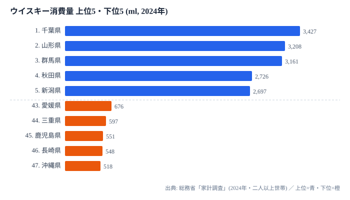

「ウイスキーは都会で飲まれる洗練された酒」というイメージを持っている方は多いでしょう。ところが総務省「家計調査」(2024 年) の都道府県庁所在市・二人以上世帯あたり **年間ウイスキー消費量** を見ると、その先入観はあっさり覆されます。首位に立ったのは東京ではなく **千葉県 (3,427ml)** でした。

最下位の **沖縄県 (518ml)** との差は **6.6 倍** に達します。砂糖や米といった食料品と比べても、酒類のなかでウイスキーの地域格差は際立って大きいのです。そして上位を関東・東北・北海道が占め、下位を九州・沖縄が占めるという、くっきりとした「ウイスキー地図」が描けます。この記事では、なぜ東京でなく千葉が首位なのか、そしてなぜ九州沖縄でウイスキーが飲まれないのかを、消費の構造から読み解いていきます。

## 上位5県と下位5県を並べると見える「南北の断層」

まず上位5県と下位5県を 1 枚に並べてみましょう。

> [!NOTE]
> 家計調査の消費量は「都道府県庁所在市・二人以上世帯あたり」の値で、世帯人員の違いを補正した1人あたりではありません。県全体や単身世帯を含む実態とは差が出るため、ここでの「千葉が首位」は世帯ベースの傾向として読むのが正確です。

1 位 **千葉県 (3,427ml)** は、世帯あたり年間で約 3.4 リットルを消費する計算で、2 位 山形 (3,208ml) を約 7%、3 位 群馬 (3,161ml) を約 8% 上回ります。**首都圏で名前が挙がりそうな東京を抑えて、千葉と群馬という関東の周辺県が上位に食い込んでいる** のが最初の意外なポイントです。ハイボール文化の浸透、郊外居住者の家飲み比率の高さ、大型商業施設での酒類販売構成など、複数の要因が重なっていると考えられます。都市そのものより、その周りで家飲みする層がウイスキー消費を押し上げている可能性が読み取れます。

一方、下位5県は **愛媛 (676ml)・三重 (597ml)・鹿児島 (551ml)・長崎 (548ml)・沖縄 (518ml)** と続きます。とくに鹿児島・長崎・沖縄の九州南部から沖縄にかけての並びは、上位の関東・東北・北海道と地理的に正反対です。日本列島を縦に貫くように、ウイスキーが「よく飲まれる北」と「あまり飲まれない南」に分かれる断層が見えてきます。

<source-link href="/ranking/whisky-consumption-quantity">ウイスキー消費量ランキングをもっと見る</source-link>

## なぜ寒冷地でウイスキーが好まれるのか

上位10県を地域別に整理すると、寒い地域への偏りがはっきりします。東北からは山形 (2 位)・秋田 (4 位)・宮城 (6 位)・青森 (10 位) の4県が入り、これに北海道 (8 位) を加えると、北日本だけで上位10県の半分を占めます。さらに新潟 (5 位)・富山 (7 位) の北信越2県も加わり、日本海側の雪国がそろってウイスキーを多く飲んでいることが分かります。

> [!TIP]
> ウイスキーは度数が高く、お湯割り・水割り・ロックで体を温めながらゆっくり飲める酒です。寒冷地で消費が伸びる背景には、長い冬の在宅時間の長さと、温かい飲み方との相性のよさがあると読めます。日本酒や焼酎など他の酒類の地図と重ねると、その土地の「冬の飲み方」が浮かび上がります。

関東勢の千葉 (1 位)・群馬 (3 位) は寒冷地需要とは別系統です。こちらは首都圏近郊でのハイボール需要や、郊外の家飲み文化が消費を支えていると考えられます。つまり上位構造は、**「寒い土地でじっくり温まる飲み方」と「都市近郊で気軽に飲むハイボール」という、性格の異なる2系統の需要が重なってできている** と見るのが自然です。中国地方で唯一上位に入った山口 (9 位) のような例外もあり、単純な気候だけでは説明し切れない奥行きがあります。

**[仮説]** ハイボール需要 (千葉・群馬など首都圏近郊) と寒冷地需要 (東北・北海道・北信越) という2系統が上位を形づくっている可能性があります。**検証コマンド**: ハイボール缶の都道府県別出荷量 (アサヒ・サントリーの IR 資料) と本データを照合します。**検証期日**: 2026-06 中。期日後の判定として、ハイボール缶出荷量との相関が r > 0.5 なら仮説を支持します。

## 最下位グループに見える「焼酎・泡盛との代替関係」

下位3県の鹿児島 (45 位・551ml)・長崎 (46 位・548ml)・沖縄 (47 位・518ml) は、いずれも焼酎・泡盛の文化が極めて強い地域です。最下位の沖縄 (518ml) は1位千葉の約 15% にとどまり、その差は 6.6 倍に開きます。

この並びは偶然ではありません。別記事の [焼酎消費量ランキング](https://stats47.jp/ranking/shochu-consumption-quantity) で示したとおり、鹿児島や宮崎は焼酎消費の上位常連です。地元で愛される蒸留酒が焼酎・泡盛である地域では、同じ蒸留酒であるウイスキーの出番が少なくなります。**「焼酎を飲む地域はウイスキーを飲まない」という代替関係が、家計調査の数字にそのまま表れている** のです。

> [!WARNING]
> 順位を「人気の高低」と単純に読むのは危険です。九州沖縄のウイスキー消費が少ないのは嗜好の問題というより、焼酎・泡盛という強力な代替財が存在するためと考えるのが妥当です。逆に上位県でも、ハイボール需要と寒冷地需要では飲まれ方がまったく異なります。同じ「上位」「下位」でも背景は一枚岩ではない点に注意してください。

焼酎消費量ランキングとウイスキー消費量ランキングを47県で対応させると、負の相関の傾向が観察されます (厳密な係数の検証は別途必要です)。酒類は互いに需要を奪い合うため、ウイスキー単独ではなく他の酒類とセットで地図を見ることで、その土地の飲酒文化がより立体的に見えてきます。

<source-link href="/ranking/shochu-consumption-quantity">焼酎消費量ランキングをもっと見る</source-link>

## まとめ

- 1 位は **千葉県 (3,427ml)**、2 位 **山形 (3,208ml)**、3 位 **群馬 (3,161ml)** で、東京ではなく千葉が首位
- 最下位は **沖縄 (518ml)** で、首位とは **6.6 倍** の地域差 (酒類のなかでも極端に大きい開き)
- 上位は **関東 (千葉・群馬) + 東北4県 (山形・秋田・宮城・青森) + 北海道 + 北信越 (新潟・富山) + 山口**
- 下位は **鹿児島・長崎・沖縄** = 焼酎・泡盛文化圏
- 構造は「寒冷地でじっくり温まる飲み方」「都市近郊のハイボール需要」「焼酎・泡盛との代替関係」で説明できる

日本酒や焼酎など他の酒類とあわせて見たい方は、[ウイスキー消費量ランキング](https://stats47.jp/ranking/whisky-consumption-quantity) や酒類消費を扱う [経済カテゴリ](https://stats47.jp/category/economy) もご覧ください。

## データ出典

- 総務省「家計調査」(2024 年・都道府県庁所在市の二人以上世帯)
- e-Stat 経由で都道府県別に整備
