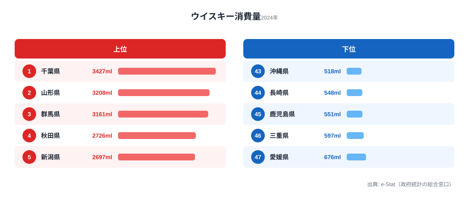

「ウイスキーが一番飲まれている県は?」と聞かれて、東京や北海道を思い浮かべる人は多いはずです。ところが総務省「家計調査」(2024 年) で 1 世帯あたりの年間ウイスキー消費量を調べると、首位は **千葉県 (3,427ml)** でした。東京 (1,998ml) を 7 割以上も上回り、ウイスキーの本場というイメージのある北海道 (2,451ml) すら抑えています。

最下位は **沖縄県 (518ml)** で、千葉とのあいだには **6.62 倍** もの開きがあります。同じ家計調査で見る砂糖や米の地域差は 2 倍前後にとどまりますから、酒類のなかでもウイスキーは突出して「住む場所で飲む量が変わる」品目だといえます。この記事では、その格差がなぜ生まれるのかを地図とデータからひも解いていきます。

> [!NOTE]
> 家計調査の数値は「都道府県庁所在市・二人以上世帯」の 1 世帯あたり年間購入量です。単身世帯や家庭外の飲酒 (居酒屋・バー) は含まないため、外食でウイスキーを飲む量が多い都市部では実消費が過小に出やすい点に注意してください。順位は「家で買って飲むウイスキー」の地図と読み替えるのが正確です。

## ウイスキー消費量、千葉が首位の理由

まず上位 5 県と下位 5 県を見比べてみます。

<source-link href="/ranking/whisky-consumption-quantity">ウイスキー消費量ランキング(47都道府県・各年版)をもっと見る</source-link>

1 位の **千葉県 (3,427ml)** は、1 世帯あたり年間で約 3.4 リットルのウイスキーを購入している計算になります。これは 2 位 山形 (3,208ml) を 7%、3 位 群馬 (3,161ml) を 8% 上回る数字です。注目したいのは、**東京 (15 位・1,998ml) や神奈川 (12 位・2,062ml) を抑えて千葉が首位に立った** という点です。

家計調査が拾うのは「家で飲むために買ったウイスキー」です。都市部の住民は店や職場の近くで外飲みする比率が高いのに対し、千葉のような郊外・ベッドタウンでは帰宅後に家で晩酌するスタイルが主流になりやすい。ハイボールを家でつくる文化が広がったことと、郊外型の大型量販店でウイスキーをまとめ買いしやすいことが重なり、家計に計上される量が押し上げられた可能性があります。「ウイスキー好きが多い県」というより「家で飲む文化が強い県」と読むほうが、東京を上回った理由を素直に説明できます。

上位 10 県の地域分布を見ると、もう一つの軸が浮かびます。山形 (2 位)・秋田 (4 位)・宮城 (6 位)・青森 (10 位) の東北 4 県に、新潟 (5 位)・富山 (7 位) の北信越、そして北海道 (8 位) を加えると、上位 10 のうち 7 県が **寒冷地** です。気温が下がる地域ほど、水割りやお湯割りで体を温められる蒸留酒の需要が高まりやすいという構図がうかがえます。

> [!TIP]
> 同じ寒冷地の酒として、東北・北陸では日本酒の消費も全国上位です。[日本酒消費量ランキング](https://stats47.jp/ranking/sake-consumption-quantity)と並べて見ると、寒い地域では「日本酒もウイスキーも飲む」傾向が読み取れ、特定の酒だけが強いわけではないことが分かります。気候という共通要因が複数の酒類の消費を底上げしていると考えると腑に落ちます。

## 下位は九州・沖縄に集中、焼酎との取り合い

下位グループを見ると、構造はさらに明快です。最下位 **沖縄 (518ml)** は 1 位千葉のわずか 15% で、46 位 長崎 (548ml)・45 位 鹿児島 (551ml) と続き、**九州南部と沖縄が下位を占めています**。45〜47 位の 3 県はいずれも年間 600ml に届かず、千葉の 5 分の 1 にも満たない水準です。

この 3 県は **焼酎・泡盛文化が極めて強い地域** です。鹿児島は芋焼酎、沖縄は泡盛という「地元の蒸留酒」が日常の晩酌に根づいており、ウイスキーが入り込む余地が小さくなっています。実際、別記事の[焼酎消費量ランキング](https://stats47.jp/ranking/shochu-consumption-quantity)では鹿児島・宮崎が常連の上位県で、ウイスキー下位県とちょうど顔ぶれが入れ替わります。「焼酎をよく飲む地域はウイスキーを飲まない」という代替関係が、家計調査の数字にそのまま表れているわけです。

> [!WARNING]
> ここで見える「焼酎が強い県=ウイスキーが弱い」という関係は、あくまで消費量の負の相関であって、片方が片方を直接押し下げている因果ではありません ([仮説] の段階)。地元の蒸留酒・気候・年齢構成・所得など複数の要因が同時に効いている可能性があるため、「焼酎のせいでウイスキーが売れない」と単純化しないよう注意してください。

中位を見ても、九州の福岡 (14 位・2,013ml) だけは例外的に上位寄りで、都市規模が大きく多様な酒が流通する地域では焼酎一辺倒にならない様子もうかがえます。一方で同じ九州でも佐賀 (42 位)・熊本 (37 位)・宮崎 (40 位) は下位寄りに沈み、地域全体として「焼酎圏」の色が濃いことが確認できます。全 47 県の並びは[ウイスキー消費量ランキング](https://stats47.jp/ranking/whisky-consumption-quantity)で確認できます。

## ウイスキー地図に見える3つのクラスター

上位 10 県を地図上で整理すると、ウイスキー消費の「濃い地域」は大きく 3 つのまとまりに分かれます。

- **関東クラスター**: 千葉 (1 位)、群馬 (3 位) — 郊外の家飲み・ハイボール需要
- **東北・北海道クラスター**: 山形 (2 位)、秋田 (4 位)、宮城 (6 位)、北海道 (8 位)、青森 (10 位) — 寒冷地での晩酌需要
- **北信越クラスター**: 新潟 (5 位)、富山 (7 位) — 同じく寒冷・降雪地域

加えて、中国地方で唯一上位に食い込んだ **山口 (9 位・2,270ml)** が単独で目立ちます。地理的にはどのクラスターにも属しませんが、隣接する九州の焼酎圏とは一線を画す結果になっています。

これらを踏まえると、ウイスキー消費を押し上げているのは大きく 2 系統の飲み方文化だと整理できます。一つは関東・首都圏近郊で広がった **ハイボールを中心とした家飲み需要**、もう一つは東北・北海道・北信越に共通する **寒冷地での水割り・お湯割り需要** です。逆に九州沖縄では、焼酎・泡盛という地元の蒸留酒が同じ晩酌の座をすでに占めているため、ウイスキーの出番が少なくなっています。

> [!NOTE]
> 千葉が東京を上回る「逆転」は 2024 年に限った話ではなく、近年の家計調査でくり返し観測されています。家計調査は対象が県庁所在市の二人以上世帯に限られるため、年ごとのサンプルのぶれは小さくありません。単年の順位を断定的に語るより、「関東郊外と寒冷地が上位・九州沖縄が下位」という大きな傾向で読むのが安全です。

## まとめ

- 1 位 **千葉県 (3,427ml)**、2 位 **山形 (3,208ml)**、3 位 **群馬 (3,161ml)** で、いずれも家飲み・寒冷地需要が強い県
- 最下位 **沖縄 (518ml)** との差は **6.62 倍**。酒類のなかでも地域格差が極端に大きい品目
- 上位は **関東郊外 (千葉・群馬) + 東北 (山形・秋田・宮城・青森) + 北信越 (新潟・富山) + 北海道 + 山口** に集中
- 下位は **鹿児島・長崎・沖縄** = 焼酎・泡盛文化圏。地元の蒸留酒との取り合いが背景
- 「家で飲む文化」「寒冷地の蒸留酒需要」「焼酎との代替」の 3 点でウイスキー地図はおおむね説明できる

## データ出典

- 総務省「家計調査」(2024 年・都道府県庁所在市の二人以上世帯)
- e-Stat 経由で都道府県別に整備
