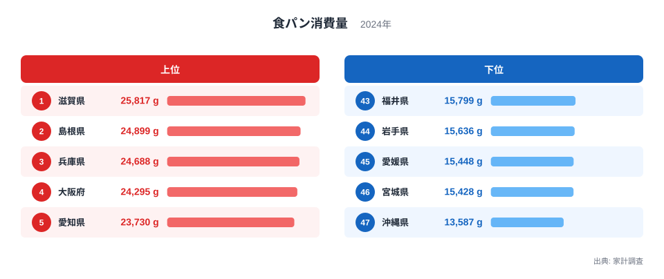
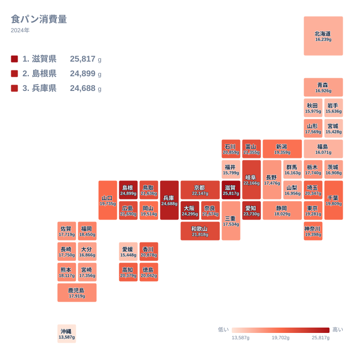

食パンは全国の家庭で日常的に食べられているパンの代表格ですが、家計調査の消費量データを見ると、県によって年間の消費量には大きな差があります。パン食といえば関東のイメージを持つ人もいるかもしれませんが、実際のデータでは関西の府県が上位を占めています。この記事では、2024年の家計調査データをもとに、食パン消費量が県ごとにどう違うのかを確かめます。

2024年の家計調査によると、食パン消費量が最も多いのは滋賀県で25,817グラム、次いで島根県が24,899グラム、兵庫県が24,688グラムとなっています。最も少ないのは沖縄県の13,587グラムで、宮城県が15,428グラム、愛媛県が15,448グラムと続きます。滋賀県と沖縄県の間には1万グラムを超える開きがあり、消費量にして2倍近い差がついています。

## 食パン消費量の上位と下位

<source-link href="/ranking/white-bread-consumption-quantity">食パン消費量ランキングをもっと見る</source-link>

上位を見ると、滋賀県が25,817グラムで首位、島根県が24,899グラムで2位、兵庫県が24,688グラムで3位、大阪府が24,295グラムで4位、愛知県が23,730グラムで5位と続きます。近畿地方の府県が上位に集中しているのが特徴的です。関西では朝食にパンを食べる習慣が全国平均より根強く残っているといわれており、パン専門店の激しい競争が価格や品質の面で消費を後押ししてきたことも要因の一つとして考えられます。特に神戸を擁する兵庫県は、開港の歴史からいち早く洋食文化が根づいた土地柄であり、パンへの親しみやすさが長年培われてきました。

島根県が2位に入っている点はやや意外に映るかもしれません。近畿地方から離れた山陰地方に位置しながら上位に食い込んでいるのは、地域のパン製造業が地元の食生活に深く浸透していることや、朝食を手早く済ませる必要のある兼業農家の多い地域性が影響している可能性があります。

下位に目を移すと、沖縄県が13,587グラムで最も少なく、宮城県が15,428グラム、愛媛県が15,448グラム、岩手県が15,636グラム、福井県が15,799グラムと続きます。沖縄県は米食文化に加えて独自の食文化を持つ地域で、朝食にパンを選ぶ習慣が本土ほど定着していないことが消費量の少なさに表れていると考えられます。

> [!NOTE]
> 家計調査の消費量は、その世帯が実際に購入した重量の平均です。自家製パンや外食で食べたパンは含まれず、あくまで家庭での購入量に限られる点に注意してください。

## 地理分布から見える傾向

タイルマップで全国を見渡すと、近畿地方を中心に西日本で消費量が高く、東北や沖縄で低い傾向がはっきりと表れています。関東地方は中間的な水準にとどまっており、パン食のイメージが強い割には突出した消費量ではありません。この分布は、パンの消費が単に人口密度や都市化の度合いで決まるのではなく、地域ごとの食文化の歴史に根ざしていることを示しています。

ただし「西日本で高い」という括り方は正確ではありません。愛媛県は15,448グラムで45位、沖縄県は13,587グラムで最下位と、西日本にも下位に沈む県があります。逆に上位2位の島根県は近畿から遠く離れた山陰地方に位置しています。地図の濃淡は東西という軸ではなく、近畿とその周辺という比較的狭い範囲にまとまっており、県境をまたいで隣接する地域どうしで似た値になる傾向が見て取れます。食習慣が行政区画ではなく生活圏の単位で広がってきたことをうかがわせる分布です。

> [!WARNING]
> 家計調査は世帯単位の平均値であり、世帯人数や朝食の形態(家庭内か外食か)を調整していません。単身世帯が多い地域と多世帯同居が多い地域とでは、同じ消費量でも一人あたりの実感が変わる可能性があります。

愛知県が5位に入っていることも見逃せません。愛知県には独自の喫茶店文化があり、朝食にトーストを添えるモーニングサービスが日常に根づいている地域として知られています。こうした外食での習慣が家庭での食パン購入にも波及し、消費量を押し上げている可能性が考えられます。

## 滋賀県と島根県、それぞれの消費量の背景

[滋賀県のデータ](/areas/25000)と[島根県のデータ](/areas/32000)を見比べると、両県とも食パン消費量で上位に入っていますが、地理的な位置づけは大きく異なります。滋賀県は京阪神のベッドタウンとして発展してきた地域で、関西の食文化圏に組み込まれる形でパン食が浸透してきました。一方の島根県は関西から離れた山陰地方に位置しており、独自の食習慣の中でパンが日常食として定着してきた経緯があると考えられます。

このような地域ごとの食文化の違いは、他の食品の消費量とあわせて見るとさらに立体的に理解できます。[同じカテゴリの統計一覧](/category/economy)にある米や麺類の消費量データと見比べると、主食の選び方が地域によってどれだけ異なるかがより鮮明に見えてきます。

> [!TIP]
> 食パン消費量を比べるときは、その地域が米食と洋食のどちらを主食として重視してきたかという食文化の歴史も踏まえると、単なる数字以上の背景が見えてきます。

## 米食との関係を考える

食パン消費量が少ない地域は、必ずしもパンそのものを嫌っているわけではなく、朝食に米飯を選ぶ習慣が根強く残っていることの裏返しだと考えられます。米どころとして知られる東北地方や、独自の食文化を持つ沖縄県で消費量が低いのは、朝食の主食としてまず米飯が選ばれる傾向が強いためだと推測できます。パンと米という2つの主食は互いに置き換わる関係にあるため、一方の消費量だけを見るのではなく、両方をあわせて見ることで、その地域の食習慣がより正確に見えてきます。

## まとめ

食パン消費量は、関東ではなく近畿地方が上位を占めるという、イメージとは異なる分布を示す指標です。滋賀県や兵庫県、大阪府といった近畿地方の府県は、港町を中心に育まれてきた洋食文化の歴史がパン食の定着を後押ししてきたと考えられます。一方で沖縄県や東北の一部の県では、米食を中心とした独自の食文化が根強く、消費量が抑えられています。単純な都市化の度合いではなく、地域ごとの食文化の歴史が消費量の差を生んでいることが、このデータから読み取れます。

## データ出典

- 家計調査(2024年)
