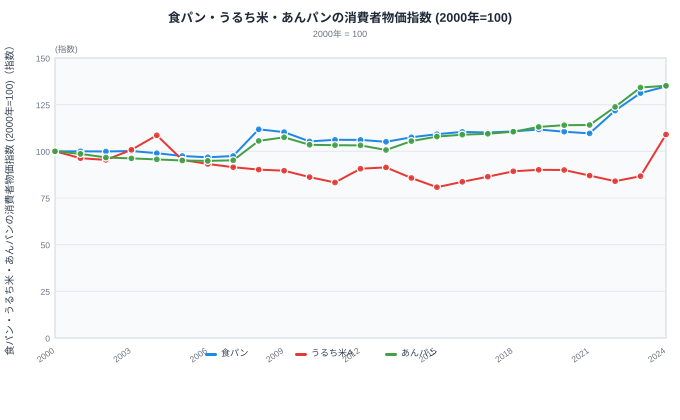
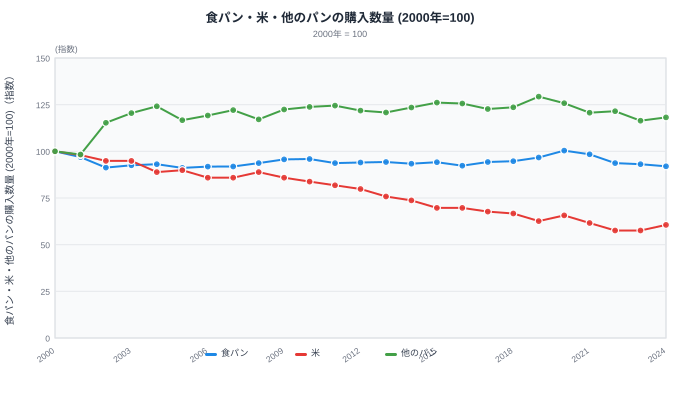
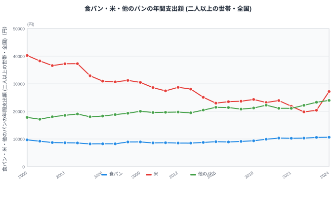
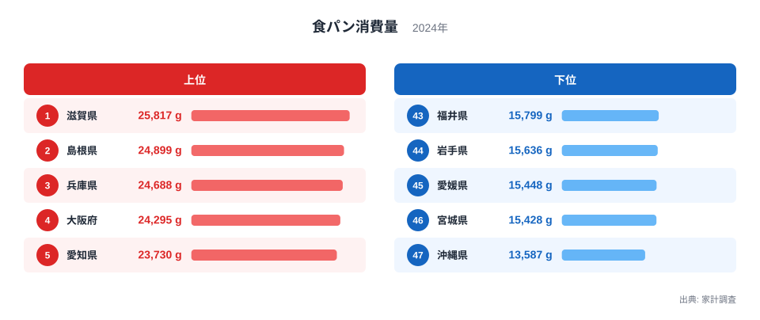

食パンは値段が上がると、かえって買う量が増える──そんな動きを見せた時期が、日本の家計にはたしかにありました。ふつう、モノは値段が上がれば買う量が減ります。これを経済学では「需要の法則」と呼びますが、この法則に逆らうように動く例外的な商品を「ギッフェン財」と呼んでいます。食パンは、この珍しい性質を示した候補として知られてきました。

では、2021年から2024年にかけての急激な値上げでも、同じことが起きているのでしょうか。総務省の家計調査と消費者物価指数を2000年から2024年まで追うと、答えは「いいえ」です。むしろ、値段が上がるほど買う量は減っています。何が変わったのかを、3つのグラフで見ていきます。

## 食パンの価格は2000年からどう動いたか

食パンの消費者物価指数は、2000年から2007年までほとんど動きませんでした。2000年を100とすると2007年は97.5で、むしろわずかに下がっていたほどです。ところが2008年に一気に111.8へ跳ね上がります。世界的な穀物市場への資金流入で原材料や燃料の価格が急騰した年で、これが食パンをはじめとするパン類の値上げにつながりました。

その後は105〜111程度で長く落ち着いていましたが、2021年の109.6を境に流れが変わります。2022年に121.8、2023年に131.2、2024年には134.8まで上昇し、2021年から2024年のわずか3年で約23%も値上がりしました。うるち米（グラフでは「うるち米A」）の指数は2010年代を通じて80〜90台まで下がる場面が多く、食パンより値ごろ感がある時期が続きましたが、2024年には86.7から109.0へ一気に跳ね上がっています。いわゆる令和のコメ不足が起きた年です。

> [!NOTE]
> 家計調査で購入数量が公表されている品目は「他のパン」ですが、消費者物価指数では対応する品目が無く、代わりに動きが連動しやすい「あんパン」の指数を代理指標として使っています。

## 購入量はむしろ減っている

> [!NOTE]
> このグラフの数量は、二人以上の世帯・全国平均の1世帯当たり年間の値です。都道府県別の値ではありません。次の支出額グラフも同じ家計調査・母集団の値です。また、消費者物価指数の「うるち米A」は特定銘柄の価格を示す指標で、ここでの家計調査の「米」（米全体の購入量）とは対象範囲が異なります。

食パン消費量（家計調査の購入数量指数）を見ると、2008年からの値上げ局面では、たしかに数量が増えています。2007年の91.9から2010年には95.9まで上がっており、価格が上がったのに買う量も増えるという、ギッフェン財らしい動きが確認できます。この時期は米の価格も落ち着いており、3つの主食のなかで食パンだけが値ごろ感を失っていない状態が続いていました。

> [!WARNING]
> 2008〜2010年に食パンの数量が増えた局面は、米の価格が比較的安定していた時期と重なります。食パンの値上がりだけが単独の原因とは言い切れず、相関関係と因果関係は別物です。

ところが2021年からの値上げ局面では、様子がまったく違います。食パンの購入数量指数は2021年の98.4から2024年には92.0まで下がりました。価格が約23%上がった同じ期間に、買う量は約6.5%減っているのです。値段が上がれば買う量が減るという、ふつうの需要の法則どおりの動きに戻っています。

> [!WARNING]
> 2021年を基準にした「約6.5%減」には、コロナ禍による押し上げの影響も一部含まれます。食パンの購入数量指数は2019年96.7→2020年100.4（在宅時間の増加で一時的に増加）→2021年98.4と、基準に採った2021年はコロナ前より高い水準にありました。コロナ前の2019年と比べた2024年の減少は約4.9%です。

米の購入数量は2000年から2024年にかけて、100から60.6までほぼ一貫して減り続けてきました。ただし直近の2024年だけは例外で、2023年の57.6から60.6へと反発しています。この年は米の価格が前年から約26%も跳ね上がった年でもあります。長年続いた減少傾向が、価格急騰の年に限って途切れたことになります。

> [!WARNING]
> [仮説] 米の購入量が2024年だけ増えたのは、価格上昇によって「割安な主食」として選ばれたのか、供給不安による買いだめ・先取り購入が起きたのかを、この1年分のデータだけで見分けることはできません。今後数年分の推移を見て検証する必要があります。

## 支出額はなぜ増え続けているのか

<source-link href="/ranking/white-bread-consumption-expenditure">食パン消費支出額ランキングをもっと見る</source-link>

あわせて見る: [米消費支出額ランキング](/ranking/rice-consumption-expenditure) / [他のパン消費支出額ランキング](/ranking/other-bread-consumption-expenditure)

食パン消費支出額の推移を見ると、2019年の9,912円から2024年には10,621円まで、約7%増えています。同じ期間に購入数量は約5%減っているので、支出額が増えたのは「たくさん買うようになったから」ではなく、「1個あたりの値段が上がった分を、購入量を少し減らしながらも払い続けているから」だとわかります。数量が減っても支出額は増える──これは、値段が上がると欲しくなるギッフェン財の動きとは別の現象で、単に「なかなかやめられない食品」の値上がりを家計が受け止めている状態です。

米の支出額は2023年の20,398円から2024年には27,198円へ、約33%も増えました。数量の反発（約5%増）だけでは説明できない伸び幅で、支出額の増加の大部分は米そのものの値上がりによるものです。他のパンの支出額も、価格の代理指標であるあんパンの指数が2021年から2024年にかけて約18%上がるなかで、23,986円まで緩やかに増え続けています。

## 値上げの影響は都道府県で均一なのか

<source-link href="/ranking/white-bread-consumption-quantity">食パン消費量ランキングをもっと見る</source-link>

ここまで見た数量や支出額の推移はすべて全国平均の値でしたが、食パン消費量は都道府県ごとにもともと大きな開きがあります。都道府県庁所在市別の家計調査（ここまでのグラフとは別の集計で、単位も指数ではなくグラム）で見ると、2024年の食パン消費量は1位滋賀県で25,817g、最下位は沖縄県で13,587gと、その差は約1.9倍です。上位には滋賀県・島根県・兵庫県・大阪府・愛知県と近畿・東海圏が並んでおり、パン食が根付いている地域の消費量が目立ちます。

では、2021年からの値上げ局面での減り方も、全国どこでも同じように起きているのでしょうか。同じ都道府県別データで2021年と2024年を比べると、47都道府県のうち32県では消費量が減った一方、15県ではむしろ増えています。減り幅が最大の沖縄県は17,370gから13,587gへ約21.8%減っているのに対し、鹿児島県は13,775gから17,919gへ約30.1%増えており、一見すると値上げへの反応が県によって正反対のように見えます。ただし、都道府県庁所在市ごとの家計調査は標本が小さく、価格が落ち着いていた時期の3年間で比べても、県別の増減はもともと同程度にばらつきます。今回の「32県減・15県増」という内訳や、沖縄県・鹿児島県で見られたような大きな振れ幅も、値上げ局面に固有の反応というより、この統計に平常時から乗っている変動と見分けがつきません。全国平均で見た数量の減少（前掲グラフ）はあくまで全国をならした動きであり、このデータだけからは、値上げの影響が特定の地域に偏って表れたとは言えず、個々の都道府県で増減が分かれた理由も特定できません。

## 発見：なぜ「安い主食への乗り換え」が起きなくなったのか

2008年からの値上げ局面と、2021年からの値上げ局面には、大きな違いがあります。2008年前後は、食パンだけが値上がりする一方で、米はむしろ値ごろ感を保っていました。3つの主食の中に「相対的に安いもの」が残っていたため、家計は食パンに乗り換えることで主食全体への支出を抑えられたと考えられます。

一方で2021年からの値上げは、食パンも米も他のパンも、ほぼ同時に、しかも急な角度で値上がりしています。乗り換え先になれるほど値ごろ感のある主食が見当たらない状況です。[仮説] このように、乗り換え先が無くなったことが、需要の法則どおりの「値上がりすれば買う量が減る」という動きに戻った一因ではないかと考えられます。ただし、この20年余りの間には世帯の高齢化や単身世帯の増加、所得の変化など主食の選び方に影響する要因が他にも多くあり、価格だけを原因と決めつけることはできません。検証には、これらの要因を切り分けた分析が必要です。

こうした食費全体の重さは、家計に占める食費の割合であるエンゲル係数にも表れます。都道府県別の違いは[エンゲル係数の都道府県別ランキング](/blog/engel-coefficient-prefecture-ranking)でも確認できます。

## まとめ

- 食パンの消費者物価指数は2000年を100として2024年に134.8まで上昇し、特に2021〜2024年の3年間で約23%値上がりした
- 2008年の値上げ局面では食パンの購入数量が91.9から95.9へ増えたが、2021〜2024年の値上げ局面では98.4から92.0へ減った
- 米の購入数量は2000〜2024年でほぼ一貫して減り続けたが、価格が急騰した2024年だけ57.6から60.6へ反発した
- 食パンの支出額は数量が減った2019〜2024年でも約7%増えており、支出額の増加と購入量の増加は同じ意味ではない
- 値上げ局面ごとに主食の相対的な値ごろ感が異なり、「一番安い主食」への乗り換えが起きるかどうかも変わってくる
- 都道府県庁所在市別に見ると2024年の食パン消費量は1位滋賀県から最下位沖縄県まで約1.9倍の開きがあり、2021〜2024年の県別の増減（32県減・15県増）も、価格が動いていない時期と同程度のばらつきで、値上げ局面に固有の反応とは言えない

## データ出典

- 総務省統計局「家計調査 家計収支編（二人以上の世帯）品目分類（2020年改定）」月次（statsDataId: 0003343671 金額、0003343670 数量）
- 総務省統計局「家計調査 家計収支編（二人以上の世帯）品目分類（2020年改定）」都道府県庁所在市別・年（statsDataId: 0003348235）
- 総務省統計局「2020年基準 消費者物価指数」品目別・全国（statsDataId: 0003427113）
