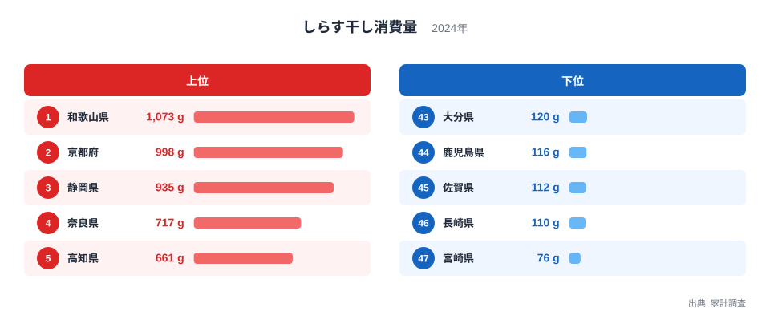
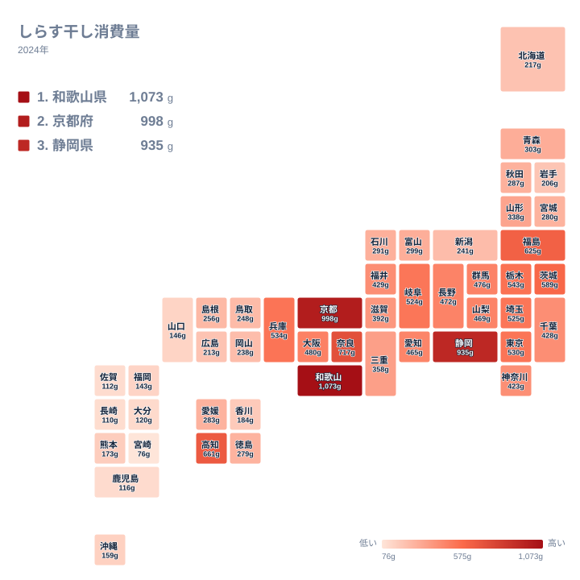

しらす干しは、カタクチイワシなどの稚魚を釜ゆでして干した加工品です。ご飯にかけたり、酢の物や卵焼きに混ぜたりと、家庭料理で幅広く使われています。ところが家計調査の数字を見ると、この身近な食材の消費量には都道府県で大きな開きがあります。

全国でもっとも消費量が多いのは和歌山県で、年間1,073グラムを消費しています。もっとも少ないのは宮崎県で76グラムにとどまり、両者の差はおよそ14倍にのぼります。同じ日本国内でありながら、なぜこれほどの差が生まれるのでしょうか。この記事では、上位と下位の分布を可視化しながら、その背景を探っていきます。

## 上位と下位を見る

<source-link href="/ranking/whitebait-consumption-quantity">しらす干し消費量ランキングをもっと見る</source-link>

上位を見ると、和歌山県の1,073グラムを筆頭に、京都府が998グラム、静岡県が935グラム、奈良県が717グラム、高知県が661グラムと続きます。いずれも太平洋に面しているか、太平洋岸の県と隣接している地域です。しらす漁は稚魚を短時間で水揚げして加工する必要があるため、水揚げ港からの距離が消費量に直結しやすい食材だといえます。

一方で下位を見ると、宮崎県の76グラムを最下位に、佐賀県が112グラム、長崎県が110グラム、鹿児島県が116グラム、大分県が120グラムと、九州の各県が並んでいます。長崎県や鹿児島県は水産業が盛んな地域ですが、しらすよりもあごや太刀魚、かつおなど、地元で水揚げされる別の魚介を日常的に食べる文化が根付いていると考えられます。[仮説] しらす自体の水揚げ量が少ないというより、食卓での優先順位が他の魚介に向いている可能性があり、検証には各県の漁獲統計との突き合わせが必要です。

## 地理分布で見るしらす干し消費量

タイルマップにすると、消費量の多い県が近畿から東海にかけて帯状に連なっている様子がよく分かります。和歌山県、京都府、静岡県、奈良県という上位4県はすべて近畿・東海圏に位置し、隣接する兵庫県や大阪府、愛知県も500グラム前後と、全国平均を上回る水準を保っています。

対照的に、九州南部から沖縄にかけては軒並み低い値が続きます。北海道も217グラムと中位にとどまっており、消費量の高さは単純な「海に近いかどうか」だけでは説明できません。むしろ、しらす漁が古くから盛んで加工の歴史が長い地域ほど、消費量が積み上がっている構図が見えてきます。

## なぜ関西・東海で消費が多いのか

和歌山県や静岡県は、駿河湾や紀伊水道など、しらす漁に適した漁場を抱えています。稚魚は鮮度が落ちやすいため、水揚げ港の近くで釜ゆでにして地元に流通させる産地直送型の消費が根付いてきました。京都府や奈良県のように海に面していない、あるいは海岸線が短い県も上位に入っているのは、隣接する和歌山県や大阪府経由でしらす干しが日常的に流通し、京料理や奈良の郷土料理に取り入れられてきた歴史が影響していると見られます。

しらすを使った郷土料理としては、和歌山県の「しらす丼」や静岡県の「生しらす丼」が知られています。観光地としてしらす料理を前面に出す地域では、日常の食卓でもしらすを使う頻度が自然と高くなりやすいと考えられます。[仮説] 観光需要と家庭消費の相関については、観光統計と家計調査を組み合わせた検証がまだ十分ではありません。

## 他の海産物との違い

しらす干しは塩分を含む乾物であるため、同じ魚介類でも刺身用の生魚とは消費のされ方が異なります。常温に近い環境でも一定期間保存でき、少量ずつ料理に加えやすいことから、購入頻度そのものが県によって差が出やすい食材です。九州各県で消費量が少ない背景には、かつおの一本釣りやあご出汁など、しらす以外の魚介加工品が食文化の中心を占めていることも関係していると考えられます。地域ごとの魚食文化を比べる際は、しらす干し単体の数字だけでなく、他の水産加工品の消費量も合わせて見ることで、より立体的な理解につながります。

## まとめ

- しらす干し消費量の全国1位は和歌山県で1,073グラム、最下位は宮崎県で76グラムです
- 上位と下位の差はおよそ14倍で、家計調査の品目の中でも地域差が大きい部類に入ります
- 上位は和歌山県、京都府、静岡県、奈良県、高知県と近畿・東海圏に集中しています
- 下位は宮崎県、長崎県、佐賀県、鹿児島県、大分県と九州の各県が並びます
- 産地からの近さと加工の歴史の長さが、消費量の地域差に影響していると考えられます

しらす干しの消費量は、[同じカテゴリの統計一覧](/category/economy)からほかの食品の消費傾向とあわせて確認できます。上位の[和歌山県のデータ](/areas/30000)や[京都府のデータ](/areas/26000)では、しらすを含む水産物の消費傾向を県単位で見ることができます。

> [!NOTE]
> この数値は総務省の家計調査による、二人以上の世帯における1年あたりの購入数量です。世帯単位の平均であるため、単身世帯の消費量や外食での摂取分は含まれていません。

> [!WARNING]
> 家計調査は都道府県庁所在市とその近郊を中心に調査するため、県内でも漁港に近い地域と内陸部とでは、実際の消費量にさらに差がある可能性があります。県全体の消費傾向として見る際はこの点にご注意ください。

> [!TIP]
> しらす干しは生しらすを加工したものなので、消費量が多い県ほど新鮮な生しらすを食べる機会も多い傾向があります。ランキング上位の県を訪れる際は、地元のしらす料理もあわせて確認してみると、統計の数字がより実感を伴って理解できます。

## データ出典

家計調査（総務省統計局）、2024年のデータをもとに作成しています。
