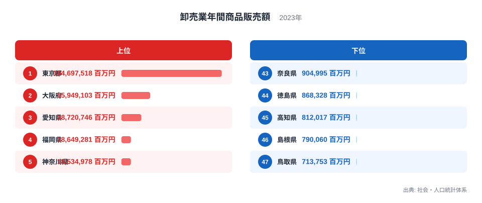
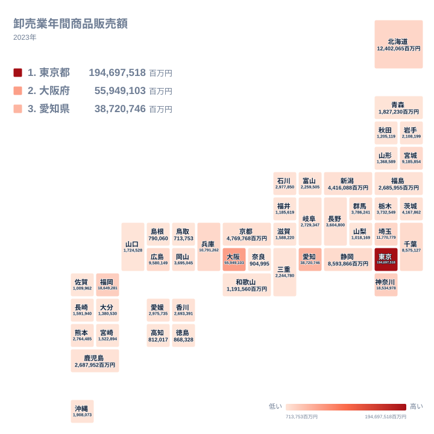

卸売業とは、メーカーから仕入れた商品を小売業者や他の卸売業者、あるいは工場などの産業用需要者へ大量に販売する事業のことです。2023年の卸売業年間商品販売額を都道府県別に見ると、この商いの規模には大きな地域差があることが分かります。

全国の販売額を合計すると膨大な金額になりますが、その中身を都道府県別に分けてみると、上位のごく一部の都道府県に販売額が集まっている構造が見えてきます。この記事では、社会・人口統計体系の2023年データをもとに、卸売業年間商品販売額がどの都道府県で多く、どの都道府県で少ないのかを確認し、その背景にある産業構造や商圏の広がりについて考えていきます。結論から言うと、この指標の地域差は消費者の購買力の差というより、企業の本社機能や物流拠点がどこに集積しているかを強く反映しています。

## 上位と下位の全体像

<source-link href="/ranking/wholesale-annual-sales-amount">卸売業年間商品販売額ランキングをもっと見る</source-link>

まず上位を見ていきます。東京都は194,697,518百万円で全国1位となっており、2位の大阪府に大差をつけています。大阪府は55,949,103百万円で2位、3位の愛知県は38,720,746百万円です。4位は福岡県で18,649,281百万円、5位は神奈川県で18,534,978百万円となっており、上位5都府県だけで全国の販売額の大部分を占める構図が浮かび上がります。

一方で下位を見ると、様子はまったく違います。43位の奈良県は904,995百万円、44位の徳島県は868,328百万円、45位の高知県は812,017百万円、46位の島根県は790,060百万円、そして47位の鳥取県は713,753百万円です。1位の東京都と47位の鳥取県を単純に比べると、その差はおよそ273倍にもなります。人口の差だけでは説明しきれないほどの開きであり、卸売業という業種そのものの立地の偏りが強く表れていると考えられます。

上位の顔ぶれを見ると、東京都と大阪府という二大都市圏の中心地に加え、愛知県、福岡県、神奈川県という広域の経済圏を持つ都道府県が並んでいます。これらはいずれも人口が多いだけでなく、周辺の県から人や物、商取引を集める中心地としての機能を持つ地域です。卸売業は最終消費者ではなく事業者を相手にする商売であるため、取引先の企業がどこに集中しているかが販売額に直結しやすいという特徴があります。

## 地理分布で見る集中の実態

地理分布の地図を見ると、販売額の多い都道府県が特定のエリアに固まっていることがはっきりと分かります。関東の東京都と神奈川県、埼玉県、千葉県、近畿の大阪府と京都府と兵庫県、そして中部の愛知県という、いわゆる三大都市圏の周辺に濃い色が集まっています。これに加えて、九州の玄関口である福岡県、北海道の中心である北海道、そして中国地方の広島県が単独で高い水準を保っています。

こうした分布は、卸売業がそれぞれの地方ブロックの中心都市に立地しやすいという傾向をよく表しています。福岡県は九州全体の商品流通の拠点であり、北海道は広大な道内はもちろん、道外への出荷を担う卸売業者が集まっています。広島県も中国地方の商業の中心として機能しており、単に県内の人口規模だけでは説明できない販売額の高さにつながっています。

反対に、地図の中で色の薄い都道府県は、四国や山陰、そして近畿の内陸部に多く見られます。徳島県、高知県、島根県、鳥取県、奈良県といった県は、いずれも大きな都市圏の中心からは外れた位置にあり、卸売業の拠点というよりも、隣接する大都市圏の卸売業者から商品の供給を受ける側になっていると考えられます。地理的な条件が、そのまま卸売業の集積度合いに影響していることがうかがえます。

## なぜこの分布になるのか

卸売業年間商品販売額がここまで偏る背景には、いくつかの要因が重なっていると考えられます。第一に、卸売業は企業の本社や支店が販売実績を計上する事業所単位で集計される統計であるため、大企業の本社が集中する東京都に販売額が積み上がりやすい構造があります。全国展開する企業が首都圏の本社でまとめて取引を計上するケースが多く、実際に商品が動く現場が全国に散らばっていても、統計上の数字は本社所在地に偏りがちです。

第二に、卸売業は最終消費者向けではなく、小売業者や製造業者など事業者同士の取引が中心であるため、企業が集積している地域ほど取引の総量が増える傾向にあります。東京都や大阪府のように多くの企業が本社機能や営業拠点を構える地域では、こうした事業者間の取引が自然と積み重なり、販売額が押し上げられます。

第三に、歴史的な商業集積の存在も見逃せません。大阪府はかつて「天下の台所」と呼ばれ、全国の物資が集まる商都として発展してきました。船場を中心とした問屋街の歴史は今も卸売業の集積という形で残っています。愛知県は自動車産業を中心としたものづくりの集積地であり、部品や資材の取引を担う卸売業が発達してきました。こうした歴史的な経緯が、現在の販売額の順位にも影響を与えていると見ることができます。

一方で下位の県については、〔仮説〕として、隣接する大都市圏に本社や主要な営業拠点を置く企業が多く、県内の事業所では小規模な取引にとどまっている可能性が考えられます。奈良県は大阪府に隣接しており、企業の意思決定や大口の取引が大阪府側で計上されやすいという構造が背景にあるかもしれません。この点については、事業所単位の詳しい内訳データを確認しなければ断定はできず、今後の検証が必要な仮説として捉えてください。

## まとめ

- 卸売業年間商品販売額の1位は東京都で194,697,518百万円、47位は鳥取県で713,753百万円です。
- 1位と47位の差はおよそ273倍にのぼり、人口差だけでは説明できない大きな開きがあります。
- 上位には東京都、大阪府、愛知県、福岡県、神奈川県という広域経済圏の中心地が並びます。
- 下位には徳島県、高知県、島根県、鳥取県、奈良県といった、大都市圏の中心から離れた県が集まっています。
- 卸売業は事業者間の取引が中心であるため、企業の本社機能や物流拠点の集積度合いが販売額に直結しやすい特徴があります。

こうした地域差の背景をさらに掘り下げたい場合は、[同じカテゴリの統計一覧](/category/economy)から関連する指標を確認できます。また、上位2都府県の詳しい統計は、[東京都のデータ](/areas/13000)と[大阪府のデータ](/areas/27000)からそれぞれ見ることができます。

> [!NOTE]
> 卸売業年間商品販売額は、企業や事業所が本社・支店単位で計上する統計です。全国展開する企業の場合、実際の商品の流れとは別に、本社が所在する都道府県にまとめて販売額が計上されることがあります。地域の実需要そのものを表す指標ではない点に注意してください。

> [!WARNING]
> この指標は卸売業者から小売業者や他の卸売業者への販売も含むため、同じ商品が複数の卸売業者を経由するたびに販売額として重複して計上される場合があります。県内の消費規模を単純に示す数字ではありません。

> [!TIP]
> 数字を読み解く際は、その都道府県の人口規模だけでなく、周辺地域を含めた商圏の広さや、大企業の本社・営業拠点がどれだけ立地しているかを合わせて見ると、順位の背景が理解しやすくなります。

## データ出典

社会・人口統計体系（2023年）
