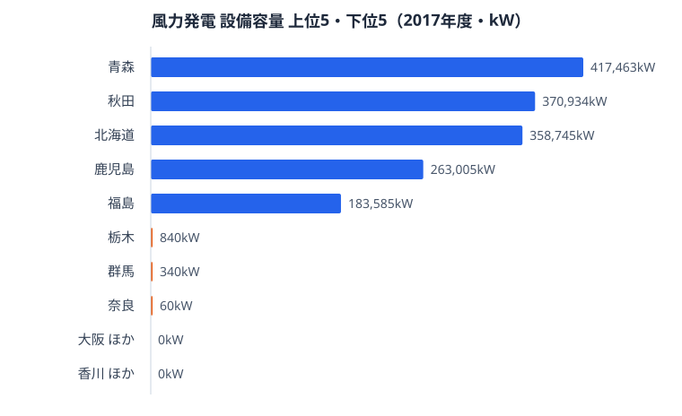
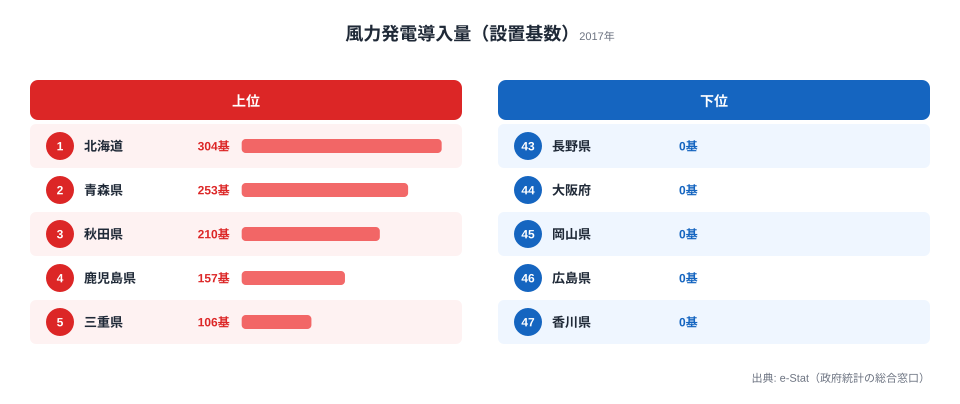

「風が強い県ほど風力発電が盛ん」──これはおおむね正しいといえます。ですが「風車の数が多い県ほど発電容量も大きい」となると、話はそう単純ではありません。

2017年度の風力発電導入量（設備容量）を都道府県別に見ると、1位は青森の **417,463kW** です。2位秋田370,934kW、3位[北海道](/areas/01000)358,745kWと、上位は東北・北海道が独占しています。ところが、設置されている風車の「数」で並べ替えると順位が入れ替わります。**風車が最も多いのは北海道の304基**で、青森（253基）を50基以上引き離しています。それなのに、容量では北海道は青森に届きません。

この記事では、「設備容量」と「設置基数」という2つの物差しのズレから、風力発電をめぐる47都道府県の地理的な偏りと、その背後にある風車の大型化を読み解いていきます。

> [!NOTE]
> ここでいう「設備容量（kW）」は、設置された風車が理論上発電できる最大出力の合計を指す。実際の発電量（kWh）とは別物で、風の吹き方によって稼働率は変わる。本記事のデータは社会・人口統計体系（総務省統計局、e-Stat 経由）の2017年度値を用いている。

## 風力発電導入量ランキング 上位と下位

上位は青森417,463kW、秋田370,934kW、北海道358,745kW、鹿児島263,005kW、福島183,585kWと続きます。全国合計は3,502,787kWで、このうち上位3県（青森・秋田・北海道）だけで約32.7%を占めています。風力発電は、強い偏西風や海からの風が安定して吹く**北日本の日本海側・太平洋側沿岸**と、台風常襲地でもある**九州南部（鹿児島）**に集中しています。風という資源そのものが地域に偏在しているため、立地の地理条件がほぼそのまま順位に表れています。

<source-link href="/ranking/wind-power-capacity">風力発電導入量（設備容量）ランキングをもっと見る</source-link>

## 7県は導入ゼロ・最下位グループの顔ぶれ

下位を見ると、容量がそもそも「0kW」の県が7つあります。非ゼロの最下位グループは栃木840kW、群馬340kW、奈良60kWと、いずれもごくわずかです。

導入ゼロの7県（埼玉・山梨・長野・大阪・岡山・広島・香川）には共通点があります。**いずれも内陸の盆地・平野部か、瀬戸内の風が穏やかなエリア**だという点です。風力発電は安定した強風を必要とするため、海から遠い内陸県や、地形に遮られて風が弱い地域には大型風車を建てる経済合理性が乏しいのです。最下位の非ゼロ県・奈良はわずか60kW（小型風車3基相当）で、ほぼ実験的な導入にとどまっています。

風が弱い地域がエネルギー供給で不利かというと、必ずしもそうではありません。これらの県は太陽光や火力など別の電源で需要をまかなっており、電源構成の地域差そのものが日本のエネルギー地図の特徴になっています。

<source-link href="/ranking/wind-power-capacity">風力発電導入量の全47都道府県ランキングを見る</source-link>

## 発見：風車の「数」と「容量」がズレる理由

ここで冒頭の謎に戻ります。風車の数が最も多いのは北海道（304基）です。にもかかわらず、容量では先行する東北勢に抜かれて3位にとどまります。なぜでしょうか。

答えは「風車1基あたりの容量」にあります。各県の設備容量を設置基数で割ると、1基あたりの平均出力が見えてきます。

- 青森：容量417,463kW ÷ 253基 ＝ 1基あたり約1,650kW
- 秋田：容量370,934kW ÷ 210基 ＝ 1基あたり約1,766kW
- 北海道：容量358,745kW ÷ 304基 ＝ 1基あたり約1,180kW
- 福島：容量183,585kW ÷ 96基 ＝ 1基あたり約1,912kW
- 島根：容量178,140kW ÷ 85基 ＝ 1基あたり約2,096kW

北海道の風車は1基あたり約1,180kWと、青森（約1,650kW）や秋田（約1,766kW）より小ぶりです。北海道は早い時期から数百kW級の中小型風車を数多く建ててきた歴史があり、基数では群を抜くものの、1基あたりの出力が控えめなため、総容量では後発の青森・秋田に逆転されました。

<source-link href="/ranking/wind-power-turbine-count">風車設置基数の全47都道府県ランキングを見る</source-link>

> [!TIP]
> 近年の新設風車は1基あたり2,000kW（2MW）超が主流。島根（約2,096kW）や山口（約2,063kW）のように基数は少なくても大型機を導入した県は、少数精鋭で容量を稼いでいる。「数」より「世代の新しさ」が容量を左右する局面に入っている。

つまり、風力発電の容量ランキングは「どれだけ早く始めたか」だけでなく「どれだけ大型化を進めたか」の両方を映す鏡になっている。基数で先行した北海道と、大型化で容量を伸ばした青森・秋田──同じ風力先進地域でも成長の仕方が異なる。

> [!WARNING]
> 本データは2017年度時点の値である。風力発電はその後も新設が続いており、洋上風力の本格導入が進む地域では順位が変動している可能性が高い。最新動向を断定するには新しい年度のデータでの再確認が必要だ。

## まとめ

- 風力発電導入量（設備容量）の1位は**青森417,463kW**、2位秋田370,934kW、3位北海道358,745kW（2017年度）
- 全国合計3,502,787kWのうち、上位3県で約32.7%を占める
- 風車の設置基数が最多なのは**北海道304基**だが、1基あたりの容量が小さく総容量では3位どまり
- 埼玉・山梨・長野・大阪・岡山・広島・香川の**7県は導入ゼロ**。内陸・瀬戸内など風の弱い地域に集中
- 容量は「導入の早さ」と「風車の大型化」の両方を映し、同じ先進地域でも成長パターンが分かれる

## データ出典

- 社会・人口統計体系（社会生活統計指標）／総務省統計局、2017年度。e-Stat（政府統計の総合窓口）経由で整備（statsDataId: 0000010108）。
- 設備容量・設置基数はいずれも2017年度末時点の値。本記事の「1基あたり容量」は設備容量÷設置基数で算出した派生値。

本記事の対象データ: [関連カテゴリ](/category/energy)・[東京都](/areas/13000)
