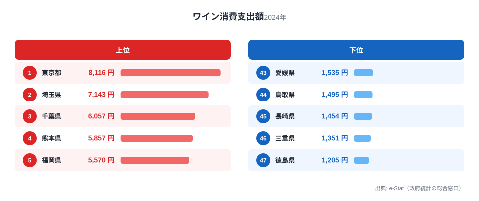

「ワインをよく飲む県」と聞いて、まず思い浮かぶのはぶどう産地でしょうか。しかし家計調査の消費支出データを見ると、話はそう単純ではありません。2024年のワイン消費支出は東京都が1世帯あたり8,116円で1位、最下位の徳島県は1,205円で、その差はおよそ6.7倍にのぼります。

ワインは酒類のなかでも「所得の伸びに支出が反応しやすい」品目だといわれます。実際のランキングを見ると、上位には東京・埼玉・千葉という関東勢が並び、産地であるはずの県は必ずしも上位に来ていません。この記事では、なぜ「飲む県」と「作る県」が一致しないのかを、家計調査のデータから探ります。

> [!NOTE]
> このランキングは総務省「家計調査」の1世帯あたり年間ワイン消費支出額（2024年、e-Stat経由で整備）を都道府県庁所在市および政令指定都市の値で比較したものです。産地でのワイナリー直販や贈答での消費は、家計調査の「支出」には反映されにくい点に注意してください。

## 上位と下位を見る

上位を見ると、1位東京都8,116円、2位埼玉県7,143円、3位千葉県6,057円と、関東の都市部が上位を独占しています。4位熊本県5,857円、5位福岡県5,570円と、九州の県庁所在都市も続きます。

<source-link href="/ranking/wine-consumption-expenditure">ワイン消費支出ランキングをもっと見る</source-link>

東京が突出して1位なのは、多様な国・地域の料理店が集積していることと関係していそうです。イタリアン、フレンチ、ビストロなど、ワインを合わせる食文化に日常的に触れる機会が多い都市部ほど、家庭でもワインを選びやすい環境があると考えられます。埼玉・千葉も東京のベッドタウンとして食文化・購買行動が似通っている可能性があります。

## 最下位グループを見る

下位を見ると、47位徳島県1,205円、46位三重県1,351円、45位長崎県1,454円、44位鳥取県1,495円、43位愛媛県1,535円と、西日本の県が並びます。

> [!WARNING]
> 家計調査は都道府県庁所在市（および政令指定都市）1世帯あたりの支出額を調べる調査です。県内でも都市部と郡部で消費行動が異なる可能性があり、県全体を代表する値ではない点に留意してください。

下位グループには焼酎や日本酒など、地域固有の酒文化が強く根付いている地域が目立ちます。晩酌の選択肢としてすでに定着した酒類がある地域では、ワインが食卓に上る頻度が相対的に低くなりやすいと考えられます。

## 山梨は「産地」だが支出は13位という意外性

ぶどう・ワインの一大産地として知られる山梨県は、消費支出ランキングでは13位（4,091円）でした。1位東京の半分程度の水準です。

> [!TIP]
> 産地であることと「家計調査上の消費支出額が高いこと」は必ずしも一致しません。ワイナリーでの直接購入や贈答用の消費、観光客の消費は「1世帯あたり家計消費支出」の集計には表れにくいためです。産地の実態を知りたい場合は、出荷量や醸造量の統計とあわせて見る必要があります。

これは「作る県」と「飲む県」が別であることを示す一例です。ワインという酒類は、産地に住んでいるからよく飲むわけではなく、都市部の食文化やライフスタイルとの結びつきの方が消費支出に強く効いていると考えられます。[山梨県の統計データ](/areas/19000)を見ると、農業産出額に占める果実の割合の高さが確認でき、ぶどう栽培が地域の基幹産業であることがうかがえます。

## 千葉は「量より質」を選んでいるかもしれない

もう一つの発見は、千葉県の順位です。3位という高順位ながら、飲酒習慣そのものが際立って多いわけではありません。[仮説] 千葉県では、頻度よりも単価の高いワインを選ぶ「量より質」の消費傾向がある可能性があります。この仮説を検証するには、購入本数や平均購入単価のデータを別途確認する必要があります。

同じ関東圏でも、東京・埼玉・千葉で支出額に差があることから、都市化の度合いだけでなく、世帯の年齢構成や外食・中食習慣の違いも影響していそうです。

## 他の酒類とあわせて見る

ワインだけでなく、他の酒類のランキングと見比べると、地域の飲酒文化がより立体的に見えてきます。たとえば[ビールと発泡酒の消費割合の変化](/blog/beer-vs-happoshu-shift)を見ると、家計の節約志向が酒類選択にどう表れているかがわかります。また[ウイスキー消費の県別ランキング](/blog/whisky-consumption-prefecture-gap)では、ワインとは異なる年齢層・所得層の嗜好が見えてきます。

ワインが「都市部・国際色豊かな食文化との結びつき」で伸びる酒類だとすれば、ウイスキーやビールはまた別の軸で地域差が生まれています。同じ「お酒」というくくりでも、品目ごとに支出を左右する要因はまったく異なるのです。

## まとめ

- 1位は東京都8,116円、僅差ではなく突出した水準
- 最下位は徳島県1,205円で、東京との差は6.7倍
- 上位は東京・埼玉・千葉・熊本・福岡と、関東および九州の都市部が中心
- 産地の山梨県は13位（4,091円）にとどまり、「作る県」と「飲む県」は一致しない
- 下位は西日本に集中し、焼酎・日本酒など既存の酒文化との競合が背景にある可能性がある

## データ出典

総務省「家計調査」（2024年、都道府県庁所在市および政令指定都市、1世帯あたり年間支出額）。e-Stat（政府統計の総合窓口）経由で整備したデータをもとに作成しています。
