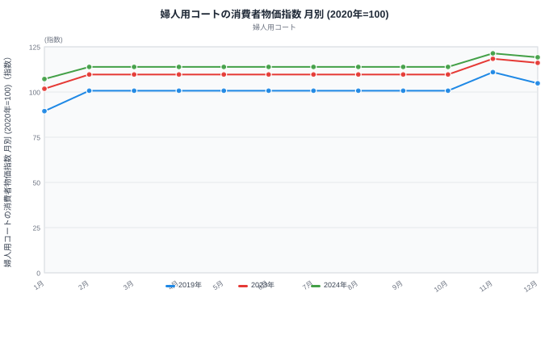
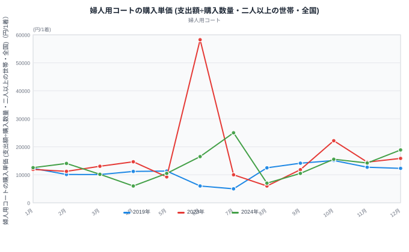
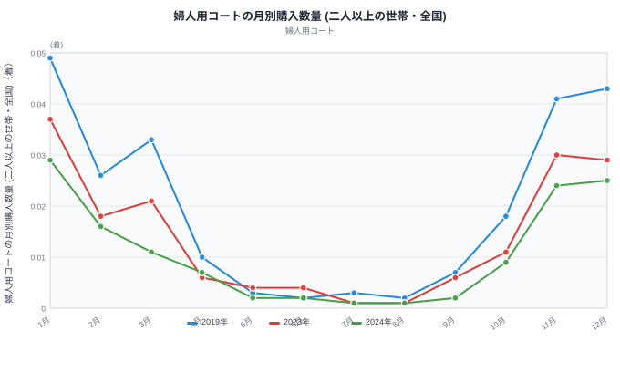

冬物バーゲンで店の値札は下がります。では、消費者が実際に払った金額はどう動くのでしょうか。総務省「家計調査」で婦人用コートの月次データを追うと、答えは「年によって逆」でした。2019年は1月から2月にかけて購入単価が17.8%下がった一方、2024年は同じ1月から2月にかけて12.0%も上がっています。店頭の価格変動を示す消費者物価指数(CPI)は、どちらの年も同じ方向に(上昇して)動いていたにもかかわらずです。この記事では、家計調査の「購入単価」「購入数量」とCPIという3つの月次データを重ね、冬物バーゲンで何が起きているのかを2019年・2023年・2024年で比べます。

## 婦人用コートの店頭価格は毎年1月がいちばん安い

> [!NOTE]
> この記事のデータは総務省「家計調査」「消費者物価指数」の全国・二人以上の世帯の月次集計です。都道府県別の順位ではなく、全国平均の家計簿を追っています。家計調査は消費者が実際に支払った金額、消費者物価指数(CPI)は店頭の価格変動を示す指数で、この2つは別のものです。

婦人用コートのCPI(2020年=100)を月別に並べると、3年とも同じ形が繰り返されています。1月がその年でいちばん低い水準で、2019年は指数89.4、2023年は101.8、2024年は107.2でした。ところが2月になると指数は一段跳ね上がり、2019年は100.7、2023年は109.7、2024年は113.9まで上昇します。この水準は3月から10月までの8か月間、3年ともそれぞれ完全に同じ値(2019年100.7、2023年109.7、2024年113.9)が続き、11月にさらに上昇(2019年111、2023年118.4、2024年121.4)、12月にやや落ち着く(2019年104.8、2023年116.1、2024年119.2)という季節の型です。

実勢価格が8か月間まったく変化しないとは考えにくく、この期間の同一値は消費者物価指数の作られ方に由来する可能性があります。この記事でCPIから読み取れる変化は、値が動く1月・2月・11月・12月の4か月に限られます。

つまり店頭価格は、1月がバーゲンの底で、2月には値上がりして年間の「通常水準」に戻り、11月の新作投入期にもう一段高くなる、という毎年ほぼ同じ動きをしています。3年を通じて水準そのものは切り上がっていて、2019年の1月と2024年の1月を比べると、指数は89.4から107.2へ約2割高くなっています。全国の物価動向を横断的に見たい場合は、[消費者物価のテーマページ](/themes/consumer-prices)も参考になります。

## 家計調査が示す「買った1着の値段」は年によって真逆に動く

<source-link href="/ranking/womens-coat-consumption-expenditure">婦人用コート消費支出額ランキングを見る</source-link>

店頭価格(CPI)は3年ともほぼ同じ動きをしていましたが、家計調査で分かる「実際に買った1着の値段」(支出額÷購入数量で算出した購入単価)は年ごとにまったく違う動きをします。2019年は1月に12,306円だったのが2月には10,115円まで下がり、下落率は17.8%です。2023年も1月11,919円から2月11,222円へ5.8%下がりました。ところが2024年は逆で、1月12,552円から2月14,062円へ12.0%も上がっています。

同じ1月から2月という期間に、店頭価格(CPI)はどの年も6〜13%ほど上昇しているのに、消費者が実際に払った金額は下がる年もあれば上がる年もあるということです。店の値札の動きだけを見ていても、消費者の財布からいくら出ていったかは分かりません。バーゲンで安い商品が売れ筋になれば単価は下がりますし、逆に「待っていた高い商品」がバーゲンで買われれば単価は上がります。2024年の1月から2月にかけての上昇は、後者に近い動きです。この購入単価のもとになる[婦人用コート消費支出額](/ranking/womens-coat-consumption-expenditure)は、都道府県別のランキングでも確認できます。

> [!WARNING]
> 2023年6月の購入単価は58,250円と、他の月から大きく飛び出しています。同じ月の購入数量は0.004着(100世帯あたり0.4着)しかなく、コートを買った世帯がごく少数だったことを示します。この記事の中心である2024年2月の購入単価(14,062円)も、購入数量は0.016着(100世帯あたり1.6着)と2023年6月の4倍程度にとどまり、平均が1件の高額購入で大きく動きうる薄さは変わりません。月別に比較するときは、シーズン中の数値も含めて購入数量をあわせて確認してください。

## バーゲン翌月に数量はほぼ半減する

<source-link href="/ranking/womens-coat-consumption-quantity">婦人用コート消費量ランキングを見る</source-link>

購入数量(家計調査の公表単位は「1世帯あたりの平均購入数量」。読みやすさのため100倍して「100世帯あたり◯着」と表記します)は、1月がその年のピークです。2019年は100世帯あたり4.9着、2023年は3.7着、2024年は2.9着でした。ここから2月にかけて、数量はどの年もほぼ半分まで落ち込みます。2019年は2.6着(1月比53.1%)、2023年は1.8着(同48.6%)、2024年は1.6着(同55.2%)と、3年とも半分前後まで減る点は共通しています。

その先の動きは年によって違います。2019年は3月に3.3着とやや持ち直し、2023年も2.1着へ小幅に戻していますが、2024年だけは3月も1.1着まで下がり続けました。4月になると、どの年も1着未満まで落ち込み(2019年1.0着、2023年0.6着、2024年0.7着)、コートのシーズンが終わったことがはっきり分かります。この[婦人用コート消費量](/ranking/womens-coat-consumption-quantity)も、都道府県別のランキングで地域差を確認できます。数量の落ち込み方は年によって差があり、価格の動きと同じく「均一な冬物バーゲンの型」は存在しないようです。

## なぜ単価の動きは年によって違うのか

3つのデータを重ねると、店頭価格の下げ幅はどの年もほぼ同じなのに、消費者が実際に払った金額の動きは年ごとにばらつくことが見えてきます。ここから先は仮説になりますが、考えられる説明は2つあります。

**[仮説]** まず、月あたりの購入世帯数(2月時点で100世帯あたり1.6〜2.6着)自体が少ないため、単価が上がった年も下がった年も、たまたま少数の購入世帯の構成が偏っただけという可能性を両方とも否定できません。そのうえで別の説明も考えられます。2024年のように単価が上がった年は、値下げによって手が届くようになった高価格帯のコートが動いた可能性があります。逆に2019年や2023年のように単価が下がった年は、値ごろな商品が売れ筋になった可能性があります。**検証には、家計調査の月次平均値だけでなく世帯ごとの購入価格の分布データが必要で、この記事の集計だけでは判定できません。**

> [!WARNING]
> 家計調査は全国・二人以上の世帯の平均であり、店頭価格(CPI)の下げ幅と消費者の購入単価・購入数量の変化との間に、因果関係があるとは断定できません(相関≠因果)。「値下げしたから単価が上がった/下がった」と一方向に読むのではなく、両方のデータを並べて動きを確かめる材料として使ってください。

> [!TIP]
> 次の冬物バーゲンを家計調査で追うときは、CPIが下がる月に購入単価も一緒に上がっているかを見てください。CPIが下がって単価も下がっていれば「安い商品が動いた」、CPIが下がっているのに単価が上がっていれば「値引きで高い商品が動いた」と読み分けられます。今回の3年間では、2024年だけがこの後者のパターンに近い動きでした。

婦人用コートと同じ「秋冬物」の衣料品の所得差については、[外に着る服ほど年収差が出るのはなぜ?](/blog/income-quintile-clothing)でも家計調査から検証しています。婦人用コートは所得上位20%の世帯が下位20%の4.4倍を支出しており、価格帯そのものに世帯ごとの差があることも、月次データを読むときの背景として押さえておくとよいでしょう。家計調査を使った他の分析は[経済カテゴリ](/category/economy)でもまとめて見られます。

## まとめ

- 婦人用コートのCPI(店頭価格)は毎年1月が最安値で、2月以降は横ばいの高水準に戻り、11月にさらに上がる型を3年とも繰り返しています
- 家計調査の購入単価(実際に払った金額)は1月→2月で、2019年-17.8%、2023年-5.8%、2024年+12.0%と年によって方向が逆になります
- 購入数量は1月をピークに2月でほぼ半減(2019年53.1%、2023年48.6%、2024年55.2%)し、3月以降の戻り方も年ごとに違います
- オフシーズン(5〜8月)の単価は購入件数が極端に少なく、1件の高額購入で平均が大きく跳ね上がります(2023年6月は58,250円)
- 店頭価格の下げ幅だけでは消費者の実際の支払額は分からず、CPIと家計調査の両方を並べて初めてバーゲンの実態が見えてきます

## データ出典

総務省統計局「家計調査 家計収支編 二人以上の世帯 品目分類(2020年改定) 月次」(統計表ID: 金額0003343671、数量0003343670)の2019年・2023年・2024年の月次値と、総務省統計局「2020年基準 消費者物価指数」品目別(全国、統計表ID: 0003427113)を用いて、stats47が加工・算出しました(購入単価は支出額÷購入数量)。取得日は2026年9月5日です。
