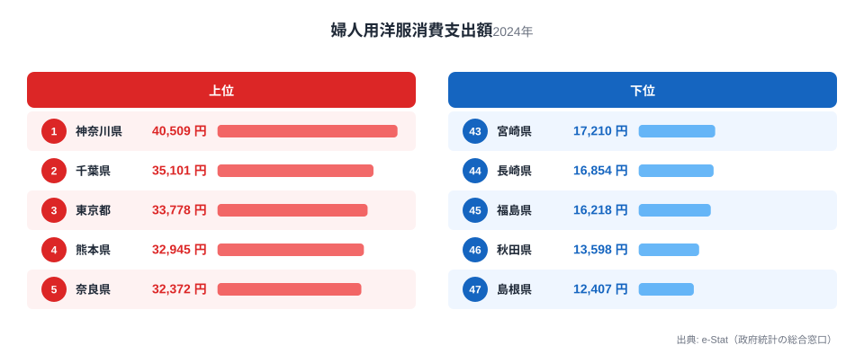
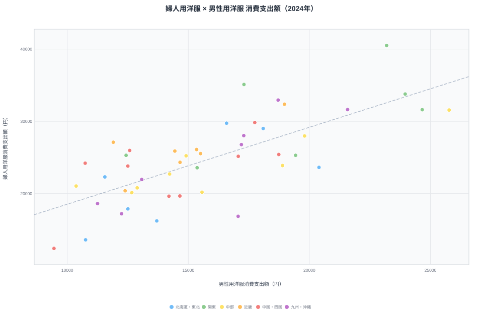

「服にお金をかける県はどこか」と聞かれたら、多くの人は東京や大阪を思い浮かべるかもしれません。しかし総務省「家計調査」（2024年）の婦人用洋服消費支出額を都道府県別に見ると、1位は神奈川県（40,509円）で、東京都は3位（33,778円）にとどまります。最下位の島根県（12,407円）との差は3.3倍。同じ「服」でも、男性用洋服の消費支出額（全国平均15,835円）と比べると、婦人用洋服の全国平均は24,743円と1.6倍も高くなっています。

衣料品は生活必需品でありながら、所得が増えるほど支出が伸びやすい「弾力性の高い」品目だとされています。なかでも婦人服はその性質が強く出やすい品目です。この記事では、2024年の最新データから婦人服支出の地域差を掘り下げ、男性用洋服との対比、そして支出額の大きい県・少ない県に共通する構造を見ていきます。

## 婦人用洋服消費支出額ランキング——上位5県と下位5県（2024年）

**上位5県**は[神奈川](/areas/14000)（1位・40,509円）、千葉（2位・35,101円）、東京（3位・33,778円）、[熊本](/areas/43000)（4位・32,945円）、奈良（5位・32,372円）という顔ぶれです。南関東（神奈川・千葉・東京・埼玉）が上位10県のうち4県を占め、首都圏の消費水準の高さがまず目に入ります。一方で熊本・奈良という非首都圏の県が上位に食い込んでいる点は見過ごせません。単純な「都市部が高い」という図式だけでは説明がつかない構造がありそうです。

**下位5県**は宮崎（43位・17,210円）、長崎（44位・16,854円）、福島（45位・16,218円）、秋田（46位・13,598円）、島根（47位・12,407円）で、東北・九州南部・山陰の県が並びます。最下位の島根県は12,407円で、1位の神奈川県の3割にも届きません。

<source-link href="/ranking/womens-clothing-consumption-expenditure">婦人用洋服消費支出額の全47都道府県ランキングを見る</source-link>

> [!NOTE]
> 本データは総務省「家計調査」の**都道府県庁所在市（および政令指定都市）の二人以上世帯**を対象にした支出額です。単身世帯や町村部の消費は含まれないため、都道府県全体の実態とは異なる可能性があります。婦人服は「県庁所在都市に住む世帯」の購買行動を反映した数字である点に留意してください。

## なぜ神奈川・千葉・東京が上位に集まるのか

南関東3県が上位を占める背景には、可処分所得の高さと商業集積の両方が関係していると考えられます。家計調査における衣料品支出は、食料品のような必需的な支出と違い、所得が増えるほど支出が伸びやすい「所得弾力性の高い」品目に分類されます。つまり衣料品、なかでも婦人服は暮らしに余裕が出たときに真っ先に支出が増える性質を持つということです。東京・神奈川・千葉のような可処分所得の高い都市圏で支出額が押し上げられるのは、この弾力性の表れと考えられます。

加えて、百貨店やセレクトショップなど選択肢の多い商業集積地では「より高い価格帯の服を選ぶ」傾向が生まれやすく、支出額を押し上げる一因になっている可能性があります。実際、婦人服の全国平均（24,743円）は男性用洋服の全国平均（15,835円）より約1.6倍高く、婦人服市場そのものが男性用より大きいことも、この構造を後押ししています。

同じ南関東でも神奈川が千葉・東京より高い（40,509円 vs 35,101円・33,778円）点は、東京都心への通勤圏でありながら横浜・川崎という独自の商業集積を持つ神奈川特有の消費構造が影響している可能性があります。[仮説] であり、本データだけでは店舗立地までは検証できません。

> [!TIP]
> 衣料品は「外側の服（コートやジャケットなど人目に触れやすいもの）ほど所得差が反映されやすく、下着など見えない衣料品ほど地域差が縮まりやすい」という傾向が家計研究では指摘されています。婦人用洋服はこの「見える消費」に該当する品目のひとつです。[仮説] であり、本データだけでは検証できないため、参考情報として留めてください。

一方で熊本県（4位・32,945円）や奈良県（5位・32,372円）のように、南関東以外から上位に入る県もあります。これは「都市部が高い」という単純な図式では説明がつきません。熊本は婦人用セーターの消費支出額でも全国1位（8,918円）を記録しており、婦人服の一部品目だけでなく衣料品全般への支出性向が構造的に高い地域である可能性がうかがえます（後述の男性用洋服との対比セクションで詳しく扱います）。奈良県は近畿圏（大阪・京都）へのアクセスが良く、都市部の商業施設で購買行動を行う世帯が多いことが一因として考えられます。

## 下位グループに共通するのは「地方・非都市圏」という単純な構図ではない

下位5県（宮崎・長崎・福島・秋田・島根）を見ると、東北と九州南部・山陰に分散しており、特定の一地方に偏っているわけではありません。共通しているのは、いずれも都道府県庁所在都市の人口規模が比較的小さく、大型商業施設や百貨店の集積が限定的な地域だという点です。婦人服のように「選ぶ楽しみ」を伴う消費は、店舗選択肢の多さが購買機会そのものを左右しやすいと考えられます。

> [!WARNING]
> 通信販売（ネット通販）の普及により、店舗の有無と購買行動の関係は年々弱まっている可能性があります。家計調査は世帯の支出額を集計したものであり、購入経路（実店舗かオンラインか）までは区別していません。したがって「店舗が少ないから支出が少ない」という因果関係は本データだけでは確認できない [仮説] です。

最下位の[島根県](/areas/32000)（12,407円）は、婦人用洋服だけでなく男性用洋服でも全国最下位（9,451円）となっており、衣料品全体への支出水準が構造的に低い地域である可能性がうかがえます。単に「婦人服だけが低い」のではなく、世帯の衣料品支出全体の傾向として捉えるべきでしょう。

## 男性用洋服との対比——婦人服はどれだけ「贅沢財」的か

「贅沢財」とは、所得が増えるほど支出が押し上げられやすい品目のことです（所得の伸び率以上に支出が伸びる性質を指します）。婦人用洋服と男性用洋服の全国平均を比べると、婦人服が24,743円、男性用が15,835円で、婦人服は男性用の約1.56倍です。最大/最小の格差倍率で見ても、婦人服は3.3倍（神奈川40,509円 vs 島根12,407円）である一方、男性用は2.7倍（愛知25,773円 vs 島根9,451円）と、婦人服のほうが地域差も大きくなっています。

47都道府県を婦人服・男性服の支出額でプロットすると、右肩上がりの傾向が見て取れます。つまり婦人服への支出が多い県は男性服への支出も多い傾向にあり、衣料品全体への支出性向という共通の土台がありそうです。ただし全ての県がこの傾向に乗るわけではありません。神奈川・千葉・東京は両方とも高水準にある一方、愛知は男性服では1位（25,773円）でありながら婦人服では8位（31,563円）にとどまり、男性服だけが突出しています。逆に熊本は婦人服で4位（32,945円）と高い一方、男性服では中位にとどまり、婦人服側に偏った支出構造を持っています。

<source-link href="/ranking/mens-clothing-consumption-expenditure">男性用洋服消費支出額の全47都道府県ランキングを見る</source-link>

[愛知県](/areas/23000)が男性用洋服で1位（25,773円）になっている点は、婦人服の1位が神奈川県だったこととあわせて見ると興味深い非対称です。必ずしも同じ県が両方の品目で強いわけではなく、愛知は自動車産業を中心に可処分所得が高い地域として知られており、男性のビジネス・カジュアル衣料への支出が特に押し上げられている可能性があります。

> [!TIP]
> 婦人服・男性服のどちらも最下位は島根県でした。特定品目だけでなく、衣料品支出全体の水準として地域差を捉えると、より実態に近い見方ができます。

一方で、防寒衣料に注目すると婦人服とは違う顔ぶれが上位に来ます。婦人用セーターの消費支出額ランキングでは熊本県が1位（8,918円）・沖縄県が最下位（1,157円）で、格差倍率は7.71倍と婦人用洋服全体（3.3倍）よりもさらに大きくなっています。熊本は婦人服全体でも4位という高水準でしたが、セーターでも1位になっている点から、熊本は衣料品全体への支出性向が構造的に高い地域である可能性がうかがえます。防寒着という性質上、寒暖差の大きい気候が支出差に直結しやすい品目だと考えられます。

<source-link href="/ranking/womens-sweater-consumption-expenditure">婦人用セーター消費支出額の全47都道府県ランキングを見る</source-link>

## まとめ

- **1位は神奈川県（40,509円）**、**最下位は島根県（12,407円）**で、格差は**3.3倍**
- 上位は南関東（神奈川・千葉・東京・埼玉）が中心だが、熊本・奈良など非首都圏の県も上位に食い込む
- 下位は宮崎・長崎・福島・秋田・島根で、特定地方に偏らず「都道府県庁所在都市の商業集積が小さい」地域に共通点がある
- 婦人用洋服の全国平均（24,743円）は男性用洋服（15,835円）の約1.6倍で、婦人服のほうが地域差（3.3倍 vs 2.7倍）も大きい
- 婦人用セーターの格差倍率は7.71倍とさらに大きく、防寒衣料は気候の影響を強く受けると考えられる

## データ出典

総務省統計局「家計調査」（2024年、都道府県庁所在市および政令指定都市の二人以上世帯）をもとに、e-Stat 経由で取得・集計したデータです。
