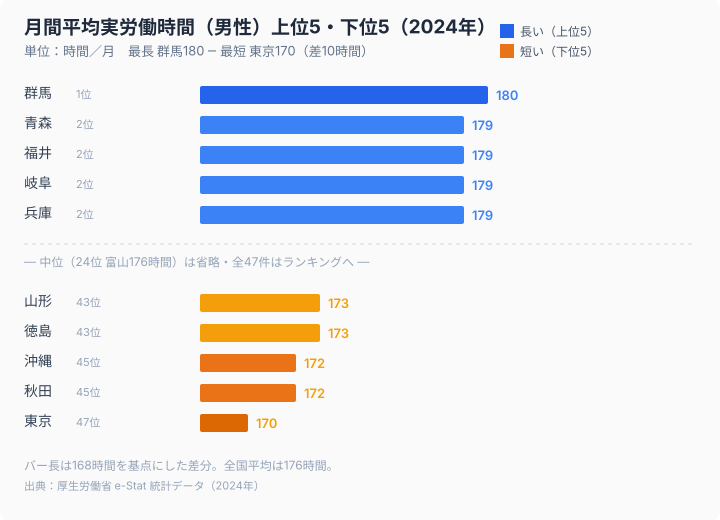

「都会は仕事に追われ、地方はゆったり働いている」——多くの人が抱くこのイメージは、データを見ると裏切られる。2024年の男性の月間平均実労働時間を都道府県別に見ると、最も長いのは群馬県の180時間。対して最も短いのは東京都の170時間で、大都市である東京がむしろ全国で最も労働時間が短い。

差そのものは約1.06倍と大きくはないが、「都会＝長時間労働」という通念とは逆の結果が出ている点が興味深い。本記事では、2024年の労働時間を47都道府県で読み解き、なぜこうした分布になるのか、そしてエンジニアが「残業の少ない環境」を手に入れるには何が必要かを考える。

> [!NOTE]
> データは男性の月間平均実労働時間（時間）です。所定内＋所定外（残業）を含む実労働時間で、産業構成によって地域差が生じます。労働時間の長短は職種・業種に強く依存するため、県の平均値はあくまで全体傾向を示すものです。

## 労働時間ランキングの全体像 — 群馬と東京で約10時間差

まず全体像を押さえる。上位（労働時間が長い）は群馬県（180時間）、青森県（179時間）、福井県（179時間）、岐阜県（179時間）、兵庫県（179時間）。一方、下位（労働時間が短い）は東京都（170時間）、沖縄県（172時間）、秋田県（172時間）と続く。全国平均は176時間で、最長の群馬と最短の東京では月あたり約10時間の開きがある。分布の中位（24位前後）は富山県の176時間で、上位・下位の極端さに比べ、多くの県は中央付近に集まっている。つまり全国の大半の県は月176時間前後に集中しており、労働時間で当たり外れを分けるのは県ではなく個々の職場だということがはっきりする。地域を選ぶより職場を選ぶ方が、労働時間の改善には効く。結局、残業の多寡を決めるのは都道府県の地図ではなく、自分がどの会社の働き方を選ぶかなのだ。県平均の小さな差に一喜一憂するより、職場の実態を見極めるほうがはるかに重要になる。

<source-link href="/ranking/monthly-average-actual-working-hours-male">月間平均実労働時間（男性）ランキングを詳しく見る</source-link>

## なぜ大都市ほど労働時間が短いのか — 産業とサービス業の比率

東京の労働時間が短い背景には、産業構成がある。東京はサービス業・情報通信業・金融など、相対的に労働時間管理が進んだホワイトカラー職の比率が高い。一方、製造業の現場比率が高い県では、所定外労働（残業）が積み上がりやすい。

> [!WARNING]
> ただし「県の平均労働時間が短い＝自分の残業が少ない」とは限らない。労働時間は業種・企業・職種で大きくばらつく。とくにIT業界は、プロジェクトの繁忙やデスマーチで個人の残業が平均を大きく上回るケースがある。県の平均値は出発点であって、自分の労働環境を保証するものではない。

つまり労働時間は、住む県以上に「どの企業・どの職場で働くか」に左右される。エンジニアにとって残業の多寡は、生活の質を直接左右する重要な条件だ。

## 年収と労働時間はセットで見る

労働時間を考えるとき、年収とセットで見ることが欠かせない。同じ年収でも、月170時間で得るのと200時間で得るのとでは、時間あたりの価値がまるで違う。

<source-link href="/ranking/software-engineer-annual-income">ソフトウェアエンジニアの年収ランキングと合わせて見る</source-link>

> [!TIP]
> 転職市場では「残業時間（実態）」「みなし残業の有無」「年間休日数」といった条件で求人を比較できる。年収だけでなく労働時間まで含めて条件を見直すことで、同じ収入でも“時間あたりの豊かさ”を大きく改善できる。

## 「残業前提」の働き方から抜け出す

労働時間の地域差は1.06倍と小さいが、それは「どの県でも残業はそれなりにある」ことを意味する。残業が常態化している環境から抜け出す鍵は、勤務地ではなく職場選びにある。

エンジニアは需要が高く、労働条件を選びやすい職種だ。残業の少なさ・リモート可否・年収といった条件を明確にして求人を探せば、「残業前提」の働き方を見直すことができる。エンジニア専門の転職エージェントなら、労働環境の実態まで踏み込んで求人を絞り込めるため、まずは自分の希望条件を言語化することから始めるとよい。

## 「時間あたりの価値」で働き方を測る

労働時間を考えるうえで欠かせないのが、「時間あたりの価値」という視点だ。月の労働時間が176時間でも200時間でも、得られる年収が同じなら、後者は時間あたりの報酬が大きく目減りしている。年収という“額面”だけを見ていると、この差は見えてこない。

たとえば、同じ年収500万円でも、月170時間で得る人と月200時間で得る人とでは、1時間あたりの報酬に2割近い開きが生まれる。残業が積み重なるほど、見かけの年収は維持できても、時間あたりの豊かさは静かに失われていく。とくにIT業界は繁忙期の残業が常態化しやすく、「年収は悪くないが時間に追われている」という状態に陥りやすい。

だからこそ、転職で条件を見直すときは、年収だけでなく「想定残業時間」「みなし残業の有無」「年間休日数」までセットで比較したい。労働時間まで含めて職場を選び直すことで、同じ収入でも“時間あたりの豊かさ”を大きく改善できる。これは昇給とは別の、もう一つの実質的な処遇改善だ。

さらに言えば、労働時間は転職活動で必ず確認すべき条件だ。求人票の「月平均残業◯時間」という数字は、現場の実態と乖離していることも少なくない。転職エージェントを介せば、実際の残業実態や有給取得率といった、求人票には載らない情報まで踏み込んで確認できる。時間あたりの豊かさを守るには、入社前の情報収集が何より重要になる。年収と労働時間の両方を天秤にかけて初めて、その仕事が本当に割に合っているかが見えてくる。残業の少なさは、給与に換算されない確かな報酬なのだ。

## 「平均」が隠す繁忙期と持ち帰り

月平均という数字は、繁忙期と閑散期、職種ごとのばらつきを均してしまう点に注意が要る。とりわけIT職は、リリース前や障害対応の時期に労働時間が集中的に跳ね上がりやすく、平常月の平均値だけを見ると実態を見誤る。さらに、自宅に持ち帰っての作業や、勤怠に計上されないサービス残業は統計上の労働時間に表れにくい。つまり県の平均が短いからといって、自分の職場の繁忙期がつらくないとは限らない。求人を見極めるときは、平均残業時間という一語ではなく、繁忙期に何が起きるか、残業が特定の人に偏っていないか、といった「分布」まで踏み込んで確認することが、時間あたりの豊かさを守る近道になる。

### 関連記事・次に読むデータ

- [テレワークで働ける県・働けない県](/ranking/telework-rate) — 働き方の地域格差と合わせて読む
- [ソフトウェアエンジニアの年収ランキング](/ranking/software-engineer-annual-income) — 年収と労働時間をセットで見る
- [群馬県のエリアプロフィール](/areas/10000) — 労働時間が最も長い群馬の産業構造
- [労働・賃金カテゴリの統計一覧](/category/laborwage) — 働き方・賃金の関連ランキング

## データ出典

- 厚生労働省「毎月勤労統計調査」ほか（e-Stat 統計データ、2024年）
- 月間平均実労働時間（男性）は所定内労働時間と所定外労働時間（残業）の合計。産業構成により地域差が生じます
