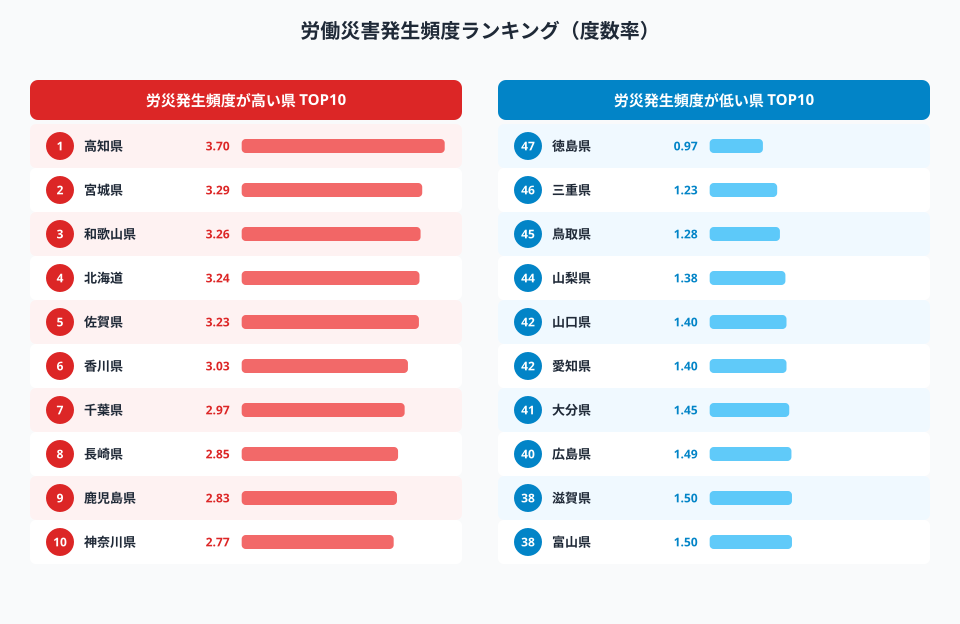
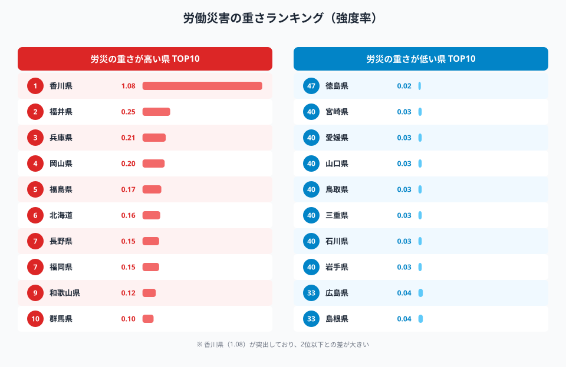
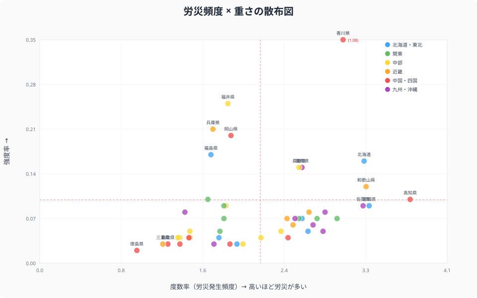
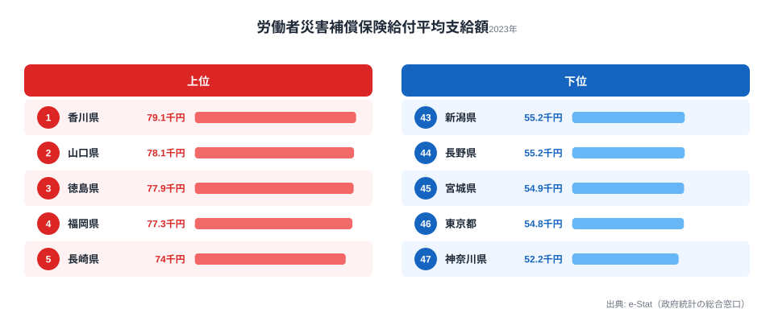
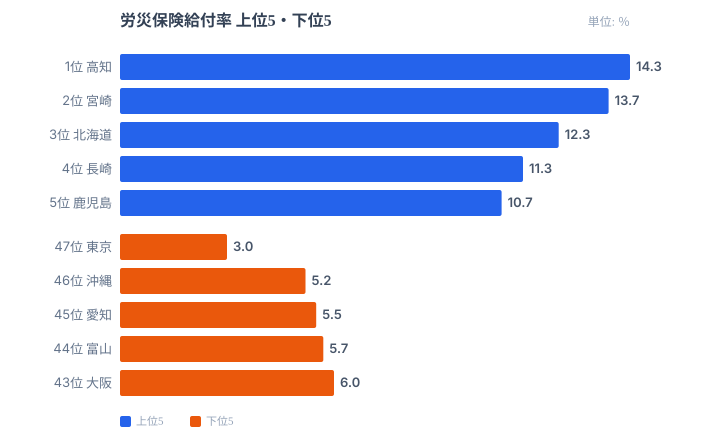

「労災死亡者数は過去最少を更新している」──厚生労働省の発表を見ると、職場の安全は改善しているように見えます。しかし死傷者数は4年連続で増加しており、労災の実態は数字の裏側を見ないとわかりません。

そしてもう一つ、見落とされがちな事実があります。**労災が「多い」県と、労災が「重い」県は一致しない**ということです。発生件数が全国最多の県でも、その多くが軽傷であれば被害の深刻さは小さくて済みます。逆に件数は少なくても、1件の死亡事故が地域全体の数字を跳ね上げることがあります。

この記事では、総務省「社会生活統計指標」のデータをもとに、**労災発生の頻度（度数率）**と**重さ（強度率）**の2つを散布図で重ね合わせ、さらに**労災保険の給付率・平均支給額**まで4つの指標で都道府県の労災リスクを立体的に読み解きます。「多い＝危険」という単純な図式が崩れる瞬間を見ていきましょう。

## 労災発生頻度ランキング（度数率）

<source-link href="/ranking/frequency-of-occupational-accidents">労働災害発生頻度の全47県ランキングを見る</source-link>

<data-source url="https://www.e-stat.go.jp/dbview?sid=0000010206" label="e-Stat 社会・人口統計体系"></data-source>

労災がどれだけ起きやすいかを示すのが「度数率」です。**発生頻度が最も高いのは高知県**（度数率3.70）。2位の宮城県（3.29）、3位の和歌山県（3.26）、4位の北海道（3.24）、5位の佐賀県（3.23）と続きます。いずれも建設業・林業・農業など、屋外作業や重機を伴う一次産業・建設業の就業者比率が高い県です。こうした業種は転落・はさまれ・刈払機による切創といった事故が起こりやすく、製造業の組立ラインのように作業を完全に自動化・標準化できないため、頻度がどうしても高くなります。

一方、**最も低いのは[徳島県](/areas/36000)**（0.97）。三重県（1.23）、鳥取県（1.28）が続きます。1位の高知県と47位の徳島県では**約3.8倍の差**があります。注目したいのは、上位を四国南部・九州・北海道が占め、下位に三重・愛知（1.40）・山口（1.40）といった製造業県や、東京（1.80）のようなオフィスワーク中心の都市圏が並ぶことです。労災頻度の地図は、そのまま各県の**主力産業の地図**と重なります。デスクワーク中心の県では転倒・腰痛が中心で件数自体が抑えられ、第一次産業・建設業の集積県では身体を使う危険作業の比率が高く件数が増える、という構造がはっきり表れています。

> [!NOTE]
> 度数率は「延べ実労働時間100万時間あたりの労災による死傷者数」を示す指標です。労働者数や事業所規模に左右されにくく、純粋な「事故の起こりやすさ」を県間で比べるのに適しています。死亡か軽傷かは区別しないため、件数の多寡だけを表す点に注意が必要です。

## 労災の「重さ」ランキング（強度率）

<source-link href="/ranking/work-accident-severity">労働災害の重さ（強度率）の全47県ランキングを見る</source-link>

<data-source url="https://www.e-stat.go.jp/dbview?sid=0000010206" label="e-Stat 社会・人口統計体系"></data-source>

度数率が「件数の多さ」なら、強度率は「1件あたりの深刻さ」です。「延べ実労働時間1,000時間あたりの労働損失日数」を表し、休業日数が長い重傷・死亡事故が多いほど大きくなります。

ここで地図が一変します。**[香川県](/areas/37000)の強度率は1.08と突出**し、2位の福井県（0.25）に**4倍以上**もの差をつけています。3位は兵庫県（0.21）、4位は岡山県（0.20）、5位は福島県（0.17）です。香川県は度数率では6位（3.03）と「やや多い」程度なのに、重さでは断トツの全国1位──つまり**件数の多さでは説明できない重さ**を抱えています。これは、休業が長期化する重大事故や死亡事故が単年度に発生すると、分子の労働損失日数（死亡は1件で7,500日換算）が一気に積み上がり、県全体の強度率を押し上げるためです。造船・建設といった重量物を扱う産業の集積も背景にあると考えられます。

一方、**最も低いのは徳島県**（0.02）。宮崎県・愛媛県（いずれも0.03）が続きます。徳島県は度数率でも最下位だったため、頻度・重さの両面で最も安全な県といえます。

> [!WARNING]
> 強度率は死亡事故1件のインパクトが極端に大きいため、人口や事業所数が少ない県では単年度の数字が大きく振れます。香川県の突出も、複数年で平均すれば順位が下がる可能性があります。単年のランキングだけで「危険な県」と断定せず、推移で見ることが大切です。

## 労災の「頻度」と「重さ」はほとんど相関しない

<source-link href="/ranking/frequency-of-occupational-accidents">労働災害発生頻度の全47県ランキングを見る</source-link>

<data-source url="https://www.e-stat.go.jp/dbview?sid=0000010206" label="e-Stat 社会・人口統計体系"></data-source>

横軸に度数率（発生頻度）、縦軸に強度率（重さ）をとって47都道府県をプロットすると、この記事の核心が見えてきます。**点は右肩上がりの直線には並びません。** 頻度が高い県ほど重さも増す、という単純な比例関係は存在しないのです。

- **頻度が高い県の多く（右側）は、重さでは中位以下**: 高知（度数率3.70）・宮城（3.29）・和歌山（3.26）・佐賀（3.23）はいずれも発生頻度の上位ですが、強度率は0.09〜0.12にとどまります。労災は多いものの、その大半が比較的軽傷で済んでいるタイプです。
- **頻度は中〜下位なのに重さが突出する県（左上）**: 福井（度数率1.88・強度率0.25）、岡山（1.91・0.20）、兵庫（1.73・0.21）。件数は平均以下なのに、1件あたりの被害が大きい「少数だが重大」タイプです。
- **両方が低い「安全な県」（左下）**: 徳島（0.97・0.02）、三重（1.23・0.03）、山梨（1.38・0.04）。頻度・重さともに全国最低水準です。
- **唯一の例外、香川**: 度数率3.03（6位）も高めですが、強度率1.08は2位以下を大きく引き離す異常値で、図の最上部にぽつんと位置します。

つまり「労災件数が全国最多の高知県」は、被害の深刻さで見れば突出していません。逆に「件数では目立たない香川県」が、重さでは最も警戒すべき県になります。**件数ランキングだけを見て安全対策の優先順位を決めると、本当に重大事故が起きている地域を見落とす**──このズレこそ、頻度と重さを別々に追う意味です。

> [!TIP]
> 自社の労災対策を考えるときも、ヒヤリ・ハットや軽傷の「件数」だけでなく、休業日数や重篤度という「重さ」を別軸で記録すると実態がつかめます。件数が減っても重大事故が紛れていないか、両方の指標で確認するのがコツです。

<ad-slot></ad-slot>

## 労災保険の平均支給額にも東西格差

<source-link href="/ranking/average-payment-amount-of-workers-compensation-insurance-benefits">労災保険平均支給額の全47県ランキングを見る</source-link>

<data-source url="https://www.e-stat.go.jp/dbview?sid=0000010206" label="e-Stat 社会・人口統計体系"></data-source>

労災が起きた後に支払われる保険給付の「1件あたり平均額」にも、明確な地域差があります。**最も高いのは香川県**（約7.9万円）。山口県（約7.8万円）、徳島県（約7.8万円）と**西日本の県が上位を独占**しています。強度率で突出していた香川県が支給額でもトップという点は、休業が長引く重い労災ほど給付額が大きくなる関係を裏づけています。

一方、**最も低いのは[神奈川県](/areas/14000)**（約5.2万円）。東京都（約5.5万円）、宮城県（約5.5万円）と大都市圏が下位に並びます。全国平均は約6.5万円で、1位と47位の差は**約1.5倍**です。頻度・重さほど極端な差ではありませんが、それでも東西で1.5倍開く背景には産業構造があります。建設業や造船業など重労働型産業の比率が高い西日本では1件あたりの休業日数が長くなりやすく、給付額も大きくなります。逆に東京・神奈川はオフィスワーク中心で、転倒・腰痛など短期間で復帰できる軽度の労災が多いため、平均支給額が押し下げられているのです。支給額は「事故の重さ」を金額に翻訳した指標ともいえ、強度率の地図と同じ向きを指しています。

## 労災給付率の地域差──産業構造が映し出される

<source-link href="/ranking/workers-compensation-insurance-benefits-rate">労災保険給付率の全47県ランキングを見る</source-link>

<data-source url="https://www.e-stat.go.jp/dbview?sid=0000010206" label="e-Stat 社会・人口統計体系"></data-source>

最後に、保険料収入に対してどれだけ給付が支払われたかを示す「給付率」を見ます。これは県全体の労災リスクと産業構成をもっとも端的に映す指標です。**高知県が14.3%で全国最高**。宮崎県（13.7%）、北海道（12.3%）、長崎県（11.3%）が続きます。いずれも度数率や一次産業比率が高い県で、保険料として集めた額に対して給付として出ていく割合が大きい=リスクの高い産業構造を抱えていることを意味します。

対照的に、**[東京都](/areas/13000)はわずか3.0%で全国最低**。沖縄県（5.2%）、愛知県（5.5%）が続きます。1位の高知県と47位の東京都では**約4.8倍の差**があり、4指標のなかで最も開きが大きい指標です。東京都は情報通信業やサービス業が主体で危険作業そのものが少なく、保険料収入に対する給付割合が小さくなります。給付率の高低は、その県の労働がどれだけ身体的リスクを伴うかの縮図といえます。全国の[安全・環境カテゴリのランキング](/category/safetyenvironment)と合わせて見ると、労災リスクの地域差が産業構造にどこまで規定されているかがより立体的に見えてきます。

## まとめ

労災発生頻度（度数率）・重さ（強度率）・労災保険給付率・平均支給額の4指標から、都道府県の労災リスクの地域差を分析しました。

- **発生頻度1位は高知県（3.70）、最下位は徳島県（0.97）で約3.8倍差**。建設業・林業・農業など身体を使う産業の集積県ほど頻度が高い
- **頻度と重さはほとんど相関しない**。件数最多の高知県は強度率では中位、件数は中位でも香川県（強度率1.08）が重さの全国1位という逆転が起きる
- **香川県は重さ・平均支給額ともにトップ**で、1件の重大事故が地域の数字を押し上げる「少数だが重大」型の典型
- **給付率は高知14.3% vs 東京3.0%で約4.8倍差**と4指標中で最大。労災リスクの地図は、各県の産業構造の地図とほぼ一致する

労災データが教えてくれるのは、**「労災が多い県」と「労災が重い県」を分けて見なければ、本当に危険な地域を見誤る**ということです。件数を減らす対策と、重大事故を防ぐ対策は別物です。どちらの指標も、最終的にはその県でどんな産業がどんな働き方を抱えているかに行き着きます。

## データ出典

本記事のデータはe-Stat（政府統計の総合窓口）「社会・人口統計体系」（2023年）を基に作成しています。
