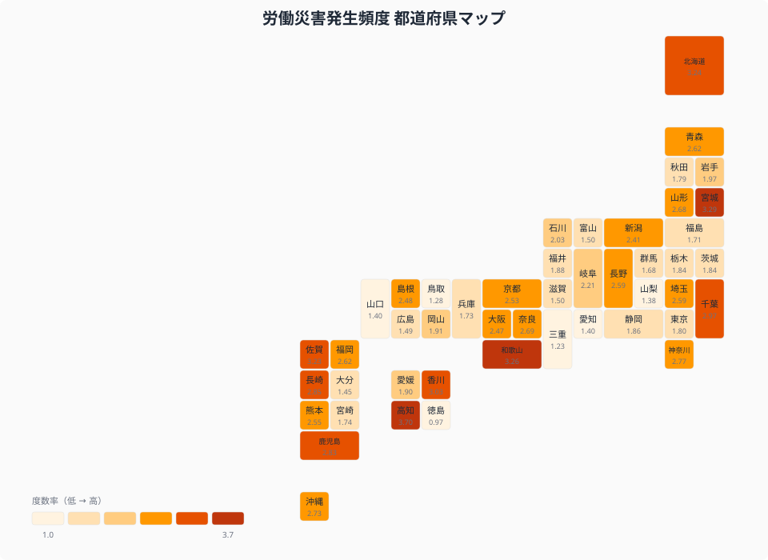
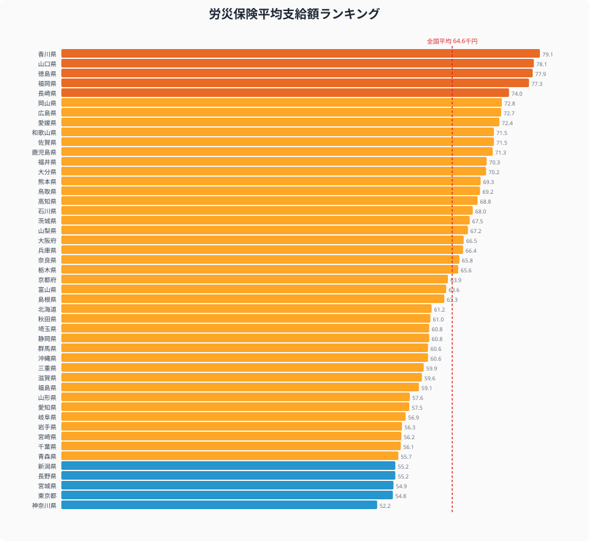
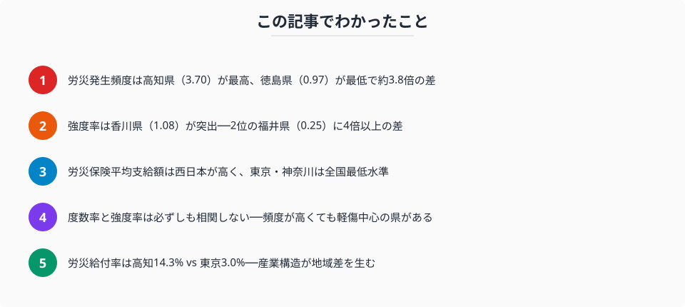

「労災死亡者数は過去最少を更新している」──厚生労働省の発表を見ると、職場の安全は改善しているように見えます。しかし死傷者数は4年連続で増加しており、労災の実態は数字の裏側を見ないとわかりません。

この記事では、総務省「社会生活統計指標」のデータを使い、**労災発生の頻度（度数率）**と**重さ（強度率）**、さらに**労災保険の給付率・平均支給額**まで、4つの指標で都道府県の労災リスクを比較します。

## 労災発生頻度ランキング（度数率）

<data-source url="https://www.e-stat.go.jp/dbview?sid=0000010206" label="e-Stat 社会・人口統計体系"></data-source>

タイルマップを見ると、**四国南部・九州・北海道**が濃い色に染まっています。建設業や農林水産業の比重が高い地方ほど労災発生頻度が高い傾向がはっきり表れています。一方、**東海・中部**は比較的薄い色で、製造業が中心でも自動化・安全管理が進んでいる地域は頻度が抑えられていることがわかります。

<data-source url="https://www.e-stat.go.jp/dbview?sid=0000010206" label="e-Stat 社会・人口統計体系"></data-source>

**労災発生頻度が最も高いのは高知県**（度数率3.70）。2位の宮城県（3.29）、3位の和歌山県（3.26）と続きます。いずれも建設業・林業の就業者比率が高い県です。

一方、**最も低いのは[徳島県](/areas/36000)**（0.97）。三重県（1.23）、鳥取県（1.28）が続きます。1位の高知県と47位の徳島県では**約3.8倍の差**があります。

> [!NOTE]
> 度数率は「延べ実労働時間100万時間あたりの労災による死傷者数」を示す指標です。事業所規模や労働者数に左右されにくく、労災発生リスクの比較に適しています。

<source-link href="/ranking/frequency-of-occupational-accidents">労働災害発生頻度の全47県ランキングを見る</source-link>

## 労災の「重さ」ランキング（強度率）

<data-source url="https://www.e-stat.go.jp/dbview?sid=0000010206" label="e-Stat 社会・人口統計体系"></data-source>

強度率は「延べ実労働時間1,000時間あたりの労働損失日数」を示す指標で、**1件の労災がどれだけ深刻か**を表します。

**[香川県](/areas/37000)の強度率は1.08と突出**しています。2位の福井県（0.25）に4倍以上の差をつけており、単年度の重大事故が数値を押し上げた可能性があります。3位は兵庫県（0.21）、4位は岡山県（0.20）です。

一方、**最も低いのは徳島県**（0.02）。宮崎県・愛媛県（いずれも0.03）が続きます。

> [!TIP]
> 度数率が高くても強度率が低い県は「軽傷の労災が多い」、逆に度数率が低くても強度率が高い県は「件数は少ないが重症事故が発生している」と読み取れます。

<source-link href="/ranking/work-accident-severity">労働災害の重さ（強度率）の全47県ランキングを見る</source-link>

<ad-slot></ad-slot>

## 労災保険の地域格差──平均支給額

<data-source url="https://www.e-stat.go.jp/dbview?sid=0000010206" label="e-Stat 社会・人口統計体系"></data-source>

労災保険の平均支給額にも大きな地域差があります。

- **最も高いのは香川県**（約7.9万円）。山口県（約7.8万円）、徳島県（約7.8万円）と**西日本の県が上位を独占**しています
- **最も低いのは[神奈川県](/areas/14000)**（約5.2万円）。東京都（約5.5万円）、宮城県（約5.5万円）と大都市圏が下位に並びます
- 全国平均は約6.5万円で、1位と47位の差は**約1.5倍**

西日本で支給額が高い背景には、建設業や造船業など重労働型産業の比率が高く、1件あたりの休業日数が長い傾向があります。逆に東京・神奈川はオフィスワーク中心で、軽度の労災が多いことが平均支給額を押し下げています。

<source-link href="/ranking/average-payment-amount-of-workers-compensation-insurance-benefits">労災保険平均支給額の全47県ランキングを見る</source-link>

## 労災頻度 × 重さの散布図──4象限で見る都道府県の労災リスク

<data-source url="https://www.e-stat.go.jp/dbview?sid=0000010206" label="e-Stat 社会・人口統計体系"></data-source>

横軸に度数率（発生頻度）、縦軸に強度率（重さ）をとると、各県の労災リスクの「タイプ」が見えてきます。

- **右上（頻度高い×重い）**: 高知県──発生頻度・重さともに高水準で、最も注意が必要なゾーン
- **左上（頻度低い×重い）**: 香川県──頻度は中位だが強度率が突出。重大事故のインパクトが大きい
- **右下（頻度高い×軽い）**: 宮城県・和歌山県・佐賀県──労災は多いが比較的軽傷中心
- **左下（頻度低い×軽い）**: 徳島県・三重県・山梨県──労災リスクが低い「安全な県」

注目すべきは、度数率と強度率は**必ずしも相関しない**こと。労災が多い県でも軽傷中心であれば強度率は低く、逆に件数が少なくても1件の死亡事故で強度率が跳ね上がることがあります。

<ad-slot></ad-slot>

## 労災給付率の地域差──産業構造が映し出される

<data-source url="https://www.e-stat.go.jp/dbview?sid=0000010206" label="e-Stat 社会・人口統計体系"></data-source>

労災保険給付率（保険料収入に対する給付額の割合）も大きな地域差があります。**高知県が14.3%で全国最高**で、宮崎県（13.7%）、北海道（12.3%）が続きます。一方、**[東京都](/areas/13000)はわずか3.0%で全国最低**で、沖縄県（5.2%）、愛知県（5.5%）が続きます。1位と47位で**約4.8倍の差**があります。

給付率が高い県は、第一次産業や建設業の比率が高く、労災リスクの高い産業構造を持っています。東京都は情報通信業やサービス業が主体のため、労災発生率自体が低く、保険料収入に対する給付割合も小さくなっています。

<source-link href="/ranking/workers-compensation-insurance-benefits-rate">労災保険給付率の全47県ランキングを見る</source-link>

## まとめ

労災発生頻度（度数率）・重さ（強度率）・労災保険給付率・平均支給額の4指標から、都道府県の労災リスクの地域差を分析しました。

労災データからわかるのは、都道府県の**産業構造がそのまま労災リスクの地図になっている**ということです。建設業・林業・製造業が集積する地方圏ほど度数率が高く、オフィスワーク中心の大都市圏ほど低い。

ただし強度率（重さ）は別の話です。香川県のように、度数率は中位でも1件の重大事故で強度率が跳ね上がるケースがあります。「件数が少ない＝安全」とは限らないのが労災の怖さです。

労災保険の平均支給額や給付率にも明確な東西格差があり、これもまた産業構造の違いを反映しています。

## データ出典

本記事のデータはe-Stat（政府統計の総合窓口）を基に作成しています。
