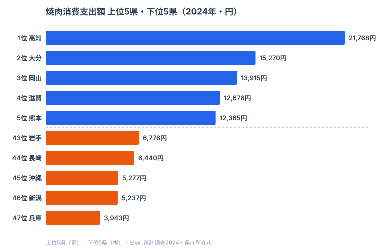

「同じ日本人でも、住む県で焼肉に使うお金が5.5倍も違う」──そう聞いて、どの県がトップだと思うだろうか。焼肉の本場というイメージなら大阪か、あるいは黒毛和牛の鹿児島・宮崎か。だが2024年の家計調査が示した答えは、どちらでもなかった。

焼肉消費支出額（都道府県庁所在市の二人以上世帯の年間支出）の1位は**[高知](/areas/39000)の21,768円**。2位の大分（15,270円）を6,000円以上引き離す独走だ。一方、最下位は意外にも**[兵庫](/areas/28000)の3,943円**。1位と最下位の差は実に**5.52倍**にのぼる。47都道府県の平均は9,277円、中央値は8,889円なので、高知は平均の2.3倍を外食ならぬ「家での焼肉」に投じている計算になる。

この記事では、焼肉に最も金を使う県・使わない県を順位ごとに並べ、「西日本が上位に固まる一方、近畿の大都市が下位に沈む」という意外な構造を読み解く。支出額に潜むのは、味の好みだけでなく「外食 vs 家庭」という消費スタイルの県民性だ。

> [!NOTE]
> 本記事の数値は総務省「家計調査」の品目別支出データ（都道府県庁所在市・二人以上世帯の年間支出額、2024年）。「焼肉（外食ではなく食材・調味料を含む焼肉関連の家庭内支出）」に対する1世帯あたりの年間金額で、都道府県全体ではなく**県庁所在市**の値である点に注意。

## 上位5と下位5

まず焼肉支出の上位5県と下位5県を、家計調査のデータで見てみよう。

突出しているのは高知の21,768円だ。2位の大分（15,270円）に約6,500円の大差をつけており、47都道府県のなかで唯一2万円台に乗っている。3位の岡山（13,915円）、4位の滋賀（12,676円）、5位の熊本（12,365円）と続くが、いずれも高知の3分の2程度にとどまる。上位グループは高知・大分・岡山・熊本・香川・鹿児島と**四国・中国・九州の西日本勢が目立つ**一方、7位に埼玉、4位に滋賀という大都市近郊県も食い込んでいるのが面白い。

<source-link href="/ranking/yakiniku-consumption-expenditure">焼肉消費支出額ランキングをもっと見る</source-link>

> [!TIP]
> 高知は「皿鉢（さわち）料理」に代表される宴会文化で知られ、人が集まって大皿を囲む食習慣が根強い。家庭での焼肉は、まさにその「みんなで囲む」スタイルと相性がよい。支出額の高さは、外食より家庭での集まりに比重を置く県民性の表れと読める。

## 焼肉支出が少ない県（下位グループ）

次に、焼肉にお金をかけない県を見てみよう。下位グループの顔ぶれは上のチャート右側（赤系）のとおりだ。最下位は兵庫の3,943円。トップの高知（21,768円）と比べると5.52倍の開きがあり、47都道府県のなかで唯一4,000円を割り込んでいる。続く新潟（5,237円）、沖縄（5,277円）も5,000円台前半と、上位勢の半分以下だ。

ここで注目したいのは、下位に**近畿の大都市圏**が並ぶ点だ。兵庫が最下位、京都は38位（7,496円）、大阪も28位（8,710円）と、いずれも平均（9,277円）を下回る。焼肉の本場というイメージの強い関西だが、「家庭での焼肉支出」では振るわない。

> [!WARNING]
> このランキングは「家庭での焼肉関連支出」であり、外食としての焼肉店利用は含まれない。大都市圏は焼肉店が密集し、外食で焼肉を楽しむ機会が多いため、家庭内支出が低く出やすい。兵庫・京都・大阪の低さは「焼肉を食べない」ではなく「家ではあまり焼肉をしない」という消費スタイルの違いとして読むのが妥当だ。

## 発見: 「家で焼肉」県と「外で焼肉」県の分かれ目

このデータから読み取れる最大の構造は、**支出額の高低が地理だけでなく「外食 vs 家庭」の消費スタイルで分かれている**ことだ。

上位を見ると、高知・大分・岡山・熊本・香川・鹿児島と、人口規模が中規模以下の西日本の県が並ぶ。これらの県は焼肉専門店の密度が大都市より低く、家庭やまとまった集まりで肉を焼く機会が相対的に多いと考えられる。家計調査が捉える「家庭内支出」が高く出るのは自然だ。

一方、下位には兵庫（47位）・大阪（28位）・京都（38位）・東京（34位、8,019円）といった大都市圏が沈む。焼肉店が街にあふれる都市部では、「焼肉は外で食べるもの」になりやすく、家庭での食材支出が抑えられる。

> [!NOTE]
> [仮説] 「上位＝家庭焼肉文化が強い県、下位＝外食焼肉が主流の都市圏」という解釈は、本データ（家庭内支出）と都市構造の対比から導いた推測であり、外食支出データとの突き合わせによる検証が必要。家計調査の外食「焼肉」項目や、人口密度・飲食店密度との相関分析で確かめるべき論点である。

ただし例外もある。4位の滋賀（12,676円）、7位の埼玉（11,860円）は大都市に隣接するベッドタウン県でありながら上位に入っている。郊外で世帯あたりの庭・駐車場スペースに余裕があり、家庭でのバーベキューや焼肉が定着しているとすれば説明はつくが、これも検証を要する仮説だ。

逆に、黒毛和牛の産地として有名な鹿児島は9位（10,405円）と上位ながら突出はせず、宮崎は20位（9,088円）、長崎にいたっては44位（6,440円）と下位だった。「ブランド牛の産地＝焼肉支出が高い」という直感は、必ずしも家庭内支出には当てはまらない。

## まとめ

- **1位は高知の21,768円**。2位大分（15,270円）を6,500円引き離す独走で、唯一の2万円台。
- **最下位は兵庫の3,943円**。47都道府県で唯一4,000円未満。
- 1位高知と最下位兵庫の差は**5.52倍**。47県平均は9,277円、中央値は8,889円。
- 上位は高知・大分・岡山・熊本・香川・鹿児島など**西日本の中規模県**が目立ち、下位は兵庫・京都・大阪・東京など**大都市圏**が沈む。
- 「家庭での焼肉支出」というデータ特性上、焼肉店が多い都市部は低く出やすく、支出額には「外食 vs 家庭」の消費スタイルが反映されている。

## データ出典

総務省統計局「家計調査」（品目別支出・都道府県庁所在市・二人以上世帯、2024年）。本記事の数値は e-Stat（政府統計の総合窓口）経由で整備したデータに基づく。焼肉消費支出額は1世帯あたりの年間金額（単位：円）で、県庁所在市の値である。関連する統計は[経済カテゴリ](/category/economy)で一覧できる。
