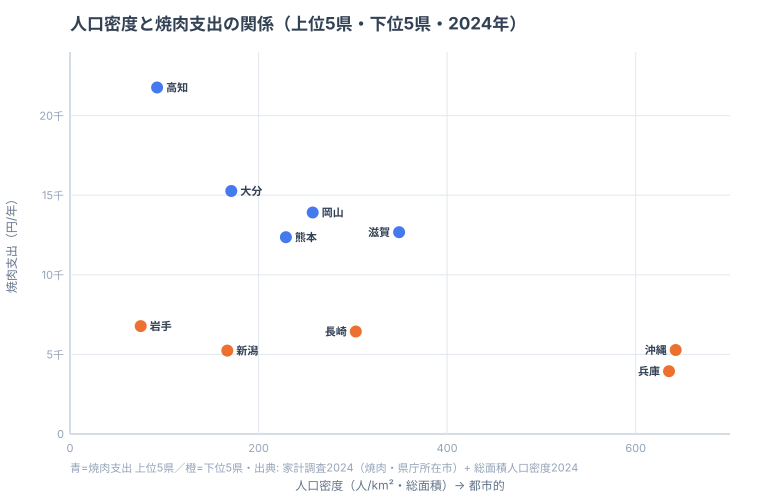

「同じ日本人でも、住む県で焼肉に使うお金が5.5倍も変わる」──そう聞いて、どの県が首位だと思いますか。焼肉の本場というイメージなら大阪、あるいは黒毛和牛の鹿児島・宮崎を思い浮かべるかもしれません。ですが2024年の家計調査が示した答えは、そのどちらでもありませんでした。

焼肉消費支出額（都道府県庁所在市の二人以上世帯の年間支出）の首位は**[高知](/areas/39000)の21,768円**です。2位の大分（15,270円）を6,000円以上引き離す独走でした。一方、最も少ないのは意外にも**[兵庫](/areas/28000)の3,943円**です。首位と最少の差は実に**5.52倍**にのぼります。47都道府県の平均は9,277円、中央値は8,889円なので、高知は平均の2.3倍を「家での焼肉」に投じている計算になります。

この記事では、焼肉に最も金を使う県・使わない県を順位ごとに並べ、「西日本が上位に固まる一方、近畿の大都市が下位に沈む」という意外な構造を読み解きます。さらに人口密度という別の指標を重ね、支出額の高低が「外食 vs 家庭」という消費スタイルの違いでどこまで説明できるのかを、目で確かめていきます。

> [!NOTE]
> 本記事の数値は総務省「家計調査」の品目別支出データ（都道府県庁所在市・二人以上世帯の年間支出額、2024年）。「焼肉（外食ではなく食材・調味料を含む焼肉関連の家庭内支出）」に対する1世帯あたりの年間金額で、都道府県全体ではなく**県庁所在市**の値である点に注意。

## 焼肉支出が多い県・少ない県（上位5と下位5）

まず焼肉支出の上位5県と下位5県を、家計調査のデータで見てみましょう。

突出しているのは高知の21,768円です。2位の大分（15,270円）に約6,500円の大差をつけており、47都道府県のなかで唯一2万円台に乗っています。3位の岡山（13,915円）、4位の滋賀（12,676円）、5位の熊本（12,365円）と続きますが、いずれも高知の3分の2程度にとどまります。上位グループには、6位の香川（12,108円）や9位の鹿児島（10,405円）など**四国・中国・九州の西日本勢が目立つ**一方で、4位に滋賀、7位に埼玉という大都市近郊県も食い込んでいるのが面白いところです。

下位に目を移すと、最も少ないのは兵庫の3,943円です。トップの高知（21,768円）と比べると5.52倍の開きがあり、47都道府県のなかで唯一4,000円を割り込んでいます。続く新潟（5,237円）、沖縄（5,277円）も5,000円台前半で、上位勢の半分以下にとどまります。さらに43位の岩手（6,776円）、44位の長崎（6,440円）まで含めて、下位5県はいずれも6,800円を超えません。

上位5県の顔ぶれをひと言でいえば、高知・大分・岡山・熊本と、いずれも人口規模が中規模以下の地方都市を県庁所在市に持つ県が並びます。一方の下位5県には、後で見るように大都市圏が混じります。この「上位＝地方／下位＝都市」というコントラストが何を意味するのかは、人口密度という別の指標と重ねると一気に輪郭が見えてきます。それは記事の後半で分解します。

<source-link href="/ranking/yakiniku-consumption-expenditure">焼肉消費支出額ランキングをもっと見る</source-link>

> [!TIP]
> 高知は「皿鉢（さわち）料理」に代表される宴会文化で知られ、人が集まって大皿を囲む食習慣が根強い土地です。家庭での焼肉は、まさにその「みんなで囲む」スタイルと相性がよいといえます。支出額の高さは、外食より家庭での集まりに比重を置く県民性の表れと読めます。

## 焼肉の本場・関西が下位に沈む意外

下位グループでまず注目したいのは、**近畿の大都市圏**が並ぶ点です。兵庫が最少で、京都は38位（7,496円）、大阪も28位（8,710円）と、いずれも平均（9,277円）を下回ります。焼肉の本場というイメージの強い関西ですが、「家庭での焼肉支出」では振るわないのです。

東京も34位（8,019円）で平均以下にとどまります。焼肉店が街にあふれる都市部では、「焼肉は外で食べるもの」になりやすく、家庭での食材支出が抑えられると考えられます。兵庫・京都・大阪・東京という大都市が軒並み平均を割っているのは、偶然ではなさそうです。

> [!WARNING]
> このランキングは「家庭での焼肉関連支出」であり、外食としての焼肉店利用は含まれません。大都市圏は焼肉店が密集し、外食で焼肉を楽しむ機会が多いため、家庭内支出が低く出やすい性質があります。兵庫・京都・大阪の低さは「焼肉を食べない」ではなく「家ではあまり焼肉をしない」という消費スタイルの違いとして読むのが妥当です。順位の低さをそのまま「焼肉好きでない」と読み違えないよう注意してください。

## 人口密度で分解すると「都市は低い」が裏づく

「家庭での焼肉支出が低いのは、外で焼肉を食べているからだ」──ここまでは仮説でした。これを観察に変えるために、もう一つの指標を重ねてみます。総務省の総面積1km²あたり人口密度（2024年）です。人口密度が高い県ほど飲食店が密集し外食機会が多い、という都市度の代理指標として使えます。上位5県・下位5県について、横軸に人口密度、縦軸に焼肉支出をとった散布図が次の図です。

この図ではっきり見えるのは、**人口密度が高い県（右側）にはひとつも上位県が現れない**ことです。下位の兵庫（密度635人）と沖縄（密度642人）は図の右下、つまり「密度が高く支出が低い」象限に固まります。一方で支出が突出する高知（密度92人）は左上に大きく離れ、地方の低密度県という位置にあります。「都市部ほど家庭での焼肉支出が低い」という関係は、少なくとも上位・下位の両端については、想像ではなく図の上で確かに観察できます。

ただし、低密度ならどこも支出が高いわけではありません。最下位グループの岩手（密度75人）は最も人口密度が低い県のひとつでありながら焼肉支出も6,776円と低く、図の左下に位置します。つまり成り立っているのは「都市的な県は低い」という一方向の関係だけで、「地方なら必ず高い」という逆向きの関係は成り立っていません。**密度の高さは支出を押し下げる方向に効くが、密度の低さだけでは高支出を保証しない**──これが、仮説を10県の実データで分解して得られた観察です。残る上振れ・下振れは、皿鉢料理のような土地ごとの食習慣で説明する余地があります。

> [!NOTE]
> [仮説] 「上位＝家庭焼肉文化が強い県、下位＝外食焼肉が主流の都市圏」という解釈の検証には、本来は外食「焼肉」の支出データそのものとの突き合わせが理想です。現状そのデータが整備されていないため、ここでは人口密度を都市度の代理指標として用いました。代理である以上、密度＝外食量とは限らない点には留保が必要です。

## 発見: 産地でも家では焼かない「焼肉パラドックス」

人口密度で説明できるのは大枠までです。その枠から外れる例外にこそ、このランキングの面白さがあります。

最も意外なのは、**ブランド牛の産地が家庭の焼肉支出では振るわない**ことです。黒毛和牛の名産地として知られる鹿児島は9位（10,405円）と上位ではあるものの突出はせず、宮崎は20位（9,088円）、長崎にいたっては44位（6,440円）と下位でした。「いい牛が穫れる県＝家でも焼肉をたくさん食べる」という直感は、家庭内支出では裏切られます。産地の牛の多くは大消費地へ出荷され、地元の食卓に並ぶ量とは別物だからです。**産地であることと、家庭でどれだけ焼肉に支出するかは、まったく別の話**なのです。これが前章の人口密度では説明しきれない、産地パラドックスです。

もうひとつの例外は、上位に食い込んだ大都市近郊県です。4位の滋賀（12,676円）、7位の埼玉（11,860円）は、密度がそこそこ高い（滋賀349人）にもかかわらず上位に入りました。京阪神・首都圏のベッドタウンでありながら、郊外で世帯あたりの庭・駐車場スペースに余裕があり、家庭でのバーベキューや焼肉が定着している可能性があります。同じ「大都市圏」でも、都心の兵庫（最下位）と近郊の滋賀（4位）でこれだけ分かれるのは、家庭で肉を焼ける住環境の差が効いていると読めます。

> [!TIP]
> 同じことが家計の食費全体にもいえます。ある品目の支出が低いとき、それは「嫌い・食べない」ではなく「外で買う・外で食べる」だけかもしれません。自分の家計を振り返るときも、家庭内支出が少ない品目を「節約できている」と早合点せず、外食・中食に回った分とあわせて見ると、本当の食の好みが見えてきます。家庭内支出だけで県民の焼肉好きを断じないのが、この種のデータを読むコツです。

## まとめ

- **首位は高知の21,768円**。2位大分（15,270円）を6,500円引き離す独走で、唯一の2万円台。
- **最も少ないのは兵庫の3,943円**。47都道府県で唯一4,000円未満。
- 首位高知と最少兵庫の差は**5.52倍**。47県平均は9,277円、中央値は8,889円。
- 上位は高知・大分・岡山・熊本など**地方の中規模県**が目立ち、下位は兵庫・京都・大阪・東京など**大都市圏**が沈む傾向。
- 人口密度と重ねると、**密度が高い県に上位はひとつもなく「都市部ほど家庭焼肉支出が低い」が観察できる**。ただし低密度の岩手も低支出で、「地方なら必ず高い」とは限らない。
- 黒毛和牛の産地（鹿児島9位・長崎44位）でも家庭内支出は突出せず、「産地＝家でも焼肉」は成り立たない（焼肉パラドックス）。

## データ出典

総務省統計局「家計調査」（品目別支出・都道府県庁所在市・二人以上世帯、2024年）。本記事の数値は e-Stat（政府統計の総合窓口）経由で整備したデータに基づきます。焼肉消費支出額は1世帯あたりの年間金額（単位：円）で、県庁所在市の値です。関連する統計は[経済カテゴリ](/category/economy)で一覧できます。
