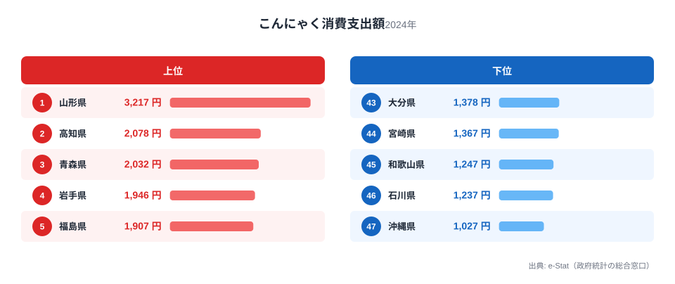
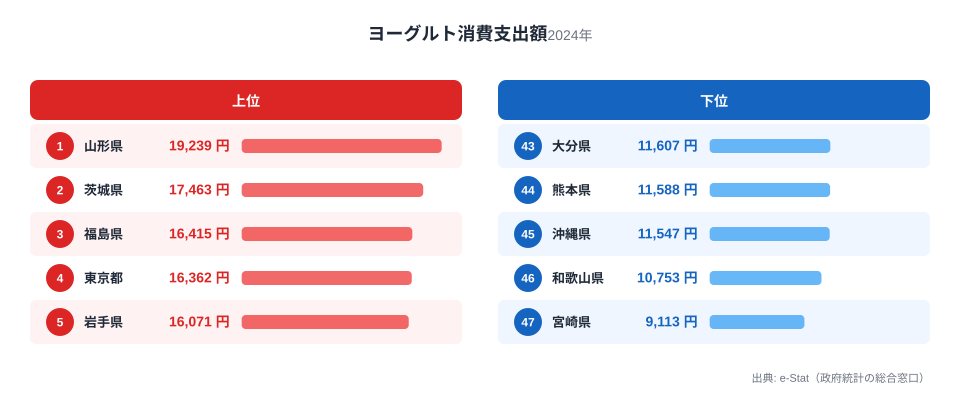
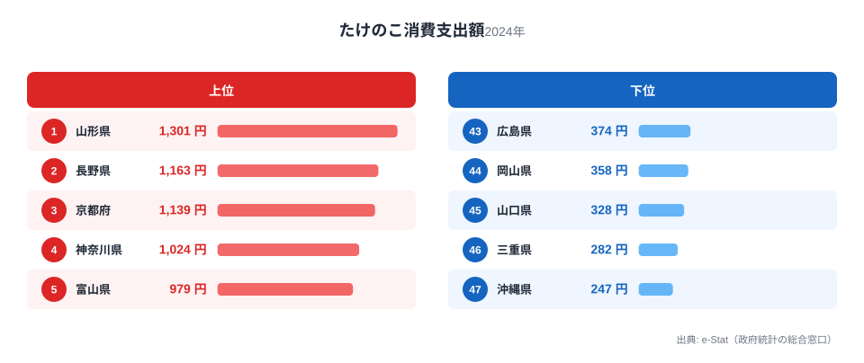
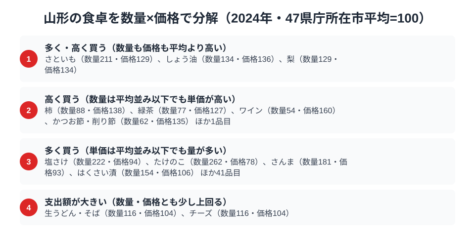

さくらんぼで知られる山形県ですが、家計調査が映し出す食卓の主役は少し意外な顔ぶれです。総務省の家計調査（品目別）で山形市の二人以上世帯を見ると、こんにゃく・ヨーグルト・たけのこという3つの品目すべてで、山形が全国1位に立っています。

芋煮に欠かせないこんにゃく、健康志向を映すヨーグルト、そして山の恵みのたけのこ。海に面しない内陸県ならではの、大地と山の食文化がここに表れています。この記事では、3つの全国1位品目を横断しながら、山形県民の食卓を読み解きます。

> [!NOTE]
> 家計調査の都道府県データは、県庁所在市（山形県は山形市）の二人以上世帯を対象にした年間支出額です。県全体ではなく山形市在住世帯の家計簿から見た傾向であり、支出「金額」であって消費「量」そのものではない点にご注意ください。

## こんにゃく — 全国1位3,217円、芋煮の主役

<source-link href="/ranking/konnyaku-consumption-expenditure">こんにゃく消費支出額ランキングをもっと見る</source-link>

山形県のこんにゃく消費支出額は3,217円で全国1位です。2位の高知県2,078円を大きく引き離しています。山形といえば秋の「芋煮会」。里芋・こんにゃく・牛肉・ねぎを大鍋で煮る芋煮は、河川敷に家族や仲間が集まって楽しむ山形の一大行事です。

芋煮に欠かせないこんにゃくに加え、山形には「玉こんにゃく」を串に刺して煮込む名物もあり、観光地でも家庭でも日常的に食べられています。芋煮文化と玉こんにゃくという二つの食習慣が、こんにゃくの全国一の支出額を支えています。[こんにゃく消費支出の記事](/blog/konnyaku-expenditure-ranking)でも山形の突出ぶりを扱っています。

## ヨーグルト — 全国1位19,239円、健康志向の内陸県

<source-link href="/ranking/yogurt-consumption-expenditure">ヨーグルト消費支出額ランキングをもっと見る</source-link>

ヨーグルトの消費支出額も山形県が19,239円で全国1位です。2位の茨城県17,463円を上回ります。山形は果物王国として知られ、健康や食への意識が高い土地柄とされます。ヨーグルトは果物と合わせて食べられることも多く、フルーツ文化とヨーグルト消費が結びついている可能性があります。

内陸の山形は寒暖差が大きく、朝食を重視する家庭が多いことも、ヨーグルト消費の高さの背景と考えられます。こんにゃくという伝統食と、ヨーグルトという現代的な健康食品の両方で全国一という組み合わせに、山形の食卓の幅広さが表れています。

## たけのこ — 全国1位1,301円、山の恵み

<source-link href="/ranking/bamboo-shoot-consumption-expenditure">たけのこ消費支出額ランキングをもっと見る</source-link>

山の幸でも山形は全国トップです。たけのこの消費支出額も山形県が1,301円で全国1位。2位の長野県1,163円を上回ります。山に囲まれた内陸県の山形では、春になると山菜やたけのこを採り、食卓に取り入れる文化が根づいています。

たけのこの煮物や炊き込みご飯、山菜と合わせた郷土料理など、季節の山の恵みを大切にする食習慣が、たけのこの全国一を支えています。海の幸に乏しい内陸県だからこそ、山の恵みへの支出が厚くなるという構図です。

> [!WARNING]
> 山形名産のさくらんぼや山菜の一部は、家計調査の主要品目として個別に集計されていません。そのため、ここで紹介した3品目のランキングだけでは、山形の食文化の全体像は測れない点にご注意ください。

## 山形の食卓を貫くもの

山形県民の食卓を貫くのは、「内陸の大地と山が育む食文化」です。芋煮のこんにゃく、果物文化と結びついたヨーグルト、山の恵みのたけのこ。海に面しない内陸県ゆえに、大地の作物・山菜・乳製品への支出が厚くなり、それぞれが全国一の消費につながっています。

沿岸の富山（海の幸の多冠型）や鳥取（梨と日本海の海の幸）と並べると、山形は「内陸の大地・山・乳製品型」。海の有無という地理条件が、県民の食卓の骨格を大きく左右することが、比較から見えてきます。

> [!TIP]
> 山形のように海に面しない内陸県は、山菜・きのこ・こんにゃく・乳製品といった「山と大地の食材」への支出が厚くなる傾向があります。海の幸の順位だけでなく、山の幸・農産物の順位を見ると、内陸県の食文化の豊かさが見えてきます。

## 数量×価格で分解する山形市の食卓

<source-link href="/ranking/taro-consumption-quantity">さといも消費量ランキングをもっと見る</source-link>

家計調査は品目ごとに支出額だけでなく数量も調べています。両方を組み合わせ、47都道府県庁所在市の平均を100とする指数に直すと、山形市がその品目を「多く買っている」のか「高く買っている」のかを切り分けられます。たとえばさといも消費量は数量指数211・価格指数129で、平均の2倍以上の量を、単価も3割ほど高く買っています。芋煮の主役であるこんにゃくと同じく、さといもも山形の食卓で量と単価の両面から突出している品目です。しょう油も数量指数134・価格指数136とほぼ同じ傾向にあり、味付けそのものを多く使う食文化がうかがえます。

反対に、柿は数量指数88・価格指数138、緑茶は数量指数77・価格指数127、ワインは数量指数54・価格指数160と、買う量自体は平均以下でも単価だけが目立って高い品目です。量は少ないのに支出額の順位が上位に入ってくる背景には、質の高いものを選んで買う層の存在が考えられます。一方で、たけのこは数量指数262・価格指数78、塩さけは数量指数222・価格指数94、さんまは数量指数181・価格指数93と、大量に買う一方で単価は平均より低く抑えられています。冒頭で紹介したたけのこの全国1位も、高級品としてではなく、日常的に大量に消費される山の恵みとしての1位だとわかります。

なお、こんにゃくとヨーグルトは支出額の統計はあっても数量の統計が家計調査に無いため、同じ切り分けはできません。この2品目の突出が量によるものか単価によるものかは、今後のデータ拡充を待つ必要があります。

> [!TIP]
> 支出額の順位だけでは、「たくさん食べているから1位」なのか「高いものを買っているから1位」なのかは分かりません。数量指数と価格指数に分解すると、さといもやしょう油のように量も単価も高い品目と、柿やワインのように単価だけが高い品目、たけのこや塩さけのように量で支出額を押し上げている品目を見分けられます。

> [!NOTE]
> この指数は「47都道府県庁所在市の単純平均=100」を基準にしており、家計調査の全国平均そのものではありません。また価格指数は支出額を数量で割った金額の相対値なので、単価だけでなく買っている品種やブランドの違いも含んでいます。対象は二人以上世帯・山形市の年間支出額と年間購入量です。

## まとめ

- こんにゃく消費支出額は山形県が全国1位（3,217円）、芋煮と玉こんにゃくの食文化
- ヨーグルトも全国1位（19,239円）、果物王国の健康志向を映す
- たけのこも全国1位（1,301円）、内陸の山の恵み
- 数量×価格で分解すると、たけのこは量で稼ぐ1位（数量指数262・価格指数78）、さといもとしょう油は量も単価も高い品目とわかる
- 海に面しない内陸県ゆえの大地・山・乳製品への厚い支出が、山形の豊かな食卓を支える

山形県の他の統計は[山形県の地域プロフィール](/areas/06000)、食品・家計消費の地域差は[経済カテゴリ一覧](/category/economy)からご覧いただけます。

## データ出典

総務省統計局「家計調査（品目別）」（2024年、都道府県庁所在市 二人以上世帯）をもとに、e-Stat（政府統計の総合窓口）経由で整備したデータを使用しています。
