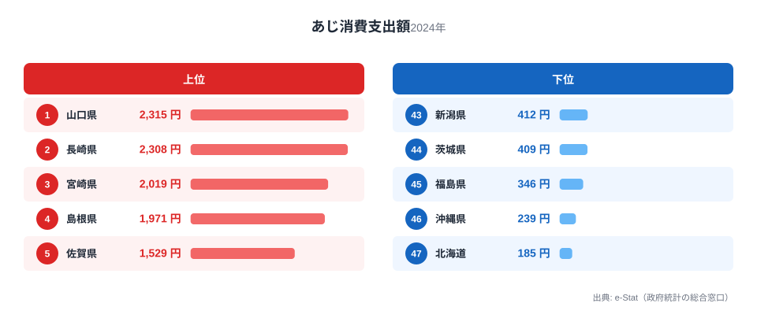
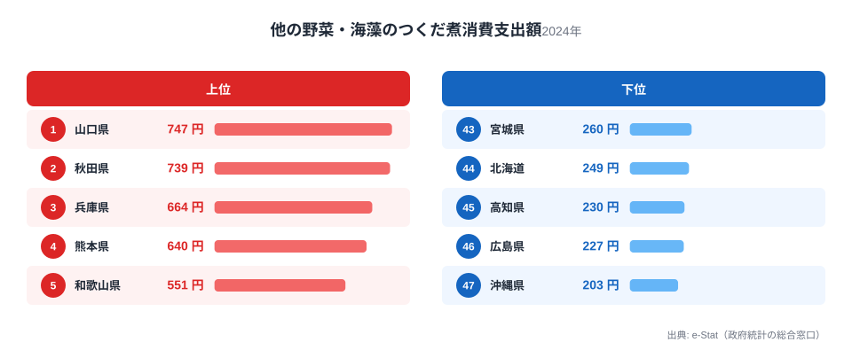
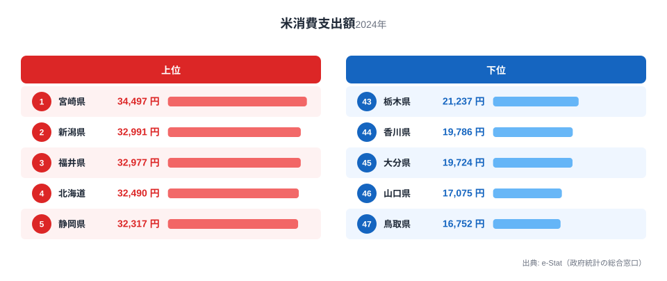
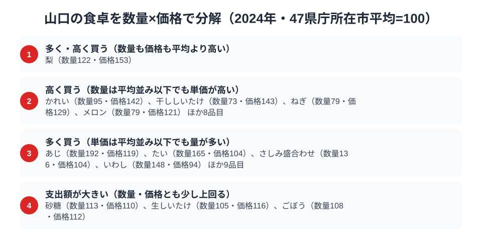

瀬戸内海と日本海の両方に面する山口県は、魚を新鮮なまま食卓に運べる立地に恵まれています。実際に家計調査を見ると、山口はあじの消費支出額で全国1位、佃煮でも全国1位という「魚食県」の顔がはっきり表れています。

ところが同じ家計調査で主食の米を見ると、山口は全国46位という下位に沈んでいます。魚はどこよりも買うのに、米だけは買わない。この一見矛盾した組み合わせの背景には、瀬戸内海の漁場と、パン・麺への支出が相対的に厚い山口独特の食生活の構造があります。

> [!NOTE]
> 家計調査の数値はすべて山口県の県庁所在市（山口市）の二人以上世帯における年間消費支出額です。県全体の平均ではなく、県庁所在市の世帯を対象にした抽出調査である点に注意してください。

## あじ — 全国1位2,315円、瀬戸内の近海魚

<source-link href="/ranking/horse-mackerel-consumption-expenditure">あじ消費支出額ランキングをもっと見る</source-link>

山口はあじの消費支出額が2,315円で全国1位です。2位の長崎県は2,308円でわずかな差ですが、3位の宮崎県は2,019円で300円近く開いています。最下位は北海道の185円で、山口とは12.5倍の差があります。

山口が上位に来る理由は、瀬戸内海と日本海という2つの漁場を抱える地理的条件にあります。あじは近海で水揚げされ鮮度が落ちにくいうちに市場に出回るため、内陸で消費される加工品や冷凍品に頼る地域より価格面でも入手のしやすさでも有利です。下関や萩など県内各地に漁港が分散していることも、県全域での日常的な消費を支えていると考えられます。北海道など寒流域の県で消費支出額が低いのは、あじよりも鮭やほっけなど別の魚種が食卓の主役になっているためです。

## 他の野菜・海藻のつくだ煮 — 全国1位747円、瀬戸内海苔の伝統

<source-link href="/ranking/vegetable-seaweed-tsukudani-consumption-expenditure">他の野菜・海藻のつくだ煮消費支出額ランキングをもっと見る</source-link>

つくだ煮の消費支出額でも山口は747円で全国1位です。2位の秋田県は739円で僅差ですが、3位の兵庫県は664円で、そこから下位とは明確な差がついています。最下位は沖縄県の203円で、山口の約3.7倍の開きです。

山口でつくだ煮の消費が多い背景には、瀬戸内海沿岸で獲れる海藻や小魚を保存食として加工する食文化が根付いていることが挙げられます。冷蔵・冷凍技術が発達する以前から、日持ちする佃煮は魚介王国・山口の食卓を支える常備菜として定着してきました。あじの消費と同じく、近海の水産資源を余さず使い切る発想が佃煮文化にもつながっていると見られます。対照的に沖縄は、県産の昆布消費こそ独自の食文化を持つものの、つくだ煮という調理形態そのものが本土ほど日常的でないことが下位の一因と考えられます。

> [!WARNING]
> この消費支出額はあくまで「金額」であり、消費「量」ではありません。単価の高い海藻を少量使う調理法や、値段の安い地元産の魚を多く使う調理法では、同じ消費量でも支出額の順位は変わります。また、山口が誇るふぐは高級魚として別の統計区分（生鮮魚介の内訳）で扱われており、本記事の2品目には含まれていません。

## 米 — 全国46位17,075円、なぜ主食への支出が薄いのか

<source-link href="/ranking/rice-consumption-expenditure">米消費支出額ランキングをもっと見る</source-link>

一方で米の消費支出額を見ると、山口は17,075円で全国46位と下位に沈みます。首位の宮崎県は34,497円で、山口はその半分にも届きません。2位の新潟県も32,991円で、山口との差は大きいままです。最下位は鳥取県の16,752円で、山口はそのすぐ上という位置です。

米どころとして知られる宮崎や新潟が上位を占めるのは、地元産の良食味米を日常的に購入する層が厚いためと考えられます。対して山口が下位にあるのは、魚介中心のおかずが食卓の主役になりやすく、主食側の支出が相対的に抑えられていることが一因と見られます。あじやつくだ煮のように「おかずにお金をかける」食文化が強い分、米への支出配分が他県より控えめになっている可能性があります。また瀬戸内エリアはうどんなど麺文化も根強く、主食が米一辺倒でない食習慣も影響していると考えられます。

## 山口の食卓を貫くもの

あじとつくだ煮という2つの全国1位が示すのは、瀬戸内海と日本海という2つの海に囲まれた山口の「近海の恵みを余さず食べる」という一貫した食習慣です。新鮮な魚をそのまま食べるだけでなく、佃煮に加工して保存する知恵まで含めて、魚介資源を軸にした食文化が根付いています。

その一方で、魚介におかず予算が集中する分、米という主食への支出は相対的に薄くなっています。これは同じく魚食文化が強い高知県（かつお日本一・すでに公開）や、焼酎とともに主食の位置づけが独特な宮崎県（すでに公開）とも通じる構図です。山口の場合は「おかずは近海魚、主食は控えめ」という配分のメリハリが際立っている点が特徴といえます。

> [!TIP]
> あじとつくだ煮がともに全国1位という組み合わせは、単に「魚が好き」というだけでなく、素材をそのまま食べる調理法と、加工して長期保存する調理法の両方が発達している証拠です。1つの食材の消費額だけでなく、加工品の消費額もあわせて見ると、その県の「魚とのつきあい方」の深さが見えてきます。

山口県の他の統計指標は[山口県の地域プロフィール](/areas/35000)でまとめて確認できます。家計調査に基づく他の消費支出データは[経済カテゴリ一覧](/category/economy)からたどれます。魚介を軸にした食文化という点では[高知の食卓｜かつお日本一でみかん最下位の謎](/blog/kochi-food-culture)や、焼酎と米の関係を扱った[宮崎の食卓｜焼酎日本一、でもほたては最下位?](/blog/miyazaki-food-culture)もあわせて読むと、地域ごとの主食とおかずの配分の違いが見えてきます。

## 数量×価格で分解する山口市の食卓

<source-link href="/ranking/horse-mackerel-consumption-quantity">あじ消費量ランキングをもっと見る</source-link>

ここまで見てきたあじや米の支出額は、「数量×価格」に分解するともう一段深い山口市の食卓が見えてきます。家計調査で数量と支出額の両方が公表されている125品目について、47県庁所在市の平均を100とした指数で比べると、あじ消費量は数量指数が192と平均のほぼ2倍まで買われている一方、価格指数は119で平均をわずかに上回る程度にとどまります。つまり山口市のあじ消費が突出しているのは単価の高さではなく、買う量そのものの多さが効いています。数量の全国順位は4位で、支出額1位を支えているのは「量を多く買う」という消費行動であることが読み取れます。

同じ「多く買う」区分にはたい・さしみ盛合わせ・いわしなど魚介品目が並び、あじと同じ傾向を示します。一方「高く買う」区分にはかれい・干ししいたけ・ねぎ・メロンなど単価そのものが平均を上回る品目が入り、量より価格差で支出額が押し上げられている点で、あじとは性格が異なります。

山口市の米はこの分解でもっとも対照的な位置にあります。数量指数は68で47県庁所在市中最下位、価格指数は95と平均並みです。支出額46位という順位は、割高な米を避けているからではなく、量そのものを買っていないことが直接の理由であると、この分解から読み取れます。

> [!TIP]
> 支出額だけを見ると「たくさん買っているのか、高いものを買っているのか」は区別できません。数量指数と価格指数をセットで見ると、あじのように量で稼ぐ品目と、かれいやメロンのように単価で稼ぐ品目の違いが分かります。

> [!NOTE]
> ここでの指数は家計調査の全国値ではなく、47都道府県庁所在市（山口市を含む）の単純平均を100とした値です。価格指数は品種やブランドの違いを含んだ平均単価から算出しており、産地や鮮度による差を分離していません。対象は二人以上世帯の2024年の年間消費です。

## まとめ

- あじの消費支出額は2,315円で全国1位。瀬戸内海・日本海の両漁場を持つ立地が背景
- 他の野菜・海藻のつくだ煮の消費支出額は747円で全国1位。近海資源を保存食に加工する伝統が根付く
- 米の消費支出額は17,075円で全国46位。おかず中心の食生活が主食への支出を相対的に抑えている
- 「近海の恵みをそのまま・加工して余さず食べる」ことが山口の食卓を貫く軸である

## データ出典

総務省統計局「家計調査（品目別）」2024年、都道府県庁所在市 二人以上世帯（e-Stat 経由で整備）。
