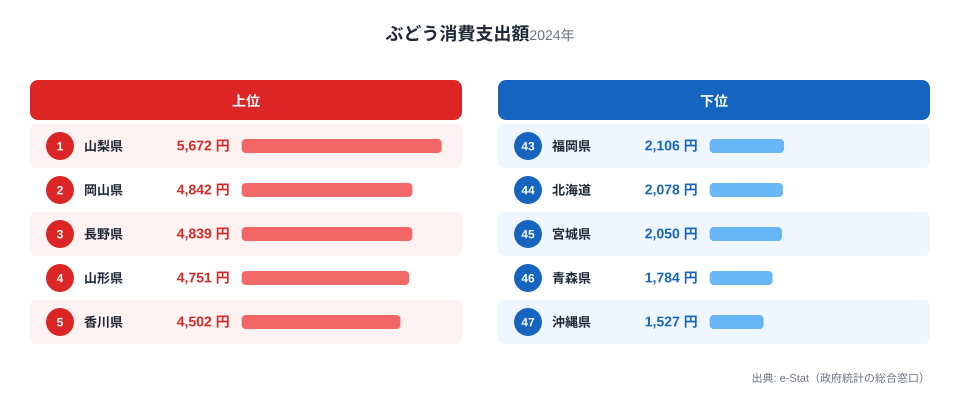
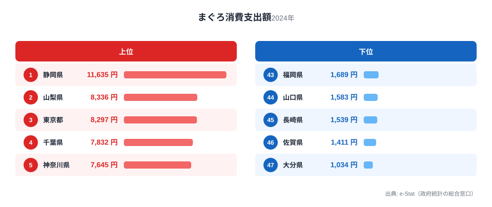
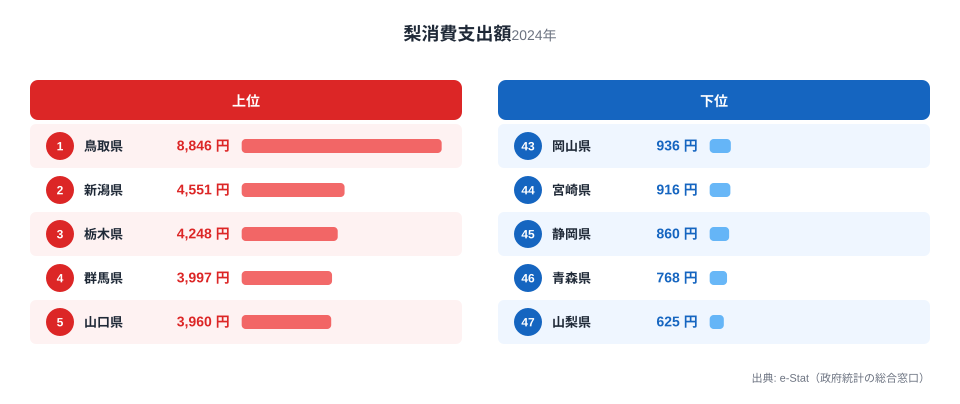
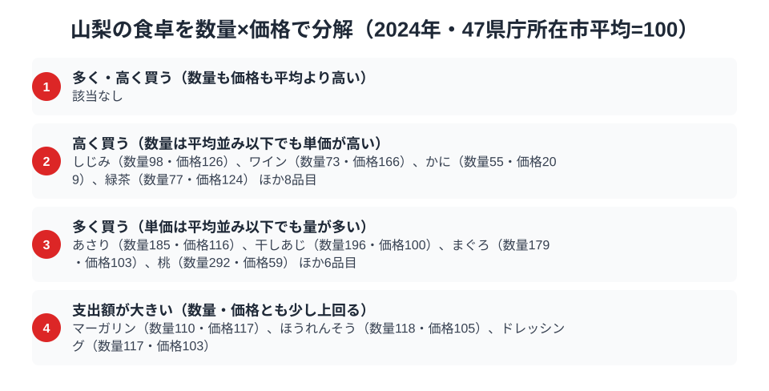

山梨県は、盆地特有の寒暖差が生み出す果樹王国として知られています。総務省の家計調査（品目別）2024年データを見ると、その評判どおり**ぶどう消費支出額は全国1位（5,672円）**でした。さらに意外なことに、海に面していないにもかかわらず**まぐろ消費支出額は全国2位（8,336円）**という結果も出ています。

ところがこのデータには、もうひとつの発見があります。県名に「梨」の字を持つ山梨県が、**梨の消費支出額では全国最下位（625円）**なのです。ぶどうでは圧勝、まぐろでも健闘する山梨が、なぜ同じ果物である梨にはこれほど無関心なのでしょうか。3つの品目を通して、山梨県民の食卓を読み解きます。

> [!NOTE]
> 本記事のデータは総務省「家計調査（品目別）」の都道府県庁所在市（山梨県は甲府市）における二人以上世帯の1世帯当たり年間支出額（2024年）です。県全体の消費量調査ではなく、県庁所在市の家計簿から集計した支出額である点に注意してください。

## ぶどう — 全国1位5,672円、盆地が育てた王者の貫禄

<source-link href="/ranking/grape-consumption-expenditure">ぶどう消費支出額ランキングをもっと見る</source-link>

甲府市の世帯は年間5,672円をぶどうに支出しており、これは全国2位の岡山県4,842円や全国3位の長野県4,839円を大きく引き離す数字です。下位を見ると全国46位の青森県は1,784円、全国47位の沖縄県は1,527円で、山梨の支出額はその3倍以上に達しています。

山梨県の甲府盆地は、日照時間の長さと昼夜の寒暖差という条件が重なり、糖度の高いぶどうが育つ土壌として知られています。勝沼を中心とした産地が県内に根を張っているため、地元での購入機会や贈答文化が根付いていることが、支出額の突出につながっていると考えられます。全国2位の岡山県や全国3位の長野県もぶどうの名産地であり、上位が果樹産地県で占められている点からも、産地であることが購買行動に直結している構図が見えます。

## まぐろ — 全国2位8,336円、海なし県が刺身を手放さない理由

<source-link href="/ranking/tuna-consumption-expenditure">まぐろ消費支出額ランキングをもっと見る</source-link>

山梨県は全国でも数少ない海に面さない内陸県のひとつですが、まぐろへの支出額は8,336円で全国2位です。首位の静岡県は11,635円でした。全国3位の東京都は8,297円とほぼ並ぶ水準で、下位の佐賀県は1,411円（全国46位）、大分県は1,034円（全国47位）で、山梨との差は8倍近くに達しています。

内陸県でありながらまぐろ支出が高い背景には、山梨が古くから海産物を「塩」で保存・輸送する文化を持っていた地理的事情があります。駿河湾に近い静岡から鉄道や道路で新鮮な魚介が届きやすい立地に加え、山梨県民は冠婚葬祭や来客時に刺身を振る舞う習慣が根強いとされます。全国1位の静岡が漁港を持つ県であることを踏まえると、山梨の高支出は「産地に近い内陸県」という独特のポジションが効いている可能性があります。

## 梨 — 全国最下位625円、県名を裏切る不人気の謎

<source-link href="/ranking/pear-consumption-expenditure">梨消費支出額ランキングをもっと見る</source-link>

もっとも意外なのがこの結果です。山梨県の梨への年間支出額はわずか625円で、全国1位の鳥取県は8,846円、その7分の1以下です。全国46位の青森県は768円で、山梨はそれをも下回る**全国最下位**でした。全国2位の新潟県は4,551円で、これと比べても圧倒的な差があります。

山梨県は「山梨」という県名に梨の字を含みますが、これは地名の由来が梨の産地であることを意味しているわけではなく、諸説あるものの梨との直接的な結びつきは薄いとされています。実際、県内の農業出荷は圧倒的にぶどう・桃が中心で、梨の産地としての存在感は乏しいのが実情です。地元で梨を買う機会が少ないうえ、ぶどうや桃という強力な代替の果物が食卓を占有していることも、梨支出の低さを後押ししていると考えられます。

> [!WARNING]
> ここでの支出額は「金額」であり「消費量」そのものではありません。山梨県産の桃やぶどうが自家消費・贈答・親戚からのお裾分けで手に入るぶんは家計調査の購入支出には計上されないため、実際の果物摂取量はさらに高い可能性があります。

## 山梨の食卓を貫くもの

ぶどう1位・まぐろ2位・梨最下位という3つの数字を並べると、山梨県の食卓を貫く軸が見えてきます。それは「地元で手に入るものを食べ、地元にないものは選ばない」という徹底した地産地消的な購買行動です。ぶどうとまぐろ（静岡経由）は山梨の地理と流通に根ざした強みがある一方、梨は産地としての強みがなく、他の果物に選択肢を奪われています。

同じように地元の名産が食卓の軸になっている県として、桃とりんごが並ぶ[福島県の食卓](/blog/fukushima-food-culture)や、そばと味噌が根付く[長野県の食卓](/blog/nagano-food-culture)があります。山梨の場合は「隣接する強い産地」がまぐろの高支出という形で食卓に取り込まれている点が特徴的です。

> [!TIP]
> ぶどう1位・梨最下位という対照は、単純に「果物好きな県」では説明できません。山梨の家計調査データは、消費行動が全国的な人気や健康志向ではなく、あくまで「地元で何が採れるか」に強く規定されていることを示しています。他の果物（桃・さくらんぼ等）でも同じ論理が働いているか確認すると、産地バイアスの強さがより明確になります。

## 数量×価格で分解する甲府市の食卓

<source-link href="/ranking/clam-consumption-quantity">あさり消費量ランキングをもっと見る</source-link>

ここまで見てきたぶどう・まぐろ・梨の支出額は、いずれも「金額」でした。しかし支出額だけでは、たくさん買っているから金額が大きいのか、単価が高いものを選んでいるから金額が大きいのかを区別できません。そこで家計調査の数量データを使い、支出額を数量指数と価格指数に分解すると、甲府市の食卓の輪郭がさらにはっきりします。あさり消費量は数量指数が高い一方で価格指数はほぼ平均並みで、たくさん食べているために支出額が膨らむタイプです。ただしあさりは山梨で採れる食材でも、近接産地から届く品目でもないため、量が多い理由は地元の強みとは別に考える必要があります。まぐろも同じ傾向で、数量指数は平均を大きく上回るのに価格指数はほぼ平均並みにとどまります。桃にいたっては数量指数が突出して高い一方で価格指数は平均を大きく下回っており、安く大量に食べていることがうかがえます。ぶどうも数量が多く単価はむしろ平均以下で、量で支出額を押し上げるタイプです。まぐろ・桃・ぶどうのように地元や近接産地に強みを持つ品目は、「たくさん買って単価は上げない」という買い方が共通しています。一方、梨の数量指数はわずか28.5で、対象125品目の中でも際立って少ない部類に入ります。価格指数は103とほぼ平均並みで、梨が売れないのは価格が高いからではなく、そもそも購入する量自体が少ないことが数字にも表れています。

一方、価格指数だけが突出して高い品目もあります。ワインやかに、しじみ、緑茶は数量こそ平均並みか平均以下ですが、単価の高いものを選んで買っているために支出額が押し上げられています。かにやしじみは山梨で採れる食材ではなく、日常的に大量に買う品目でもありませんが、購入するときには質の高いものを選ぶ傾向がうかがえます。ぶどう産地である山梨が、ワインの単価でも平均を上回っている点は興味深いところです。地元産のワインが比較的高価格帯であることや、贈答・来客用に良いワインを選ぶ習慣を反映していると考えられます。地元産地の強みが「量」に表れる品目と、購買行動の丁寧さが「単価」に表れる品目とに分かれ、山梨の食卓は二重の構造を持っていると言えそうです。

> [!TIP]
> 支出額の順位だけでは「たくさん食べている」のか「高いものを買っている」のかが分かりません。数量指数と価格指数に分解すると、ぶどう・まぐろ・桃は量で支出額を押し上げるタイプ、ワインやかにのような品目は単価で支出額を押し上げるタイプに分かれます。地元産地に近い品目ほど前者に、贈答や特別な機会に選ぶ品目ほど後者に寄る傾向が読み取れます。

> [!NOTE]
> 指数の基準は47都道府県庁所在市の単純平均を100とした相対値で、家計調査が公表する全国平均とは別物です。価格指数は「支出額を数量で割った値」から逆算した相対価格なので、同じ品目でも買っている品種やブランドが違えば数値が変わり、純粋な価格水準の比較ではありません。対象はいずれも甲府市の二人以上世帯における年間の値です。

## まとめ

- ぶどう消費支出額は全国1位（5,672円）。甲府盆地の産地としての強みが直結
- まぐろ消費支出額は全国2位（8,336円）。内陸県ながら静岡に近い立地が高支出を後押し
- 梨消費支出額は全国最下位（625円）。県名に反して梨の産地としての基盤が薄い
- 山梨の食卓は「地元産地の強み」に忠実に従う、地産地消色の強い構造
- 3品目とも、順位の背景には産地との距離という共通の地理的要因が見える

## データ出典

総務省統計局「家計調査（品目別）」2024年、都道府県庁所在市（山梨県：甲府市）二人以上世帯のデータをもとに、e-Stat経由で整備しています。詳しくは[山梨県の地域プロフィール](/areas/19000)や[経済カテゴリ一覧](/category/economy)もあわせてご覧ください。
