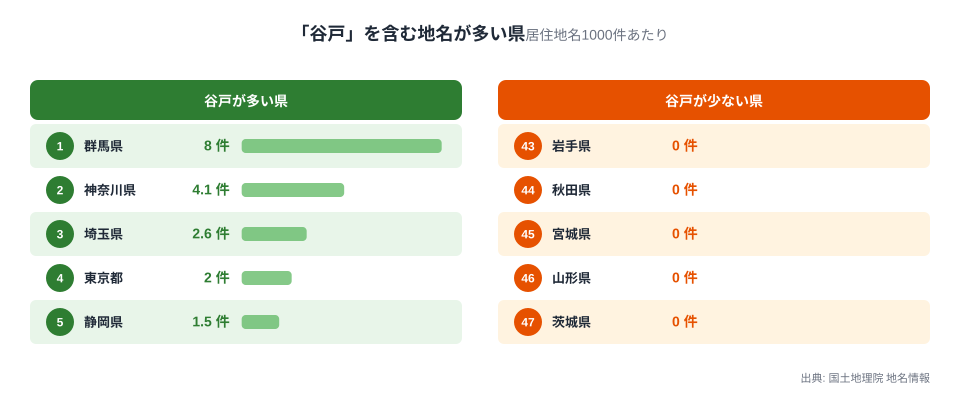
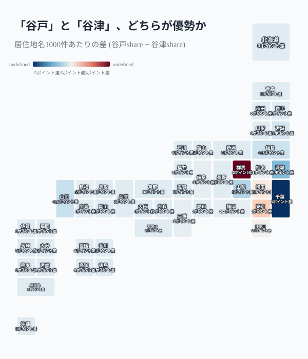
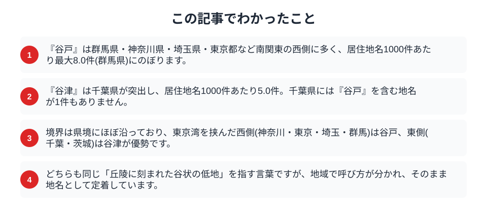

丘陵地に刻まれた谷状の低地を、関東地方では「谷戸」または「谷津」と呼びます。どちらも同じ地形を指す言葉なのに、地名として定着する範囲は驚くほどきれいに分かれています。国土地理院の地名情報から、居住地名に「谷戸」「谷津」がどれだけ含まれるかを都道府県ごとに数えると、南関東を中心に呼び方が入れ替わる境界がありながら、その広がり方は単純な東西二分ではないことがわかりました。

## 「谷戸」は南関東の西側に多い

まず、居住地名1000件あたりに「谷戸」を含む地名がいくつあるかを、県ごとに比べます。

<data-source label="国土地理院 地名情報" note="居住地名1000件あたりの『谷戸』を含む地名数（電子国土基本図・地名情報）"></data-source>

最も多いのは群馬県で、居住地名1000件あたり8.0件に「谷戸」が含まれます。次いで神奈川県4.1件、埼玉県2.6件、東京都2.0件と、南関東から北関東にかけての内陸側に集中しています。全国では129件の「谷戸」地名があり、そのほとんどがこの4都県に集まっています。丘陵や台地が広がり、谷状の低地に水田や集落が営まれてきた地域で、「谷戸」という呼び方が地名として根付いてきたのです。

## 「谷津」は千葉に突出し、谷戸はゼロになる

同じ地形を指す「谷津」を数えると、分布はまったく違う顔を見せます。

<data-source label="国土地理院 地名情報" note="居住地名1000件あたりの谷戸share引く谷津shareの差（電子国土基本図・地名情報）"></data-source>

千葉県は居住地名1000件あたり5.0件の「谷津」を持ち、全国で最も突出しています。ところが同じ千葉県には「谷戸」を含む地名が1件もありません。隣接する茨城県(1.8件)も「谷津」だけが使われ、「谷戸」はゼロです。この2県が「谷津」優勢の中心です。一方、神奈川県(谷戸4.1・谷津3.4)や埼玉県(谷戸2.6・谷津1.4)、群馬県(谷戸8.0・谷津1.7)では「谷戸」と「谷津」の両方が使われていますが、いずれも「谷戸」のほうが多く残っています。東京都は谷戸2.0件に対し谷津は1件もなく、最も差がはっきりしています。

「谷戸」優勢は南関東(群馬・東京・埼玉・神奈川)が中心ですが、それだけにとどまりません。栃木県(谷戸0.8・谷津0.5)や静岡県(谷戸1.5・谷津1.3)にも谷戸のほうが多い傾向が広がり、岐阜県(谷戸0.2・谷津0)・三重県(谷戸0.2・谷津0)・島根県(谷戸0.2・谷津0)ではわずかながら「谷戸」だけが残っています。逆に「谷津」優勢は千葉・茨城の東側だけでなく、山梨県(谷津1.4・谷戸0.4)、福島県(谷津0.8・谷戸0.3)、宮城県(谷津0.3・谷戸0)、山口県(谷津0.6・谷戸0)にも及んでいます。つまり境界は東京湾を挟んだ南関東で最も明確ですが、県境ひとつできれいに二分される単純な東西線ではなく、周辺の県にも谷戸・谷津それぞれの優勢が飛び地のように広がっているのが実態です。

> [!NOTE]
> 「谷戸」「谷津」はいずれも、丘陵や台地を刻む谷状の低地を指す言葉です。谷戸は横浜・鎌倉など三浦半島から多摩丘陵にかけての呼び方として知られ、谷津は千葉県北部の下総台地でよく使われます。同じ地形が地域で違う呼び名を持ち、それぞれが地名として定着した点が、この分布の面白さです。

## なぜ南関東で明確に分かれるのか

南関東で境界が特に明確になる背景には、地形と開発の歴史があります。

多摩丘陵から三浦半島にかけての神奈川・東京の谷戸地形は、水田耕作に適した谷状の低地として古くから利用され、「谷戸」の呼び方とともに開発が進みました。一方、下総台地を刻む千葉県北部の谷は同じ地形でありながら、「谷津」という呼び方で集落や耕地が広がってきました。県境をまたぐ多摩川や江戸川といった川筋が、言葉の伝わる範囲に何らかの影響を与えた可能性はありますが、[仮説] の域を出ず、断定はできません。方言や地名の呼び分けは、行政区分そのものではなく、地域の生活圏やコミュニティの結びつきに沿って広がることが多く、栃木・静岡や、逆に山梨・福島・宮城・山口にまで谷戸・谷津それぞれの優勢が飛び地状に及んでいるのも、こうした生活圏の広がり方が単純な東西線に収まらないことを示しています。地名は、[新田開発の歴史が残る「新田」地名](/blog/development-history-place-name-map)と同じように、地域の暮らしと地形の関わりを今に伝える手がかりになっています。

> [!WARNING]
> 「谷戸」と「谷津」という表記や読みの違いだけから、その土地の成り立ちや文化圏を断定することはできません。同じ県内でも両方の呼び方が混在する地域があり、地名の由来には諸説あります。ここで示したのは居住地名としての出現頻度の分布であり、方言学的な境界線を厳密に定めたものではありません。

## 数字を読むときの注意

地名の集計から地域差を読むときには、いくつか気をつけたい点があります。

> [!TIP]
> ここで数えたのは、住所として使われる居住地名です。山や谷そのものを指す自然地名は都道府県コードを持たないため、集計の対象に含まれていません。自然地名まで含めると、谷戸・谷津の分布はさらに広がる可能性があります。

「谷戸」も「谷津」も、全国で見れば決して多い地名ではありません。それでも、同じ地形を指す2つの言葉が地図の上でこれほどきれいに住み分けているという事実は、地名が地域ごとの暮らしの記憶を静かに刻んでいることを教えてくれます。[丘陵・台地の広がる関東地方の地形](/themes/landform-climate)を眺めながら、身近な地名の由来をたどってみるのも一興です。

## まとめ

この記事でわかったことを整理します。

「谷戸」は群馬・神奈川・埼玉・東京を中心に南関東で多く残り、「谷津」は千葉県・茨城県に突出しています。千葉県には「谷戸」を含む地名が1件もなく、東京都には「谷津」を含む地名が1件もありません。ただし境界は県境で単純に東西二分されるわけではなく、栃木・静岡・岐阜・三重・島根にも谷戸優勢が、山梨・福島・宮城・山口にも谷津優勢が飛び地のように広がっています。同じ谷状の地形を指す言葉が地域で呼び分けられている背景には、地形と生活圏の結びつきがあります。[開発の歴史が残る「新田」地名](/blog/development-history-place-name-map)と合わせて読むと、関東の地形と地名の関係がより立体的に見えてきます。関東の各県の特徴は[都道府県別の地域プロフィール](/areas/14000)からも詳しく調べられます。

## データ出典

- 国土地理院「電子国土基本図（地名情報）」の居住地名を使用（出典明示により商用利用可・PDL1.0）
- 居住地名（大字・町・丁目等）1000件あたりに「谷戸」「谷津」を含む地名数を都道府県別に集計。自然地名は都道府県コードを持たないため対象外としています。
