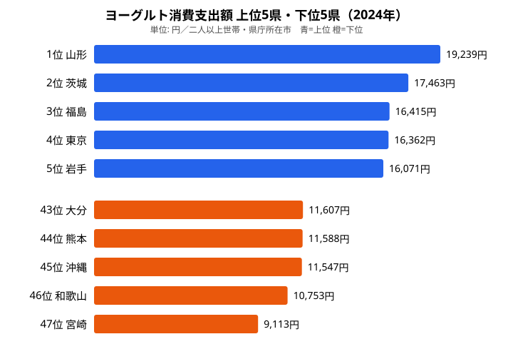

「同じヨーグルトでも、住む県で年間支出が2倍以上違う」——そんな差が2024年の家計調査には現れています。ヨーグルト消費支出額（都道府県庁所在市・二人以上世帯の年間支出金額）のランキングを見ると、首位は[山形県](https://stats47.jp/areas/06000)の19,239円です。これに対して最下位の[宮崎県](https://stats47.jp/areas/45000)は9,113円で、その差は10,126円、倍率にして約2.11倍に達します。

そして驚きは「健康志向の東西差」という単純な構図ではない点にあります。上位を見ると、1位山形・2位茨城・3位福島・5位岩手と東北・北関東が並び、4位には東京、6位には徳島が割って入ります。下位は宮崎・和歌山・沖縄と南国・西日本に集まっています。「西で少なく、東北・関東で多い」——南北・東西の両方が効いた偏りです。この記事では、その偏りがどこまで鮮明か、なぜ北で多く南で少ないのかを[経済・家計カテゴリ](https://stats47.jp/category/economy)のデータとともに読み解きます。

> [!NOTE]
> 本データは総務省「家計調査」をもとにした、二人以上の世帯における都道府県庁所在市の1世帯あたりヨーグルト年間消費支出金額（円、2024年）です。県庁所在市の数値であり、県全体の平均とは厳密には一致しない点にご注意ください。

## ヨーグルト支出 上位・下位の全体像

首位の[山形県](https://stats47.jp/areas/06000)は19,239円で、2位の茨城県（17,463円）を約1,800円引き離して突出しています。続く3位福島県（16,415円）、5位岩手県（16,071円）と東北勢が上位に並ぶ一方、4位には東京都（16,362円）、6位には徳島県（16,031円）が食い込み、純粋な「東北独占」ではありません。7位以下も愛知県（16,012円）・富山県（15,548円）・埼玉県（15,488円）・千葉県（15,370円）と東日本・北陸が続き、上位10県のボーダーとなる千葉県でも15,370円と高水準です。全体として上位は「東北・北関東・首都圏を中心とした東日本」に偏っています。

最下位は[宮崎県](https://stats47.jp/areas/45000)の9,113円で、47県の中で唯一1万円を下回っています。46位の和歌山県（10,753円）、45位の沖縄県（11,547円）、44位の熊本県（11,588円）、43位の大分県（11,607円）と、下位には九州・南国・紀伊半島といった南西の県が集中しており、上位の「東日本集中」とちょうど裏返しの構図になっています。

上位と下位の差を数字で確認すると、1位山形（19,239円）と47位宮崎（9,113円）の開きは実に10,126円です。年間ベースでこれほどの差があると、月に換算して約840円の違いになります。ヨーグルトを毎日食べる習慣が県によってこれほど異なるという事実は、食文化や生活習慣の地域差を如実に示しています。

<source-link href="/ranking/yogurt-consumption-expenditure">ヨーグルト消費支出額ランキングの全順位を見る</source-link>

## 下位グループは南国・西日本に偏る

最下位グループの特徴をさらに詳しく見てみましょう。最下位の宮崎県（9,113円）は首位山形県（19,239円）の約47%の水準にとどまります。46位の[和歌山県](https://stats47.jp/areas/30000)（10,753円）と45位の沖縄県（11,547円）を加えた3県は、いずれも温暖な気候で知られる県です。44位熊本県（11,588円）・43位大分県（11,607円）まで含めると、下位5県のうち4県が九州・南国・紀伊半島に位置していることがわかります。

この地理的な偏りは偶然ではないと考えられます。九州・南国では温暖な気候が食材の多様性を広げ、乳製品に依存しない伝統的な食文化が根付いている可能性があります。例えば、宮崎県や熊本県では地元産の農産物・畜産物が豊富で、食卓のバリエーションが東北とは異なる方向に発達してきた背景があります。また、南国では発酵食品として乳製品よりも漬物・味噌・醤油など植物性発酵食品の存在感が大きい傾向が見られ、ヨーグルトの日常的な位置づけが異なる可能性もあります。

> [!TIP]
> 上位・下位を並べて見ると、単純な「東 vs 西」よりも「東北・関東で高く、九州・南国で低い」と読むのが正確です。東京都が4位に入る一方、関西の大都市圏よりさらに南の県が下位に沈んでいます。徳島県（6位、16,031円）のように西日本でも高い県があることも興味深い点です。

<source-link href="/ranking/yogurt-consumption-expenditure">ヨーグルト消費支出額の下位県を詳しく見る</source-link>

## なぜ北で多く南で少ないのか

東北・関東が上位を占め、九州・南国が下位に沈む背景には、いくつかの要因が考えられます。

まず、**乳製品文化との重なり**です。東北・北関東は牛乳・乳酸菌飲料など乳製品全般の消費が多い地域として知られており、ヨーグルトもその延長上に位置づくと考えられます。上位に山形・茨城・福島・岩手が並ぶのは、この地域的な乳製品消費の厚さと整合しています。東北では農村部での自家製乳製品の伝統や、酪農業が盛んな地域との文化的な近接性が、乳製品を日常的に摂取する習慣の下地を作っていると推測されます。特に山形県が全国1位を独走しているのは、こうした食文化の積み重ねが反映されているといえるでしょう。

> [!WARNING]
> ただし「健康志向が高いから北で多い」と断定するのは早計です。家計調査の「支出額」は購入量と価格の両方を含むため、店頭価格や物流コストの地域差も数値に乗ります。「どれだけ買ったか」と「いくらで買ったか」が分離できない点に注意が必要です。価格差が存在する場合、同じ量を消費していても支出額の順位は変わりえます。

もう一つの視点は**世帯構成と気候**です。東北は三世代同居・高齢者世帯の比率が比較的高く、朝食や日常的な乳製品消費が多い可能性があります。高齢化が進む地域では健康意識の高まりとともにヨーグルト消費が増加する傾向があり、東北の高齢者比率の高さがランキング上位を後押ししているかもしれません。一方、最下位の宮崎をはじめ下位に並ぶ九州・南国の県では、温暖な気候や食文化の違いがヨーグルト購入に影響している可能性があります。

**[仮説]** 東北が上位・九州南部が下位に集まる構造は、乳製品消費文化・世帯構成・気候の3要因が複合的に作用した結果である可能性が高いです。この仮説を検証するには、世帯人員・年齢別のヨーグルト支出データや、牛乳・乳酸菌飲料など他の乳製品支出とのクロス集計が必要です。

## まとめ

- ヨーグルト消費支出額の1位は**山形の19,239円**（2024年、二人以上世帯・県庁所在市）。
- 最下位は**宮崎の9,113円**で、首位との差は10,126円、**約2.1倍の開き**。
- 上位は**山形・茨城・福島・東京・岩手**と、東北・北関東・首都圏を中心とした**東日本に集中**。
- 下位は**宮崎・和歌山・沖縄・熊本・大分**と、**九州・南国・西日本に集中**。
- 「健康志向の東西差」というより、乳製品文化・気候・世帯構成が重なった**「北で多く南で少ない」**構図と読むのが正確です。

## データ出典

本記事のランキングは総務省「家計調査」（2024年）をもとに、e-Stat経由で取得・整備したものです。数値は二人以上の世帯における都道府県庁所在市の1世帯あたり年間消費支出金額です。
