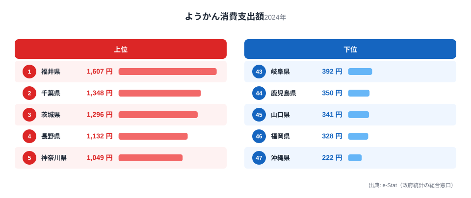
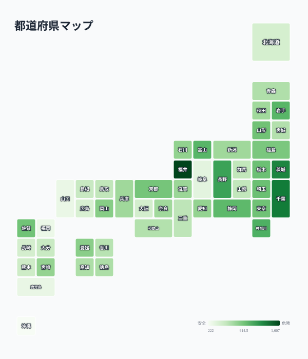

一世帯あたりのようかん（羊羹）の年間消費支出額には、都道府県で大きな差があります。総務省「家計調査」の2024年データによると、全国1位は福井県の1,607円、最下位は沖縄県の222円で、その差は7.2倍にのぼります。

ようかんは小豆と砂糖、寒天を練り上げた保存性の高い和菓子で、贈答品やお茶請けとして古くから親しまれてきました。今回のデータを見ると、単に「甘いものが好きな県」が上位に来ているわけではなく、関東・北陸・信州といった特定の地域に支出が集中する一方、西日本の多くの県が下位に沈むという、はっきりした地理的な偏りが見えてきます。この記事では、その分布の背景を探ります。

> [!NOTE]
> 本データは総務省「家計調査」の品目別支出額（二人以上の世帯、年間換算）です。ようかんは調査上「他の和生菓子」等とは別区分で集計されており、単価の高い贈答用商品の購入も含まれます。世帯人数や購入頻度の違いが支出額に影響するため、消費「量」ではなく支出「額」の指標である点に注意してください。

## 上位と下位

<source-link href="/ranking/yokan-consumption-expenditure">ようかん消費支出額ランキングをもっと見る</source-link>

上位5県は福井県1,607円、千葉県1,348円、茨城県1,296円、長野県1,132円、神奈川県1,049円です。1位の福井県は2位の千葉県と比べても約260円の差をつけており、突出した支出額になっています。

福井県が1位である背景には、隣接する石川県（18位、797円）や富山県（7位、1,010円）を含む北陸地方全体で、伝統的な和菓子文化が生活に根づいていることが挙げられます。北陸は冬場の積雪が長く、保存性に優れた和菓子や乾物を贈答・仏事用に備える習慣が根強い地域です。ようかんは常温で長期保存できるため、法事や来客の手土産として重宝されてきました。[福井県の地域データ](/areas/18000)を見ると、こうした伝統的な消費行動の傾向が他の指標にも表れています。

長野県（4位、1,132円）や山形県（12位、923円）といった内陸の県が上位に食い込んでいる点も見逃せません。これらの県は寒冷な気候と農産物（小豆・栗など）の産地であることが共通しており、地元産の材料を使った和菓子文化が根強く残っていると考えられます。一方で首都圏の千葉県・茨城県・神奈川県・埼玉県（9位、942円）も軒並り上位に入っており、人口の多い都市近郊圏では贈答用・来客用の需要が下支えしている可能性があります。

> [!WARNING]
> 家計調査は都道府県庁所在市および政令指定都市の家計を中心にサンプリングされており、県内の地域差までは反映されません。「福井県が1位」というのは県全体の平均的な傾向であり、県内のすべての地域が同じ水準とは限らない点に留意してください。

## 最下位グループの構造

下位5県は福岡県328円、沖縄県222円に加え、山口県341円、鹿児島県350円、岐阜県392円と続きます。西日本、特に九州・中国地方の県が集中しているのが特徴です。

沖縄県が最下位となっているのは、地理的にようかんの主要産地（北陸・信州など）から距離があることに加え、沖縄には黒糖菓子や紅芋タルトなど独自の菓子文化が根づいており、そちらの需要がようかんの代わりを担っている可能性があります。大阪府（39位、498円）や広島県（42位、470円）といった西日本の大都市圏も軒並み下位に沈んでおり、単純な人口規模や都市化の度合いでは説明がつきません。

福岡県が46位という結果も注目に値します。九州は明治期以降に独自の菓子文化（博多の「鶴乃子」や熊本の「いきなり団子」など）が発展した地域で、ようかんが贈答品の第一選択にはなりにくい土地柄だと考えられます。九州・沖縄地方全体で見ても、佐賀県の920円（13位）を除けば、熊本県527円（38位）、大分県550円（37位）、鹿児島県350円（44位）と、上位に入る県がほとんどありません。[沖縄県の地域データ](/areas/47000)では、他の菓子類の消費傾向も本州と異なる特徴が見られます。

## 発見：西高東低ではなく「北陸・信州＋首都圏」対「西日本」

47都道府県マップで支出額の分布を見ると、単純な東西格差ではなく、より複雑な地域構造が浮かび上がります。

<source-link href="/ranking/yokan-consumption-expenditure">ようかん消費支出額の全47都道府県を見る</source-link>

地図で濃い色（支出額が高い）に塗られているのは、福井・千葉・茨城・長野・神奈川・岩手・富山・静岡・埼玉・栃木の上位10県です。これらは北陸・信州・首都圏近郊・東北の一部に分散しており、必ずしも地理的に隣接しているわけではありません。共通するのは、いずれも伝統的な和菓子文化を持つ産地が近い（あるいは首都圏の消費力が高い）という点です。

対照的に薄い色（支出額が低い）の地域は、九州全域、中国地方の広島・山口、四国の一部、そして北海道・沖縄という「本州の主要和菓子産地から遠い」地域に集中しています。北海道が41位（484円）と低いのは意外に思えるかもしれませんが、北海道は「白い恋人」に代表される洋菓子文化が強く、和菓子の中でもようかんへの支出は相対的に小さいと見られます。[仮説] この分布は各地域の代表的な和菓子・銘菓の違い（北陸=ようかん、九州=別の郷土菓子）を反映している可能性がありますが、品目別の詳細な消費動向データによる検証が必要です。

> [!TIP]
> ようかんのような贈答性の高い和菓子は、地域の「お茶請け文化」や冠婚葬祭の慣習と結びついています。他の和菓子・洋菓子の消費支出ランキングと比較すると、その県がどのような菓子文化を持つかがより立体的に見えてきます。

## まとめ

- **全国1位**は福井県で年間1,607円、**最下位**は沖縄県で222円、その差は**7.2倍**
- 上位5県は福井・千葉・茨城・長野・神奈川で、**北陸・信州と首都圏近郊**に支出が集中
- 下位グループは福岡・沖縄・山口・鹿児島・岐阜で、**九州・中国地方**に偏る
- 佐賀県は13位（920円）で、突出した1位ではなく中位上位にとどまる
- 支出額の地理分布は、各地域の伝統的な和菓子文化・気候・産地との結びつきを反映していると考えられる

他の食品・家計消費の地域差については[家計調査カテゴリ](/category/economy)で一覧できます。

## データ出典

総務省統計局「家計調査」（二人以上の世帯）品目別支出額データ（2024年）をもとに、e-Stat（政府統計の総合窓口）経由で集計しました。
