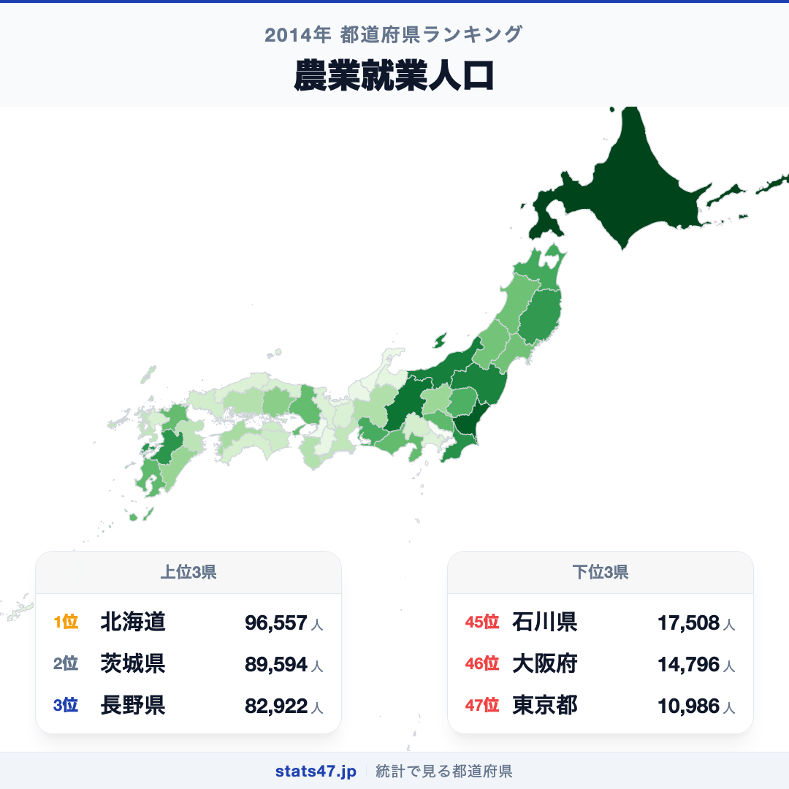
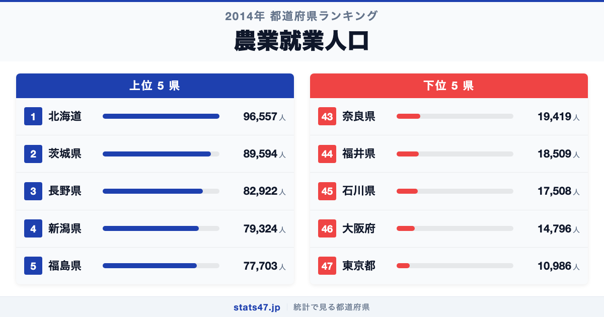
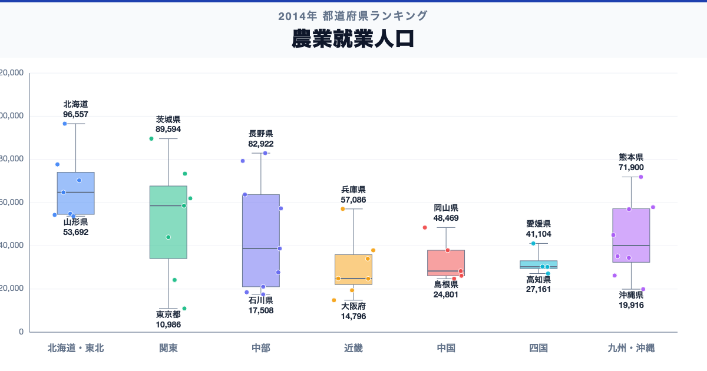

北海道が全国1位、東京都が47位。農業就業人口には、同じ日本の中でも8.8倍の開きがあります。

首位の北海道は96,557人で偏差値73.9、最下位の東京都は10,986人で偏差値34.5です。なぜこれほど差があるのでしょうか。

「農業就業人口」は、主として農業に従事する人の数を示す総数指標です。2014年の値であり、担い手の高齢化や定義変更を含む現在の状況は最新統計で確認します。

## データハイライト

全国平均: 44,609.83人

1位: 北海道　96,557人 / 偏差値 73.9

47位: 東京都　10,986人 / 偏差値 34.5

上位5県と下位5県の間には明確な開きがあります。一方、順位が近い県では値の差が小さい場合もあるため、一つの順位差を地域の優劣として扱わないことが大切です。

## 【コロプレス地図】日本全国の分布

<!-- note投稿時: この画像行を削除し、images/choropleth-map-1080x1080.png をアップロード -->

地域中央値が最も高いのは北海道で96,557人、最も低いのは近畿で24,860人です。県別の順位だけでなく、まとまりとして見ると分布の偏りを捉えやすくなります。

ただし、地域内にもばらつきがあります。人口規模、農業地域の広がり、農業経営の構造が人数に表れます。人数が少なくても大規模化や機械化で高い生産を行う地域があり、生産力とは一致しません。地図の色を原因の地図とみなさず、観測された分布として読みます。

## 上位5：分析

<!-- note投稿時: この画像行を削除し、images/chart-x-1200x630.png をアップロード -->

全国首位の北海道は1位で、96,557人、偏差値は73.9です。全国平均を51,947.17人上回ります。人口規模、農業地域の広がり、農業経営の構造が人数に表れます。この順位だけで原因を決めず、基幹的農業従事者、年齢構成、農業経営体数、耕地面積、農業産出額、最新年値を確認すると背景を分解できます。

続く茨城県は2位で、89,594人、偏差値は70.7です。全国平均を44,984.17人上回ります。関東に位置し、同じ地域内の県と比べる視点も必要です。この順位だけで原因を決めず、基幹的農業従事者、年齢構成、農業経営体数、耕地面積、農業産出額、最新年値を確認すると背景を分解できます。

上位に入った長野県は3位で、82,922人、偏差値は67.6です。全国平均を38,312.17人上回ります。中部に位置し、同じ地域内の県と比べる視点も必要です。この順位だけで原因を決めず、基幹的農業従事者、年齢構成、農業経営体数、耕地面積、農業産出額、最新年値を確認すると背景を分解できます。

4番手の新潟県は4位で、79,324人、偏差値は66.0です。全国平均を34,714.17人上回ります。中部に位置し、同じ地域内の県と比べる視点も必要です。この順位だけで原因を決めず、基幹的農業従事者、年齢構成、農業経営体数、耕地面積、農業産出額、最新年値を確認すると背景を分解できます。

上位5県を締める福島県は5位で、77,703人、偏差値は65.2です。全国平均を33,093.17人上回ります。東北に位置し、同じ地域内の県と比べる視点も必要です。この順位だけで原因を決めず、基幹的農業従事者、年齢構成、農業経営体数、耕地面積、農業産出額、最新年値を確認すると背景を分解できます。

## 下位5：分析

下位側を見ると、奈良県は43位で、19,419人、偏差値は38.4です。全国平均を25,190.83人下回ります。近畿の中でも、この県の位置を周辺県と見比べることが次の手がかりです。2014年の値であり、担い手の高齢化や定義変更を含む現在の状況は最新統計で確認します。

次に福井県は44位で、18,509人、偏差値は38.0です。全国平均を26,100.83人下回ります。中部の中でも、この県の位置を周辺県と見比べることが次の手がかりです。2014年の値であり、担い手の高齢化や定義変更を含む現在の状況は最新統計で確認します。

45位の石川県は45位で、17,508人、偏差値は37.5です。全国平均を27,101.83人下回ります。中部の中でも、この県の位置を周辺県と見比べることが次の手がかりです。2014年の値であり、担い手の高齢化や定義変更を含む現在の状況は最新統計で確認します。

46位の大阪府は46位で、14,796人、偏差値は36.3です。全国平均を29,813.83人下回ります。近畿の中でも、この県の位置を周辺県と見比べることが次の手がかりです。2014年の値であり、担い手の高齢化や定義変更を含む現在の状況は最新統計で確認します。

最下位の東京都は47位で、10,986人、偏差値は34.5です。全国平均を33,623.83人下回ります。人数が少なくても大規模化や機械化で高い生産を行う地域があり、生産力とは一致しません。2014年の値であり、担い手の高齢化や定義変更を含む現在の状況は最新統計で確認します。

## あなたの県は何位？

ここまで上位・下位の10県を見てきましたが、残る37県の順位も気になるはずです。全47都道府県の順位は、色分け地図と並べ替え可能なグラフ付きでstats47から確認できます。

### 農業就業人口ランキング 全47都道府県版

https://stats47.jp/ranking/agricultural-employment-population

## 地域別の傾向

<!-- note投稿時: この画像行を削除し、images/boxplot-1200x630.png をアップロード -->

箱ひげ図では、北海道の中央値が高く、近畿が低い配置です。ただし、箱の重なりや外れた県も確認し、地域名だけで各県の値を決めつけないようにします。

## このランキングを正しく読む3つの視点

**総数と比率を混同しない**

人口規模、農業地域の広がり、農業経営の構造が人数に表れます。人数が少なくても大規模化や機械化で高い生産を行う地域があり、生産力とは一致しません。

**順位だけで原因を決めない**

このデータから直接分かるのは、2014年の47都道府県の値と順位です。背景を確かめるには、基幹的農業従事者、年齢構成、農業経営体数、耕地面積、農業産出額、最新年値が必要です。

**対象年と定義を確認する**

2014年の値であり、担い手の高齢化や定義変更を含む現在の状況は最新統計で確認します。別年や別調査と比べるときは、対象となる世帯・人・施設と単位をそろえます。

## まとめ

農業就業人口の地域差は、単純な県の優劣ではなく、指標の対象と地域条件の違いを映しています。

**首位と最下位には8.8倍の開き**

北海道の96,557人に対し、東京都は10,986人でした。まずは差の大きさを事実として押さえます。

**地域のまとまりと県内差は両方見る**

地域中央値には違いがありますが、同じ地域のすべての県が同じ傾向とは限りません。地図と全47県の順位を併用すると例外も見つけられます。

**次のデータで理由を分解する**

基幹的農業従事者、年齢構成、農業経営体数、耕地面積、農業産出額、最新年値を重ねれば、総数・割合・価格・人口構成など、順位を動かす要素を切り分けられます。

## もっと詳しく知りたい方へ

全47都道府県の順位や、グラフ・地図での可視化はstats47で確認できます。

### 農業就業人口ランキング 全都道府県版

https://stats47.jp/ranking/agricultural-employment-population

### 不慮の事故による死亡者数

https://stats47.jp/ranking/accidental-deaths-per-100k

### 年齢別死亡率

https://stats47.jp/ranking/age-specific-death-rate-0-4-per-1000

### 平均初婚年齢（夫）

https://stats47.jp/ranking/average-age-of-first-marriage-husband

---

**stats47** は、e-Statなどの公的統計データを47都道府県別に可視化するサービスです。ランキング・散布図・時系列チャートで、地域の違いがひと目で分かります。

https://stats47.jp
