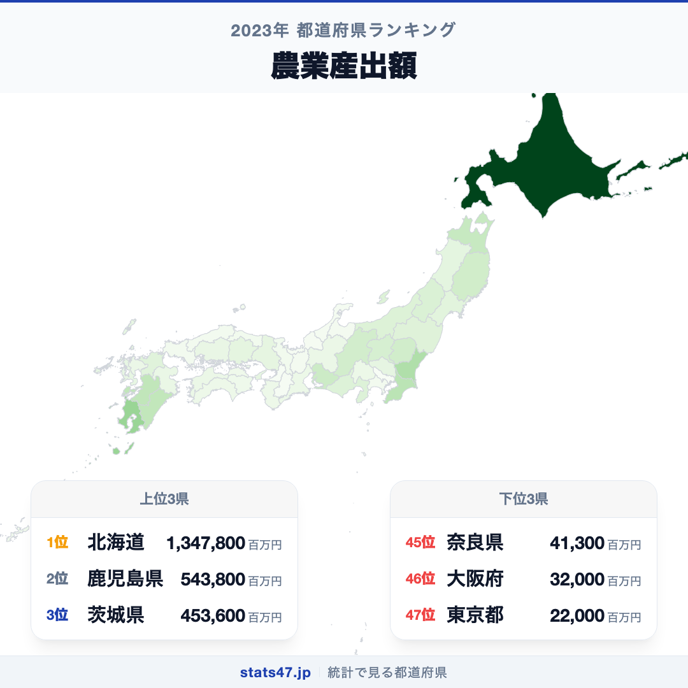
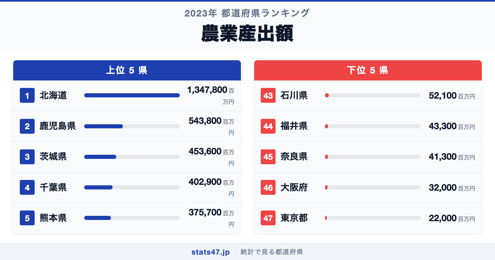
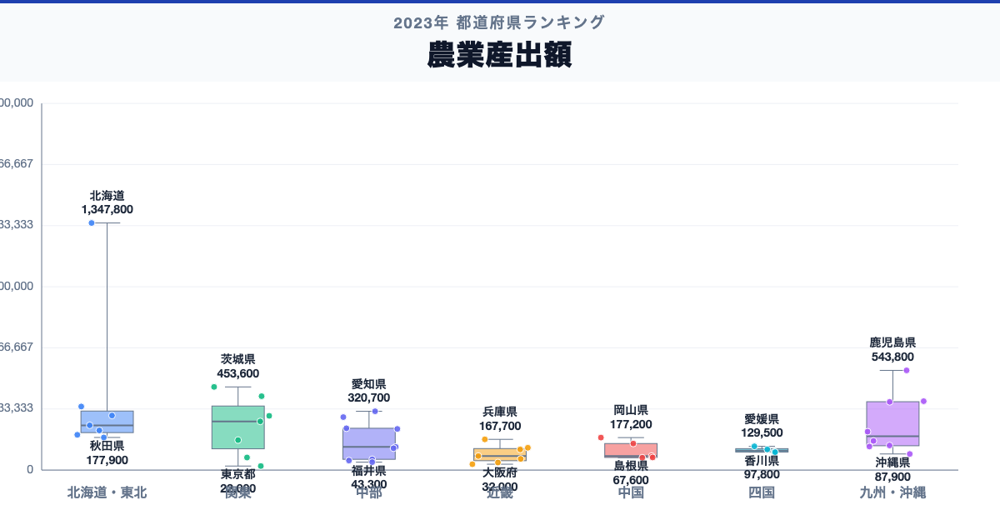

北海道が全国1位、東京都が47位。農業産出額には、同じ日本の中でも61.3倍の開きがあります。

首位の北海道は1,347,800百万円で偏差値105.3、最下位の東京都は22,000百万円で偏差値41.2です。なぜこれほど差があるのでしょうか。

「農業産出額」は、農業産出額は、都道府県内で生産された農産物の生産量に農家庭先価格を掛けて評価した金額です。価格変動でも産出額は動くため、生産量の増減と金額の増減を分けて確認します。

## データハイライト

全国平均: 203,282.98百万円

1位: 北海道　1,347,800百万円 / 偏差値 105.3

47位: 東京都　22,000百万円 / 偏差値 41.2

上位5県と下位5県の間には明確な開きがあります。一方、順位が近い県では値の差が小さい場合もあるため、一つの順位差を地域の優劣として扱わないことが大切です。

## 【コロプレス地図】日本全国の分布

<!-- note投稿時: この画像行を削除し、images/choropleth-map-1080x1080.png をアップロード -->

地域中央値が最も高いのは北海道で1,347,800百万円、最も低いのは近畿で76,600百万円です。県別の順位だけでなく、まとまりとして見ると分布の偏りを捉えやすくなります。

ただし、地域内にもばらつきがあります。耕地規模だけでなく、畜産、野菜、果実など品目構成と価格が総額に表れます。都市部でも高付加価値の農業は存在するため、総額の小ささを農業の価値の低さとはみなしません。地図の色を原因の地図とみなさず、観測された分布として読みます。

## 上位5：分析

<!-- note投稿時: この画像行を削除し、images/chart-x-1200x630.png をアップロード -->

全国首位の北海道は1位で、1,347,800百万円、偏差値は105.3です。全国平均を1,144,517.02百万円上回ります。耕地規模だけでなく、畜産、野菜、果実など品目構成と価格が総額に表れます。この順位だけで原因を決めず、品目別産出額、耕地面積、農業経営体数、生産量、農業所得、価格指数を確認すると背景を分解できます。

続く鹿児島県は2位で、543,800百万円、偏差値は66.4です。全国平均を340,517.02百万円上回ります。九州・沖縄に位置し、同じ地域内の県と比べる視点も必要です。この順位だけで原因を決めず、品目別産出額、耕地面積、農業経営体数、生産量、農業所得、価格指数を確認すると背景を分解できます。

上位に入った茨城県は3位で、453,600百万円、偏差値は62.1です。全国平均を250,317.02百万円上回ります。関東に位置し、同じ地域内の県と比べる視点も必要です。この順位だけで原因を決めず、品目別産出額、耕地面積、農業経営体数、生産量、農業所得、価格指数を確認すると背景を分解できます。

4番手の千葉県は4位で、402,900百万円、偏差値は59.6です。全国平均を199,617.02百万円上回ります。関東に位置し、同じ地域内の県と比べる視点も必要です。この順位だけで原因を決めず、品目別産出額、耕地面積、農業経営体数、生産量、農業所得、価格指数を確認すると背景を分解できます。

上位5県を締める熊本県は5位で、375,700百万円、偏差値は58.3です。全国平均を172,417.02百万円上回ります。九州・沖縄に位置し、同じ地域内の県と比べる視点も必要です。この順位だけで原因を決めず、品目別産出額、耕地面積、農業経営体数、生産量、農業所得、価格指数を確認すると背景を分解できます。

## 下位5：分析

下位側を見ると、石川県は43位で、52,100百万円、偏差値は42.7です。全国平均を151,182.98百万円下回ります。中部の中でも、この県の位置を周辺県と見比べることが次の手がかりです。価格変動でも産出額は動くため、生産量の増減と金額の増減を分けて確認します。

次に福井県は44位で、43,300百万円、偏差値は42.3です。全国平均を159,982.98百万円下回ります。中部の中でも、この県の位置を周辺県と見比べることが次の手がかりです。価格変動でも産出額は動くため、生産量の増減と金額の増減を分けて確認します。

45位の奈良県は45位で、41,300百万円、偏差値は42.2です。全国平均を161,982.98百万円下回ります。近畿の中でも、この県の位置を周辺県と見比べることが次の手がかりです。価格変動でも産出額は動くため、生産量の増減と金額の増減を分けて確認します。

46位の大阪府は46位で、32,000百万円、偏差値は41.7です。全国平均を171,282.98百万円下回ります。近畿の中でも、この県の位置を周辺県と見比べることが次の手がかりです。価格変動でも産出額は動くため、生産量の増減と金額の増減を分けて確認します。

最下位の東京都は47位で、22,000百万円、偏差値は41.2です。全国平均を181,282.98百万円下回ります。都市部でも高付加価値の農業は存在するため、総額の小ささを農業の価値の低さとはみなしません。価格変動でも産出額は動くため、生産量の増減と金額の増減を分けて確認します。

## あなたの県は何位？

ここまで上位・下位の10県を見てきましたが、残る37県の順位も気になるはずです。全47都道府県の順位は、色分け地図と並べ替え可能なグラフ付きでstats47から確認できます。

### 農業産出額ランキング 全47都道府県版

https://stats47.jp/ranking/agricultural-output

## 地域別の傾向

<!-- note投稿時: この画像行を削除し、images/boxplot-1200x630.png をアップロード -->

箱ひげ図では、北海道の中央値が高く、近畿が低い配置です。ただし、箱の重なりや外れた県も確認し、地域名だけで各県の値を決めつけないようにします。

## このランキングを正しく読む3つの視点

**総数と比率を混同しない**

耕地規模だけでなく、畜産、野菜、果実など品目構成と価格が総額に表れます。都市部でも高付加価値の農業は存在するため、総額の小ささを農業の価値の低さとはみなしません。

**順位だけで原因を決めない**

このデータから直接分かるのは、2023年の47都道府県の値と順位です。背景を確かめるには、品目別産出額、耕地面積、農業経営体数、生産量、農業所得、価格指数が必要です。

**対象年と定義を確認する**

価格変動でも産出額は動くため、生産量の増減と金額の増減を分けて確認します。別年や別調査と比べるときは、対象となる世帯・人・施設と単位をそろえます。

## まとめ

農業産出額の地域差は、単純な県の優劣ではなく、指標の対象と地域条件の違いを映しています。

**首位と最下位には61.3倍の開き**

北海道の1,347,800百万円に対し、東京都は22,000百万円でした。まずは差の大きさを事実として押さえます。

**地域のまとまりと県内差は両方見る**

地域中央値には違いがありますが、同じ地域のすべての県が同じ傾向とは限りません。地図と全47県の順位を併用すると例外も見つけられます。

**次のデータで理由を分解する**

品目別産出額、耕地面積、農業経営体数、生産量、農業所得、価格指数を重ねれば、総数・割合・価格・人口構成など、順位を動かす要素を切り分けられます。

## もっと詳しく知りたい方へ

全47都道府県の順位や、グラフ・地図での可視化はstats47で確認できます。

### 農業産出額ランキング 全都道府県版

https://stats47.jp/ranking/agricultural-output

### 耕地放棄面積

https://stats47.jp/ranking/abandoned-cultivated-land-area

### 農家数

https://stats47.jp/ranking/agricultural-farm-count

### 農業所得割合

https://stats47.jp/ranking/agricultural-income-ratio

### 農業産出額の流れをサンキー｜分類軸を Claude Code に提案させる（stats47ブログ）

https://stats47.jp/blog/cc-estat-13-agri-sankey

---

**stats47** は、e-Statなどの公的統計データを47都道府県別に可視化するサービスです。ランキング・散布図・時系列チャートで、地域の違いがひと目で分かります。

https://stats47.jp
