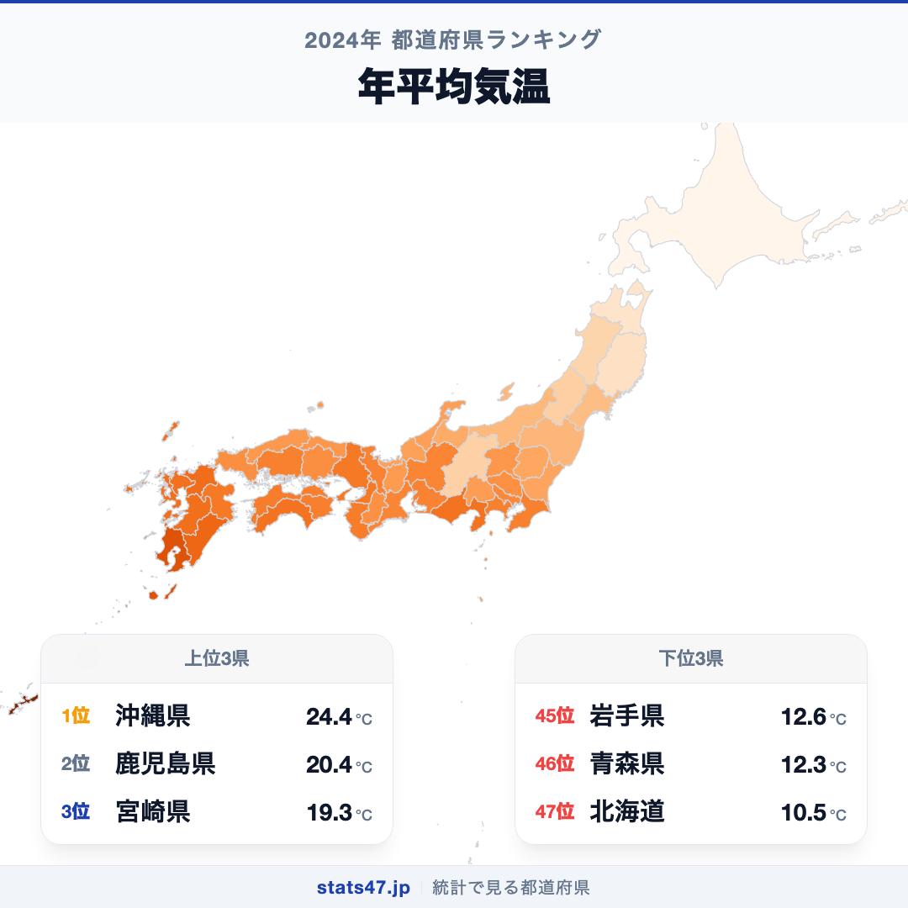
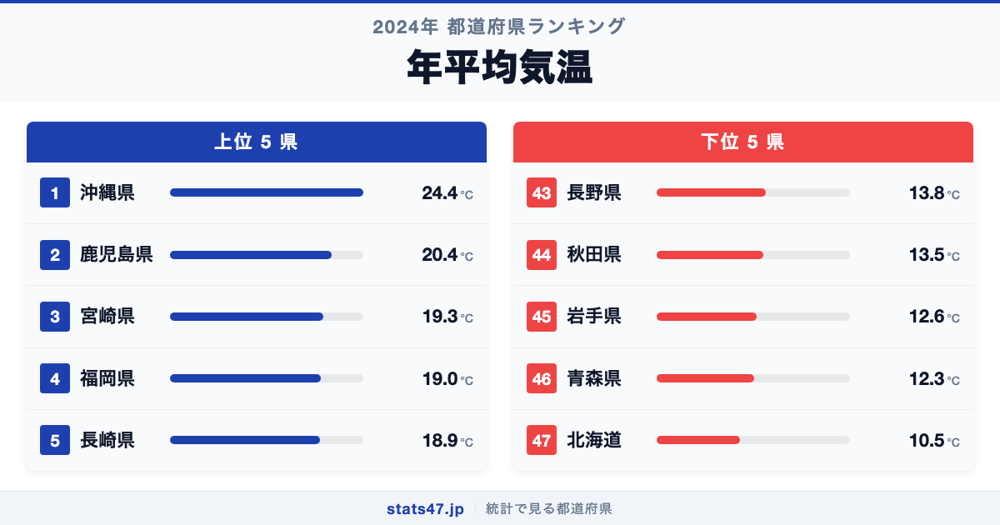
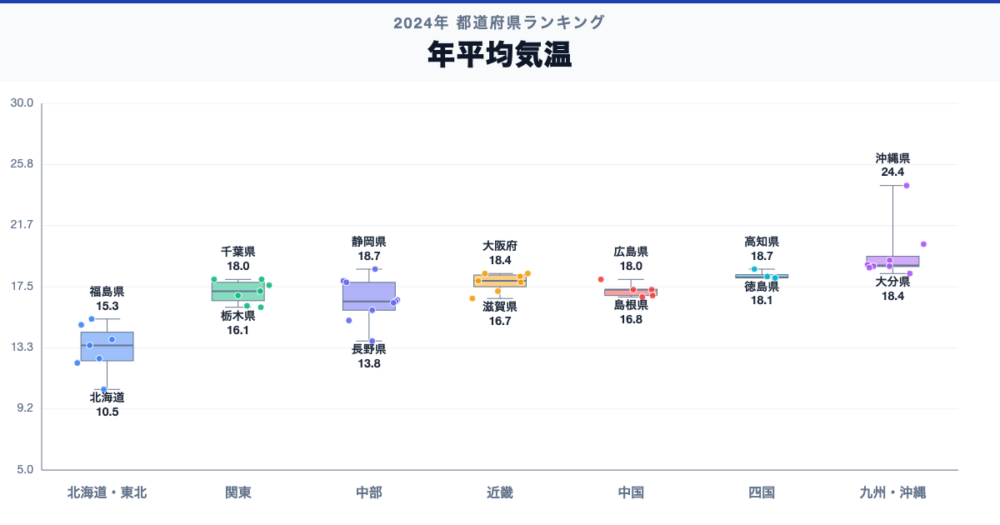

沖縄県が全国1位、北海道が47位。年平均気温には、同じ日本の中でも2.3倍の開きがあります。

首位の沖縄県は24.4℃で偏差値82.4、最下位の北海道は10.5℃で偏差値20.7です。なぜこれほど差があるのでしょうか。

「年平均気温」は、各地点で観測した日々の気温を年単位で平均した値です。1年の値を長期的な気候そのものとせず、平年値や複数年の推移と比較します。

## データハイライト

全国平均: 17.1℃

1位: 沖縄県　24.4℃ / 偏差値 82.4

47位: 北海道　10.5℃ / 偏差値 20.7

上位5県と下位5県の間には明確な開きがあります。一方、順位が近い県では値の差が小さい場合もあるため、一つの順位差を地域の優劣として扱わないことが大切です。

## 【コロプレス地図】日本全国の分布

<!-- note投稿時: この画像行を削除し、images/choropleth-map-1080x1080.png をアップロード -->

地域中央値が最も高いのは九州・沖縄で18.95℃、最も低いのは北海道で10.5℃です。県別の順位だけでなく、まとまりとして見ると分布の偏りを捉えやすくなります。

ただし、地域内にもばらつきがあります。緯度、標高、海からの距離などの地理条件に加え、その年特有の天候が表れます。低い値は寒さの一面を示しますが、夏の暑さや降雪量、日較差までは分かりません。地図の色を原因の地図とみなさず、観測された分布として読みます。

## 上位5：分析

<!-- note投稿時: この画像行を削除し、images/chart-x-1200x630.png をアップロード -->

全国首位の沖縄県は1位で、24.4℃、偏差値は82.4です。全国平均を7.3℃上回ります。緯度、標高、海からの距離などの地理条件に加え、その年特有の天候が表れます。この順位だけで原因を決めず、平年値、月平均気温、最高・最低気温、標高、降雪量、猛暑日・真冬日を確認すると背景を分解できます。

続く鹿児島県は2位で、20.4℃、偏差値は64.6です。全国平均を3.3℃上回ります。九州・沖縄に位置し、同じ地域内の県と比べる視点も必要です。この順位だけで原因を決めず、平年値、月平均気温、最高・最低気温、標高、降雪量、猛暑日・真冬日を確認すると背景を分解できます。

上位に入った宮崎県は3位で、19.3℃、偏差値は59.7です。全国平均を2.2℃上回ります。九州・沖縄に位置し、同じ地域内の県と比べる視点も必要です。この順位だけで原因を決めず、平年値、月平均気温、最高・最低気温、標高、降雪量、猛暑日・真冬日を確認すると背景を分解できます。

4番手の福岡県は4位で、19℃、偏差値は58.4です。全国平均を1.9℃上回ります。九州・沖縄に位置し、同じ地域内の県と比べる視点も必要です。この順位だけで原因を決めず、平年値、月平均気温、最高・最低気温、標高、降雪量、猛暑日・真冬日を確認すると背景を分解できます。

上位5県を締める長崎県は5位で、18.9℃、偏差値は58.0です。全国平均を1.8℃上回ります。九州・沖縄に位置し、同じ地域内の県と比べる視点も必要です。この順位だけで原因を決めず、平年値、月平均気温、最高・最低気温、標高、降雪量、猛暑日・真冬日を確認すると背景を分解できます。

## 下位5：分析

下位側を見ると、長野県は43位で、13.8℃、偏差値は35.3です。全国平均を3.3℃下回ります。中部の中でも、この県の位置を周辺県と見比べることが次の手がかりです。1年の値を長期的な気候そのものとせず、平年値や複数年の推移と比較します。

次に秋田県は44位で、13.5℃、偏差値は34.0です。全国平均を3.6℃下回ります。東北の中でも、この県の位置を周辺県と見比べることが次の手がかりです。1年の値を長期的な気候そのものとせず、平年値や複数年の推移と比較します。

45位の岩手県は45位で、12.6℃、偏差値は30.0です。全国平均を4.5℃下回ります。東北の中でも、この県の位置を周辺県と見比べることが次の手がかりです。1年の値を長期的な気候そのものとせず、平年値や複数年の推移と比較します。

46位の青森県は46位で、12.3℃、偏差値は28.7です。全国平均を4.8℃下回ります。東北の中でも、この県の位置を周辺県と見比べることが次の手がかりです。1年の値を長期的な気候そのものとせず、平年値や複数年の推移と比較します。

最下位の北海道は47位で、10.5℃、偏差値は20.7です。全国平均を6.6℃下回ります。低い値は寒さの一面を示しますが、夏の暑さや降雪量、日較差までは分かりません。1年の値を長期的な気候そのものとせず、平年値や複数年の推移と比較します。

## あなたの県は何位？

ここまで上位・下位の10県を見てきましたが、残る37県の順位も気になるはずです。全47都道府県の順位は、色分け地図と並べ替え可能なグラフ付きでstats47から確認できます。

### 年平均気温ランキング 全47都道府県版

https://stats47.jp/ranking/average-temperature

## 地域別の傾向

<!-- note投稿時: この画像行を削除し、images/boxplot-1200x630.png をアップロード -->

箱ひげ図では、九州・沖縄の中央値が高く、北海道が低い配置です。ただし、箱の重なりや外れた県も確認し、地域名だけで各県の値を決めつけないようにします。

## このランキングを正しく読む3つの視点

**総数と比率を混同しない**

緯度、標高、海からの距離などの地理条件に加え、その年特有の天候が表れます。低い値は寒さの一面を示しますが、夏の暑さや降雪量、日較差までは分かりません。

**順位だけで原因を決めない**

このデータから直接分かるのは、2024年の47都道府県の値と順位です。背景を確かめるには、平年値、月平均気温、最高・最低気温、標高、降雪量、猛暑日・真冬日が必要です。

**対象年と定義を確認する**

1年の値を長期的な気候そのものとせず、平年値や複数年の推移と比較します。別年や別調査と比べるときは、対象となる世帯・人・施設と単位をそろえます。

## まとめ

年平均気温の地域差は、単純な県の優劣ではなく、指標の対象と地域条件の違いを映しています。

**首位と最下位には2.3倍の開き**

沖縄県の24.4℃に対し、北海道は10.5℃でした。まずは差の大きさを事実として押さえます。

**地域のまとまりと県内差は両方見る**

地域中央値には違いがありますが、同じ地域のすべての県が同じ傾向とは限りません。地図と全47県の順位を併用すると例外も見つけられます。

**次のデータで理由を分解する**

平年値、月平均気温、最高・最低気温、標高、降雪量、猛暑日・真冬日を重ねれば、総数・割合・価格・人口構成など、順位を動かす要素を切り分けられます。

## もっと詳しく知りたい方へ

全47都道府県の順位や、グラフ・地図での可視化はstats47で確認できます。

### 年平均気温ランキング 全都道府県版

https://stats47.jp/ranking/average-temperature

### 農地の転用面積

https://stats47.jp/ranking/agricultural-land-conversion-area

### 年間快晴日数

https://stats47.jp/ranking/annual-clear-days

### 年間曇天日数

https://stats47.jp/ranking/annual-cloudy-days

---

**stats47** は、e-Statなどの公的統計データを47都道府県別に可視化するサービスです。ランキング・散布図・時系列チャートで、地域の違いがひと目で分かります。

https://stats47.jp
