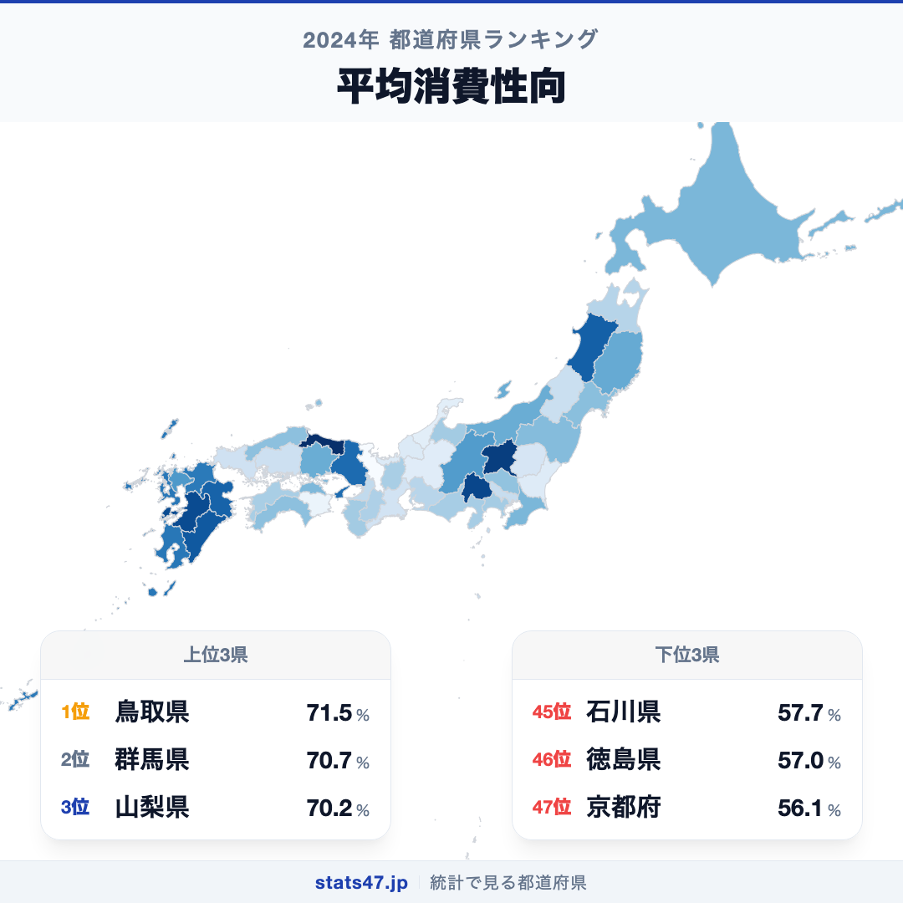
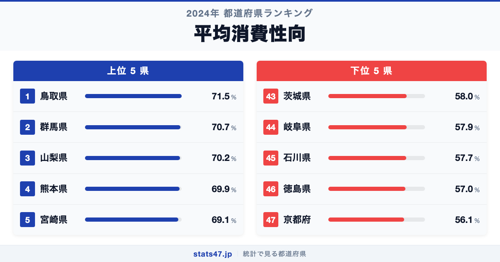
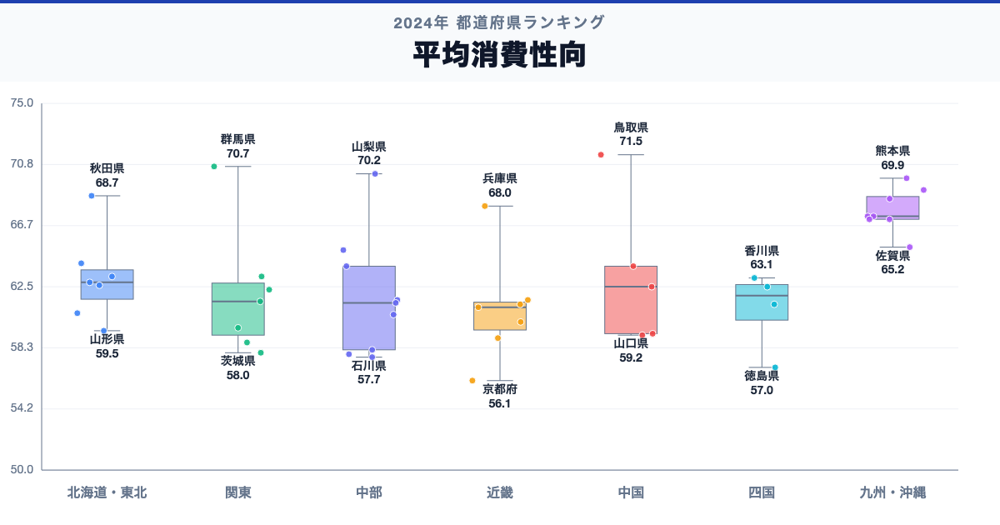

鳥取県が全国1位、京都府が47位。平均消費性向には、同じ日本の中でも1.3倍の開きがあります。

首位の鳥取県は71.5％で偏差値71.3、最下位の京都府は56.1％で偏差値32.7です。なぜこれほど差があるのでしょうか。

「平均消費性向」は、勤労者世帯の可処分所得に占める消費支出の割合です。分母の可処分所得と分子の消費支出の両方で値が動くため、比率だけで節約志向を判断しません。

## データハイライト

全国平均: 63％

1位: 鳥取県　71.5％ / 偏差値 71.3

47位: 京都府　56.1％ / 偏差値 32.7

上位5県と下位5県の間には明確な開きがあります。一方、順位が近い県では値の差が小さい場合もあるため、一つの順位差を地域の優劣として扱わないことが大切です。

## 【コロプレス地図】日本全国の分布

<!-- note投稿時: この画像行を削除し、images/choropleth-map-1080x1080.png をアップロード -->

地域中央値が最も高いのは九州・沖縄で67.3％、最も低いのは近畿で61.1％です。県別の順位だけでなく、まとまりとして見ると分布の偏りを捉えやすくなります。

ただし、地域内にもばらつきがあります。所得のうち消費に回った比率であり、支出額そのものの多さとは異なります。低い値は貯蓄余力だけでなく、税・社会保険、住宅購入、調査時点の支出変動にも注意が必要です。地図の色を原因の地図とみなさず、観測された分布として読みます。

## 上位5：分析

<!-- note投稿時: この画像行を削除し、images/chart-x-1200x630.png をアップロード -->

全国首位の鳥取県は1位で、71.5％、偏差値は71.3です。全国平均を8.5％上回ります。所得のうち消費に回った比率であり、支出額そのものの多さとは異なります。この順位だけで原因を決めず、可処分所得、消費支出、黒字率、貯蓄現在高、費目別支出、複数年平均を確認すると背景を分解できます。

続く群馬県は2位で、70.7％、偏差値は69.3です。全国平均を7.7％上回ります。関東に位置し、同じ地域内の県と比べる視点も必要です。この順位だけで原因を決めず、可処分所得、消費支出、黒字率、貯蓄現在高、費目別支出、複数年平均を確認すると背景を分解できます。

上位に入った山梨県は3位で、70.2％、偏差値は68.0です。全国平均を7.2％上回ります。中部に位置し、同じ地域内の県と比べる視点も必要です。この順位だけで原因を決めず、可処分所得、消費支出、黒字率、貯蓄現在高、費目別支出、複数年平均を確認すると背景を分解できます。

4番手の熊本県は4位で、69.9％、偏差値は67.3です。全国平均を6.9％上回ります。九州・沖縄に位置し、同じ地域内の県と比べる視点も必要です。この順位だけで原因を決めず、可処分所得、消費支出、黒字率、貯蓄現在高、費目別支出、複数年平均を確認すると背景を分解できます。

上位5県を締める宮崎県は5位で、69.1％、偏差値は65.3です。全国平均を6.1％上回ります。九州・沖縄に位置し、同じ地域内の県と比べる視点も必要です。この順位だけで原因を決めず、可処分所得、消費支出、黒字率、貯蓄現在高、費目別支出、複数年平均を確認すると背景を分解できます。

## 下位5：分析

下位側を見ると、茨城県は43位で、58％、偏差値は37.5です。全国平均を5％下回ります。関東の中でも、この県の位置を周辺県と見比べることが次の手がかりです。分母の可処分所得と分子の消費支出の両方で値が動くため、比率だけで節約志向を判断しません。

次に岐阜県は44位で、57.9％、偏差値は37.2です。全国平均を5.1％下回ります。中部の中でも、この県の位置を周辺県と見比べることが次の手がかりです。分母の可処分所得と分子の消費支出の両方で値が動くため、比率だけで節約志向を判断しません。

45位の石川県は45位で、57.7％、偏差値は36.7です。全国平均を5.3％下回ります。中部の中でも、この県の位置を周辺県と見比べることが次の手がかりです。分母の可処分所得と分子の消費支出の両方で値が動くため、比率だけで節約志向を判断しません。

46位の徳島県は46位で、57％、偏差値は35.0です。全国平均を6％下回ります。四国の中でも、この県の位置を周辺県と見比べることが次の手がかりです。分母の可処分所得と分子の消費支出の両方で値が動くため、比率だけで節約志向を判断しません。

最下位の京都府は47位で、56.1％、偏差値は32.7です。全国平均を6.9％下回ります。低い値は貯蓄余力だけでなく、税・社会保険、住宅購入、調査時点の支出変動にも注意が必要です。分母の可処分所得と分子の消費支出の両方で値が動くため、比率だけで節約志向を判断しません。

## あなたの県は何位？

ここまで上位・下位の10県を見てきましたが、残る37県の順位も気になるはずです。全47都道府県の順位は、色分け地図と並べ替え可能なグラフ付きでstats47から確認できます。

### 平均消費性向ランキング 全47都道府県版

https://stats47.jp/ranking/avg-propensity-to-consume-worker-households

## 地域別の傾向

<!-- note投稿時: この画像行を削除し、images/boxplot-1200x630.png をアップロード -->

箱ひげ図では、九州・沖縄の中央値が高く、近畿が低い配置です。ただし、箱の重なりや外れた県も確認し、地域名だけで各県の値を決めつけないようにします。

## このランキングを正しく読む3つの視点

**総数と比率を混同しない**

所得のうち消費に回った比率であり、支出額そのものの多さとは異なります。低い値は貯蓄余力だけでなく、税・社会保険、住宅購入、調査時点の支出変動にも注意が必要です。

**順位だけで原因を決めない**

このデータから直接分かるのは、2024年の47都道府県の値と順位です。背景を確かめるには、可処分所得、消費支出、黒字率、貯蓄現在高、費目別支出、複数年平均が必要です。

**対象年と定義を確認する**

分母の可処分所得と分子の消費支出の両方で値が動くため、比率だけで節約志向を判断しません。別年や別調査と比べるときは、対象となる世帯・人・施設と単位をそろえます。

## まとめ

平均消費性向の地域差は、単純な県の優劣ではなく、指標の対象と地域条件の違いを映しています。

**首位と最下位には1.3倍の開き**

鳥取県の71.5％に対し、京都府は56.1％でした。まずは差の大きさを事実として押さえます。

**地域のまとまりと県内差は両方見る**

地域中央値には違いがありますが、同じ地域のすべての県が同じ傾向とは限りません。地図と全47県の順位を併用すると例外も見つけられます。

**次のデータで理由を分解する**

可処分所得、消費支出、黒字率、貯蓄現在高、費目別支出、複数年平均を重ねれば、総数・割合・価格・人口構成など、順位を動かす要素を切り分けられます。

## もっと詳しく知りたい方へ

全47都道府県の順位や、グラフ・地図での可視化はstats47で確認できます。

### 平均消費性向ランキング 全都道府県版

https://stats47.jp/ranking/avg-propensity-to-consume-worker-households

### アクセサリー消費支出額

https://stats47.jp/ranking/accessories-consumption-expenditure

### 宿泊料消費支出額

https://stats47.jp/ranking/accommodation-consumption-expenditure

### 大人用サンダル消費支出額

https://stats47.jp/ranking/adult-sandals-consumption-expenditure

---

**stats47** は、e-Statなどの公的統計データを47都道府県別に可視化するサービスです。ランキング・散布図・時系列チャートで、地域の違いがひと目で分かります。

https://stats47.jp
