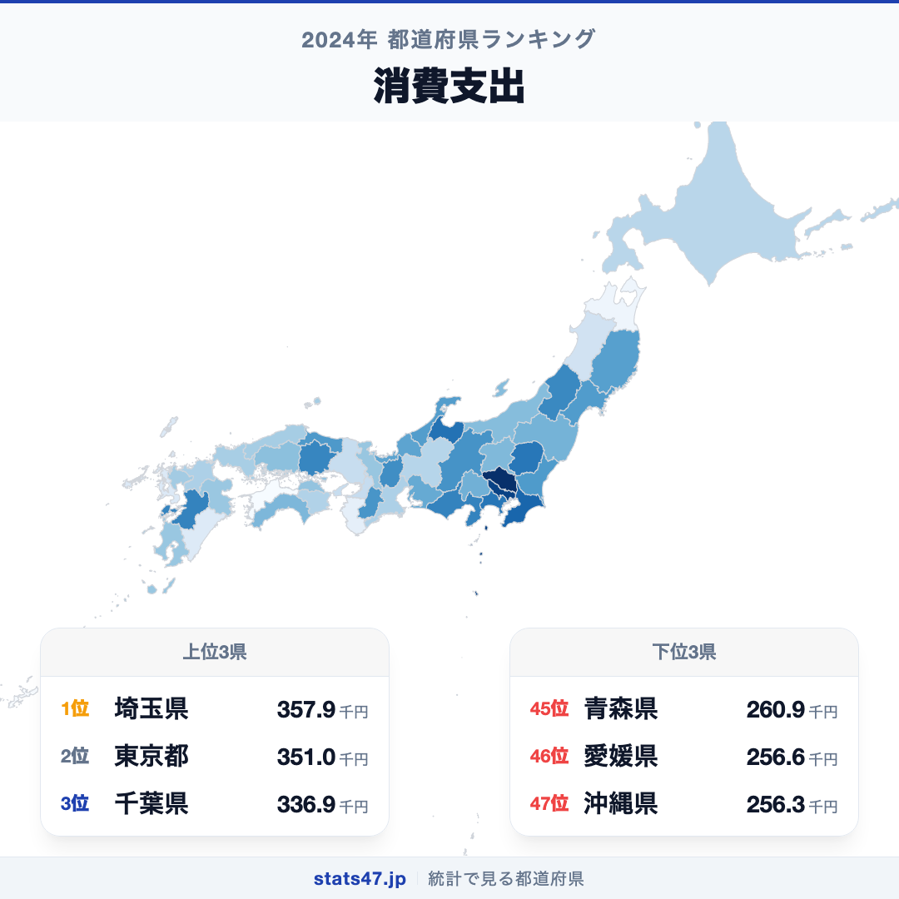
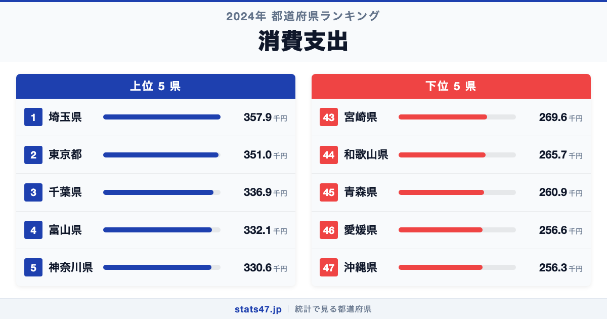
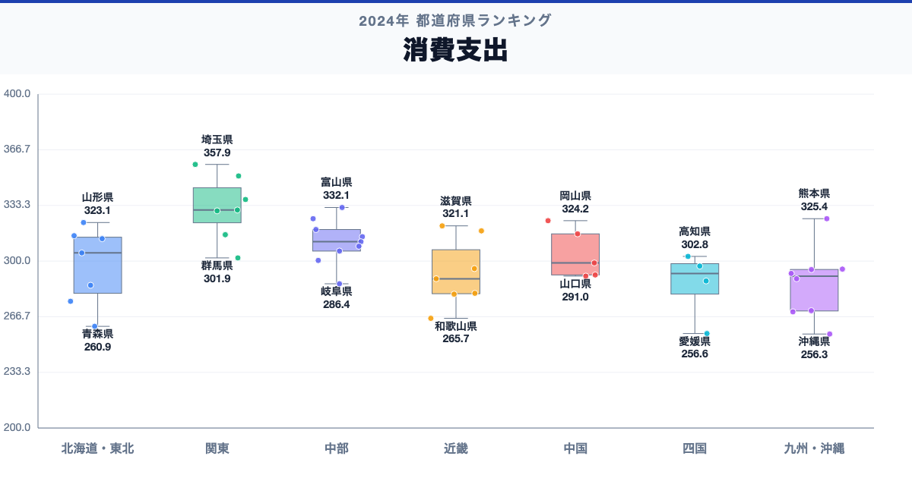

埼玉県が全国1位、沖縄県が47位。二人以上世帯の1か月の消費支出には、同じ日本の中でも1.4倍の開きがあります。

首位の埼玉県は357.9千円で偏差値73.8、最下位の沖縄県は256.3千円で偏差値30.2です。なぜこれほど差があるのでしょうか。

「消費支出」は、消費支出は、二人以上世帯が1か月に商品やサービスへ支出した金額の平均です。標本調査の単年平均には振れがあるため、近い順位の優劣より複数年の傾向を重視します。

## データハイライト

全国平均: 302.52千円

1位: 埼玉県　357.9千円 / 偏差値 73.8

47位: 沖縄県　256.3千円 / 偏差値 30.2

上位5県と下位5県の間には明確な開きがあります。一方、順位が近い県では値の差が小さい場合もあるため、一つの順位差を地域の優劣として扱わないことが大切です。

## 【コロプレス地図】日本全国の分布

<!-- note投稿時: この画像行を削除し、images/choropleth-map-1080x1080.png をアップロード -->

地域中央値が最も高いのは関東で330.6千円、最も低いのは北海道で285.5千円です。県別の順位だけでなく、まとまりとして見ると分布の偏りを捉えやすくなります。

ただし、地域内にもばらつきがあります。所得、物価、世帯人数、住居費、調査月の大きな購入などが平均額に影響します。支出が少ないことを節約上手や生活の苦しさのどちらか一方には決められません。地図の色を原因の地図とみなさず、観測された分布として読みます。

## 上位5：分析

<!-- note投稿時: この画像行を削除し、images/chart-x-1200x630.png をアップロード -->

全国首位の埼玉県は1位で、357.9千円、偏差値は73.8です。全国平均を55.38千円上回ります。所得、物価、世帯人数、住居費、調査月の大きな購入などが平均額に影響します。この順位だけで原因を決めず、可処分所得、世帯人員、消費者物価、費目別支出、実質値、複数年平均を確認すると背景を分解できます。

続く東京都は2位で、351千円、偏差値は70.8です。全国平均を48.48千円上回ります。関東に位置し、同じ地域内の県と比べる視点も必要です。この順位だけで原因を決めず、可処分所得、世帯人員、消費者物価、費目別支出、実質値、複数年平均を確認すると背景を分解できます。

上位に入った千葉県は3位で、336.9千円、偏差値は64.7です。全国平均を34.38千円上回ります。関東に位置し、同じ地域内の県と比べる視点も必要です。この順位だけで原因を決めず、可処分所得、世帯人員、消費者物価、費目別支出、実質値、複数年平均を確認すると背景を分解できます。

4番手の富山県は4位で、332.1千円、偏差値は62.7です。全国平均を29.58千円上回ります。中部に位置し、同じ地域内の県と比べる視点も必要です。この順位だけで原因を決めず、可処分所得、世帯人員、消費者物価、費目別支出、実質値、複数年平均を確認すると背景を分解できます。

上位5県を締める神奈川県は5位で、330.6千円、偏差値は62.0です。全国平均を28.08千円上回ります。関東に位置し、同じ地域内の県と比べる視点も必要です。この順位だけで原因を決めず、可処分所得、世帯人員、消費者物価、費目別支出、実質値、複数年平均を確認すると背景を分解できます。

## 下位5：分析

下位側を見ると、宮崎県は43位で、269.6千円、偏差値は35.9です。全国平均を32.92千円下回ります。九州・沖縄の中でも、この県の位置を周辺県と見比べることが次の手がかりです。標本調査の単年平均には振れがあるため、近い順位の優劣より複数年の傾向を重視します。

次に和歌山県は44位で、265.7千円、偏差値は34.2です。全国平均を36.82千円下回ります。近畿の中でも、この県の位置を周辺県と見比べることが次の手がかりです。標本調査の単年平均には振れがあるため、近い順位の優劣より複数年の傾向を重視します。

45位の青森県は45位で、260.9千円、偏差値は32.1です。全国平均を41.62千円下回ります。東北の中でも、この県の位置を周辺県と見比べることが次の手がかりです。標本調査の単年平均には振れがあるため、近い順位の優劣より複数年の傾向を重視します。

46位の愛媛県は46位で、256.6千円、偏差値は30.3です。全国平均を45.92千円下回ります。四国の中でも、この県の位置を周辺県と見比べることが次の手がかりです。標本調査の単年平均には振れがあるため、近い順位の優劣より複数年の傾向を重視します。

最下位の沖縄県は47位で、256.3千円、偏差値は30.2です。全国平均を46.22千円下回ります。支出が少ないことを節約上手や生活の苦しさのどちらか一方には決められません。標本調査の単年平均には振れがあるため、近い順位の優劣より複数年の傾向を重視します。

## あなたの県は何位？

ここまで上位・下位の10県を見てきましたが、残る37県の順位も気になるはずです。全47都道府県の順位は、色分け地図と並べ替え可能なグラフ付きでstats47から確認できます。

### 二人以上世帯の1か月の消費支出ランキング 全47都道府県版

https://stats47.jp/ranking/consumption-expenditure-multi-person-households-per-month

## 地域別の傾向

<!-- note投稿時: この画像行を削除し、images/boxplot-1200x630.png をアップロード -->

箱ひげ図では、関東の中央値が高く、北海道が低い配置です。ただし、箱の重なりや外れた県も確認し、地域名だけで各県の値を決めつけないようにします。

## このランキングを正しく読む3つの視点

**総数と比率を混同しない**

所得、物価、世帯人数、住居費、調査月の大きな購入などが平均額に影響します。支出が少ないことを節約上手や生活の苦しさのどちらか一方には決められません。

**順位だけで原因を決めない**

このデータから直接分かるのは、2024年の47都道府県の値と順位です。背景を確かめるには、可処分所得、世帯人員、消費者物価、費目別支出、実質値、複数年平均が必要です。

**対象年と定義を確認する**

標本調査の単年平均には振れがあるため、近い順位の優劣より複数年の傾向を重視します。別年や別調査と比べるときは、対象となる世帯・人・施設と単位をそろえます。

## まとめ

二人以上世帯の1か月の消費支出の地域差は、単純な県の優劣ではなく、指標の対象と地域条件の違いを映しています。

**首位と最下位には1.4倍の開き**

埼玉県の357.9千円に対し、沖縄県は256.3千円でした。まずは差の大きさを事実として押さえます。

**地域のまとまりと県内差は両方見る**

地域中央値には違いがありますが、同じ地域のすべての県が同じ傾向とは限りません。地図と全47県の順位を併用すると例外も見つけられます。

**次のデータで理由を分解する**

可処分所得、世帯人員、消費者物価、費目別支出、実質値、複数年平均を重ねれば、総数・割合・価格・人口構成など、順位を動かす要素を切り分けられます。

## もっと詳しく知りたい方へ

全47都道府県の順位や、グラフ・地図での可視化はstats47で確認できます。

### 二人以上世帯の1か月の消費支出ランキング 全都道府県版

https://stats47.jp/ranking/consumption-expenditure-multi-person-households-per-month

### アクセサリー消費支出額

https://stats47.jp/ranking/accessories-consumption-expenditure

### 宿泊料消費支出額

https://stats47.jp/ranking/accommodation-consumption-expenditure

### 大人用サンダル消費支出額

https://stats47.jp/ranking/adult-sandals-consumption-expenditure

### りんご消費支出は東北勢が独占｜産地なのに青森が首位を逃す謎 (2024)（stats47ブログ）

https://stats47.jp/blog/apple-expenditure-ranking

---

**stats47** は、e-Statなどの公的統計データを47都道府県別に可視化するサービスです。ランキング・散布図・時系列チャートで、地域の違いがひと目で分かります。

https://stats47.jp
