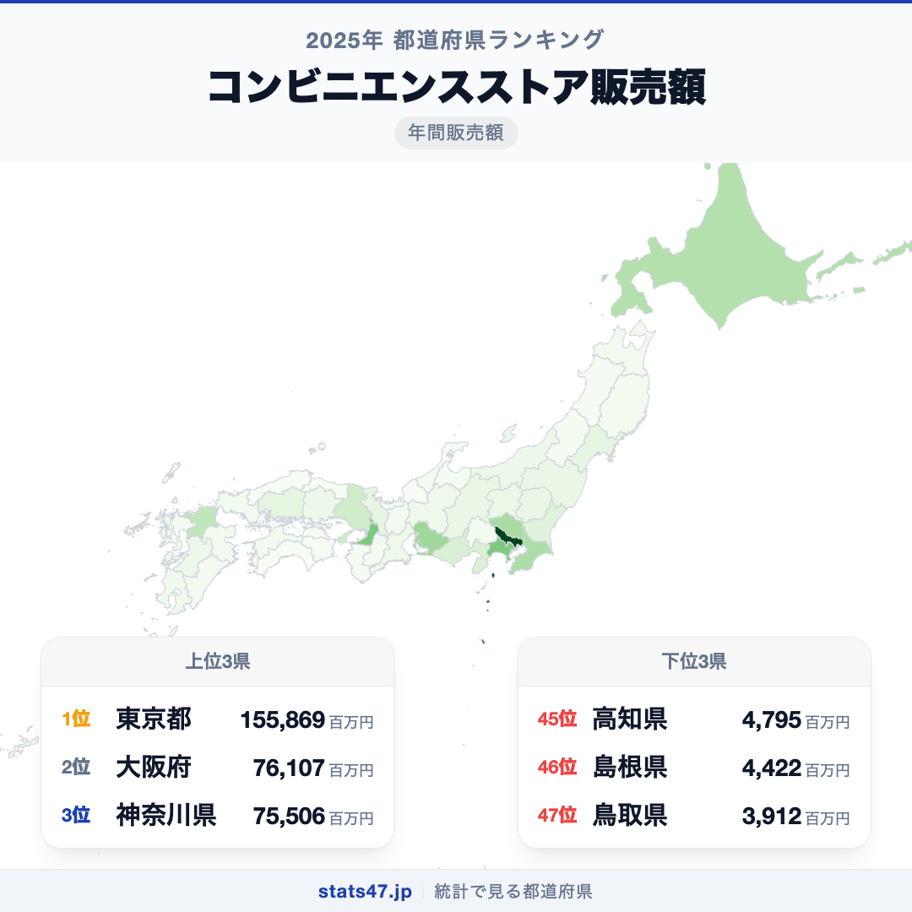
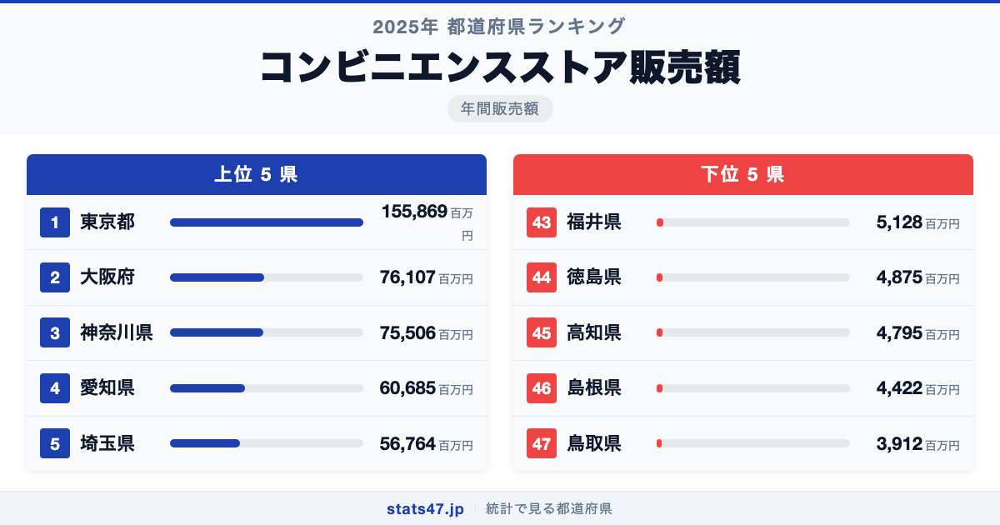
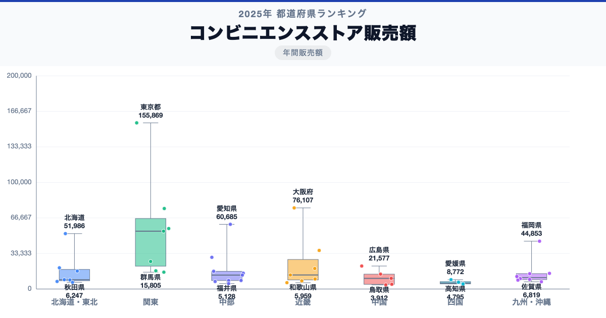

東京都が全国1位、鳥取県が47位。コンビニエンスストア販売額には、同じ日本の中でも39.8倍の開きがあります。

首位の東京都は155,869百万円で偏差値99.2、最下位の鳥取県は3,912百万円で偏差値43.2です。なぜこれほど差があるのでしょうか。

「コンビニエンスストア販売額」は、コンビニエンスストア販売額について、都道府県別に同じ定義で集計した値です。単年の順位だけで判断せず、同じ定義の時系列と関連する内訳を併せて確認します。

## データハイライト

全国平均: 22,332.89百万円

1位: 東京都　155,869百万円 / 偏差値 99.2

47位: 鳥取県　3,912百万円 / 偏差値 43.2

上位5県と下位5県の間には明確な開きがあります。一方、順位が近い県では値の差が小さい場合もあるため、一つの順位差を地域の優劣として扱わないことが大切です。

## 【コロプレス地図】日本全国の分布

<!-- note投稿時: この画像行を削除し、images/choropleth-map-1080x1080.png をアップロード -->

地域中央値が最も高いのは関東で54,270百万円、最も低いのは四国で5,616百万円です。県別の順位だけでなく、まとまりとして見ると分布の偏りを捉えやすくなります。

ただし、地域内にもばらつきがあります。総数・比率・平均のどれを測る指標かを確認し、値の大きさを地域の優劣へ置き換えないことが重要です。低い値にも人口規模、分母、対象範囲など複数の要因があり、このランキングだけで原因は決められません。地図の色を原因の地図とみなさず、観測された分布として読みます。

## 上位5：分析

<!-- note投稿時: この画像行を削除し、images/chart-x-1200x630.png をアップロード -->

全国首位の東京都は1位で、155,869百万円、偏差値は99.2です。全国平均を133,536.11百万円上回ります。総数・比率・平均のどれを測る指標かを確認し、値の大きさを地域の優劣へ置き換えないことが重要です。この順位だけで原因を決めず、指標の分子・分母、構成内訳、人口規模、同一定義の時系列、一次資料の注記を確認すると背景を分解できます。

続く大阪府は2位で、76,107百万円、偏差値は69.8です。全国平均を53,774.11百万円上回ります。近畿に位置し、同じ地域内の県と比べる視点も必要です。この順位だけで原因を決めず、指標の分子・分母、構成内訳、人口規模、同一定義の時系列、一次資料の注記を確認すると背景を分解できます。

上位に入った神奈川県は3位で、75,506百万円、偏差値は69.6です。全国平均を53,173.11百万円上回ります。関東に位置し、同じ地域内の県と比べる視点も必要です。この順位だけで原因を決めず、指標の分子・分母、構成内訳、人口規模、同一定義の時系列、一次資料の注記を確認すると背景を分解できます。

4番手の愛知県は4位で、60,685百万円、偏差値は64.1です。全国平均を38,352.11百万円上回ります。中部に位置し、同じ地域内の県と比べる視点も必要です。この順位だけで原因を決めず、指標の分子・分母、構成内訳、人口規模、同一定義の時系列、一次資料の注記を確認すると背景を分解できます。

上位5県を締める埼玉県は5位で、56,764百万円、偏差値は62.7です。全国平均を34,431.11百万円上回ります。関東に位置し、同じ地域内の県と比べる視点も必要です。この順位だけで原因を決めず、指標の分子・分母、構成内訳、人口規模、同一定義の時系列、一次資料の注記を確認すると背景を分解できます。

## 下位5：分析

下位側を見ると、福井県は43位で、5,128百万円、偏差値は43.7です。全国平均を17,204.89百万円下回ります。中部の中でも、この県の位置を周辺県と見比べることが次の手がかりです。単年の順位だけで判断せず、同じ定義の時系列と関連する内訳を併せて確認します。

次に徳島県は44位で、4,875百万円、偏差値は43.6です。全国平均を17,457.89百万円下回ります。四国の中でも、この県の位置を周辺県と見比べることが次の手がかりです。単年の順位だけで判断せず、同じ定義の時系列と関連する内訳を併せて確認します。

45位の高知県は45位で、4,795百万円、偏差値は43.5です。全国平均を17,537.89百万円下回ります。四国の中でも、この県の位置を周辺県と見比べることが次の手がかりです。単年の順位だけで判断せず、同じ定義の時系列と関連する内訳を併せて確認します。

46位の島根県は46位で、4,422百万円、偏差値は43.4です。全国平均を17,910.89百万円下回ります。中国の中でも、この県の位置を周辺県と見比べることが次の手がかりです。単年の順位だけで判断せず、同じ定義の時系列と関連する内訳を併せて確認します。

最下位の鳥取県は47位で、3,912百万円、偏差値は43.2です。全国平均を18,420.89百万円下回ります。低い値にも人口規模、分母、対象範囲など複数の要因があり、このランキングだけで原因は決められません。単年の順位だけで判断せず、同じ定義の時系列と関連する内訳を併せて確認します。

## あなたの県は何位？

ここまで上位・下位の10県を見てきましたが、残る37県の順位も気になるはずです。全47都道府県の順位は、色分け地図と並べ替え可能なグラフ付きでstats47から確認できます。

### コンビニエンスストア販売額ランキング 全47都道府県版

https://stats47.jp/ranking/convenience-store-sales

## 地域別の傾向

<!-- note投稿時: この画像行を削除し、images/boxplot-1200x630.png をアップロード -->

箱ひげ図では、関東の中央値が高く、四国が低い配置です。ただし、箱の重なりや外れた県も確認し、地域名だけで各県の値を決めつけないようにします。

## このランキングを正しく読む3つの視点

**総数と比率を混同しない**

総数・比率・平均のどれを測る指標かを確認し、値の大きさを地域の優劣へ置き換えないことが重要です。低い値にも人口規模、分母、対象範囲など複数の要因があり、このランキングだけで原因は決められません。

**順位だけで原因を決めない**

このデータから直接分かるのは、2025年の47都道府県の値と順位です。背景を確かめるには、指標の分子・分母、構成内訳、人口規模、同一定義の時系列、一次資料の注記が必要です。

**対象年と定義を確認する**

単年の順位だけで判断せず、同じ定義の時系列と関連する内訳を併せて確認します。別年や別調査と比べるときは、対象となる世帯・人・施設と単位をそろえます。

## まとめ

コンビニエンスストア販売額の地域差は、単純な県の優劣ではなく、指標の対象と地域条件の違いを映しています。

**首位と最下位には39.8倍の開き**

東京都の155,869百万円に対し、鳥取県は3,912百万円でした。まずは差の大きさを事実として押さえます。

**地域のまとまりと県内差は両方見る**

地域中央値には違いがありますが、同じ地域のすべての県が同じ傾向とは限りません。地図と全47県の順位を併用すると例外も見つけられます。

**次のデータで理由を分解する**

指標の分子・分母、構成内訳、人口規模、同一定義の時系列、一次資料の注記を重ねれば、総数・割合・価格・人口構成など、順位を動かす要素を切り分けられます。

## もっと詳しく知りたい方へ

全47都道府県の順位や、グラフ・地図での可視化はstats47で確認できます。

### コンビニエンスストア販売額ランキング 全都道府県版

https://stats47.jp/ranking/convenience-store-sales

### 商業年間商品販売額

https://stats47.jp/ranking/annual-sales-amount-per-employee

### 商業年間商品販売額

https://stats47.jp/ranking/annual-sales-amount-per-establishment

### 商業年間商品販売額

https://stats47.jp/ranking/annual-sales-amount

---

**stats47** は、e-Statなどの公的統計データを47都道府県別に可視化するサービスです。ランキング・散布図・時系列チャートで、地域の違いがひと目で分かります。

https://stats47.jp
