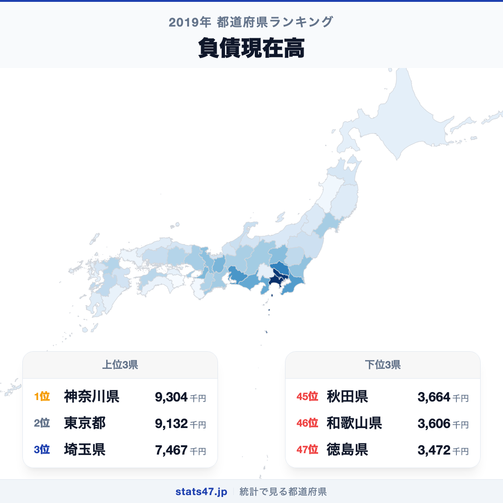
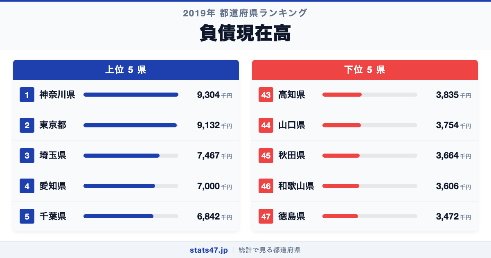
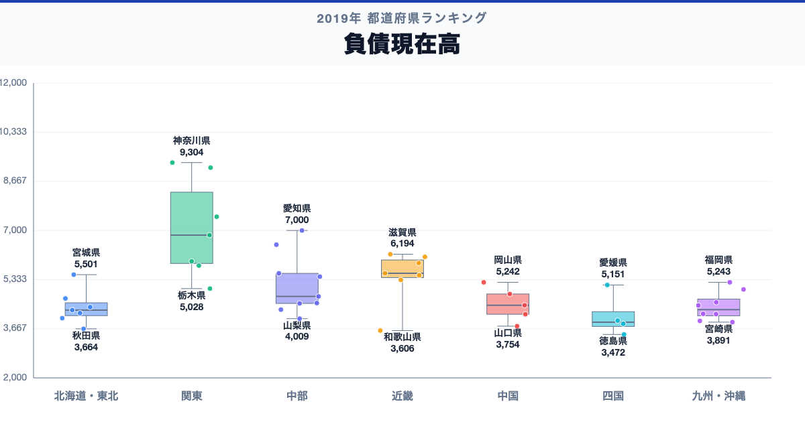

神奈川県が全国1位、徳島県が47位。負債現在高には、同じ日本の中でも2.7倍の開きがあります。

首位の神奈川県は9,304千円で偏差値82.8、最下位の徳島県は3,472千円で偏差値37.4です。なぜこれほど差があるのでしょうか。

「負債現在高」は、二人以上世帯が調査時点で抱える借入金などの残高を1世帯あたりで平均した値です。家計の健全性は負債単独ではなく、資産、所得、毎月の返済負担と併せて評価します。

## データハイライト

全国平均: 5,093.85千円

1位: 神奈川県　9,304千円 / 偏差値 82.8

47位: 徳島県　3,472千円 / 偏差値 37.4

上位5県と下位5県の間には明確な開きがあります。一方、順位が近い県では値の差が小さい場合もあるため、一つの順位差を地域の優劣として扱わないことが大切です。

## 【コロプレス地図】日本全国の分布

<!-- note投稿時: この画像行を削除し、images/choropleth-map-1080x1080.png をアップロード -->

地域中央値が最も高いのは関東で6,842千円、最も低いのは四国で3,889.5千円です。県別の順位だけでなく、まとまりとして見ると分布の偏りを捉えやすくなります。

ただし、地域内にもばらつきがあります。住宅価格と住宅ローン、世帯主の年齢、所得などが平均残高に影響します。負債が少ないことだけで家計が豊かとは判断できず、資産取得や若年世帯の少なさも関係します。地図の色を原因の地図とみなさず、観測された分布として読みます。

## 上位5：分析

<!-- note投稿時: この画像行を削除し、images/chart-x-1200x630.png をアップロード -->

全国首位の神奈川県は1位で、9,304千円、偏差値は82.8です。全国平均を4,210.15千円上回ります。住宅価格と住宅ローン、世帯主の年齢、所得などが平均残高に影響します。この順位だけで原因を決めず、資産現在高、純資産、年間収入、返済負担率、負債保有率、世帯主年齢を確認すると背景を分解できます。

続く東京都は2位で、9,132千円、偏差値は81.5です。全国平均を4,038.15千円上回ります。関東に位置し、同じ地域内の県と比べる視点も必要です。この順位だけで原因を決めず、資産現在高、純資産、年間収入、返済負担率、負債保有率、世帯主年齢を確認すると背景を分解できます。

上位に入った埼玉県は3位で、7,467千円、偏差値は68.5です。全国平均を2,373.15千円上回ります。関東に位置し、同じ地域内の県と比べる視点も必要です。この順位だけで原因を決めず、資産現在高、純資産、年間収入、返済負担率、負債保有率、世帯主年齢を確認すると背景を分解できます。

4番手の愛知県は4位で、7,000千円、偏差値は64.9です。全国平均を1,906.15千円上回ります。中部に位置し、同じ地域内の県と比べる視点も必要です。この順位だけで原因を決めず、資産現在高、純資産、年間収入、返済負担率、負債保有率、世帯主年齢を確認すると背景を分解できます。

上位5県を締める千葉県は5位で、6,842千円、偏差値は63.6です。全国平均を1,748.15千円上回ります。関東に位置し、同じ地域内の県と比べる視点も必要です。この順位だけで原因を決めず、資産現在高、純資産、年間収入、返済負担率、負債保有率、世帯主年齢を確認すると背景を分解できます。

## 下位5：分析

下位側を見ると、高知県は43位で、3,835千円、偏差値は40.2です。全国平均を1,258.85千円下回ります。四国の中でも、この県の位置を周辺県と見比べることが次の手がかりです。家計の健全性は負債単独ではなく、資産、所得、毎月の返済負担と併せて評価します。

次に山口県は44位で、3,754千円、偏差値は39.6です。全国平均を1,339.85千円下回ります。中国の中でも、この県の位置を周辺県と見比べることが次の手がかりです。家計の健全性は負債単独ではなく、資産、所得、毎月の返済負担と併せて評価します。

45位の秋田県は45位で、3,664千円、偏差値は38.9です。全国平均を1,429.85千円下回ります。東北の中でも、この県の位置を周辺県と見比べることが次の手がかりです。家計の健全性は負債単独ではなく、資産、所得、毎月の返済負担と併せて評価します。

46位の和歌山県は46位で、3,606千円、偏差値は38.4です。全国平均を1,487.85千円下回ります。近畿の中でも、この県の位置を周辺県と見比べることが次の手がかりです。家計の健全性は負債単独ではなく、資産、所得、毎月の返済負担と併せて評価します。

最下位の徳島県は47位で、3,472千円、偏差値は37.4です。全国平均を1,621.85千円下回ります。負債が少ないことだけで家計が豊かとは判断できず、資産取得や若年世帯の少なさも関係します。家計の健全性は負債単独ではなく、資産、所得、毎月の返済負担と併せて評価します。

## あなたの県は何位？

ここまで上位・下位の10県を見てきましたが、残る37県の順位も気になるはずです。全47都道府県の順位は、色分け地図と並べ替え可能なグラフ付きでstats47から確認できます。

### 負債現在高ランキング 全47都道府県版

https://stats47.jp/ranking/current-liabilities-balance-multi-person-households-per-household

## 地域別の傾向

<!-- note投稿時: この画像行を削除し、images/boxplot-1200x630.png をアップロード -->

箱ひげ図では、関東の中央値が高く、四国が低い配置です。ただし、箱の重なりや外れた県も確認し、地域名だけで各県の値を決めつけないようにします。

## このランキングを正しく読む3つの視点

**総数と比率を混同しない**

住宅価格と住宅ローン、世帯主の年齢、所得などが平均残高に影響します。負債が少ないことだけで家計が豊かとは判断できず、資産取得や若年世帯の少なさも関係します。

**順位だけで原因を決めない**

このデータから直接分かるのは、2019年の47都道府県の値と順位です。背景を確かめるには、資産現在高、純資産、年間収入、返済負担率、負債保有率、世帯主年齢が必要です。

**対象年と定義を確認する**

家計の健全性は負債単独ではなく、資産、所得、毎月の返済負担と併せて評価します。別年や別調査と比べるときは、対象となる世帯・人・施設と単位をそろえます。

## まとめ

負債現在高の地域差は、単純な県の優劣ではなく、指標の対象と地域条件の違いを映しています。

**首位と最下位には2.7倍の開き**

神奈川県の9,304千円に対し、徳島県は3,472千円でした。まずは差の大きさを事実として押さえます。

**地域のまとまりと県内差は両方見る**

地域中央値には違いがありますが、同じ地域のすべての県が同じ傾向とは限りません。地図と全47県の順位を併用すると例外も見つけられます。

**次のデータで理由を分解する**

資産現在高、純資産、年間収入、返済負担率、負債保有率、世帯主年齢を重ねれば、総数・割合・価格・人口構成など、順位を動かす要素を切り分けられます。

## もっと詳しく知りたい方へ

全47都道府県の順位や、グラフ・地図での可視化はstats47で確認できます。

### 負債現在高ランキング 全都道府県版

https://stats47.jp/ranking/current-liabilities-balance-multi-person-households-per-household

### アクセサリー消費支出額

https://stats47.jp/ranking/accessories-consumption-expenditure

### 宿泊料消費支出額

https://stats47.jp/ranking/accommodation-consumption-expenditure

### 大人用サンダル消費支出額

https://stats47.jp/ranking/adult-sandals-consumption-expenditure

---

**stats47** は、e-Statなどの公的統計データを47都道府県別に可視化するサービスです。ランキング・散布図・時系列チャートで、地域の違いがひと目で分かります。

https://stats47.jp
