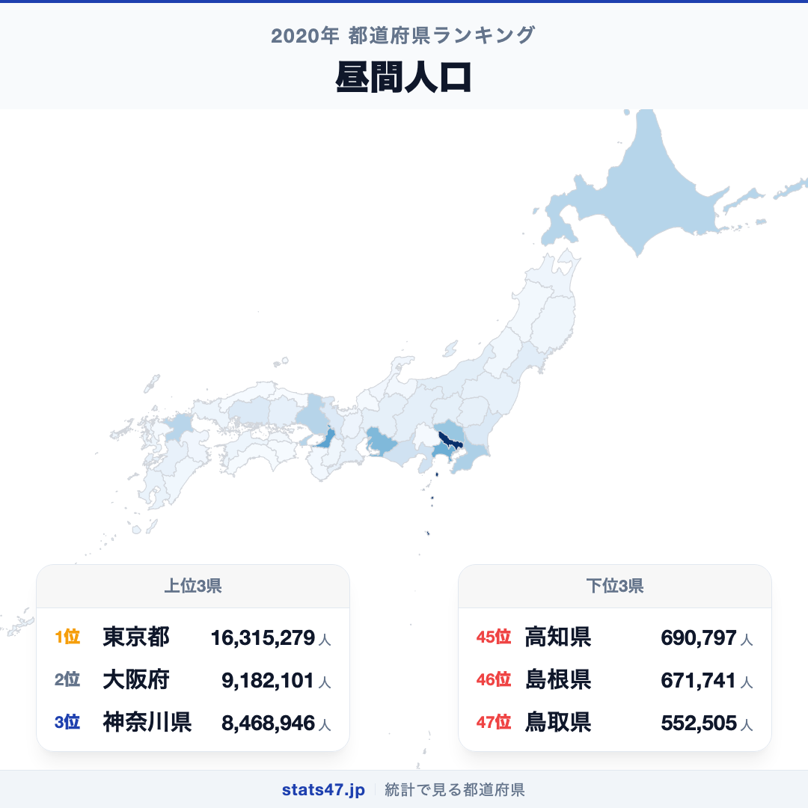
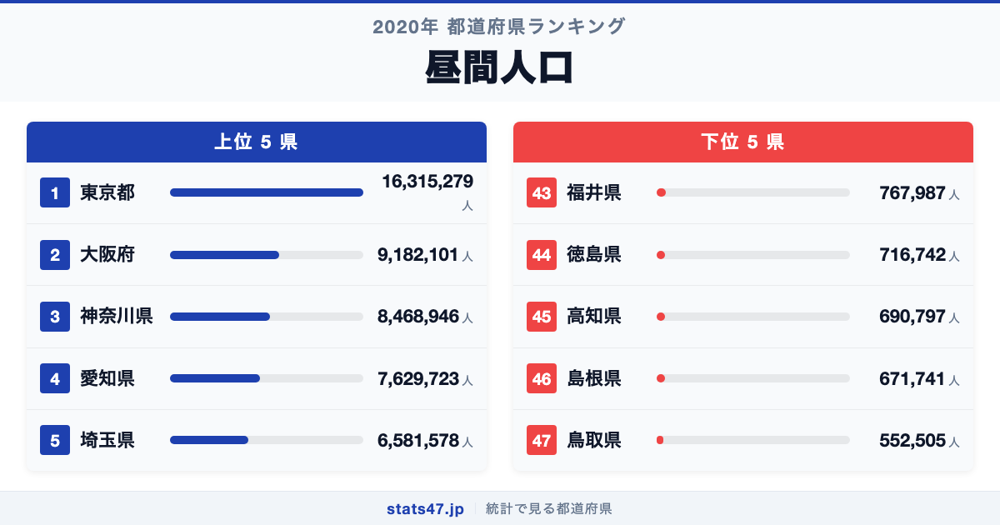
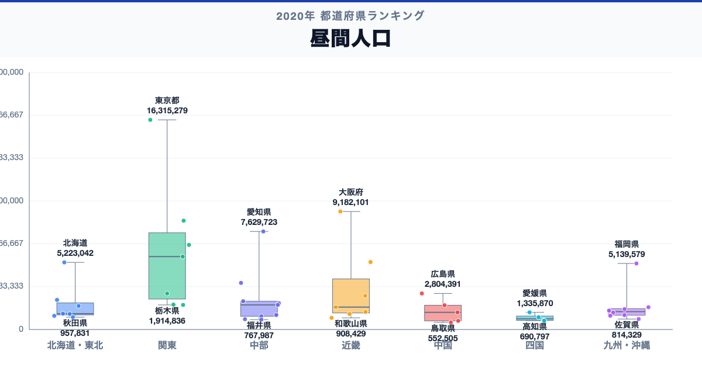

東京都が全国1位、鳥取県が47位。昼間人口には、同じ日本の中でも29.5倍の開きがあります。

首位の東京都は16,315,279人で偏差値96.7、最下位の鳥取県は552,505人で偏差値42.7です。なぜこれほど差があるのでしょうか。

「昼間人口」は、昼間人口は、常住人口を基礎に通勤・通学による流入と流出を調整した日中の人口です。観光客や買い物客など一時的な滞在者をすべて数えたリアルタイム人流ではありません。

## データハイライト

全国平均: 2,683,959.55人

1位: 東京都　16,315,279人 / 偏差値 96.7

47位: 鳥取県　552,505人 / 偏差値 42.7

上位5県と下位5県の間には明確な開きがあります。一方、順位が近い県では値の差が小さい場合もあるため、一つの順位差を地域の優劣として扱わないことが大切です。

## 【コロプレス地図】日本全国の分布

<!-- note投稿時: この画像行を削除し、images/choropleth-map-1080x1080.png をアップロード -->

地域中央値が最も高いのは関東で5,672,183人、最も低いのは四国で833,954人です。県別の順位だけでなく、まとまりとして見ると分布の偏りを捉えやすくなります。

ただし、地域内にもばらつきがあります。総数には常住人口の大きさが含まれるため、外部からの吸引力だけを示す値ではありません。人口規模の小さい県では昼間人口も小さくなりやすく、流入・流出は比率で確認します。地図の色を原因の地図とみなさず、観測された分布として読みます。

## 上位5：分析

<!-- note投稿時: この画像行を削除し、images/chart-x-1200x630.png をアップロード -->

全国首位の東京都は1位で、16,315,279人、偏差値は96.7です。全国平均を13,631,319.45人上回ります。総数には常住人口の大きさが含まれるため、外部からの吸引力だけを示す値ではありません。この順位だけで原因を決めず、夜間人口、昼夜間人口比率、通勤・通学流入出、駅別乗降客数、時間帯別人流を確認すると背景を分解できます。

続く大阪府は2位で、9,182,101人、偏差値は72.2です。全国平均を6,498,141.45人上回ります。近畿に位置し、同じ地域内の県と比べる視点も必要です。この順位だけで原因を決めず、夜間人口、昼夜間人口比率、通勤・通学流入出、駅別乗降客数、時間帯別人流を確認すると背景を分解できます。

上位に入った神奈川県は3位で、8,468,946人、偏差値は69.8です。全国平均を5,784,986.45人上回ります。関東に位置し、同じ地域内の県と比べる視点も必要です。この順位だけで原因を決めず、夜間人口、昼夜間人口比率、通勤・通学流入出、駅別乗降客数、時間帯別人流を確認すると背景を分解できます。

4番手の愛知県は4位で、7,629,723人、偏差値は66.9です。全国平均を4,945,763.45人上回ります。中部に位置し、同じ地域内の県と比べる視点も必要です。この順位だけで原因を決めず、夜間人口、昼夜間人口比率、通勤・通学流入出、駅別乗降客数、時間帯別人流を確認すると背景を分解できます。

上位5県を締める埼玉県は5位で、6,581,578人、偏差値は63.3です。全国平均を3,897,618.45人上回ります。関東に位置し、同じ地域内の県と比べる視点も必要です。この順位だけで原因を決めず、夜間人口、昼夜間人口比率、通勤・通学流入出、駅別乗降客数、時間帯別人流を確認すると背景を分解できます。

## 下位5：分析

下位側を見ると、福井県は43位で、767,987人、偏差値は43.4です。全国平均を1,915,972.55人下回ります。中部の中でも、この県の位置を周辺県と見比べることが次の手がかりです。観光客や買い物客など一時的な滞在者をすべて数えたリアルタイム人流ではありません。

次に徳島県は44位で、716,742人、偏差値は43.3です。全国平均を1,967,217.55人下回ります。四国の中でも、この県の位置を周辺県と見比べることが次の手がかりです。観光客や買い物客など一時的な滞在者をすべて数えたリアルタイム人流ではありません。

45位の高知県は45位で、690,797人、偏差値は43.2です。全国平均を1,993,162.55人下回ります。四国の中でも、この県の位置を周辺県と見比べることが次の手がかりです。観光客や買い物客など一時的な滞在者をすべて数えたリアルタイム人流ではありません。

46位の島根県は46位で、671,741人、偏差値は43.1です。全国平均を2,012,218.55人下回ります。中国の中でも、この県の位置を周辺県と見比べることが次の手がかりです。観光客や買い物客など一時的な滞在者をすべて数えたリアルタイム人流ではありません。

最下位の鳥取県は47位で、552,505人、偏差値は42.7です。全国平均を2,131,454.55人下回ります。人口規模の小さい県では昼間人口も小さくなりやすく、流入・流出は比率で確認します。観光客や買い物客など一時的な滞在者をすべて数えたリアルタイム人流ではありません。

## あなたの県は何位？

ここまで上位・下位の10県を見てきましたが、残る37県の順位も気になるはずです。全47都道府県の順位は、色分け地図と並べ替え可能なグラフ付きでstats47から確認できます。

### 昼間人口ランキング 全47都道府県版

https://stats47.jp/ranking/day-time-population

## 地域別の傾向

<!-- note投稿時: この画像行を削除し、images/boxplot-1200x630.png をアップロード -->

箱ひげ図では、関東の中央値が高く、四国が低い配置です。ただし、箱の重なりや外れた県も確認し、地域名だけで各県の値を決めつけないようにします。

## このランキングを正しく読む3つの視点

**総数と比率を混同しない**

総数には常住人口の大きさが含まれるため、外部からの吸引力だけを示す値ではありません。人口規模の小さい県では昼間人口も小さくなりやすく、流入・流出は比率で確認します。

**順位だけで原因を決めない**

このデータから直接分かるのは、2020年の47都道府県の値と順位です。背景を確かめるには、夜間人口、昼夜間人口比率、通勤・通学流入出、駅別乗降客数、時間帯別人流が必要です。

**対象年と定義を確認する**

観光客や買い物客など一時的な滞在者をすべて数えたリアルタイム人流ではありません。別年や別調査と比べるときは、対象となる世帯・人・施設と単位をそろえます。

## まとめ

昼間人口の地域差は、単純な県の優劣ではなく、指標の対象と地域条件の違いを映しています。

**首位と最下位には29.5倍の開き**

東京都の16,315,279人に対し、鳥取県は552,505人でした。まずは差の大きさを事実として押さえます。

**地域のまとまりと県内差は両方見る**

地域中央値には違いがありますが、同じ地域のすべての県が同じ傾向とは限りません。地図と全47県の順位を併用すると例外も見つけられます。

**次のデータで理由を分解する**

夜間人口、昼夜間人口比率、通勤・通学流入出、駅別乗降客数、時間帯別人流を重ねれば、総数・割合・価格・人口構成など、順位を動かす要素を切り分けられます。

## もっと詳しく知りたい方へ

全47都道府県の順位や、グラフ・地図での可視化はstats47で確認できます。

### 昼間人口ランキング 全都道府県版

https://stats47.jp/ranking/day-time-population

### 不慮の事故による死亡者数

https://stats47.jp/ranking/accidental-deaths-per-100k

### 年齢別死亡率

https://stats47.jp/ranking/age-specific-death-rate-0-4-per-1000

### 農業就業人口

https://stats47.jp/ranking/agricultural-employment-population

### 人口を集める首都圏3県が昼間人口では最下位──通勤帝国が作り出す二重構造（stats47ブログ）

https://stats47.jp/blog/population-migration-tokyo-concentration

---

**stats47** は、e-Statなどの公的統計データを47都道府県別に可視化するサービスです。ランキング・散布図・時系列チャートで、地域の違いがひと目で分かります。

https://stats47.jp
