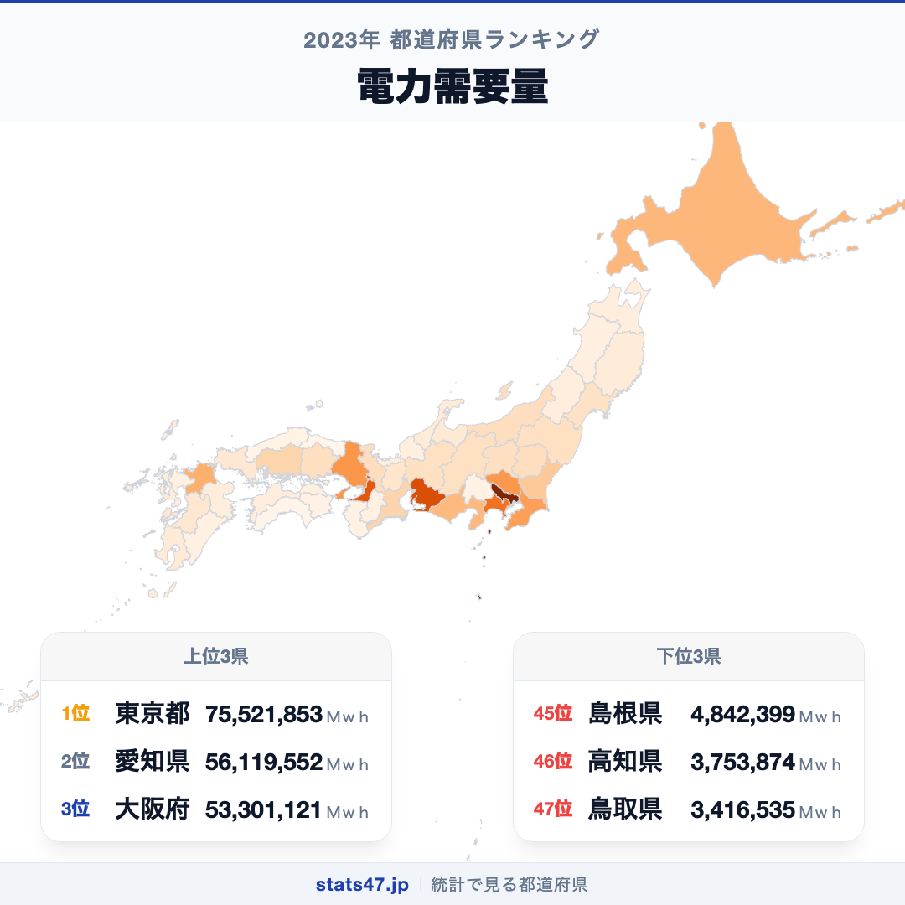
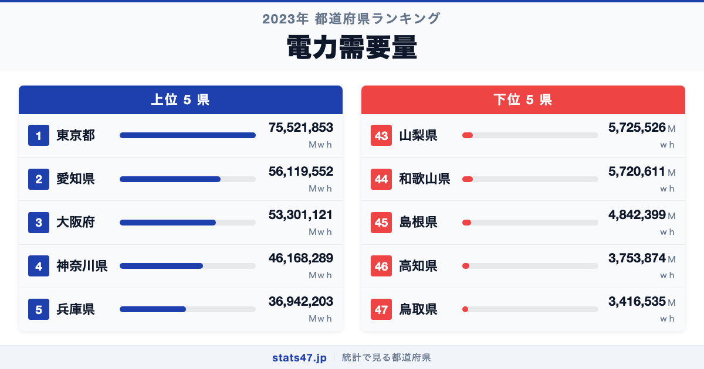
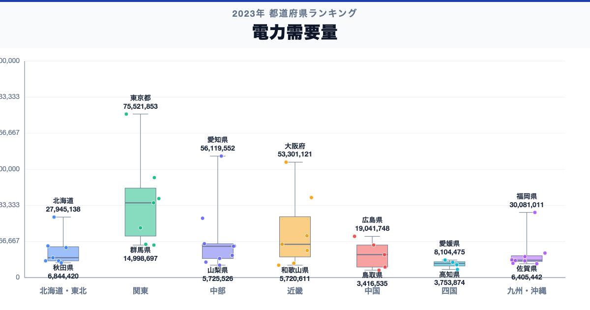

東京都が全国1位、鳥取県が47位。電力需要量には、同じ日本の中でも22.1倍の開きがあります。

首位の東京都は75,521,853Ｍｗｈで偏差値88.1、最下位の鳥取県は3,416,535Ｍｗｈで偏差値41.0です。なぜこれほど差があるのでしょうか。

「電力需要量」は、電力需要量について、都道府県別に同じ定義で集計した値です。単年の順位だけで判断せず、同じ定義の時系列と関連する内訳を併せて確認します。

## データハイライト

全国平均: 17,221,041.17Ｍｗｈ

1位: 東京都　75,521,853Ｍｗｈ / 偏差値 88.1

47位: 鳥取県　3,416,535Ｍｗｈ / 偏差値 41.0

上位5県と下位5県の間には明確な開きがあります。一方、順位が近い県では値の差が小さい場合もあるため、一つの順位差を地域の優劣として扱わないことが大切です。

## 【コロプレス地図】日本全国の分布

<!-- note投稿時: この画像行を削除し、images/choropleth-map-1080x1080.png をアップロード -->

地域中央値が最も高いのは関東で34,532,289Ｍｗｈ、最も低いのは四国で6,482,156.5Ｍｗｈです。県別の順位だけでなく、まとまりとして見ると分布の偏りを捉えやすくなります。

ただし、地域内にもばらつきがあります。総数・比率・平均のどれを測る指標かを確認し、値の大きさを地域の優劣へ置き換えないことが重要です。低い値にも人口規模、分母、対象範囲など複数の要因があり、このランキングだけで原因は決められません。地図の色を原因の地図とみなさず、観測された分布として読みます。

## 上位5：分析

<!-- note投稿時: この画像行を削除し、images/chart-x-1200x630.png をアップロード -->

全国首位の東京都は1位で、75,521,853Ｍｗｈ、偏差値は88.1です。全国平均を58,300,811.83Ｍｗｈ上回ります。総数・比率・平均のどれを測る指標かを確認し、値の大きさを地域の優劣へ置き換えないことが重要です。この順位だけで原因を決めず、指標の分子・分母、構成内訳、人口規模、同一定義の時系列、一次資料の注記を確認すると背景を分解できます。

続く愛知県は2位で、56,119,552Ｍｗｈ、偏差値は75.4です。全国平均を38,898,510.83Ｍｗｈ上回ります。中部に位置し、同じ地域内の県と比べる視点も必要です。この順位だけで原因を決めず、指標の分子・分母、構成内訳、人口規模、同一定義の時系列、一次資料の注記を確認すると背景を分解できます。

上位に入った大阪府は3位で、53,301,121Ｍｗｈ、偏差値は73.6です。全国平均を36,080,079.83Ｍｗｈ上回ります。近畿に位置し、同じ地域内の県と比べる視点も必要です。この順位だけで原因を決めず、指標の分子・分母、構成内訳、人口規模、同一定義の時系列、一次資料の注記を確認すると背景を分解できます。

4番手の神奈川県は4位で、46,168,289Ｍｗｈ、偏差値は68.9です。全国平均を28,947,247.83Ｍｗｈ上回ります。関東に位置し、同じ地域内の県と比べる視点も必要です。この順位だけで原因を決めず、指標の分子・分母、構成内訳、人口規模、同一定義の時系列、一次資料の注記を確認すると背景を分解できます。

上位5県を締める兵庫県は5位で、36,942,203Ｍｗｈ、偏差値は62.9です。全国平均を19,721,161.83Ｍｗｈ上回ります。近畿に位置し、同じ地域内の県と比べる視点も必要です。この順位だけで原因を決めず、指標の分子・分母、構成内訳、人口規模、同一定義の時系列、一次資料の注記を確認すると背景を分解できます。

## 下位5：分析

下位側を見ると、山梨県は43位で、5,725,526Ｍｗｈ、偏差値は42.5です。全国平均を11,495,515.17Ｍｗｈ下回ります。中部の中でも、この県の位置を周辺県と見比べることが次の手がかりです。単年の順位だけで判断せず、同じ定義の時系列と関連する内訳を併せて確認します。

次に和歌山県は44位で、5,720,611Ｍｗｈ、偏差値は42.5です。全国平均を11,500,430.17Ｍｗｈ下回ります。近畿の中でも、この県の位置を周辺県と見比べることが次の手がかりです。単年の順位だけで判断せず、同じ定義の時系列と関連する内訳を併せて確認します。

45位の島根県は45位で、4,842,399Ｍｗｈ、偏差値は41.9です。全国平均を12,378,642.17Ｍｗｈ下回ります。中国の中でも、この県の位置を周辺県と見比べることが次の手がかりです。単年の順位だけで判断せず、同じ定義の時系列と関連する内訳を併せて確認します。

46位の高知県は46位で、3,753,874Ｍｗｈ、偏差値は41.2です。全国平均を13,467,167.17Ｍｗｈ下回ります。四国の中でも、この県の位置を周辺県と見比べることが次の手がかりです。単年の順位だけで判断せず、同じ定義の時系列と関連する内訳を併せて確認します。

最下位の鳥取県は47位で、3,416,535Ｍｗｈ、偏差値は41.0です。全国平均を13,804,506.17Ｍｗｈ下回ります。低い値にも人口規模、分母、対象範囲など複数の要因があり、このランキングだけで原因は決められません。単年の順位だけで判断せず、同じ定義の時系列と関連する内訳を併せて確認します。

## あなたの県は何位？

ここまで上位・下位の10県を見てきましたが、残る37県の順位も気になるはずです。全47都道府県の順位は、色分け地図と並べ替え可能なグラフ付きでstats47から確認できます。

### 電力需要量ランキング 全47都道府県版

https://stats47.jp/ranking/electricity-demand

## 地域別の傾向

<!-- note投稿時: この画像行を削除し、images/boxplot-1200x630.png をアップロード -->

箱ひげ図では、関東の中央値が高く、四国が低い配置です。ただし、箱の重なりや外れた県も確認し、地域名だけで各県の値を決めつけないようにします。

## このランキングを正しく読む3つの視点

**総数と比率を混同しない**

総数・比率・平均のどれを測る指標かを確認し、値の大きさを地域の優劣へ置き換えないことが重要です。低い値にも人口規模、分母、対象範囲など複数の要因があり、このランキングだけで原因は決められません。

**順位だけで原因を決めない**

このデータから直接分かるのは、2023年の47都道府県の値と順位です。背景を確かめるには、指標の分子・分母、構成内訳、人口規模、同一定義の時系列、一次資料の注記が必要です。

**対象年と定義を確認する**

単年の順位だけで判断せず、同じ定義の時系列と関連する内訳を併せて確認します。別年や別調査と比べるときは、対象となる世帯・人・施設と単位をそろえます。

## まとめ

電力需要量の地域差は、単純な県の優劣ではなく、指標の対象と地域条件の違いを映しています。

**首位と最下位には22.1倍の開き**

東京都の75,521,853Ｍｗｈに対し、鳥取県は3,416,535Ｍｗｈでした。まずは差の大きさを事実として押さえます。

**地域のまとまりと県内差は両方見る**

地域中央値には違いがありますが、同じ地域のすべての県が同じ傾向とは限りません。地図と全47県の順位を併用すると例外も見つけられます。

**次のデータで理由を分解する**

指標の分子・分母、構成内訳、人口規模、同一定義の時系列、一次資料の注記を重ねれば、総数・割合・価格・人口構成など、順位を動かす要素を切り分けられます。

## もっと詳しく知りたい方へ

全47都道府県の順位や、グラフ・地図での可視化はstats47で確認できます。

### 電力需要量ランキング 全都道府県版

https://stats47.jp/ranking/electricity-demand

### 都市ガスメーター取付数

https://stats47.jp/ranking/city-gas-meter-count

### 都市ガス販売量

https://stats47.jp/ranking/city-gas-sales-volume

### 都市ガス供給区域内世帯数

https://stats47.jp/ranking/city-gas-supply-area-households

---

**stats47** は、e-Statなどの公的統計データを47都道府県別に可視化するサービスです。ランキング・散布図・時系列チャートで、地域の違いがひと目で分かります。

https://stats47.jp
