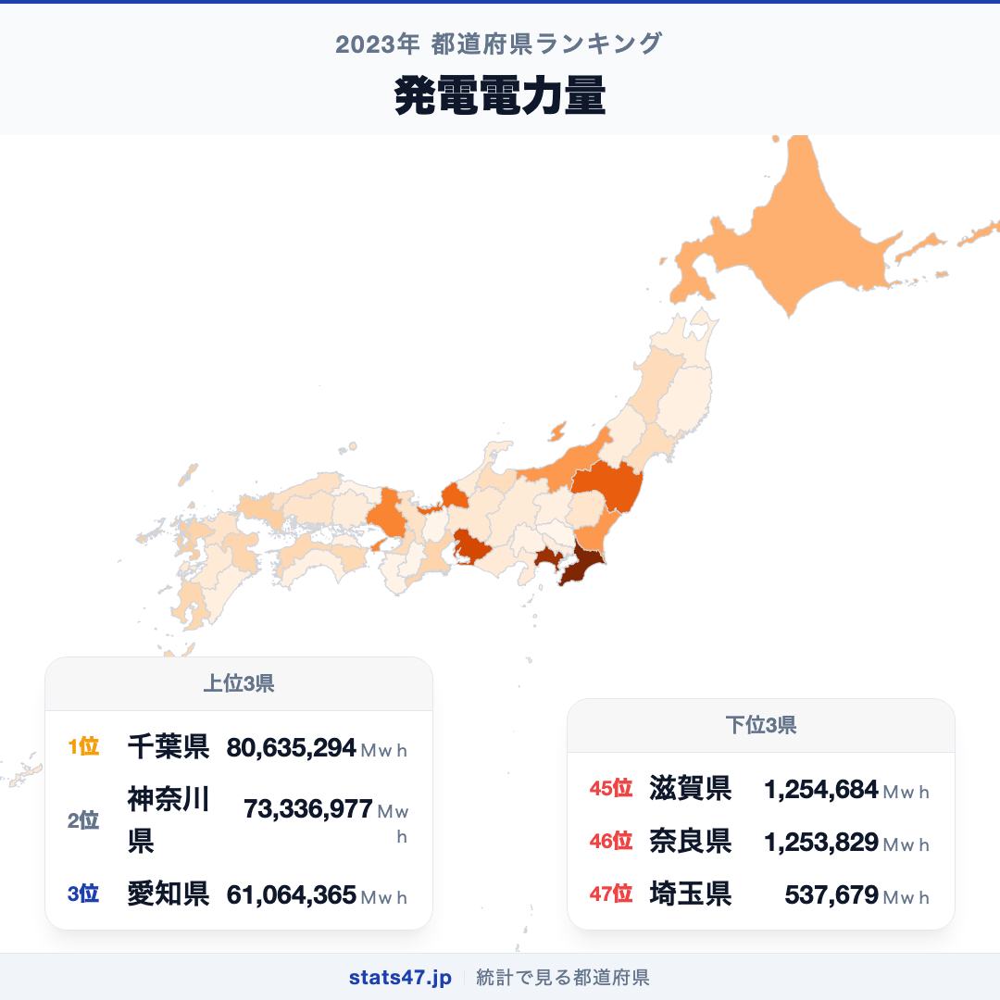
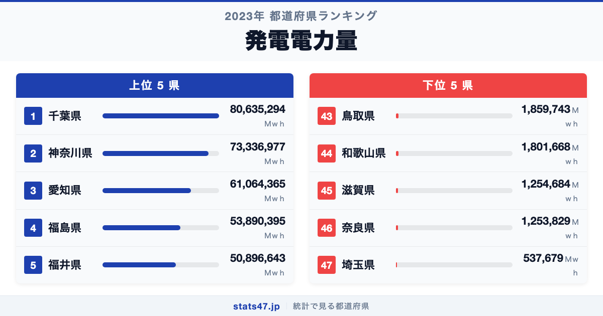
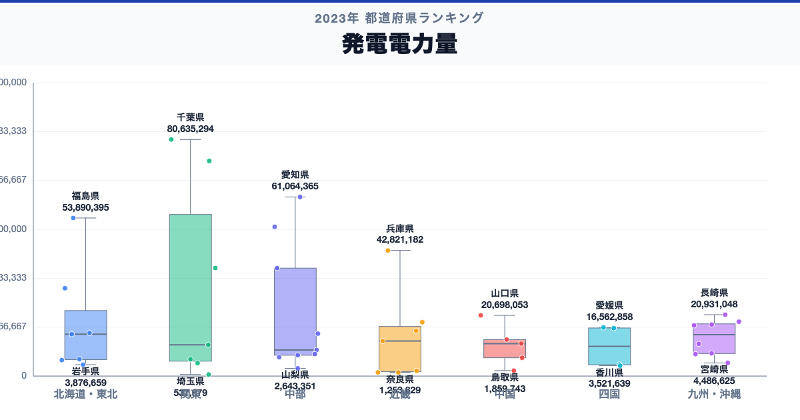

千葉県が全国1位、埼玉県が47位。発電電力量には、同じ日本の中でも150倍の開きがあります。

首位の千葉県は80,635,294Ｍｗｈで偏差値83.3、最下位の埼玉県は537,679Ｍｗｈで偏差値41.0です。なぜこれほど差があるのでしょうか。

「発電電力量」は、発電電力量は、都道府県内の発電設備が一定期間に生み出した電力量です。設備容量とは異なります。単年値は設備点検や稼働率にも左右されるため、電源別内訳と時系列を併せて見ます。

## データハイライト

全国平均: 17,584,702.11Ｍｗｈ

1位: 千葉県　80,635,294Ｍｗｈ / 偏差値 83.3

47位: 埼玉県　537,679Ｍｗｈ / 偏差値 41.0

上位5県と下位5県の間には明確な開きがあります。一方、順位が近い県では値の差が小さい場合もあるため、一つの順位差を地域の優劣として扱わないことが大切です。

## 【コロプレス地図】日本全国の分布

<!-- note投稿時: この画像行を削除し、images/choropleth-map-1080x1080.png をアップロード -->

地域中央値が最も高いのは北海道で29,938,468Ｍｗｈ、最も低いのは中部で8,902,817Ｍｗｈです。県別の順位だけでなく、まとまりとして見ると分布の偏りを捉えやすくなります。

ただし、地域内にもばらつきがあります。大規模な火力・原子力・水力・再生可能エネルギー設備の立地と稼働状況が総量に表れます。消費地へ県境を越えて送電されるため、発電量の少なさは電力利用の少なさや不足を意味しません。地図の色を原因の地図とみなさず、観測された分布として読みます。

## 上位5：分析

<!-- note投稿時: この画像行を削除し、images/chart-x-1200x630.png をアップロード -->

全国首位の千葉県は1位で、80,635,294Ｍｗｈ、偏差値は83.3です。全国平均を63,050,591.89Ｍｗｈ上回ります。大規模な火力・原子力・水力・再生可能エネルギー設備の立地と稼働状況が総量に表れます。この順位だけで原因を決めず、電源別発電量、設備容量、設備利用率、県内電力需要、送受電量、再エネ比率を確認すると背景を分解できます。

続く神奈川県は2位で、73,336,977Ｍｗｈ、偏差値は79.5です。全国平均を55,752,274.89Ｍｗｈ上回ります。関東に位置し、同じ地域内の県と比べる視点も必要です。この順位だけで原因を決めず、電源別発電量、設備容量、設備利用率、県内電力需要、送受電量、再エネ比率を確認すると背景を分解できます。

上位に入った愛知県は3位で、61,064,365Ｍｗｈ、偏差値は73.0です。全国平均を43,479,662.89Ｍｗｈ上回ります。中部に位置し、同じ地域内の県と比べる視点も必要です。この順位だけで原因を決めず、電源別発電量、設備容量、設備利用率、県内電力需要、送受電量、再エネ比率を確認すると背景を分解できます。

4番手の福島県は4位で、53,890,395Ｍｗｈ、偏差値は69.2です。全国平均を36,305,692.89Ｍｗｈ上回ります。東北に位置し、同じ地域内の県と比べる視点も必要です。この順位だけで原因を決めず、電源別発電量、設備容量、設備利用率、県内電力需要、送受電量、再エネ比率を確認すると背景を分解できます。

上位5県を締める福井県は5位で、50,896,643Ｍｗｈ、偏差値は67.6です。全国平均を33,311,940.89Ｍｗｈ上回ります。中部に位置し、同じ地域内の県と比べる視点も必要です。この順位だけで原因を決めず、電源別発電量、設備容量、設備利用率、県内電力需要、送受電量、再エネ比率を確認すると背景を分解できます。

## 下位5：分析

下位側を見ると、鳥取県は43位で、1,859,743Ｍｗｈ、偏差値は41.7です。全国平均を15,724,959.11Ｍｗｈ下回ります。中国の中でも、この県の位置を周辺県と見比べることが次の手がかりです。単年値は設備点検や稼働率にも左右されるため、電源別内訳と時系列を併せて見ます。

次に和歌山県は44位で、1,801,668Ｍｗｈ、偏差値は41.7です。全国平均を15,783,034.11Ｍｗｈ下回ります。近畿の中でも、この県の位置を周辺県と見比べることが次の手がかりです。単年値は設備点検や稼働率にも左右されるため、電源別内訳と時系列を併せて見ます。

45位の滋賀県は45位で、1,254,684Ｍｗｈ、偏差値は41.4です。全国平均を16,330,018.11Ｍｗｈ下回ります。近畿の中でも、この県の位置を周辺県と見比べることが次の手がかりです。単年値は設備点検や稼働率にも左右されるため、電源別内訳と時系列を併せて見ます。

46位の奈良県は46位で、1,253,829Ｍｗｈ、偏差値は41.4です。全国平均を16,330,873.11Ｍｗｈ下回ります。近畿の中でも、この県の位置を周辺県と見比べることが次の手がかりです。単年値は設備点検や稼働率にも左右されるため、電源別内訳と時系列を併せて見ます。

最下位の埼玉県は47位で、537,679Ｍｗｈ、偏差値は41.0です。全国平均を17,047,023.11Ｍｗｈ下回ります。消費地へ県境を越えて送電されるため、発電量の少なさは電力利用の少なさや不足を意味しません。単年値は設備点検や稼働率にも左右されるため、電源別内訳と時系列を併せて見ます。

## あなたの県は何位？

ここまで上位・下位の10県を見てきましたが、残る37県の順位も気になるはずです。全47都道府県の順位は、色分け地図と並べ替え可能なグラフ付きでstats47から確認できます。

### 発電電力量ランキング 全47都道府県版

https://stats47.jp/ranking/electricity-generation-capacity

## 地域別の傾向

<!-- note投稿時: この画像行を削除し、images/boxplot-1200x630.png をアップロード -->

箱ひげ図では、北海道の中央値が高く、中部が低い配置です。ただし、箱の重なりや外れた県も確認し、地域名だけで各県の値を決めつけないようにします。

## このランキングを正しく読む3つの視点

**総数と比率を混同しない**

大規模な火力・原子力・水力・再生可能エネルギー設備の立地と稼働状況が総量に表れます。消費地へ県境を越えて送電されるため、発電量の少なさは電力利用の少なさや不足を意味しません。

**順位だけで原因を決めない**

このデータから直接分かるのは、2023年の47都道府県の値と順位です。背景を確かめるには、電源別発電量、設備容量、設備利用率、県内電力需要、送受電量、再エネ比率が必要です。

**対象年と定義を確認する**

単年値は設備点検や稼働率にも左右されるため、電源別内訳と時系列を併せて見ます。別年や別調査と比べるときは、対象となる世帯・人・施設と単位をそろえます。

## まとめ

発電電力量の地域差は、単純な県の優劣ではなく、指標の対象と地域条件の違いを映しています。

**首位と最下位には150倍の開き**

千葉県の80,635,294Ｍｗｈに対し、埼玉県は537,679Ｍｗｈでした。まずは差の大きさを事実として押さえます。

**地域のまとまりと県内差は両方見る**

地域中央値には違いがありますが、同じ地域のすべての県が同じ傾向とは限りません。地図と全47県の順位を併用すると例外も見つけられます。

**次のデータで理由を分解する**

電源別発電量、設備容量、設備利用率、県内電力需要、送受電量、再エネ比率を重ねれば、総数・割合・価格・人口構成など、順位を動かす要素を切り分けられます。

## もっと詳しく知りたい方へ

全47都道府県の順位や、グラフ・地図での可視化はstats47で確認できます。

### 発電電力量ランキング 全都道府県版

https://stats47.jp/ranking/electricity-generation-capacity

### バイオマス発電施設数

https://stats47.jp/ranking/biomass-power-station-count

### 都市ガスメーター取付数

https://stats47.jp/ranking/city-gas-meter-count

### 都市ガス販売量

https://stats47.jp/ranking/city-gas-sales-volume

---

**stats47** は、e-Statなどの公的統計データを47都道府県別に可視化するサービスです。ランキング・散布図・時系列チャートで、地域の違いがひと目で分かります。

https://stats47.jp
