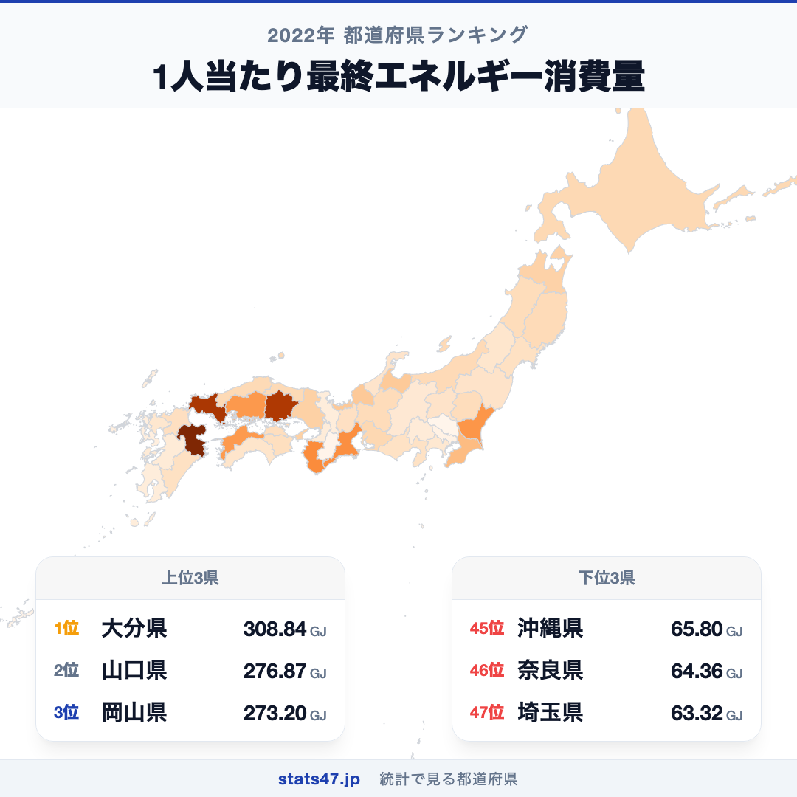
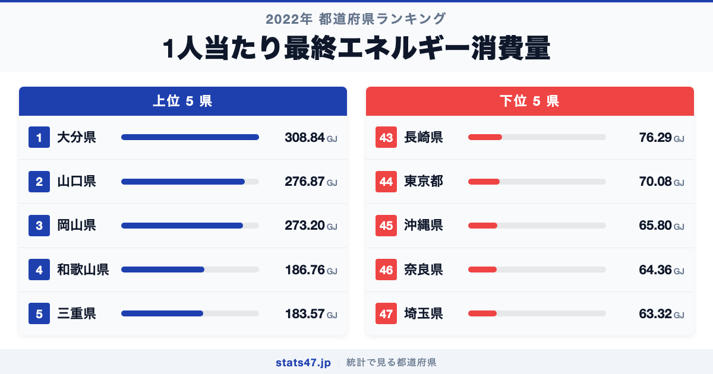
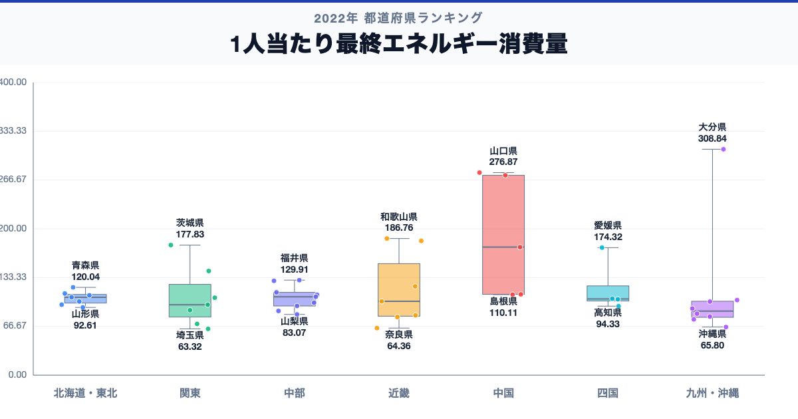

大分県が全国1位、埼玉県が47位。1人当たり最終エネルギー消費量には、同じ日本の中でも4.9倍の開きがあります。

首位の大分県は308.84GJで偏差値85.8、最下位の埼玉県は63.32GJで偏差値39.5です。なぜこれほど差があるのでしょうか。

「1人当たり最終エネルギー消費量」は、1人当たり最終エネルギー消費量について、都道府県別に同じ定義で集計した値です。単年の順位だけで判断せず、同じ定義の時系列と関連する内訳を併せて確認します。

## データハイライト

全国平均: 118.85GJ

1位: 大分県　308.84GJ / 偏差値 85.8

47位: 埼玉県　63.32GJ / 偏差値 39.5

上位5県と下位5県の間には明確な開きがあります。一方、順位が近い県では値の差が小さい場合もあるため、一つの順位差を地域の優劣として扱わないことが大切です。

## 【コロプレス地図】日本全国の分布

<!-- note投稿時: この画像行を削除し、images/choropleth-map-1080x1080.png をアップロード -->

地域中央値が最も高いのは中国で174.98GJ、最も低いのは九州・沖縄で87.56GJです。県別の順位だけでなく、まとまりとして見ると分布の偏りを捉えやすくなります。

ただし、地域内にもばらつきがあります。総数・比率・平均のどれを測る指標かを確認し、値の大きさを地域の優劣へ置き換えないことが重要です。低い値にも人口規模、分母、対象範囲など複数の要因があり、このランキングだけで原因は決められません。地図の色を原因の地図とみなさず、観測された分布として読みます。

## 上位5：分析

<!-- note投稿時: この画像行を削除し、images/chart-x-1200x630.png をアップロード -->

全国首位の大分県は1位で、308.84GJ、偏差値は85.8です。全国平均を189.99GJ上回ります。総数・比率・平均のどれを測る指標かを確認し、値の大きさを地域の優劣へ置き換えないことが重要です。この順位だけで原因を決めず、指標の分子・分母、構成内訳、人口規模、同一定義の時系列、一次資料の注記を確認すると背景を分解できます。

続く山口県は2位で、276.87GJ、偏差値は79.7です。全国平均を158.02GJ上回ります。中国に位置し、同じ地域内の県と比べる視点も必要です。この順位だけで原因を決めず、指標の分子・分母、構成内訳、人口規模、同一定義の時系列、一次資料の注記を確認すると背景を分解できます。

上位に入った岡山県は3位で、273.2GJ、偏差値は79.1です。全国平均を154.35GJ上回ります。中国に位置し、同じ地域内の県と比べる視点も必要です。この順位だけで原因を決めず、指標の分子・分母、構成内訳、人口規模、同一定義の時系列、一次資料の注記を確認すると背景を分解できます。

4番手の和歌山県は4位で、186.76GJ、偏差値は62.8です。全国平均を67.91GJ上回ります。近畿に位置し、同じ地域内の県と比べる視点も必要です。この順位だけで原因を決めず、指標の分子・分母、構成内訳、人口規模、同一定義の時系列、一次資料の注記を確認すると背景を分解できます。

上位5県を締める三重県は5位で、183.57GJ、偏差値は62.2です。全国平均を64.72GJ上回ります。近畿に位置し、同じ地域内の県と比べる視点も必要です。この順位だけで原因を決めず、指標の分子・分母、構成内訳、人口規模、同一定義の時系列、一次資料の注記を確認すると背景を分解できます。

## 下位5：分析

下位側を見ると、長崎県は43位で、76.29GJ、偏差値は42.0です。全国平均を42.56GJ下回ります。九州・沖縄の中でも、この県の位置を周辺県と見比べることが次の手がかりです。単年の順位だけで判断せず、同じ定義の時系列と関連する内訳を併せて確認します。

次に東京都は44位で、70.08GJ、偏差値は40.8です。全国平均を48.77GJ下回ります。関東の中でも、この県の位置を周辺県と見比べることが次の手がかりです。単年の順位だけで判断せず、同じ定義の時系列と関連する内訳を併せて確認します。

45位の沖縄県は45位で、65.8GJ、偏差値は40.0です。全国平均を53.05GJ下回ります。九州・沖縄の中でも、この県の位置を周辺県と見比べることが次の手がかりです。単年の順位だけで判断せず、同じ定義の時系列と関連する内訳を併せて確認します。

46位の奈良県は46位で、64.36GJ、偏差値は39.7です。全国平均を54.49GJ下回ります。近畿の中でも、この県の位置を周辺県と見比べることが次の手がかりです。単年の順位だけで判断せず、同じ定義の時系列と関連する内訳を併せて確認します。

最下位の埼玉県は47位で、63.32GJ、偏差値は39.5です。全国平均を55.53GJ下回ります。低い値にも人口規模、分母、対象範囲など複数の要因があり、このランキングだけで原因は決められません。単年の順位だけで判断せず、同じ定義の時系列と関連する内訳を併せて確認します。

## あなたの県は何位？

ここまで上位・下位の10県を見てきましたが、残る37県の順位も気になるはずです。全47都道府県の順位は、色分け地図と並べ替え可能なグラフ付きでstats47から確認できます。

### 1人当たり最終エネルギー消費量ランキング 全47都道府県版

https://stats47.jp/ranking/final-energy-consumption-per-capita

## 地域別の傾向

<!-- note投稿時: この画像行を削除し、images/boxplot-1200x630.png をアップロード -->

箱ひげ図では、中国の中央値が高く、九州・沖縄が低い配置です。ただし、箱の重なりや外れた県も確認し、地域名だけで各県の値を決めつけないようにします。

## このランキングを正しく読む3つの視点

**総数と比率を混同しない**

総数・比率・平均のどれを測る指標かを確認し、値の大きさを地域の優劣へ置き換えないことが重要です。低い値にも人口規模、分母、対象範囲など複数の要因があり、このランキングだけで原因は決められません。

**順位だけで原因を決めない**

このデータから直接分かるのは、2022年の47都道府県の値と順位です。背景を確かめるには、指標の分子・分母、構成内訳、人口規模、同一定義の時系列、一次資料の注記が必要です。

**対象年と定義を確認する**

単年の順位だけで判断せず、同じ定義の時系列と関連する内訳を併せて確認します。別年や別調査と比べるときは、対象となる世帯・人・施設と単位をそろえます。

## まとめ

1人当たり最終エネルギー消費量の地域差は、単純な県の優劣ではなく、指標の対象と地域条件の違いを映しています。

**首位と最下位には4.9倍の開き**

大分県の308.84GJに対し、埼玉県は63.32GJでした。まずは差の大きさを事実として押さえます。

**地域のまとまりと県内差は両方見る**

地域中央値には違いがありますが、同じ地域のすべての県が同じ傾向とは限りません。地図と全47県の順位を併用すると例外も見つけられます。

**次のデータで理由を分解する**

指標の分子・分母、構成内訳、人口規模、同一定義の時系列、一次資料の注記を重ねれば、総数・割合・価格・人口構成など、順位を動かす要素を切り分けられます。

## もっと詳しく知りたい方へ

全47都道府県の順位や、グラフ・地図での可視化はstats47で確認できます。

### 1人当たり最終エネルギー消費量ランキング 全都道府県版

https://stats47.jp/ranking/final-energy-consumption-per-capita

### 都市ガスメーター取付数

https://stats47.jp/ranking/city-gas-meter-count

### 都市ガス販売量

https://stats47.jp/ranking/city-gas-sales-volume

### 都市ガス供給区域内世帯数

https://stats47.jp/ranking/city-gas-supply-area-households

---

**stats47** は、e-Statなどの公的統計データを47都道府県別に可視化するサービスです。ランキング・散布図・時系列チャートで、地域の違いがひと目で分かります。

https://stats47.jp
