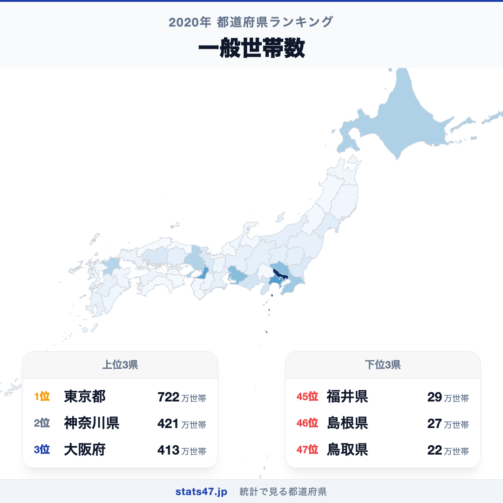
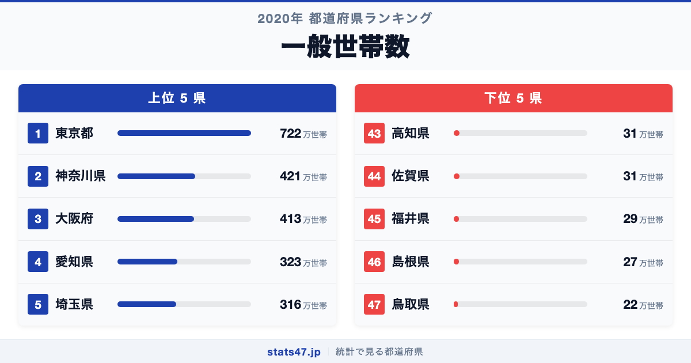
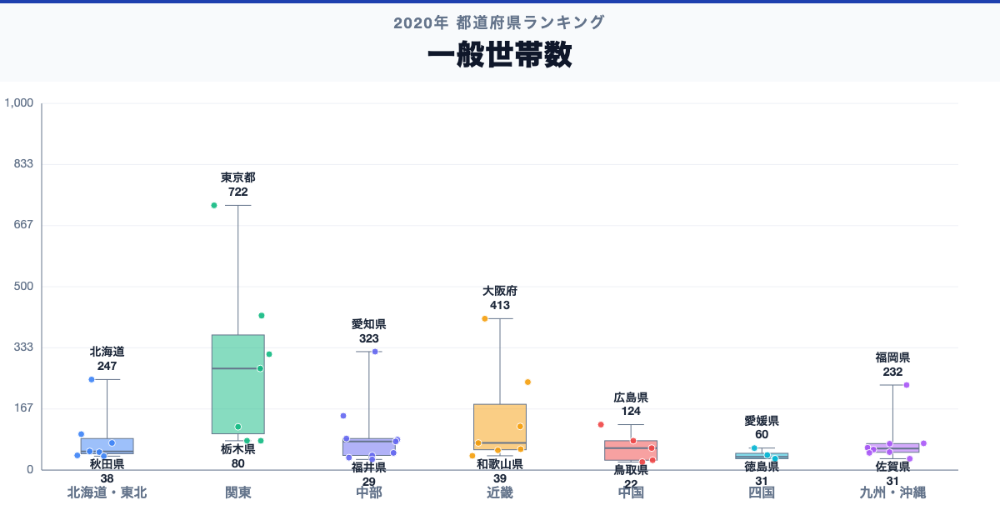

東京都が全国1位、鳥取県が47位。一般世帯数には、同じ日本の中でも32.8倍の開きがあります。

首位の東京都は722万世帯で偏差値95.0、最下位の鳥取県は22万世帯で偏差値42.8です。なぜこれほど差があるのでしょうか。

「一般世帯数」は、住居と生計をともにする人の集まりや、一戸を構える単身者など、施設等の世帯を除く一般世帯の総数です。世帯の人数や単身世帯の割合は分からないため、一世帯あたり人員と世帯構成を別に確認します。

## データハイライト

全国平均: 118.55万世帯

1位: 東京都　722万世帯 / 偏差値 95.0

47位: 鳥取県　22万世帯 / 偏差値 42.8

上位5県と下位5県の間には明確な開きがあります。一方、順位が近い県では値の差が小さい場合もあるため、一つの順位差を地域の優劣として扱わないことが大切です。

## 【コロプレス地図】日本全国の分布

<!-- note投稿時: この画像行を削除し、images/choropleth-map-1080x1080.png をアップロード -->

地域中央値が最も高いのは関東で277万世帯、最も低いのは四国で36万世帯です。県別の順位だけでなく、まとまりとして見ると分布の偏りを捉えやすくなります。

ただし、地域内にもばらつきがあります。総数なので、人口規模と大都市圏への世帯集積を強く反映します。値の小ささは世帯形成の少なさではなく、まず地域全体の人口規模として読みます。地図の色を原因の地図とみなさず、観測された分布として読みます。

## 上位5：分析

<!-- note投稿時: この画像行を削除し、images/chart-x-1200x630.png をアップロード -->

全国首位の東京都は1位で、722万世帯、偏差値は95.0です。全国平均を603.45万世帯上回ります。総数なので、人口規模と大都市圏への世帯集積を強く反映します。この順位だけで原因を決めず、総人口、一世帯あたり人員、単独世帯比率、過去からの世帯数推移を確認すると背景を分解できます。

続く神奈川県は2位で、421万世帯、偏差値は72.6です。全国平均を302.45万世帯上回ります。関東に位置し、同じ地域内の県と比べる視点も必要です。この順位だけで原因を決めず、総人口、一世帯あたり人員、単独世帯比率、過去からの世帯数推移を確認すると背景を分解できます。

上位に入った大阪府は3位で、413万世帯、偏差値は72.0です。全国平均を294.45万世帯上回ります。近畿に位置し、同じ地域内の県と比べる視点も必要です。この順位だけで原因を決めず、総人口、一世帯あたり人員、単独世帯比率、過去からの世帯数推移を確認すると背景を分解できます。

4番手の愛知県は4位で、323万世帯、偏差値は65.3です。全国平均を204.45万世帯上回ります。中部に位置し、同じ地域内の県と比べる視点も必要です。この順位だけで原因を決めず、総人口、一世帯あたり人員、単独世帯比率、過去からの世帯数推移を確認すると背景を分解できます。

上位5県を締める埼玉県は5位で、316万世帯、偏差値は64.7です。全国平均を197.45万世帯上回ります。関東に位置し、同じ地域内の県と比べる視点も必要です。この順位だけで原因を決めず、総人口、一世帯あたり人員、単独世帯比率、過去からの世帯数推移を確認すると背景を分解できます。

## 下位5：分析

下位側を見ると、高知県は43位で、31万世帯、偏差値は43.5です。全国平均を87.55万世帯下回ります。四国の中でも、この県の位置を周辺県と見比べることが次の手がかりです。世帯の人数や単身世帯の割合は分からないため、一世帯あたり人員と世帯構成を別に確認します。

次に佐賀県は44位で、31万世帯、偏差値は43.5です。全国平均を87.55万世帯下回ります。九州・沖縄の中でも、この県の位置を周辺県と見比べることが次の手がかりです。世帯の人数や単身世帯の割合は分からないため、一世帯あたり人員と世帯構成を別に確認します。

45位の福井県は45位で、29万世帯、偏差値は43.3です。全国平均を89.55万世帯下回ります。中部の中でも、この県の位置を周辺県と見比べることが次の手がかりです。世帯の人数や単身世帯の割合は分からないため、一世帯あたり人員と世帯構成を別に確認します。

46位の島根県は46位で、27万世帯、偏差値は43.2です。全国平均を91.55万世帯下回ります。中国の中でも、この県の位置を周辺県と見比べることが次の手がかりです。世帯の人数や単身世帯の割合は分からないため、一世帯あたり人員と世帯構成を別に確認します。

最下位の鳥取県は47位で、22万世帯、偏差値は42.8です。全国平均を96.55万世帯下回ります。値の小ささは世帯形成の少なさではなく、まず地域全体の人口規模として読みます。世帯の人数や単身世帯の割合は分からないため、一世帯あたり人員と世帯構成を別に確認します。

## あなたの県は何位？

ここまで上位・下位の10県を見てきましたが、残る37県の順位も気になるはずです。全47都道府県の順位は、色分け地図と並べ替え可能なグラフ付きでstats47から確認できます。

### 一般世帯数ランキング 全47都道府県版

https://stats47.jp/ranking/general-households

## 地域別の傾向

<!-- note投稿時: この画像行を削除し、images/boxplot-1200x630.png をアップロード -->

箱ひげ図では、関東の中央値が高く、四国が低い配置です。ただし、箱の重なりや外れた県も確認し、地域名だけで各県の値を決めつけないようにします。

## このランキングを正しく読む3つの視点

**総数と比率を混同しない**

総数なので、人口規模と大都市圏への世帯集積を強く反映します。値の小ささは世帯形成の少なさではなく、まず地域全体の人口規模として読みます。

**順位だけで原因を決めない**

このデータから直接分かるのは、2020年の47都道府県の値と順位です。背景を確かめるには、総人口、一世帯あたり人員、単独世帯比率、過去からの世帯数推移が必要です。

**対象年と定義を確認する**

世帯の人数や単身世帯の割合は分からないため、一世帯あたり人員と世帯構成を別に確認します。別年や別調査と比べるときは、対象となる世帯・人・施設と単位をそろえます。

## まとめ

一般世帯数の地域差は、単純な県の優劣ではなく、指標の対象と地域条件の違いを映しています。

**首位と最下位には32.8倍の開き**

東京都の722万世帯に対し、鳥取県は22万世帯でした。まずは差の大きさを事実として押さえます。

**地域のまとまりと県内差は両方見る**

地域中央値には違いがありますが、同じ地域のすべての県が同じ傾向とは限りません。地図と全47県の順位を併用すると例外も見つけられます。

**次のデータで理由を分解する**

総人口、一世帯あたり人員、単独世帯比率、過去からの世帯数推移を重ねれば、総数・割合・価格・人口構成など、順位を動かす要素を切り分けられます。

## もっと詳しく知りたい方へ

全47都道府県の順位や、グラフ・地図での可視化はstats47で確認できます。

### 一般世帯数ランキング 全都道府県版

https://stats47.jp/ranking/general-households

### 不慮の事故による死亡者数

https://stats47.jp/ranking/accidental-deaths-per-100k

### 年齢別死亡率

https://stats47.jp/ranking/age-specific-death-rate-0-4-per-1000

### 農業就業人口

https://stats47.jp/ranking/agricultural-employment-population

---

**stats47** は、e-Statなどの公的統計データを47都道府県別に可視化するサービスです。ランキング・散布図・時系列チャートで、地域の違いがひと目で分かります。

https://stats47.jp
