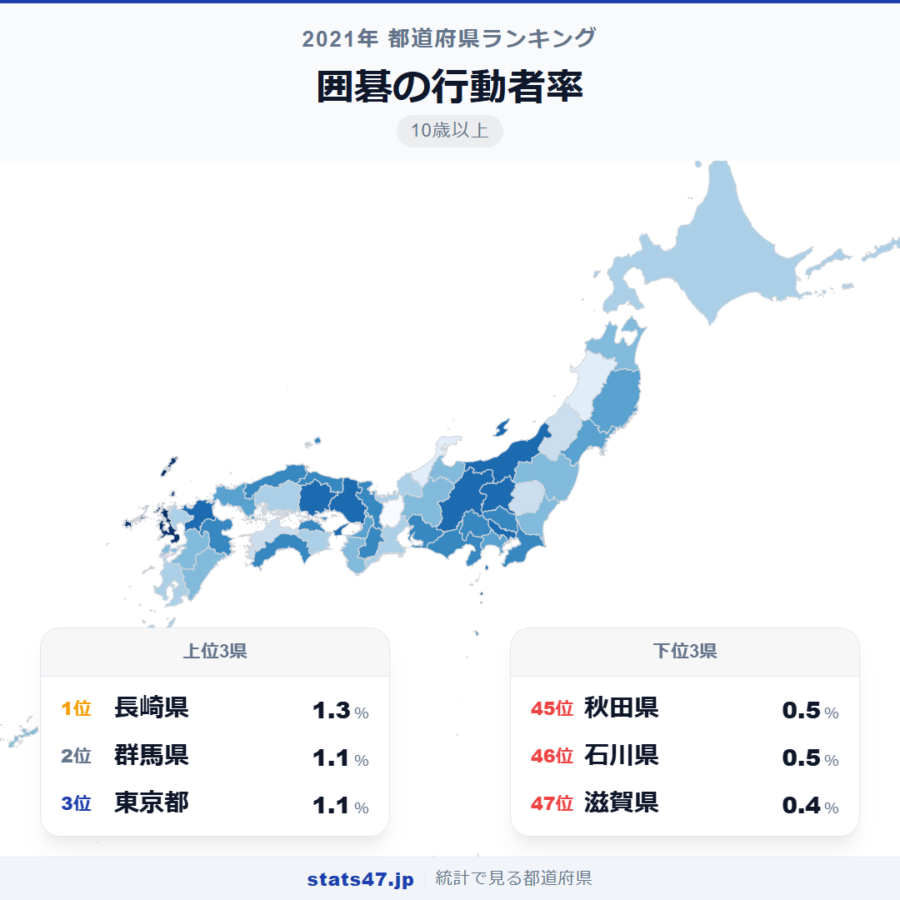
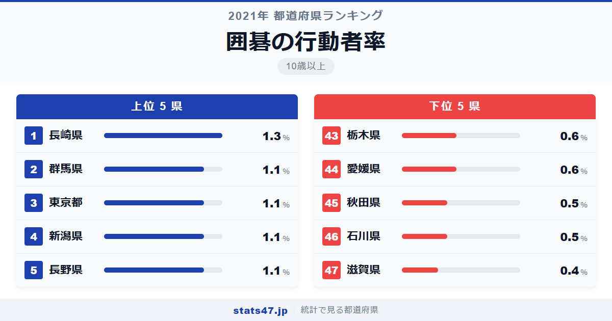
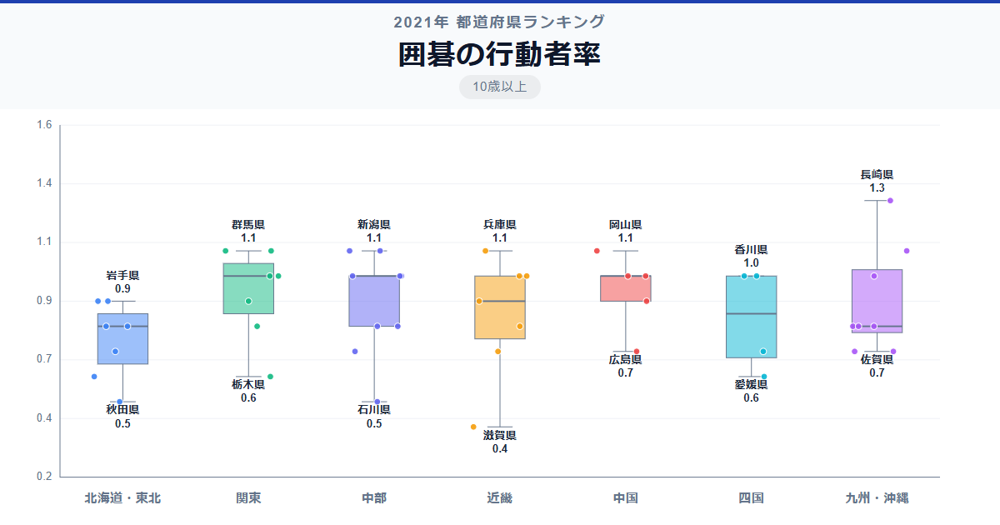

囲碁が最も盛んな県はどこでしょうか。答えは長崎県です。全国1位の長崎県は1.3％で偏差値72.6。囲碁の本場と呼ばれることもある地域ですが、実際にデータで裏付けられました。最下位の滋賀県は0.4％で偏差値25.5、その差は3.3倍にのぼります。

全国平均はわずか0.87％。100人に1人にも満たないニッチな趣味ですが、都道府県によって3倍以上の差がある点は注目に値します。

「囲碁の行動者率」は、過去1年間に囲碁を行った10歳以上の人の割合です。総務省「社会生活基本調査」（2021年）のデータに基づいています。

## データハイライト

全国平均: 0.87％

1位: 長崎県（1.3％ / 偏差値 72.6）

47位: 滋賀県（0.4％ / 偏差値 25.5）

全体的に低い行動者率の中で、同率の県が多いのが特徴です。0.1ポイントの差で順位が大きく変動するため、微妙な数値の違いに意味を見出しすぎないよう注意が必要です。

## 【コロプレス地図】日本全国の分布

<!-- note投稿時: この画像行を削除し、images/choropleth-map-1080x1080.png をアップロード -->

地図を見ると、特定の地域に集中するパターンはあまり見られません。1位の長崎県や、群馬・新潟・長野など内陸〜日本海側に高い県が点在しています。

東京都は1.1％で3位タイ。都市部では碁会所やオンライン対局の環境が整っており、一定の愛好者層がいます。

滋賀県の0.4％が最下位ですが、秋田・石川も0.5％と低く、地域的な法則性を見出すのは難しい指標です。

## 上位5：分析

<!-- note投稿時: この画像行を削除し、images/chart-x-1200x630.png をアップロード -->

長崎県は偏差値72.6で1.3％と、唯一の単独トップです。長崎は古くから中国文化の影響を受けた港町であり、囲碁の伝統が根づいている土地柄と考えられます。

2位タイの群馬県は偏差値62.1で1.1％。地域の公民館やコミュニティセンターでの囲碁教室が盛んで、高齢者の交流の場として定着しています。

同じく1.1％で2位タイの東京都。碁会所の数が全国最多で、日本棋院の本拠地でもあります。プロの対局を間近に見られる環境が愛好者を育てています。

新潟県も偏差値62.1の1.1％で4位タイ。雪の多い冬場にインドアで楽しめる趣味として、囲碁が親しまれてきた歴史があります。

長野県は同じく1.1％で5位タイ。信州は文化的な活動に熱心な県民性が知られており、囲碁サークルの活動も活発です。

## 下位5：分析

最下位の滋賀県は0.4％で偏差値25.5。近畿圏で唯一突出して低い数値で、若いファミリー層の流入が多いベッドタウン的な県の特性が、囲碁のような伝統的趣味の行動者率を下げている可能性があります。

石川県は偏差値30.8の0.5％で46位タイ。北陸の中では福井が0.7％、富山が0.8％とやや高く、石川だけが低い結果となりました。

同じく0.5％の秋田県も46位タイ。高齢化が進む県ですが、囲碁よりも他の伝統的な屋内娯楽が好まれているのかもしれません。

愛媛県と栃木県はともに0.6％で偏差値36.0の43位タイ。特に際立った背景要因は見当たらず、単に囲碁文化の浸透度が低い地域といえます。

## 地域別の傾向

<!-- note投稿時: この画像行を削除し、images/boxplot-1200x630.png をアップロード -->

地域間の明確な傾向は読み取りにくい指標です。関東がやや高く、北陸にばらつきが見られます。

## まとめ

囲碁の行動者率は全国的に低い水準ですが、その中にも興味深いパターンが見られます。このデータから以下の洞察が得られます。

**長崎県1位は中国文化の歴史的影響の名残か**

出島を通じた中国との交流の歴史を持つ長崎が最高値です。
囲碁の伝播ルートと重なる興味深い結果といえます。

**全国平均1％未満の希少な趣味**

47都道府県すべてで1.3％以下と、極めて行動者率が低い指標です。
同率の県が多く、わずかな差で順位が変動します。

**囲碁の担い手は減少傾向に**

若年層の囲碁離れが進んでおり、将来的にさらに数値が下がる可能性があります。
ただしオンライン対局の普及が新たな愛好者を生む可能性も残されています。

## もっと詳しく知りたい方へ

全47都道府県の順位や、グラフ・地図での可視化は stats47 で見ることができます。

### 囲碁の行動者率ランキング 全都道府県版

https://stats47.jp/ranking/hobby-participation-rate-go

### 将棋の行動者率ランキング

https://stats47.jp/ranking/hobby-participation-rate-shogi

### ゲームの行動者率ランキング

https://stats47.jp/ranking/hobby-participation-rate-video-games

### 趣味としての読書の行動者率ランキング

https://stats47.jp/ranking/hobby-participation-rate-reading

### パチンコの行動者率ランキング

https://stats47.jp/ranking/hobby-participation-rate-pachinko

### 書道の行動者率ランキング

https://stats47.jp/ranking/hobby-participation-rate-calligraphy

---

**stats47** は、e-Stat の公的統計データを47都道府県別に可視化するサービスです。
ランキング・散布図・時系列チャートで、地域の違いがひと目でわかります。

https://stats47.jp
