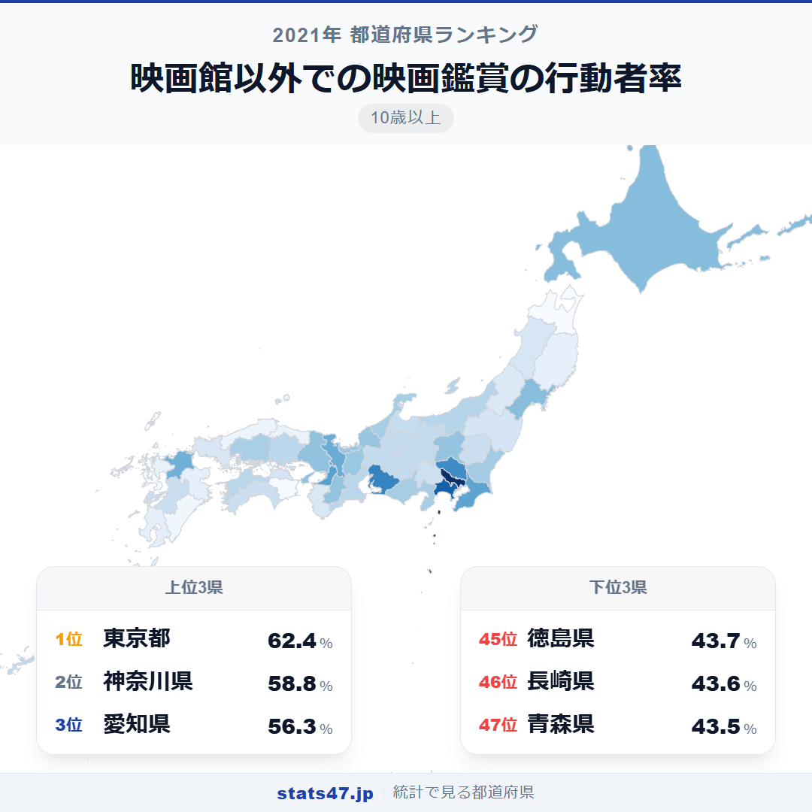
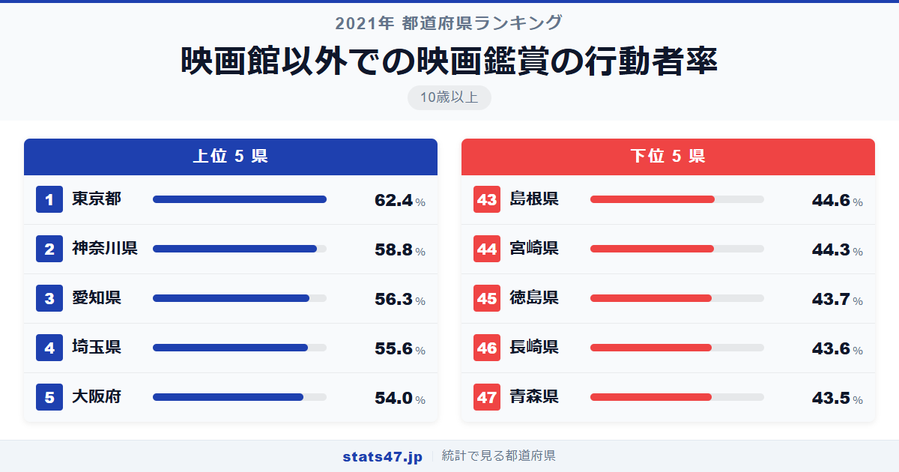
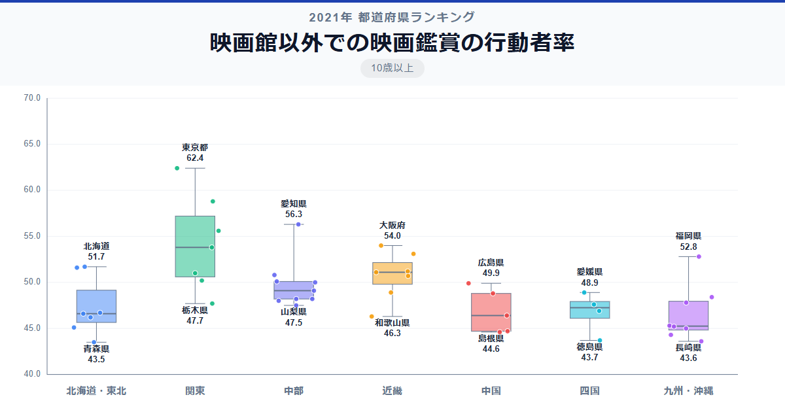

NetflixやAmazon Prime Videoの普及で「映画は家で観る」が当たり前になった時代。それでも都道府県による差は存在し、東京都の62.4％と青森県の43.5％には約19ポイントもの開きがあります。

全国1位の東京都は偏差値83.4で62.4％。最下位の青森県は偏差値35.9で43.5％です。1.4倍の差は映画館の行動者率と比べれば小さいものの、配信時代にもなお地域差が残っているのは興味深いところです。

「映画館以外での映画鑑賞の行動者率」は、10歳以上の人口のうち過去1年間にDVD・Blu-ray・動画配信サービスなどで映画を鑑賞した人の割合です。総務省の社会生活基本調査に基づいています。

## データハイライト

全国平均: 49.11％

1位: 東京都（62.4％ / 偏差値 83.4）

47位: 青森県（43.5％ / 偏差値 35.9）

全国平均は49.11％と、ほぼ2人に1人が映画館以外で映画を鑑賞しています。他の文化系行動者率と比べて全体的に値が高く、動画配信の普及が行動者率のベースを底上げしていることがわかります。それでも上位と下位で約19ポイントの差があり、デジタルインフラや年齢構成の違いが影響しているようです。

## 【コロプレス地図】日本全国の分布

<!-- note投稿時: この画像行を削除し、images/choropleth-map-1080x1080.png をアップロード -->

東京都と神奈川県が最も濃い色で、首都圏から近畿圏にかけて比較的高い値が広がっています。映画館の行動者率が高い地域とおおむね重なりますが、差はより小さくなっています。

東北地方と四国・九州の一部が薄い色を示しています。ただし北海道が9位の51.7％と健闘しており、冬場に自宅で映画を楽しむ文化が根付いていることがうかがえます。

沖縄県は24位の48.4％とほぼ全国平均並み。映画館の行動者率は41位と低かった沖縄県ですが、自宅での鑑賞では差が縮まっています。配信サービスが物理的な施設の不足を補う効果が見て取れます。

## 上位5：分析

<!-- note投稿時: この画像行を削除し、images/chart-x-1200x630.png をアップロード -->

動画配信サービスの加入率が高いとされる東京都は、偏差値83.4で62.4％と6割を超えています。映画館での鑑賞率も1位の東京都は、映画そのものへの関心が高い県民性がうかがえます。通勤電車でスマートフォンから映画を観る人も少なくないでしょう。

2位の神奈川県は偏差値74.4の58.8％です。東京に次ぐ人口規模と若い世代の多さが、配信サービスの利用率の高さにつながっています。

愛知県が偏差値68.1の56.3％で3位に入りました。大都市圏ならではのデジタルインフラの整備と、名古屋を中心とした若年層の多さが背景にあります。

4位は埼玉県で偏差値66.3の55.6％。東京のベッドタウンとして通勤時間が長い埼玉県では、移動中や帰宅後に配信で映画を観るスタイルが定着しているのかもしれません。

大阪府は偏差値62.3で54.0％の5位。映画館の行動者率では4位タイでしたが、自宅鑑賞でも安定して上位に位置しています。

## 下位5：分析

高齢化率が高く、デジタルサービスの普及に時間がかかる青森県。偏差値35.9の43.5％で全国最下位となっています。インターネット環境の整備や高齢者のデジタルリテラシーが課題です。

46位の長崎県は偏差値36.1で43.6％。離島を含む地域ではインターネット回線のインフラが十分でない地域もあり、配信サービスの利用にハードルがある場合があります。

徳島県が偏差値36.4の43.7％で45位です。人口規模が小さく高齢化も進む中、配信サービスの浸透がまだ途上にあることが推測されます。

44位の宮崎県は偏差値37.9で44.3％。県内の若年人口の流出が進んでおり、配信サービスの主な利用者層が少なくなっていることが影響しているようです。

島根県が偏差値38.7で44.6％の43位。中山間地域が広い島根県では、ブロードバンド環境の地域差が映画鑑賞の機会に影響を与えている可能性があります。

## 地域別の傾向

<!-- note投稿時: この画像行を削除し、images/boxplot-1200x630.png をアップロード -->

関東が突出して高く、東北と四国が低い傾向は映画館の行動者率と同様です。ただし全体的な差は小さくなっており、配信サービスの普及が地域間格差を緩和していることが読み取れます。

## まとめ

映画館以外での映画鑑賞の行動者率は、デジタル環境と年齢構成の影響を受けています。このデータから以下の洞察が得られます。

**配信サービスでも地域差は消えていない**

物理的な施設が不要な動画配信であっても、東京都62.4％と青森県43.5％には約19ポイントの差があります。
通信インフラの整備状況や、高齢化による利用率の差が地域差を生んでいます。

**映画館の行動者率との差が地域ごとに異なる**

沖縄県は映画館41位に対し自宅鑑賞24位と大幅に順位を上げており、配信サービスが映画館不足を補っています。
一方、東北各県は両方とも低く、映画への関心自体に地域差がある可能性も示唆されます。

**全国平均49％は「2人に1人が自宅で映画を観る時代」の象徴**

全国平均が約50％に達していることは、映画鑑賞がかつてないほど身近な娯楽になったことを示しています。
配信サービスのさらなる普及が、この数字をさらに押し上げていくでしょう。

## もっと詳しく知りたい方へ

全47都道府県の順位や、グラフ・地図での可視化は stats47 で見ることができます。

### 映画館以外での映画鑑賞の行動者率ランキング 全都道府県版

https://stats47.jp/ranking/hobby-participation-rate-home-movie

### 映画館での映画鑑賞の行動者率ランキング

https://stats47.jp/ranking/hobby-participation-rate-cinema

### CD・スマートフォンなどによる音楽鑑賞の行動者率ランキング

https://stats47.jp/ranking/hobby-participation-rate-music-listening

### ゲームの行動者率ランキング

https://stats47.jp/ranking/hobby-participation-rate-video-games

### 趣味としての読書の行動者率ランキング

https://stats47.jp/ranking/hobby-participation-rate-reading

### マンガを読む行動者率ランキング

https://stats47.jp/ranking/hobby-participation-rate-manga

---

**stats47** は、e-Stat の公的統計データを47都道府県別に可視化するサービスです。
ランキング・散布図・時系列チャートで、地域の違いがひと目でわかります。

https://stats47.jp
