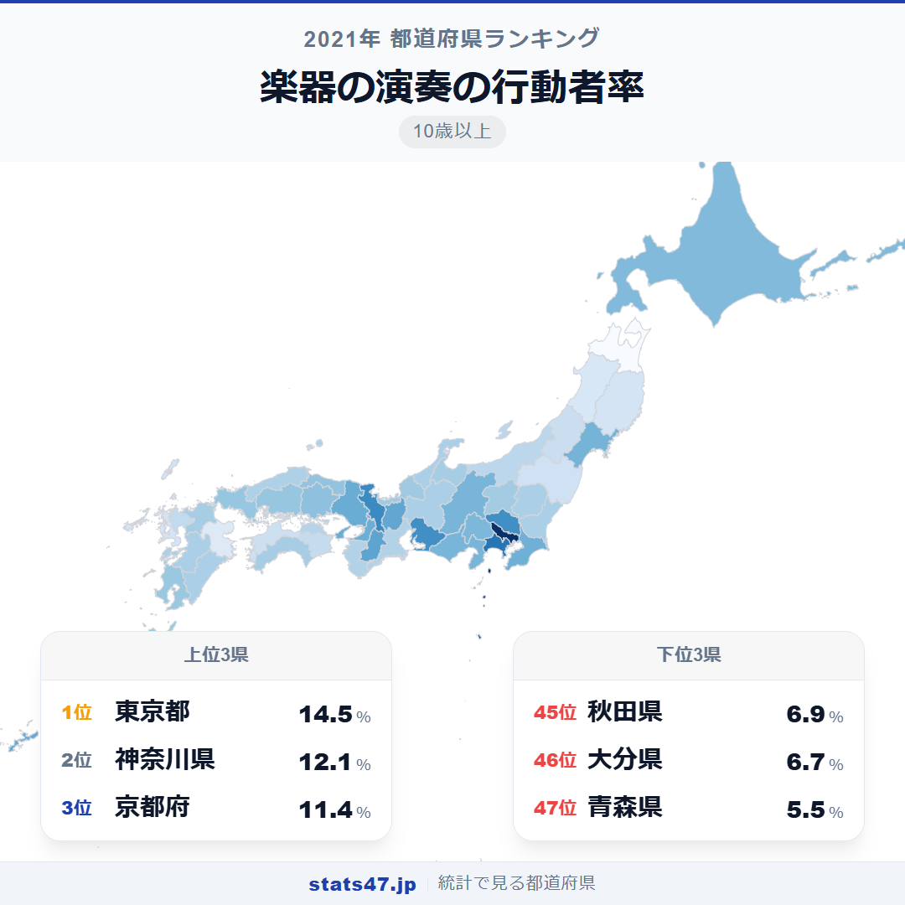
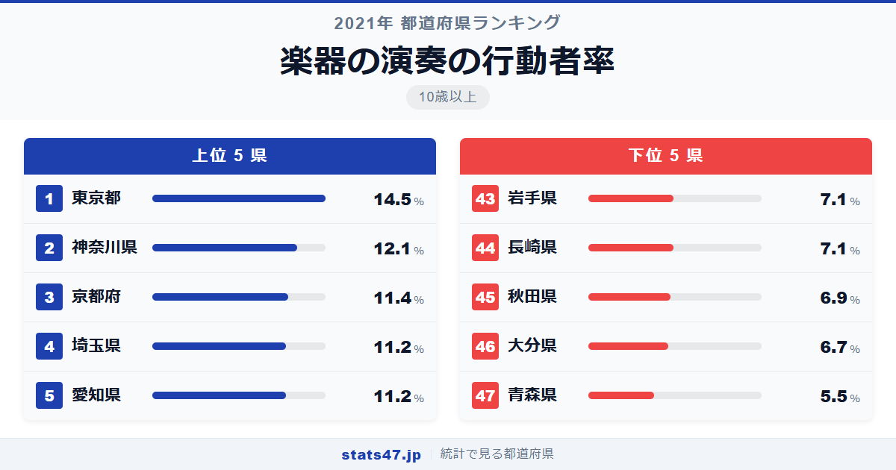
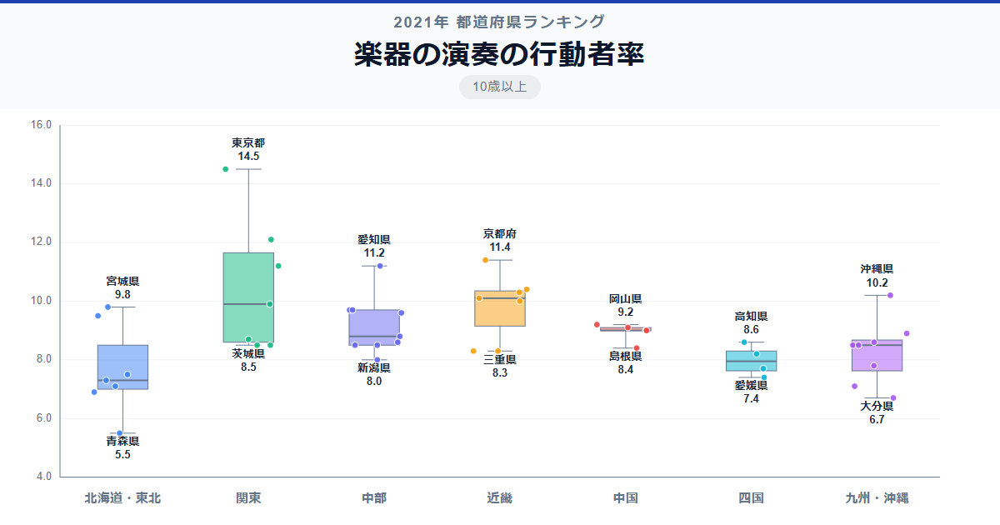

東京都では7人に1人が楽器を演奏しています。一方、青森県は18人に1人。楽器という趣味の広がりには2.6倍もの地域差があります。

全国1位の東京都は偏差値86.1で14.5％。最下位の青森県は偏差値27.4で5.5％です。大都市圏が上位に並ぶ中、沖縄県が8位の10.2％と三線文化の力を見せつけています。

「楽器の演奏の行動者率」は、10歳以上の人口のうち過去1年間に何らかの楽器を演奏した人の割合です。総務省の社会生活基本調査に基づくデータで、ピアノ・ギター・三線・管楽器など楽器の種類は問いません。

## データハイライト

全国平均: 8.96％

1位: 東京都（14.5％ / 偏差値 86.1）

47位: 青森県（5.5％ / 偏差値 27.4）

全国平均は8.96％で、約11人に1人が楽器を演奏しています。東京都が偏差値86.1と突出しており、音楽教室の密度と文化的な環境が際立っています。沖縄県が8位に入っているのは、三線という独自の楽器文化が幅広い世代に受け継がれていることの証です。

## 【コロプレス地図】日本全国の分布

<!-- note投稿時: この画像行を削除し、images/choropleth-map-1080x1080.png をアップロード -->

東京都が突出して濃い色を示し、神奈川県・京都府・埼玉県がそれに続いています。関東から近畿にかけて比較的濃い色が広がり、音楽教室やスタジオの多い大都市圏が高い傾向です。

沖縄県が関東・近畿と遜色ない濃さを見せているのが際立っています。三線は沖縄の伝統芸能に欠かせない楽器で、学校教育にも取り入れられているため、子どもから高齢者まで幅広い世代が演奏しています。

東北地方は全体的に薄い色で、特に青森県・秋田県・岩手県が低い値を記録しています。一方、山口県が20位の9.0％と中国地方の中ではやや高めで、吹奏楽が盛んな地域性があるとも言われています。

## 上位5：分析

<!-- note投稿時: この画像行を削除し、images/chart-x-1200x630.png をアップロード -->

音楽教室・スタジオ・楽器店が密集する東京都は、偏差値86.1の14.5％と2位以下を大きく引き離しています。ピアノ教室からジャズのセッションバーまで、あらゆるレベルの演奏者が活動できる環境が揃う街です。

2位の神奈川県は偏差値70.4で12.1％。横浜のジャズ文化や、音楽大学・音楽教室の充実が演奏者の裾野を広げています。

京都府が偏差値65.9の11.4％で3位に入りました。大学が多い京都では軽音楽サークルやオーケストラサークルの活動が盛んで、若い世代の演奏機会が豊富です。

埼玉県と愛知県がともに偏差値64.6の11.2％で4位タイ。埼玉県は東京の音楽シーンへのアクセスの良さが強みで、愛知県は吹奏楽の強豪校が多い地域として知られています。

## 下位5：分析

青森県が偏差値27.4の5.5％で全国最下位。2位以下とも1.4ポイントの差があり、突出して低い値です。楽器教室の数が限られることに加え、冬季の積雪で教室への通学が困難になることも影響しているでしょう。

46位の大分県は偏差値35.3で6.7％。温泉文化で知られる大分県ですが、音楽教室や演奏施設の充実度では他の上位県に及びません。

秋田県が偏差値36.6の6.9％で45位。東北の中でも特に高齢化が進んでおり、楽器を演奏する若年・中年層の減少が行動者率を下げています。

同率で44位は長崎県の偏差値37.9で7.1％。岩手県も同じ値で43位に入っています。長崎県は離島の多さ、岩手県は広い県土が楽器教室へのアクセスを難しくしている面があります。

## 地域別の傾向

<!-- note投稿時: この画像行を削除し、images/boxplot-1200x630.png をアップロード -->

関東と近畿が高く、東北が低い傾向は他の文化系指標と共通しています。沖縄県が単独で高い値を示しているため、九州・沖縄地方はばらつきが大きくなっています。

## まとめ

楽器の演奏の行動者率は、音楽教育の環境と地域固有の音楽文化を映し出しています。このデータから以下の洞察が得られます。

**沖縄8位が示す「伝統楽器の力」**

大都市でもない沖縄県が8位に入っているのは、三線という楽器が生活と一体化しているためです。
学校教育で触れ、お祝いの席で弾き、日常の中で演奏が継承される。この循環が高い行動者率を生んでいます。

**音楽教室の「ある・なし」が行動者率を大きく左右する**

上位県は音楽教室やスタジオが充実した大都市圏に集中しています。
楽器は独学のハードルが高い趣味であり、教わる場所があるかどうかが参入の鍵です。

**青森県の突出した低さは「文化インフラの課題」を象徴**

偏差値27.4という値は下位2位の大分県よりもさらに一段低く、楽器を始める環境自体が乏しいことを意味しています。
オンラインレッスンの普及が、地方の音楽人口を増やす手段として注目されています。

## もっと詳しく知りたい方へ

全47都道府県の順位や、グラフ・地図での可視化は stats47 で見ることができます。

### 楽器の演奏の行動者率ランキング 全都道府県版

https://stats47.jp/ranking/hobby-participation-rate-instrument

### CD・スマートフォンなどによる音楽鑑賞の行動者率ランキング

https://stats47.jp/ranking/hobby-participation-rate-music-listening

### クラシック音楽鑑賞の行動者率ランキング

https://stats47.jp/ranking/hobby-participation-rate-classical-music

### ポピュラー音楽鑑賞の行動者率ランキング

https://stats47.jp/ranking/hobby-participation-rate-popular-music

### カラオケの行動者率ランキング

https://stats47.jp/ranking/hobby-participation-rate-karaoke

### 邦楽の行動者率ランキング

https://stats47.jp/ranking/hobby-participation-rate-japanese-music

---

**stats47** は、e-Stat の公的統計データを47都道府県別に可視化するサービスです。
ランキング・散布図・時系列チャートで、地域の違いがひと目でわかります。

https://stats47.jp
