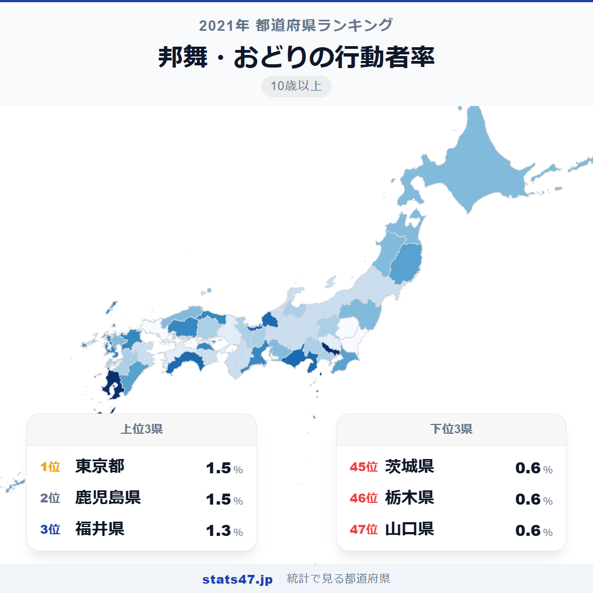
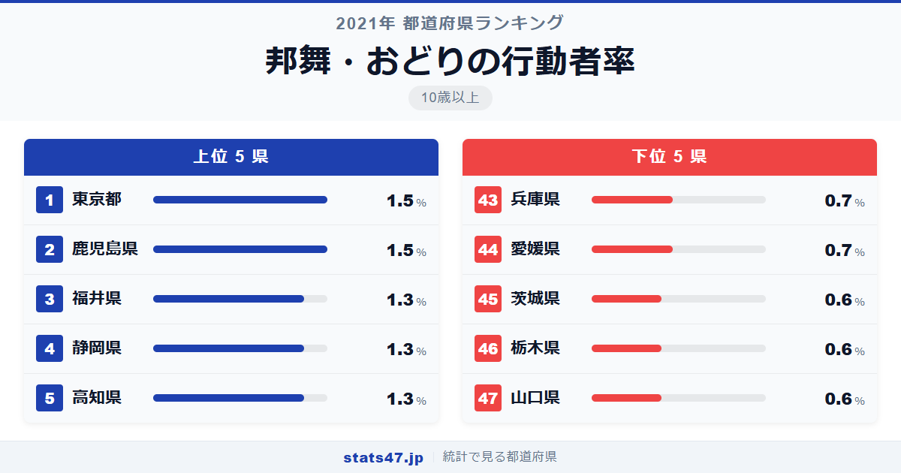
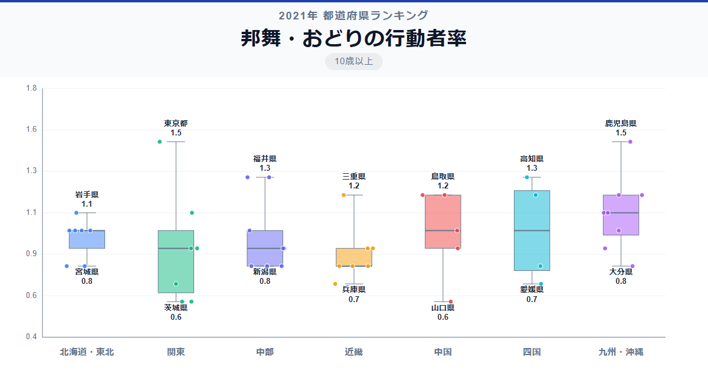

日本舞踊や伝統的なおどりが最も盛んな県は、東京都と鹿児島県。まったく異なる風土を持つ2つの地域が、同率で全国1位に並んでいます。

総務省「社会生活基本調査」（2021年）によると、両者の行動者率は1.5％で偏差値74.3。全国平均0.97％を大きく上回ります。一方、最下位は山口県・栃木県・茨城県の0.6％で偏差値33.3。1位と最下位の差は2.5倍です。

東京は日本舞踊の教室が集積する文化の中心地。鹿児島は薩摩の伝統舞踊が受け継がれてきた土地。形は異なれど、「おどりの文化」が生活に根づいた県が上位に並ぶのは興味深い結果です。

「邦舞・おどりの行動者率」は、過去1年間に日本舞踊や伝統的なおどりを行った人の割合を10歳以上人口に対して算出した指標です。総務省が5年ごとに実施する社会生活基本調査のデータに基づいています。

## データハイライト

全国平均: 0.97％

1位: 東京都（1.5％ / 偏差値 74.3）

47位: 山口県（0.6％ / 偏差値 33.3）

全体として行動者率は1％前後と非常に低い指標です。標準偏差0.22ポイントと差も小さいですが、伝統文化が根づく地域と、そうでない地域の違いがはっきり表れています。

## 【コロプレス地図】日本全国の分布

<!-- note投稿時: この画像行を削除し、images/choropleth-map-1080x1080.png をアップロード -->

地図を見ると、太平洋側に濃い色が目立ちます。東京都を筆頭に、静岡県・高知県・福岡県・鹿児島県と、海沿いの地域が上位に並んでいます。

一方で、北関東の茨城県・栃木県、中国地方の山口県は最下位圏に沈んでいます。伝統的なおどりの文化が継承されにくい地域や、他の娯楽に時間を割く傾向が見えてきます。

九州は鹿児島・福岡・長崎と複数の県が上位に入る一方、大分県は0.8％で低めと、地域内の差が大きいのが特徴です。

## 上位5：分析

<!-- note投稿時: この画像行を削除し、images/chart-x-1200x630.png をアップロード -->

薩摩おはら節や鹿児島ハンヤ節で知られる鹿児島県が、偏差値74.3で1.5％。地域の祭りや盆踊りが今も盛んに行われており、子どもから高齢者まで世代を超えて踊る文化が息づいています。

同率1位の東京都も1.5％で偏差値74.3。こちらは日本舞踊の流派の本拠が集まり、教室やお稽古の場が豊富に揃う文化の集積地としての強みが数値に表れています。

3位の福井県は1.3％で偏差値65.2。越前の伝統芸能に加え、地域の公民館活動でおどりのサークルが活発に運営されています。

静岡県も1.3％で偏差値65.2。駿河の伝統舞踊や各地の祭りで披露されるおどりが、県民の生活に自然と溶け込んでいます。

高知県は1.3％で偏差値65.2と、カラオケでは最下位だったのに対し、おどりでは上位に入る対照的な結果です。よさこい祭りに象徴される踊り文化が、日常のおどり参加にもつながっています。

## 下位5：分析

山口県は0.6％で偏差値33.3、全国最下位です。中国地方の中では広島県が1.2％と上位にいるのと対照的で、県内で邦舞を学べる場が限られていることが背景にありそうです。

同じ0.6％で栃木県と茨城県が45位・46位に並びます。北関東は東京に近いものの、通勤圏として生活が忙しく、伝統的なおどりに時間を割く余裕が少ないのかもしれません。

44位の愛媛県は0.7％で偏差値37.9。四国では高知県が上位に入っているのと比べると低水準です。よさこい文化の有無が四国内でも差を生んでいる可能性があります。

兵庫県も0.7％で偏差値37.9。神戸を中心とした都市部では洋舞やダンスが盛んな一方、邦舞の参加者は相対的に少ない傾向が見て取れます。

## 地域別の傾向

<!-- note投稿時: この画像行を削除し、images/boxplot-1200x630.png をアップロード -->

九州と四国の一部が高く、北関東と中国地方が低い傾向です。地域固有の伝統舞踊や祭り文化の有無が、行動者率に直結しています。

## まとめ

邦舞・おどりの行動者率は、伝統文化の継承度合いを映す指標です。このデータから以下の洞察が得られます。

**祭り文化が生きる地域は行動者率が高い**

鹿児島のおはら祭り、高知のよさこい、福井の伝統芸能。地域の祭りが盛んな県ほど、おどりが日常の中に自然と組み込まれています。

**東京は「学ぶ場」としての強み**

東京の1位は祭り文化というよりも、日本舞踊教室の集積による「習い事」としてのおどりの強さです。
文化の中心地ならではの参加の形が見えてきます。

**北関東の低さは生活スタイルの反映**

東京への通勤圏である茨城・栃木は、時間的な余裕の少なさが伝統的なおどり離れにつながっている可能性があります。

## もっと詳しく知りたい方へ

全47都道府県の順位や、グラフ・地図での可視化は stats47 で見ることができます。

### 邦舞・おどりの行動者率ランキング 全都道府県版

https://stats47.jp/ranking/hobby-participation-rate-japanese-dance

### 洋舞・社交ダンスの行動者率ランキング

https://stats47.jp/ranking/hobby-participation-rate-western-dance

### 演芸・演劇・舞踊鑑賞の行動者率ランキング

https://stats47.jp/ranking/hobby-participation-rate-theater

### 邦楽の行動者率ランキング

https://stats47.jp/ranking/hobby-participation-rate-japanese-music

### 茶道の行動者率ランキング

https://stats47.jp/ranking/hobby-participation-rate-tea-ceremony

### 華道の行動者率ランキング

https://stats47.jp/ranking/hobby-participation-rate-flower-arrangement

---

**stats47** は、e-Stat の公的統計データを47都道府県別に可視化するサービスです。
ランキング・散布図・時系列チャートで、地域の違いがひと目でわかります。

https://stats47.jp
