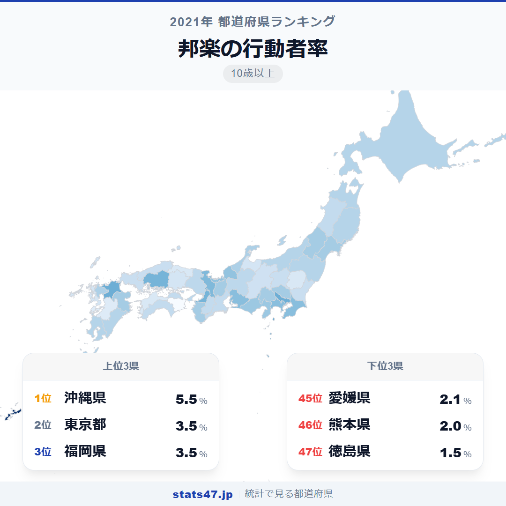
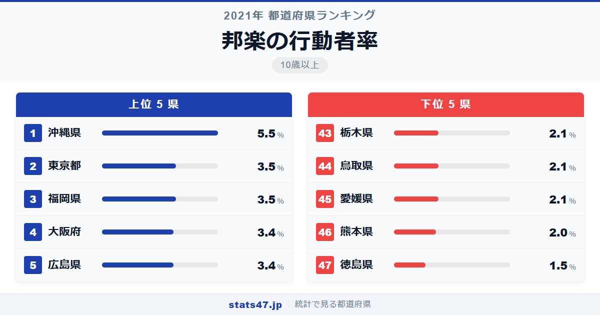
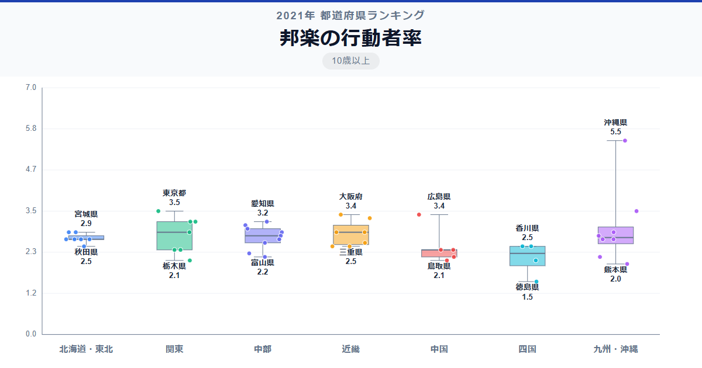

沖縄県民の18人に1人が邦楽に親しんでいる。この数字は偏差値97.0という他のランキングではまず見ない突出ぶりで、2位の東京都と福岡県を2.0ポイントも引き離す圧倒的な1位です。

全国1位の沖縄県は偏差値97.0で5.5％。最下位の徳島県は偏差値28.7で1.5％にとどまり、3.7倍の差があります。三線・琉球古典音楽・エイサーが日常に溶け込んだ沖縄の音楽文化が、データで裏付けられました。

「邦楽の行動者率」は、10歳以上の人口のうち過去1年間に日本の伝統的な音楽を演奏または鑑賞した人の割合です。総務省の社会生活基本調査に基づくデータで、三味線・琴・三線・尺八などの演奏のほか、雅楽や民謡の鑑賞も含みます。

## データハイライト

全国平均: 2.75％

1位: 沖縄県（5.5％ / 偏差値 97.0）

47位: 徳島県（1.5％ / 偏差値 28.7）

全国平均は2.75％と、約36人に1人の割合。全体的に値が小さい指標ですが、沖縄県だけが5％を超えて飛び抜けています。2位以下は3.5％から1.5％の狭い範囲に46県がひしめいており、沖縄県の特異性が際立つランキングです。

## 【コロプレス地図】日本全国の分布

<!-- note投稿時: この画像行を削除し、images/choropleth-map-1080x1080.png をアップロード -->

地図上で沖縄県だけが突出して濃い色を放っています。他の都道府県は比較的均一な色合いで、沖縄の特異な位置づけが一目瞭然です。

東京都・大阪府・福岡県・広島県がやや濃い色を示していますが、沖縄県との差は歴然です。大都市圏はさまざまな邦楽教室へのアクセスが良いため上位に来る傾向がありますが、沖縄の生活に根付いた音楽文化とは質的に異なります。

四国は全体的に薄い色で、徳島県が最も薄くなっています。阿波おどりで知られる徳島県ですが、この統計の対象である「邦楽」には太鼓や三味線の演奏は含まれるものの、阿波おどり自体は舞踊のカテゴリに分類されるため、邦楽の行動者率としては低く出ています。

## 上位5：分析

<!-- note投稿時: この画像行を削除し、images/chart-x-1200x630.png をアップロード -->

三線の音色が日常に溶け込んでいる沖縄県。偏差値97.0で5.5％と、2位を2.0ポイント引き離す圧倒的な1位です。学校教育で三線に触れる機会があり、お祭りや宴席では三線の伴奏で歌い踊ることが当たり前。「演奏する・聴く」が生活の一部になっている文化は、他県には見られない特徴です。

東京都と福岡県がともに偏差値62.8の3.5％で2位タイ。東京都は邦楽の教室や演奏会が集まる文化の中心地であり、尺八・琴・三味線の教室が充実しています。福岡県は博多の祭り文化と結びついた伝統芸能が根付いている地域です。

大阪府と広島県がともに偏差値61.1の3.4％で4位タイ。大阪府は文楽の三味線など伝統芸能の拠点としての歴史があり、広島県は神楽に代表される地域の伝統音楽が盛んです。

## 下位5：分析

阿波おどりの県なのに最下位。徳島県は偏差値28.7の1.5％で全国47位です。しかしこれは統計の分類によるもので、阿波おどりは「舞踊」に分類されるため、この「邦楽」の行動者率には反映されにくい事情があります。

46位は熊本県で偏差値37.3の2.0％。くまモンで知られる熊本県ですが、邦楽の伝統はそれほど強くなく、伝統音楽の継承者が少なくなっている現状があります。

愛媛県・鳥取県・栃木県が偏差値39.0の2.1％で43位タイ。いずれも伝統的な邦楽の拠点と言える施設や団体が少なく、邦楽に触れる機会自体が限られている地域です。

## 地域別の傾向

<!-- note投稿時: この画像行を削除し、images/boxplot-1200x630.png をアップロード -->

沖縄県が極端に高いため、九州・沖縄地方のばらつきが突出しています。他の地域はおおむね2〜3％台の狭い範囲に収まっており、全国的に均質な低水準の中で沖縄だけが例外的に高い構図です。

## まとめ

邦楽の行動者率は、沖縄県という圧倒的な1位が全体の構図を決定づけています。このデータから以下の洞察が得られます。

**沖縄県の偏差値97.0は「生きた伝統」の証明**

三線が学校教育に組み込まれ、お祝いの席で演奏され、日常的に沖縄民謡が歌われる。
この自然な循環が、他県の追随を許さない突出した行動者率を生んでいます。

**邦楽の「担い手不足」が全国的な課題**

全国平均2.75％という低さは、尺八・琴・三味線といった伝統楽器の担い手が減り続けていることを意味します。
教室の減少と師匠の高齢化が、邦楽文化の継承に暗い影を落としています。

**徳島県最下位は「統計の分類」が生んだ意外な結果**

阿波おどりで全国的に知られる徳島県が最下位なのは、阿波おどりが「舞踊」に分類され、この統計に反映されないためです。
統計の読み方ひとつで印象が大きく変わる好例と言えるでしょう。

## もっと詳しく知りたい方へ

全47都道府県の順位や、グラフ・地図での可視化は stats47 で見ることができます。

### 邦楽の行動者率ランキング 全都道府県版

https://stats47.jp/ranking/hobby-participation-rate-japanese-music

### 楽器の演奏の行動者率ランキング

https://stats47.jp/ranking/hobby-participation-rate-instrument

### CD・スマートフォンなどによる音楽鑑賞の行動者率ランキング

https://stats47.jp/ranking/hobby-participation-rate-music-listening

### クラシック音楽鑑賞の行動者率ランキング

https://stats47.jp/ranking/hobby-participation-rate-classical-music

### ポピュラー音楽鑑賞の行動者率ランキング

https://stats47.jp/ranking/hobby-participation-rate-popular-music

### 茶道の行動者率ランキング

https://stats47.jp/ranking/hobby-participation-rate-tea-ceremony

---

**stats47** は、e-Stat の公的統計データを47都道府県別に可視化するサービスです。
ランキング・散布図・時系列チャートで、地域の違いがひと目でわかります。

https://stats47.jp
