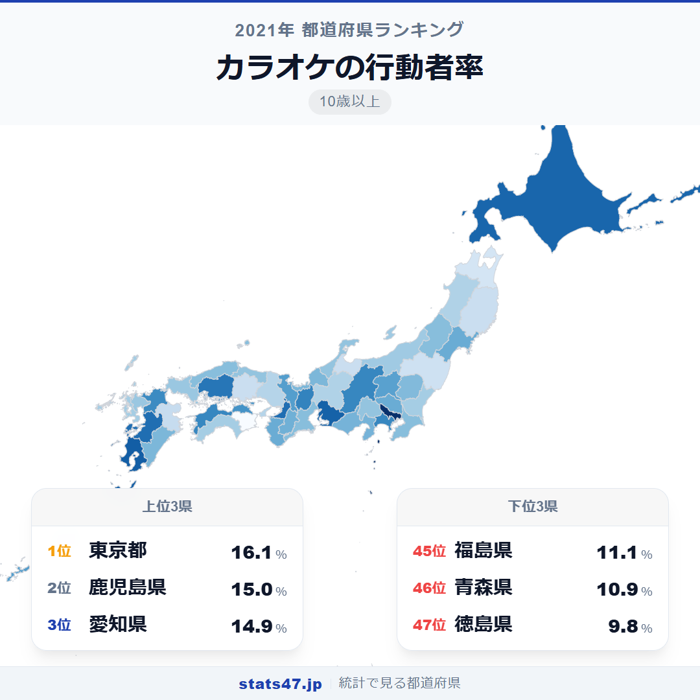
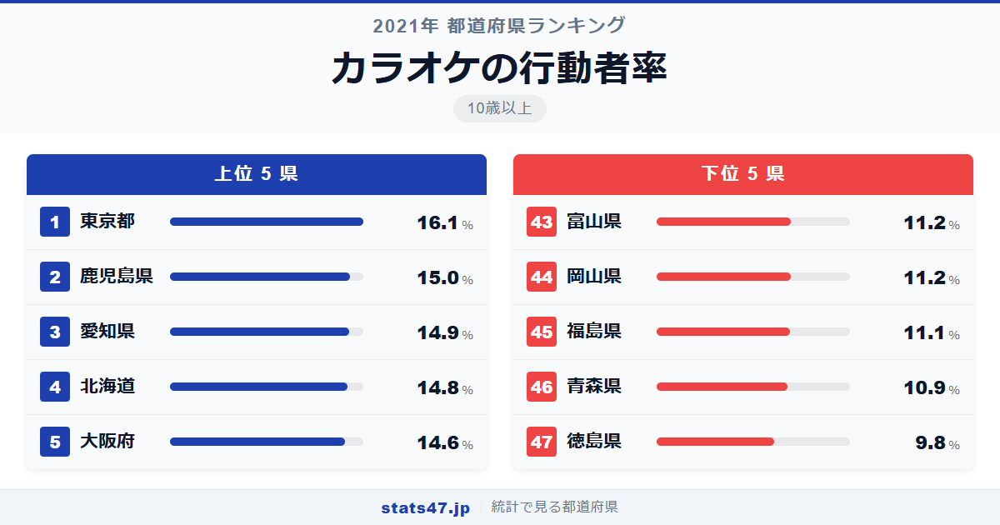
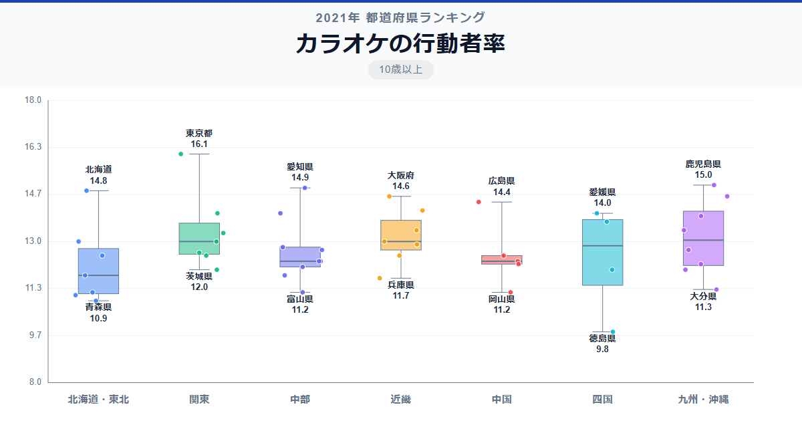

カラオケ好きが最も多いのは東京都。ここまでは想像どおりかもしれません。では2位はどこでしょう。大阪でも愛知でもなく、鹿児島県です。

総務省「社会生活基本調査」（2021年）によると、東京都のカラオケ行動者率は16.1％で偏差値76.0。2位の鹿児島県は15.0％で偏差値67.3と続きます。最下位の徳島県は9.8％で偏差値26.2。1位と最下位の差は1.6倍です。

飲み会文化が根強い地域ほどカラオケに行く人も多いのか。それとも別の要因があるのか。都道府県の順位を見ていくと、意外な傾向が浮かび上がります。

「カラオケの行動者率」は、過去1年間にカラオケを行った人の割合を10歳以上人口に対して算出した指標です。総務省が5年ごとに実施する社会生活基本調査のデータに基づいています。

## データハイライト

全国平均: 12.81％

1位: 東京都（16.1％ / 偏差値 76.0）

47位: 徳島県（9.8％ / 偏差値 26.2）

全体を見渡すと、大都市圏と九州の一部が高く、東北や北陸が低い傾向です。標準偏差1.27ポイントで県ごとの差は比較的小さい指標ですが、徳島県だけが突出して低い点が特徴的です。

## 【コロプレス地図】日本全国の分布

<!-- note投稿時: この画像行を削除し、images/choropleth-map-1080x1080.png をアップロード -->

地図を見ると、東京・愛知・大阪の三大都市圏が濃く色づいているのがわかります。カラオケボックスの店舗密度が高い地域ほど、行動者率も高い傾向があるのは自然な結果です。

注目すべきは鹿児島県と熊本県。九州南部が意外にも上位に入っています。焼酎文化に代表される宴会の場でカラオケが欠かせない存在であることが、この数値に表れているのかもしれません。

一方、東北は全般的に低く、特に青森県は46位。北陸の富山県や四国の徳島県も最下位圏で、カラオケ店の立地が限られる地域が多い点が共通しています。

## 上位5：分析

<!-- note投稿時: この画像行を削除し、images/chart-x-1200x630.png をアップロード -->

日本の首都、東京都が偏差値76.0で16.1％と圧倒的な1位です。カラオケボックスの店舗数が圧倒的に多く、仕事帰りや休日に気軽に利用できる環境が行動者率を押し上げています。

2位は鹿児島県で15.0％、偏差値67.3。鹿児島は宴席文化が盛んで、焼酎を囲みながらカラオケに興じる光景は日常的です。二次会・三次会にカラオケが組み込まれやすい土地柄が、この高い数値の背景にあります。

愛知県が14.9％で3位に入り、偏差値は66.5。名古屋圏はカラオケチェーンの激戦区としても知られ、価格競争が進んだ結果、利用しやすい環境が整っています。

北国のイメージが強い北海道は14.8％で偏差値65.7。冬の長い夜を室内で過ごす娯楽として、カラオケは道民にとって身近なレジャーです。

5位の大阪府は14.6％で偏差値64.1。大阪の歓楽街にはカラオケ店がひしめき、エンターテインメントを愛する府民性がそのまま数値に反映されています。

## 下位5：分析

最下位の徳島県は9.8％で偏差値26.2。46位の青森県とも1ポイント以上の差があり、突出して低い値です。徳島は阿波おどりを中心とした独自の娯楽文化が強く、カラオケという選択肢が相対的に弱い可能性があります。

46位の青森県は10.9％で偏差値34.9。冬期の厳しい気候と、県内のカラオケ店舗の少なさが影響していると考えられます。

福島県が11.1％で45位、偏差値は36.4。東北の中でも特に低い水準で、山間部の多い地理条件がカラオケ店へのアクセスを制限しています。

44位の岡山県は11.2％で偏差値37.2。中国地方では広島県が14.4％で7位なのと対照的な結果です。岡山市の繁華街の規模と比べ、県全体では郊外や農村部の人口比率が高いことが一因でしょう。

同じ11.2％で43位の富山県も偏差値37.2。北陸は全般的にカラオケの行動者率が低く、冬期に外出を控える傾向や、自宅での娯楽を好む文化が関係していそうです。

## 地域別の傾向

<!-- note投稿時: この画像行を削除し、images/boxplot-1200x630.png をアップロード -->

関東と九州の中央値が高く、東北と北陸が低い傾向です。四国は徳島県の極端な低さに引っ張られて全体的に低く見えますが、愛媛県は14.0％と全国平均を上回っています。

## まとめ

カラオケの行動者率は、都市のエンターテインメント環境と地域の宴会文化を色濃く反映しています。このデータから以下の洞察が得られます。

**カラオケ店の充実度が行動を左右する**

東京・大阪・愛知と大都市圏が上位に並びます。
店舗密度が高く、価格競争が進んだ地域ほど「行ってみよう」のハードルが下がります。

**九州南部の宴会文化がカラオケを後押し**

鹿児島県と熊本県が全国上位に入ったのは、焼酎文化に根ざした宴席の多さが背景にあります。
飲みの場にカラオケが組み込まれる文化が、行動者率を高めています。

**徳島県の突出した低さは独自の娯楽文化の裏返し**

最下位の徳島県は2位との差が大きく、全国的に見ても異質な水準です。
阿波おどりをはじめとする地域固有の娯楽が強い土地では、カラオケの存在感が相対的に薄れるようです。

## もっと詳しく知りたい方へ

全47都道府県の順位や、グラフ・地図での可視化は stats47 で見ることができます。

### カラオケの行動者率ランキング 全都道府県版

https://stats47.jp/ranking/hobby-participation-rate-karaoke

### コーラス・声楽の行動者率ランキング

https://stats47.jp/ranking/hobby-participation-rate-chorus

### 楽器の演奏の行動者率ランキング

https://stats47.jp/ranking/hobby-participation-rate-instrument

### ポピュラー音楽鑑賞の行動者率ランキング

https://stats47.jp/ranking/hobby-participation-rate-popular-music

### 映画館での映画鑑賞の行動者率ランキング

https://stats47.jp/ranking/hobby-participation-rate-cinema

### 演芸・演劇・舞踊鑑賞の行動者率ランキング

https://stats47.jp/ranking/hobby-participation-rate-theater

---

**stats47** は、e-Stat の公的統計データを47都道府県別に可視化するサービスです。
ランキング・散布図・時系列チャートで、地域の違いがひと目でわかります。

https://stats47.jp
