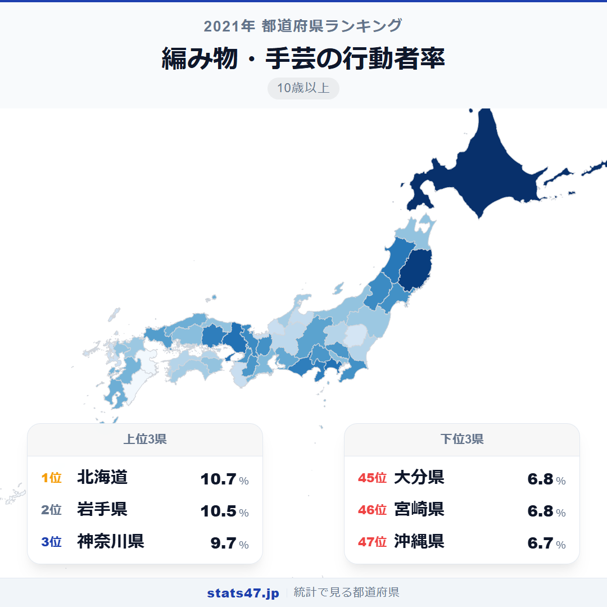
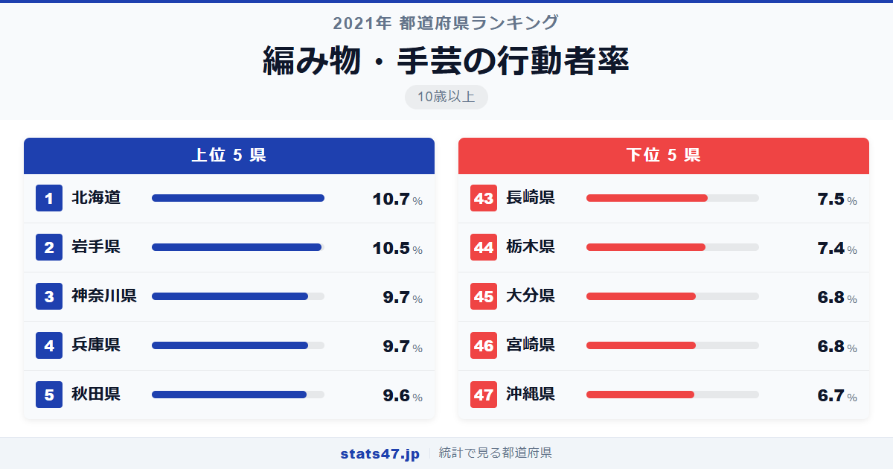
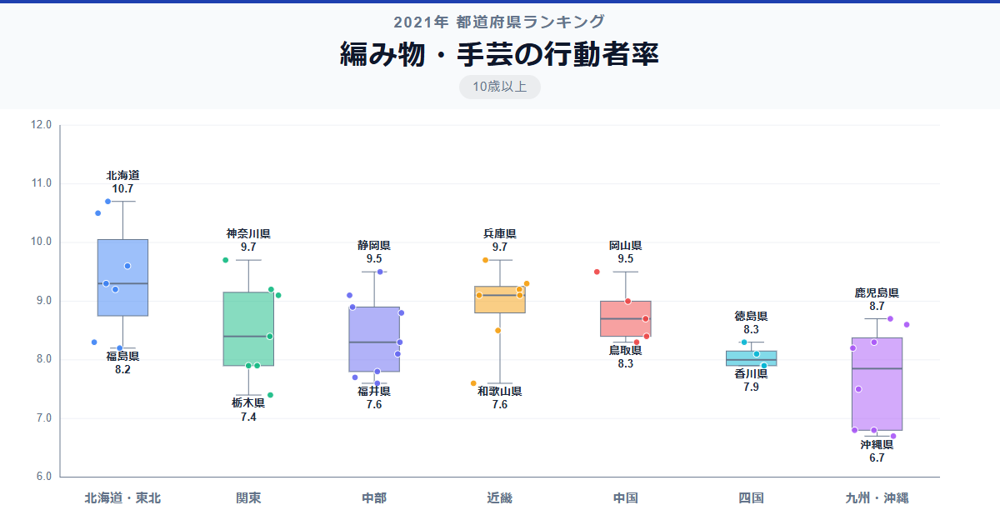

編み物・手芸の行動者率で北海道がダントツの全国1位。10人に1人以上が毛糸や針を手にしています。

総務省「社会生活基本調査」（2021年）によると、北海道の行動者率は10.7％で偏差値74.8。全国平均の8.54％を2ポイント以上上回る圧倒的な水準です。一方、最下位の沖縄県は6.7％で偏差値28.9。1位と最下位の差は1.6倍です。

寒い地域ほどニットを編む人が多い。当たり前のように思えるこの傾向は、データではっきり裏づけられるのでしょうか。

「編み物・手芸の行動者率」は、過去1年間に編み物や手芸を行った人の割合を10歳以上人口に対して算出した指標です。総務省が5年ごとに実施する社会生活基本調査のデータに基づいています。

## データハイライト

全国平均: 8.54％

1位: 北海道（10.7％ / 偏差値 74.8）

47位: 沖縄県（6.7％ / 偏差値 28.9）

全国平均8.54％は、趣味系ランキングの中でも比較的高い水準です。約12人に1人が編み物や手芸に親しんでいることになります。寒冷地が上位、温暖な地域が下位に集まる傾向が明瞭です。

## 【コロプレス地図】日本全国の分布

<!-- note投稿時: この画像行を削除し、images/choropleth-map-1080x1080.png をアップロード -->

地図を見ると、北海道と東北が最も濃い色で目を引きます。北海道・岩手・秋田と、冬が長く寒い地域が軒並み上位に入っています。防寒具としてのニット需要が、そのまま編み物文化の基盤となっていることがわかります。

意外なのは神奈川県と兵庫県が3位・4位に入っている点です。必ずしも寒冷地だけが上位ではなく、都市部の手芸文化も一定の存在感を見せています。

九州の南部は色が薄く、宮崎県と沖縄県が最下位圏です。温暖な気候のもとでは、ニットを編む動機が相対的に弱くなります。

## 上位5：分析

<!-- note投稿時: この画像行を削除し、images/chart-x-1200x630.png をアップロード -->

長い冬の間、室内で過ごす時間が多い北海道が偏差値74.8で10.7％と断トツです。マフラーやセーターなど防寒具を自分で編む文化が道民に根づいており、手芸用品店の品揃えも充実しています。

2位の岩手県は10.5％で偏差値72.5。北海道に次ぐ寒さの中で、編み物は冬の暮らしに欠かせない手仕事です。岩手には「南部裂織」などの伝統的な繊維工芸もあり、手芸全般への関心が高い土地柄です。

首都圏から神奈川県が9.7％で偏差値63.3の3位に入りました。寒冷地ではない神奈川の上位は、手芸専門店や編み物教室の充実度によるもの。趣味としての編み物を楽しむ文化が、大都市近郊に広がっています。

兵庫県も9.7％で偏差値63.3と同率3位。阪神間にはカルチャーセンターや手芸店が多く、都市型の手芸文化が行動者率を押し上げています。

5位は秋田県で9.6％、偏差値62.1。岩手と同じく冬の長い東北の県として、編み物が生活の一部になっています。秋田の長い雪の夜に、手仕事で過ごす時間が培ってきた文化です。

## 下位5：分析

最下位の沖縄県は6.7％で偏差値28.9。年間を通して温暖な気候のもとでは、ニットを編む必然性が低く、手芸の中でも編み物の優先度が下がります。

宮崎県は6.8％で偏差値30.1。九州南部の温暖な気候が北海道や東北との差を生んでいます。防寒具を手編みする需要がほとんどないことが、数値に直結しています。

同率の大分県も6.8％で偏差値30.1。九州の中でも福岡の8.2％に比べると低く、都市部からの手芸文化の波及が周辺県にまで届いていない構図です。

44位の栃木県は7.4％で偏差値36.9。北関東は首都圏の一部でありながら、神奈川や埼玉と比べると手芸文化の浸透度にはまだ差があります。

43位の長崎県は7.5％で偏差値38.1。九州の中では中位ですが、全国的に見ると低い水準です。温暖な海洋性気候が編み物需要を抑えている面があります。

## 地域別の傾向

<!-- note投稿時: この画像行を削除し、images/boxplot-1200x630.png をアップロード -->

北海道・東北が突出して高く、九州が低い傾向です。気候の寒暖がそのまま行動者率に反映される、わかりやすいパターンの指標です。

## まとめ

編み物・手芸の行動者率は、気候と暮らしの密接な関係を数値で示す指標です。このデータから以下の洞察が得られます。

**寒い地域ほど編み物が盛ん、はデータで裏づけられた**

北海道・岩手・秋田と寒冷地がトップ3を占めます。
防寒具を自分で作るという実用的な動機が、趣味としての編み物文化を長年にわたって支えてきました。

**都市部の手芸文化も侮れない**

神奈川3位、兵庫4位と、寒冷地ではない大都市近郊も上位に入っています。
手芸専門店や編み物教室へのアクセスの良さが、気候に頼らない行動者率の高さを生んでいます。

**沖縄の最下位は「編む必要がない」環境の反映**

温暖な沖縄では防寒具としてのニット需要がほぼなく、編み物の動機自体が少ないことが最下位の背景です。
手芸全般が低いわけではなく、編み物という分野の特性が出た結果です。

## もっと詳しく知りたい方へ

全47都道府県の順位や、グラフ・地図での可視化は stats47 で見ることができます。

### 編み物・手芸の行動者率ランキング 全都道府県版

https://stats47.jp/ranking/hobby-participation-rate-knitting

### 和裁・洋裁の行動者率ランキング

https://stats47.jp/ranking/hobby-participation-rate-sewing

### 趣味としての料理・菓子作りの行動者率ランキング

https://stats47.jp/ranking/hobby-participation-rate-cooking

### 園芸・庭いじり・ガーデニングの行動者率ランキング

https://stats47.jp/ranking/hobby-participation-rate-gardening

### 絵画・彫刻の制作の行動者率ランキング

https://stats47.jp/ranking/hobby-participation-rate-painting

### 陶芸・工芸の行動者率ランキング

https://stats47.jp/ranking/hobby-participation-rate-pottery

---

**stats47** は、e-Stat の公的統計データを47都道府県別に可視化するサービスです。
ランキング・散布図・時系列チャートで、地域の違いがひと目でわかります。

https://stats47.jp
