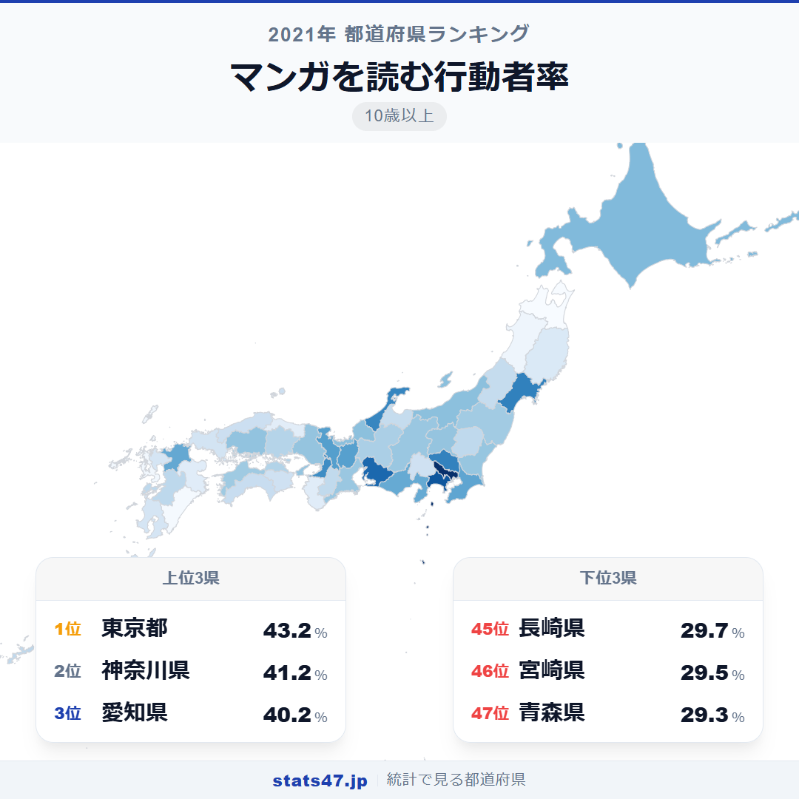
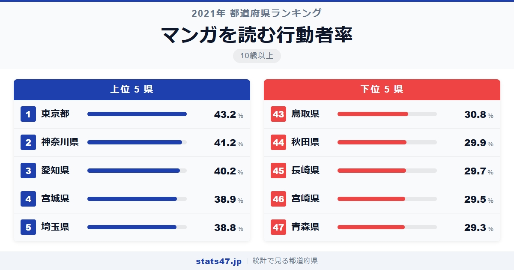
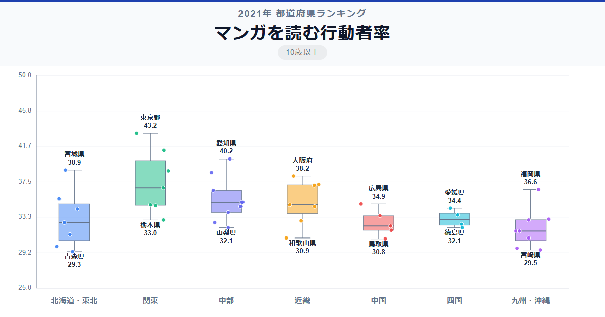

日本人の3人に1人はマンガを読んでいます。全国平均34.28％というこの数字は、読書の28.06％を大きく上回ります。全国1位の東京都は43.2％で偏差値78.6、最下位の青森県は29.3％で偏差値34.0。その差は1.5倍と、趣味系ランキングの中では比較的格差が小さい指標です。

読書と比べてマンガは地域間の差が小さいのが特徴ですが、それでも10ポイント以上の差が1位と47位の間に存在します。

「マンガを読む行動者率」は、過去1年間にマンガを読んだ10歳以上の人の割合です。紙・電子を問わず集計されており、総務省「社会生活基本調査」（2021年）のデータに基づきます。

## データハイライト

全国平均: 34.28％

1位: 東京都（43.2％ / 偏差値 78.6）

47位: 青森県（29.3％ / 偏差値 34.0）

上位は大都市圏が中心ですが、6位に石川県が入るなど意外な顔ぶれも。下位は東北・九州の県が多く、高齢化率との関連も考えられます。

## 【コロプレス地図】日本全国の分布

<!-- note投稿時: この画像行を削除し、images/choropleth-map-1080x1080.png をアップロード -->

地図を見ると、読書ほどの極端な首都圏集中は見られません。愛知県が3位に入り、石川県・宮城県なども高い値を示すなど、地方都市にも高い県が散在しています。

ただし東北地方の低さは読書と同じ傾向で、青森・秋田がワースト2に入っています。九州も長崎・宮崎が低めです。

スマートフォンの普及でマンガアプリが身近になったことが、全体的に地域差を縮めている可能性があります。それでもなお残る差は、若年層の人口比率の違いが影響していそうです。

## 上位5：分析

<!-- note投稿時: この画像行を削除し、images/chart-x-1200x630.png をアップロード -->

マンガ文化の中心地、東京都が偏差値78.6の43.2％で1位。出版社・マンガ喫茶・同人イベントの集積地であり、新作に触れる機会が桁違いに多い環境です。

2位の神奈川県は偏差値72.2で41.2％。若いファミリー層が多く、通勤電車でのスマホ読書も含めてマンガに親しむ人が多い地域です。

愛知県が偏差値69.0の40.2％で3位に食い込みました。名古屋圏は同人誌即売会も盛んで、マンガ文化への関心が高い土地柄といえます。

宮城県は偏差値64.8で38.9％の4位。仙台を中心にアニメ・マンガのイベントが多く、東北の中では突出した存在です。

僅差で5位に入った埼玉県は偏差値64.5の38.8％。首都圏の一角として東京の文化圏に含まれ、マンガ喫茶や書店へのアクセスも良好です。

## 下位5：分析

青森県は29.3％で偏差値34.0の最下位。高齢化率が高く、マンガの主な読者層である若年〜中年層の比率が低いことが直接的な要因です。

46位の宮崎県は29.5％で偏差値34.7。温暖な気候で屋外レジャーが充実していることも、室内でのマンガ読書率を相対的に下げている可能性があります。

長崎県は29.7％で偏差値35.3の45位。離島を多く抱え、書店やマンガ喫茶へのアクセスが限られる地域もあります。

秋田県は偏差値36.0で29.9％の44位。青森と同じく高齢化の影響が大きい県です。

鳥取県は偏差値38.8の30.8％で43位に位置しています。人口最少県であり、マンガ文化の発信拠点が少ないことが影響していると考えられます。ただし「まんが王国とっとり」を掲げるなど、行政の取り組みは進んでいます。

## 地域別の傾向

<!-- note投稿時: この画像行を削除し、images/boxplot-1200x630.png をアップロード -->

関東と東海が高く、東北と九州が低い傾向です。ただし読書と比べると地域間の差は小さく、マンガの全国的な浸透度の高さがうかがえます。

## まとめ

マンガを読む行動者率は、読書よりも地域差が小さいものの、それでも明確なパターンが見られます。このデータから以下の洞察が得られます。

**マンガは最も地域差が小さい読書系趣味**

1位と47位の差は1.5倍で、趣味としての読書の1.9倍より小さい数値です。
スマートフォンアプリの普及が地域の壁を低くしていると考えられます。

**石川県6位が示す地方都市のマンガ文化**

石川県は38.6％で6位に入り、必ずしも人口規模だけで決まらないことを示しています。
宮城県4位とあわせて、地方の文化都市の存在感が光ります。

**高齢化がマンガ読書率を左右している**

下位の青森・秋田・鳥取は高齢化率が高い県ばかりです。
マンガの主な読者層は若年〜中年層であり、人口構成の違いがそのまま数値に表れています。

## もっと詳しく知りたい方へ

全47都道府県の順位や、グラフ・地図での可視化は stats47 で見ることができます。

### マンガを読む行動者率ランキング 全都道府県版

https://stats47.jp/ranking/hobby-participation-rate-manga

### 趣味としての読書の行動者率ランキング

https://stats47.jp/ranking/hobby-participation-rate-reading

### ゲームの行動者率ランキング

https://stats47.jp/ranking/hobby-participation-rate-video-games

### 映画館での映画鑑賞の行動者率ランキング

https://stats47.jp/ranking/hobby-participation-rate-cinema

### 映画館以外での映画鑑賞の行動者率ランキング

https://stats47.jp/ranking/hobby-participation-rate-home-movie

### CD・スマートフォンなどによる音楽鑑賞の行動者率ランキング

https://stats47.jp/ranking/hobby-participation-rate-music-listening

---

**stats47** は、e-Stat の公的統計データを47都道府県別に可視化するサービスです。
ランキング・散布図・時系列チャートで、地域の違いがひと目でわかります。

https://stats47.jp
